# Документация по архитектуре

## 📑 Содержание

- [Обзор](#overview)
- [Концепция архитектуры](#architecture-concept)
- [Высокоуровневая архитектура](#high-level-architecture)
- [Разделение процессов](#process-separation)
- [Архитектура безопасности](#security-architecture)
- [Поток данных](#data-flow)
- [Архитектура базы данных](#database-architecture)
- [Архитектура Компонентов](#component-architecture)
- [Интеграция с внешними API](#external-api-integration)
- [Архитектура сборки](#build-architecture)
- [Управление State](#state-management)
- [Структура файлов](#file-structure)
- [Принципы проектирования](#design-principles)
- [Текущий статус](#current-status)

---

## Обзор

Это приложение следует строгой архитектуре **Разделения Ответственностей (Separation of Concerns, SoC)**, распределяя обязанности между Electron Main Process (безопасная среда Node.js) и Renderer Process (изолированная среда браузера).

📖 **Сопутствующая документация:**
- [Документация по API](./api.md) - Справочник по IPC API
- [Документация по базе данных](./database.md) - Детали архитектуры базы данных
- [Руководство по разработке](./development.md) - Настройка разработки и рабочие процессы
- [Глоссарий](./glossary.md) - Ключевые термины (Main Process, Renderer Process, IPC и т.д.)

### Схема архитектуры

Приведенная ниже схема демонстрирует высокоуровневую архитектуру. **Прочтите объяснение под схемой** для удобного восприятия.

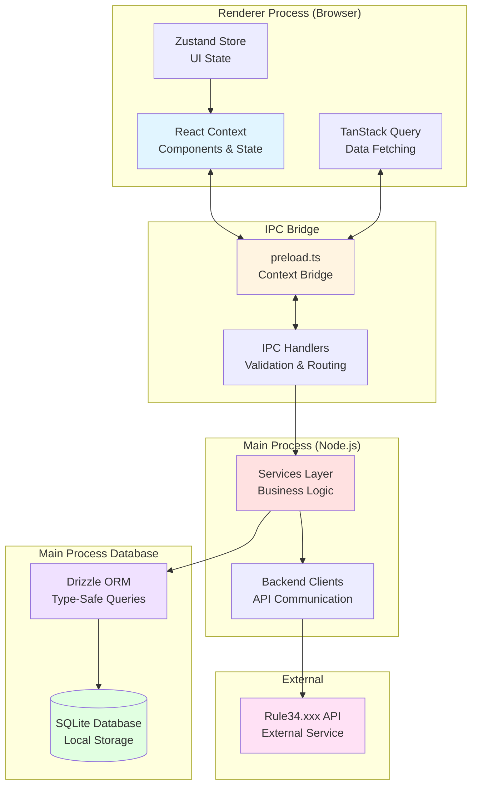

**Что означает эта схема:**

RuleDesk построен на Electron, который запускает два отдельных процесса:

1.  **Renderer Process (Браузер)** - Здесь находится ваш React UI. Это изолированная среда браузера, которая не может напрямую обращаться к Node.js API или файловой системе. Она использует:
    -   **React Context** для Component State и потока данных
    -   **TanStack Query** для получения данных из Main Process через IPC
    -   **Zustand** для легковесного UI State (например, какое диалоговое окно открыто)

2.  **IPC Bridge** - Это безопасный слой связи между Renderer и Main Process:
    -   **Скрипт Preload** (`preload.ts`) предоставляет безопасный API (`window.api`) для Renderer
    -   **IPC Handlers** в Main Process проверяют и маршрутизируют запросы к соответствующим сервисам

3.  **Main Process (Node.js)** - Это безопасный бэкенд, который обрабатывает:
    -   **Services Layer** - Бизнес-логика (синхронизация, обновления, файловые операции)
    -   **Backend Clients** - Связь с внешними API (Rule34.xxx, Gelbooru)

4.  **Database** - база данных SQLite, к которой осуществляется прямой доступ в Main Process:
    -   **Drizzle ORM** предоставляет типобезопасные запросы
    -   **SQLite** хранит все данные локально с использованием режима WAL для повышения производительности

**Пример потока данных:**

Когда вы нажимаете "Add Artist" в UI:
1.  React Component вызывает `window.api.addArtist(data)`
2.  Скрипт Preload перенаправляет запрос в Main Process через IPC
3.  IPC Handler проверяет входные данные, используя Zod-схемы
4.  Service Layer сохраняет Artist в базу данных через Drizzle ORM
5.  Ответ возвращается через IPC в Renderer
6.  React Query обновляет UI новым Artist'ом

Такое разделение обеспечивает безопасность (Renderer не может получить доступ к конфиденциальным данным) и производительность (операции с базой данных выполняются в Main Process).

## Концепция архитектуры

### 1. Двухмодульный интерфейс

-   **Режим библиотеки (Library Mode):** Работает с локальной базой данных SQLite. Максимальная производительность, виртуализация.
-   **Режим браузера (Browser Mode):** Изолированный процесс `<webview>`. Позволяет пользователям просматривать источник (Source) нативно. "Мост" между сайтом и приложением реализован через инъекцию скриптов (DOM scraping + IPC triggers).

### 2. Абстракция провайдера (задел на будущее)

-   В будущем `SyncService` больше не будет тесно связан с Rule34.
-   Вводится интерфейс `BooruProvider` (методы: `getPosts`, `getArtistInfo`, `search`).
-   Текущая реализация станет `Rule34Provider`. Это позволяет добавлять новые источники без переписывания основной базы данных.

## Высокоуровневая архитектура

### Обзор системы

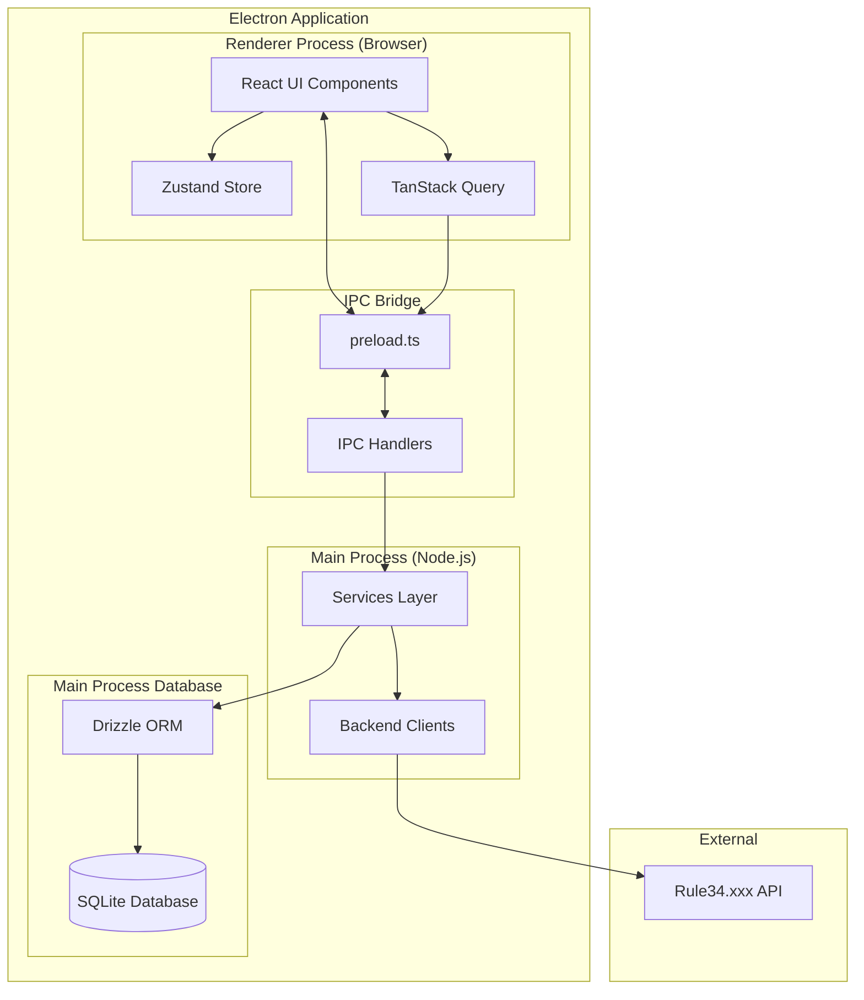

### Поток взаимодействия процессов

Схема ниже показывает, как действие пользователя проходит через систему. **Прочтите объяснение ниже** для пошагового описания.

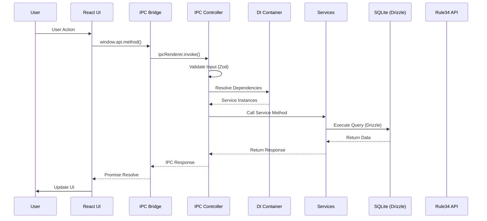

**Пошаговое объяснение:**

Давайте проследим, что происходит, когда пользователь нажимает "Add Artist":

1.  **Действие пользователя** - Пользователь заполняет форму и нажимает кнопку "Add Artist"

2.  **React UI** - React Component вызывает `window.api.addArtist(artistData)`. Это Promise, который будет разрешен после завершения операции.

3.  **IPC Bridge** - Скрипт Preload (`preload.ts`) получает вызов и перенаправляет его в Main Process, используя `ipcRenderer.invoke('db:add-artist', artistData)`. Это безопасный IPC-механизм Electron.

4.  **IPC Controller** - В Main Process `ArtistsController` получает запрос. Прежде чем что-либо делать, он:
    -   **Проверяет входные данные**, используя Zod-схему (гарантирует, что `name` и `tag` являются действительными строками, а `apiEndpoint` — действительным URL)
    -   Если проверка не удалась, он выбрасывает ошибку, которая распространяется обратно в Renderer

5.  **Внедрение зависимостей (Dependency Injection)** - Контроллеру нужны сервисы (например, база данных). Он просит DI Container разрешить зависимости. Контейнер предоставляет singleton-экземпляры сервисов.

6.  **Service Layer** - Контроллер вызывает соответствующий метод сервиса (например, `dbService.addArtist()`). Сервисы содержат бизнес-логику.

7.  **База данных** - Сервис использует Drizzle ORM для выполнения типобезопасного запроса: `db.insert(artists).values(artistData)`. SQLite хранит данные.

8.  **Поток ответа** - Данные возвращаются:
    -   База данных возвращает вставленный Artist (с сгенерированным ID)
    -   Сервис возвращает объект Artist
    -   Контроллер возвращает его через IPC
    -   Bridge разрешает Promise в Renderer
    -   React Query обновляет кэш и UI

**Обработка ошибок:**

Если какой-либо шаг завершается неудачей (ошибка валидации, ошибка базы данных, сетевая ошибка), ошибка перехватывается `BaseController`, логируется, и удобное для пользователя сообщение об ошибке отправляется обратно в Renderer. UI затем может отобразить уведомление об ошибке.

**Почему эта архитектура?**

-   **Безопасность:** Renderer не может напрямую обращаться к базе данных или файловой системе
-   **Типобезопасность:** TypeScript обеспечивает корректность типов на каждом шаге
-   **Валидация:** Zod-схемы перехватывают недопустимые данные до того, как они достигнут сервисов
-   **Разделение Ответственностей:** Каждый слой имеет одну ответственность
-   **Тестируемость:** Каждый слой может быть протестирован независимо

### Архитектура базы данных

Схема ниже показывает, как работают операции с базой данных. **Прочтите объяснение** для практического понимания.

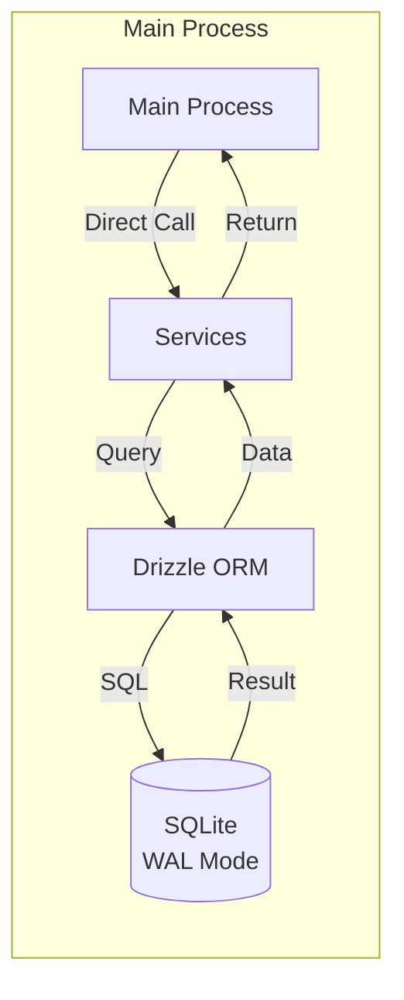

**Что это означает на практике:**

Все операции с базой данных происходят **непосредственно в Main Process** с использованием синхронного доступа. Вот как это работает:

1.  **Сервисы вызывают Drizzle ORM** - Когда сервису необходимо выполнить запрос к базе данных, он использует типобезопасный построитель запросов Drizzle:
    ```typescript
    const artists = await db.query.artists.findMany({
      orderBy: [asc(artists.name)],
    });
    ```

2.  **Drizzle генерирует SQL** - Drizzle ORM преобразует запрос TypeScript в оптимизированный SQL:
    ```sql
    SELECT * FROM artists ORDER BY name ASC;
    ```

3.  **SQLite выполняет** - База данных SQLite (через `better-sqlite3`) выполняет запрос **синхронно**.

    **⚠️ ВАЖНО: Синхронное выполнение блокирует Main Process**

    `better-sqlite3` использует **синхронные** операции с базой данных. Это означает:
    -   ✅ **Быстро для простых запросов** - Отсутствие накладных расходов на асинхронность, прямые вызовы функций
    -   ⚠️ **Блокирует Main Process** - Тяжелые запросы (например, полное сканирование таблицы без индексов) **заморозят все приложение Electron**
    -   ⚠️ **UI зависает** - Если запрос занимает 2 секунды, UI зависает на 2 секунды

    **Почему это быстро для типичных запросов:**
    -   Отсутствие сетевых накладных расходов (локальная база данных)
    -   Синхронное выполнение (без задержек async/await)
    -   Режим WAL позволяет выполнять параллельные чтения во время записи
    -   **Правильные индексы** делают запросы быстрыми (миллисекунды, а не секунды)

    **⚠️ ОБЯЗАТЕЛЬНО: Всегда используйте Limits и Indexes**

    Чтобы предотвратить блокировку Main Process:
    -   **Всегда используйте `limit`** в запросах SELECT (см. [Ограничения базы данных](#-critical-always-use-limits-for-select-queries))
    -   **Убедитесь в наличии правильных Indexes** для WHERE-условий
    -   **Используйте пагинацию** для больших наборов данных
    -   **Избегайте полного сканирования таблицы** - Всегда фильтруйте по индексированным столбцам

    **Пример опасного запроса:**

    ```typescript
    // ❌ DANGEROUS: No limit, no index on tags column
    // If database has 100k posts, this will freeze UI for seconds
    const posts = await db.query.posts.findMany({
      where: like(posts.tags, "%some_tag%"), // Full table scan!
      // Missing limit!
    });
    ```

    **Пример безопасного запроса:**

    ```typescript
    // ✅ SAFE: Uses indexed column and limit
    const posts = await db.query.posts.findMany({
      where: eq(posts.artistId, artistId), // Indexed column
      orderBy: [desc(posts.postId)],
      limit: 50, // ← Prevents large result sets
      offset: (page - 1) * 50,
    });
    ```

4.  **Результаты возвращаются** - SQLite возвращает необработанные данные → Drizzle сопоставляет их с типами TypeScript → Сервис возвращает типизированные объекты

**Почему синхронный доступ?**

-   **Производительность:** Отсутствие накладных расходов на асинхронность для локальных операций с базой данных (для простых запросов)
-   **Простота:** Прямые вызовы функций, отсутствие цепочек Promise
-   **Типобезопасность:** Drizzle гарантирует соответствие типов TypeScript схеме базы данных
-   **WAL Mode:** Write-Ahead Logging позволяет выполнять параллельные чтения даже во время записи

**⚠️ Режим WAL обязателен**

SQLite должен работать в **режиме WAL (Write-Ahead Logging)**, чтобы обеспечить:
-   **Параллельные чтения** во время записи
-   **Лучшую производительность** для рабочих нагрузок с интенсивным чтением
-   **Неблокирующие чтения** во время выполнения записи

Режим WAL автоматически включается в `src/main/db/client.ts`:

```typescript
// WAL mode is enabled automatically
sqlite.pragma("journal_mode = WAL");
```

**Без режима WAL:**
-   Запись блокирует все чтения
-   Ошибки блокировки базы данных при параллельном доступе
-   Низкая производительность при работе с несколькими читателями

**Пример: Добавление Artist**

```typescript
// In ArtistsController
const db = container.resolve(DI_TOKENS.DB);

// Drizzle query (type-safe)
const result = await db
  .insert(artists)
  .values({
    name: "artist_name",
    tag: "tag_name",
    type: "tag",
    apiEndpoint: "https://api.rule34.xxx",
  })
  .returning();

// result[0] is typed as Artist
return result[0];
```

**⚠️ ВАЖНО: Всегда используйте Limits для SELECT-запросов**

**Почему Limits обязательны:**

При запросе постов или других данных, которые могут быть большими, **всегда используйте `limit`** в ваших запросах Drizzle. Без Limits, SQLite может вернуть десятки или сотни тысяч записей, что приведет к:

1.  **Перегрузке Renderer Process** - Попытка сериализовать и отправить более 100 тысяч записей через IPC заморозит UI
2.  **Исчерпанию памяти** - Большие массивы потребляют значительный объем памяти как в Main, так и в Renderer Process
3.  **Блокировке IPC Channel** - Большие объемы данных блокируют IPC Channel, предотвращая другие операции

**Пример: Запрос постов с Limit**

```typescript
// ✅ CORRECT: Always use limit
const posts = await db.query.posts.findMany({
  where: eq(posts.artistId, artistId),
  orderBy: [desc(posts.postId)],
  limit: 50, // ← CRITICAL: Always limit results
  offset: (page - 1) * 50,
});

// ❌ WRONG: No limit - will crash with large databases
const posts = await db.query.posts.findMany({
  where: eq(posts.artistId, artistId),
  // Missing limit - dangerous!
});
```

**Лучшие практики:**

-   **Limit по умолчанию:** 50 записей на страницу (используется в `getArtistPosts`)
-   **Максимальный limit:** Никогда не превышайте 1000 записей в одном запросе
-   **Пагинация:** Используйте `offset` и `limit` для пагинации
-   **Бесконечная прокрутка:** Используйте `useInfiniteQuery` с постраничной пагинацией
-   **Запросы на подсчет:** Используйте отдельные запросы на подсчет (`getArtistPostsCount`) вместо `array.length`

**IPC-методы со встроенными Limits:**

-   `getArtistPosts()` - Возвращает максимум 50 постов на страницу
-   `getTrackedArtists()` - Должен быть ограничен, если вы ожидаете более 1000 Artist'ов (в настоящее время без Limit, но таблица Artist'ов обычно невелика)

**Ключевые моменты:**

-   Доступ к базе данных **никогда** не осуществляется из Renderer Process (безопасность)
-   Все запросы **типобезопасны** через Drizzle ORM
-   Операции **синхронны** для повышения производительности
-   Режим WAL обеспечивает **параллельные чтения** во время записи
-   **Всегда используйте `limit`** для SELECT-запросов, чтобы предотвратить перегрузку Renderer Process

## Разделение процессов

### Main Process (Мозг)

**Расположение:** `src/main/`

**Обязанности:**

-   Операции с базой данных (SQLite через Drizzle ORM)
-   Взаимодействие с внешними API
-   Операции с файловой системой
-   Фоновые задания по опросу
-   Операции, связанные с безопасностью

**Ключевые компоненты:**

1.  **Клиент базы данных** (`src/main/db/client.ts`)
    -   Прямой синхронный доступ к SQLite через `better-sqlite3`
    -   Режим WAL (Write-Ahead Logging) включен для параллельных чтений
    -   Управляет инициализацией и миграциями базы данных
    -   Предоставляет функции `getDb()` и `getSqliteInstance()`
    -   Автоматическое выполнение миграций при запуске

2.  **Схема базы данных** (`src/main/db/schema.ts`)
    -   Определения схемы Drizzle ORM для всех таблиц
    -   Типобезопасные определения таблиц с правильными Indexes
    -   Таблицы: `artists`, `posts`, `settings`
    -   Вывод типов: `Artist`, `Post`, `Settings`, `NewArtist`, `NewPost`

3.  **Сервис синхронизации (Sync Service)** (`src/main/services/sync-service.ts`)
    -   Обрабатывает синхронизацию API Rule34.xxx
    -   Реализует ограничение скорости и пагинацию
    -   Сопоставляет ответы API со схемой базы данных
    -   Обновляет количество постов Artist
    -   Предоставляет функциональность восстановления/повторной синхронизации для Artist'ов
    -   Генерирует IPC-события для отслеживания прогресса синхронизации

4.  **IPC-контроллеры** (`src/main/ipc/controllers/`)
    -   Архитектура на основе контроллеров с базовым классом `BaseController`
    -   Централизованная обработка ошибок и проверка входных данных с помощью Zod-схем
    -   Типобезопасное внедрение зависимостей с использованием DI Container
    -   Каждый контроллер обрабатывает определенную область IPC-операций

    **Модули контроллеров:**
    -   `ArtistsController.ts` - Операции управления Artist'ами
    -   `PostsController.ts` - Операции, связанные с Post'ами
    -   `SettingsController.ts` - Управление Settings
    -   `AuthController.ts` - Аутентификация и проверка учетных данных
    -   `MaintenanceController.ts` - Операции резервного копирования/восстановления базы данных
    -   `ViewerController.ts` - Операции, связанные с Viewer
    -   `FileController.ts` - Загрузка и управление файлами
    -   `SystemController.ts` - Системные операции (версия, буфер обмена и т.д.)

    **BaseController** (`src/main/core/ipc/BaseController.ts`):
    -   Обеспечивает централизованную обработку ошибок
    -   Автоматическая проверка входных данных с помощью Zod-схем
    -   Типобезопасная регистрация обработчиков
    -   Предотвращает ошибки дублирующей регистрации обработчиков

    **⚠️ ВАЖНО: Всегда используйте Limits в запросах к базе данных**

    При реализации IPC-обработчиков, которые запрашивают базу данных, **всегда используйте `limit`** в ваших запросах Drizzle. Без Limits, SQLite может вернуть десятки или сотни тысяч записей, что приведет к:

    -   **Перегрузке Renderer Process** - Большие массивы блокируют IPC и замораживают UI
    -   **Исчерпанию памяти** - Сериализация более 100 тысяч записей потребляет значительный объем памяти
    -   **Блокировке IPC Channel** - Большие объемы данных предотвращают другие операции

    **Пример в контроллере:**

    ```typescript
    // ✅ CORRECT: Always use limit
    export class PostsController extends BaseController {
      setup() {
        this.handle(
          IPC_CHANNELS.DB.GET_POSTS,
          GetPostsSchema,
          this.getPosts.bind(this)
        );
      }
    
      private async getPosts(
        _event: IpcMainInvokeEvent,
        data: GetPostsRequest
      ) {
        const db = container.resolve(DI_TOKENS.DB);
        const { artistId, page = 1 } = data;
        const limit = 50; // ← CRITICAL: Always limit results
        const offset = (page - 1) * limit;
    
        return await db.query.posts.findMany({
          where: eq(posts.artistId, artistId),
          orderBy: [desc(posts.postId)],
          limit, // ← Required
          offset,
        });
      }
    }
    ```

    **Limits по умолчанию:**
    -   Post'ы: 50 на страницу (макс. 1000 на запрос)
    -   Artist'ы: Без Limit (обычно мало, но рассмотрите возможность добавления, если ожидается > 1000)
    -   Settings: Одна запись (Limit не нужен)

    **Рекомендации по производительности:**
    -   **Тяжелые запросы** (полное сканирование таблицы, сложные WHERE-условия) → Всегда используйте пагинацию
    -   **Индексированные запросы** (WHERE по индексированным столбцам) → Могут обрабатывать большие Limits (до 1000)
    -   **Неиндексированные запросы** → Должны использовать строгие Limits (50-100) для предотвращения блокировки
    -   **WAL mode** → Требуется для параллельных чтений (включается автоматически)

5.  **Контейнер внедрения зависимостей (Dependency Injection Container)** (`src/main/core/di/Container.ts`)
    -   Типобезопасный DI-контейнер с регистрацией на основе Token
    -   Паттерн Singleton для управления сервисами
    -   Обнаружение циклических зависимостей
    -   Сервисы: База данных, SyncService

6.  **Провайдеры Booru** (`src/main/providers/`)
    -   Абстракция паттерна Provider для поддержки нескольких Booru
    -   Интерфейс `IBooruProvider` для стандартизированных Booru-операций
    -   Реализации: `Rule34Provider`, `GelbooruProvider`
    -   Методы: `checkAuth`, `fetchPosts`, `searchTags`, `formatTag`

7.  **Сервис обновлений (Updater Service)** (`src/main/services/updater-service.ts`)
    -   Управляет автоматической проверкой обновлений через `electron-updater`
    -   Обрабатывает загрузку и установку обновлений
    -   Генерирует IPC-события для статуса и прогресса обновления
    -   Загрузка, контролируемая пользователем (ручной запуск загрузки)

8.  **Безопасное хранилище (Secure Storage)** (`src/main/services/secure-storage.ts`)
    -   Шифрует и дешифрует конфиденциальные данные с использованием Electron `safeStorage` API
    -   Используется для шифрования учетных данных API в состоянии покоя
    -   Расшифровка происходит только в Main Process по мере необходимости
    -   Методы: encrypt, decrypt

9.  **Bridge** (`src/main/bridge.ts`)
    -   Определяет IPC-интерфейс
    -   Доступен через скрипт Preload
    -   Типобезопасный контракт связи
    -   Управление Event listener'ами для обновлений в реальном времени

10. **Основная точка входа (Main Entry)** (`src/main/main.ts`)
    -   Инициализация приложения
    -   Создание окна
    -   Конфигурация безопасности
    -   Инициализация и миграции worker thread базы данных

### Renderer Process (Лицо)

**Расположение:** `src/renderer/`

**Обязанности:**

-   Рендеринг пользовательского интерфейса
-   Взаимодействия с пользователем
-   Управление State
-   Представление данных

**Ключевые компоненты:**

1.  **Приложение React** (`src/renderer/App.tsx`)
    -   Основной UI Component с логикой маршрутизации
    -   Экран Onboarding для учетных данных API
    -   Навигация по боковой панели с несколькими страницами
    -   Использует TanStack Query для получения данных
    -   Управление State через React hooks и Zustand

2.  **Компоненты** (`src/renderer/components/`)
    -   **Страницы (Pages):**
        -   **Updates.tsx** - Лента подписок (заглушка - placeholder Component)
        -   **Browse.tsx** - Просмотр всех постов с фильтрацией (заглушка - placeholder Component)
        -   **Favorites.tsx** - Коллекция избранного (заглушка - placeholder Component)
        -   **Tracked.tsx** - Управление Artist'ами и Tag'ами (полностью реализовано)
        -   **Settings.tsx** - Конфигурация приложения (полностью реализовано)
        -   **ArtistDetails.tsx** - Просмотр галереи Artist'а (полностью реализовано)
        -   **Onboarding.tsx** - Форма ввода учетных данных API (полностью реализовано)
    -   **Макет (Layout):**
        -   **AppLayout.tsx** - Основной макет приложения с боковой панелью и глобальной верхней панелью
        -   **Sidebar.tsx** - Постоянная боковая панель навигации с кнопкой синхронизации и выходом из системы
        -   **GlobalTopBar.tsx** - Унифицированная верхняя панель с полем поиска, выпадающим списком сортировки, кнопкой фильтров и переключением вида (UI реализован, бэкенд-фильтрация в ожидании)
    -   **Галерея (Gallery):**
        -   **ArtistCard.tsx** - Component карточки Artist'а
        -   **ArtistGallery.tsx** - Сетка постов для Artist'а
        -   **PostCard.tsx** - Component отдельной карточки Post'а
    -   **Просмотрщик (Viewer):**
        -   **ViewerDialog.tsx** - Полноэкранный Viewer с загрузкой, избранным, горячими клавишами
    -   **Диалоги (Dialogs):**
        -   **AddArtistModal.tsx** - Модальное окно для добавления новых Artist'ов
        -   **DeleteArtistDialog.tsx** - Диалог подтверждения удаления Artist'а
        -   **UpdateNotification.tsx** - Component уведомления об обновлении
    -   **Настройки (Settings):**
        -   **BackupControls.tsx** - Элементы управления резервным копированием и восстановлением базы данных
    -   **Элементы ввода (Inputs):**
        -   **AsyncAutocomplete.tsx** - Component автозаполнения с локальным и удаленным поиском
    -   **ui/** - shadcn/ui Components (Button, Dialog, Select, Input и т.д.)

3.  **IPC Client** (`window.api`)
    -   Типизированный интерфейс к Main Process
    -   Вся связь проходит через этот Bridge
    -   Методы: getSettings, saveSettings, getTrackedArtists, addArtist, deleteArtist, getArtistPosts, getArtistPostsCount, syncAll, openExternal, searchArtists, searchRemoteTags, markPostAsViewed, togglePostViewed, togglePostFavorite, downloadFile, openFileInFolder, createBackup, restoreBackup, writeToClipboard, verifyCredentials, logout, resetPostCache, repairArtist, checkForUpdates, quitAndInstall, startDownload

## Архитектура безопасности

### Слои безопасности

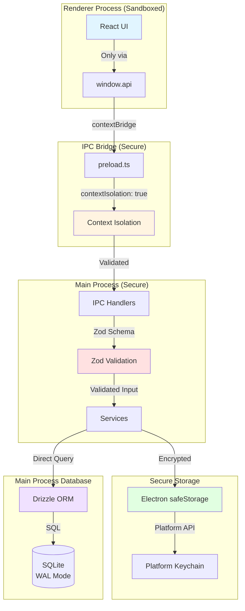

### Изоляция контекста

**Статус:** ✅ Включено

Renderer Process работает в изолированной среде без прямого доступа к Node.js. Это предотвращает атаки Remote Code Execution (RCE).

**Конфигурация:**

```typescript
webPreferences: {
  contextIsolation: true,  // Required
  nodeIntegration: false,  // Never true
  sandbox: true,           // Additional security
  preload: path.join(__dirname, "../preload/bridge.cjs"),
}
```

### Безопасность IPC

**⚠️ ВАЖНО: Контракт безопасности API Key**

Слой IPC обеспечивает строгий контракт безопасности для учетных данных API:

-   **`saveSettings(creds: { userId: string; apiKey: string })`** - Принимает API key в открытом виде (неизбежно при Onboarding)
-   **`getSettings()`** - Возвращает `IpcSettings` с `hasApiKey: boolean`, **НИКОГДА сам API key**
-   **Жизненный цикл API Key:**
    -   Введен в Renderer → Отправлен в Main через IPC → Зашифрован в Main → Хранится в зашифрованном виде
    -   **Никогда не расшифровывается для Renderer** - Расшифровывается только в Main Process, когда это необходимо для вызовов API (например, в `SyncService`)

**Почему это важно:** Если `getSettings()` возвращал бы API key, любой скомпрометированный Renderer Process (XSS, вредоносное расширение и т.д.) мог бы украсть учетные данные. Булев флаг `hasApiKey` позволяет UI проверять, настроены ли учетные данные, не раскрывая сам ключ.

1.  **Типобезопасность:** Вся IPC-связь строго типизирована
2.  **Проверка входных данных:** Все входные данные проверяются в Main Process с использованием Zod-схем
3.  **Обработка ошибок:** Ошибки обрабатываются корректно без раскрытия конфиденциальных данных
4.  **Отсутствие прямого доступа к Node:** Renderer не может напрямую обращаться к Node.js API
5.  **Безопасные учетные данные:** API keys шифруются в состоянии покоя, **НИКОГДА не возвращаются в Renderer** (только булев флаг `hasApiKey`)
6.  **Изоляция Worker Thread:** Операции с базой данных изолированы в worker thread

### Поток безопасности учетных данных

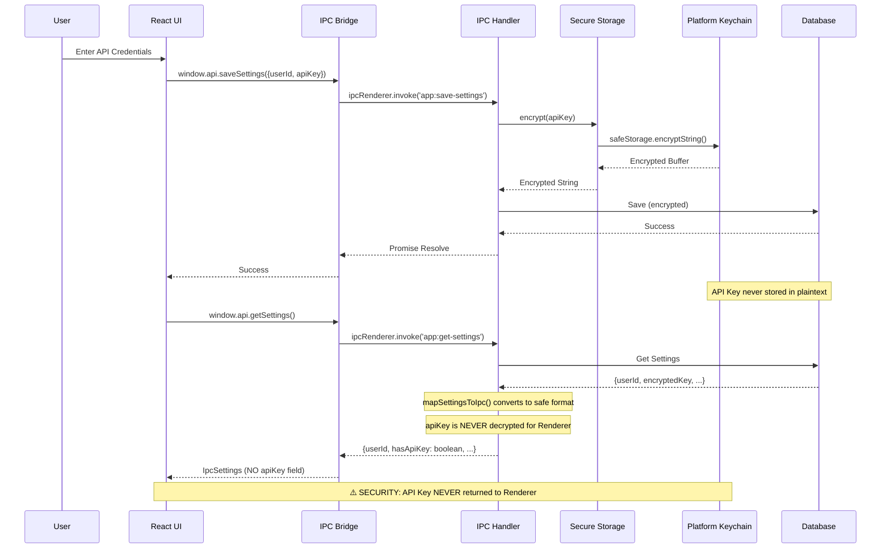

**Понятное объяснение:**

1.  **Сохранение учетных данных (Onboarding):**
    -   Пользователь вводит API key в Renderer (открытым текстом, что неизбежно во время ввода)
    -   `saveSettings()` отправляет учетные данные через IPC в Main Process
    -   Main Process шифрует API key с использованием Electron `safeStorage` API (связка ключей платформы)
    -   Зашифрованный ключ хранится в базе данных
    -   Renderer получает подтверждение успеха (чувствительные данные не возвращаются)

2.  **Получение настроек (Контракт безопасности):**
    -   `getSettings()` вызывается из Renderer
    -   Main Process извлекает зашифрованный ключ из базы данных
    -   **⚠️ КРИТИЧЕСКОЕ ПРАВИЛО БЕЗОПАСНОСТИ: API Key НИКОГДА не расшифровывается для Renderer**
    -   Функция `mapSettingsToIpc()` преобразует запись базы данных в безопасный формат IPC:
        -   ✅ Возвращает: `userId` (безопасно, нечувствительно)
        -   ✅ Возвращает: `hasApiKey: boolean` (флаг, указывающий, существует ли ключ, безопасно)
        -   ✅ Возвращает: Другие флаги настроек (safe mode, подтверждение возраста и т.д.)
        -   ❌ **НИКОГДА не возвращает:** `apiKey` (зашифрованный или расшифрованный)
    -   Renderer получает тип `IpcSettings`, который **не содержит поля `apiKey`**
    -   API key расшифровывается только в Main Process, когда это необходимо для вызовов API (например, в `SyncService`)

**Контракт безопасности:**

-   **Ввод (saveSettings):** API key отправляется из Renderer открытым текстом (неизбежно при Onboarding)
-   **Хранение:** API key шифруется с использованием связки ключей платформы, хранится в зашифрованном виде в базе данных
-   **Вывод (getSettings):** Renderer получает `IpcSettings` с `hasApiKey: boolean`, **НИКОГДА сам ключ**
-   **Внутреннее использование:** API key расшифровывается только в Main Process для вызовов API, никогда не раскрывается для Renderer

**Почему это важно:**

Если `getSettings()` возвращал бы API key (даже расшифрованный), любой скомпрометированный Renderer Process (XSS, вредоносное расширение и т.д.) мог бы украсть учетные данные. Возвращая только булев флаг, Renderer может проверить, настроены ли учетные данные, никогда не видя сам ключ.

## Поток данных

### Поток чтения данных

Схема ниже показывает, как данные считываются из базы данных и отображаются в UI. **Прочтите объяснение**, чтобы понять полный поток.

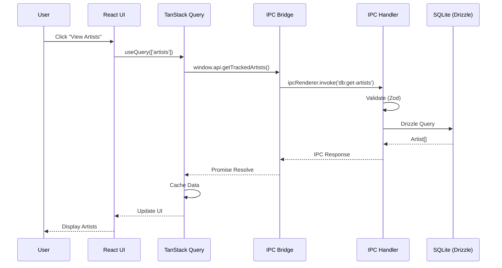

**Реальный сценарий: Пользователь открывает страницу "Tracked"**

1.  **Пользователь нажимает "Tracked"** в боковой навигации

2.  **React Component рендерится** - Component `Tracked.tsx` монтируется и вызывает:
    ```typescript
    const { data: artists } = useQuery({
      queryKey: ["artists"],
      queryFn: () => window.api.getTrackedArtists(),
    });
    ```

3.  **React Query проверяет кэш** - React Query сначала проверяет, есть ли у него кэшированные данные для `["artists"]`. Если да, он немедленно возвращает кэшированные данные (без сетевого вызова).

4.  **Вызов IPC** - Если кэш пуст или устарел, React Query вызывает `window.api.getTrackedArtists()`, который проходит через IPC bridge в Main Process.

5.  **Валидация** - IPC-обработчик проверяет запрос (хотя `getTrackedArtists` не имеет параметров, валидация все равно выполняется для обеспечения согласованности).

6.  **Запрос к базе данных** - Обработчик выполняет запрос Drizzle:
    ```typescript
    const artists = await db.query.artists.findMany({
      orderBy: [asc(artists.name)],
    });
    ```

7.  **Ответ** - Массив Artist'ов возвращается:
    -   База данных → IPC Handler → IPC Bridge → React Query → Component

8.  **Кэширование** - React Query автоматически кэширует результат. Если пользователь уходит и возвращается, данные подаются из кэша (мгновенная загрузка).

9.  **Обновление UI** - React перерисовывается с данными Artist'ов, отображая их в виде сетки.

**Почему React Query?**

-   **Автоматическое кэширование** - Данные кэшируются и повторно используются
-   **Состояния загрузки** - Состояния `isLoading` и `error` обрабатываются автоматически
-   **Фоновая повторная выборка** - Может выполнять повторную выборку в фоновом режиме, когда данные могут быть устаревшими
-   **Оптимистические обновления** - Может обновлять UI до подтверждения сервером (для мутаций)

**Преимущества производительности:**

-   Первая загрузка: ~50-100 мс (запрос к базе данных + накладные расходы IPC)
-   Последующие загрузки: ~0 мс (обслуживаются из кэша React Query)
-   Фоновая повторная выборка: Происходит автоматически, не блокируя UI

### Поток записи данных

Схема ниже показывает, как данные записываются в базу данных. **Прочтите объяснение** для полного понимания потока, включая обработку ошибок.

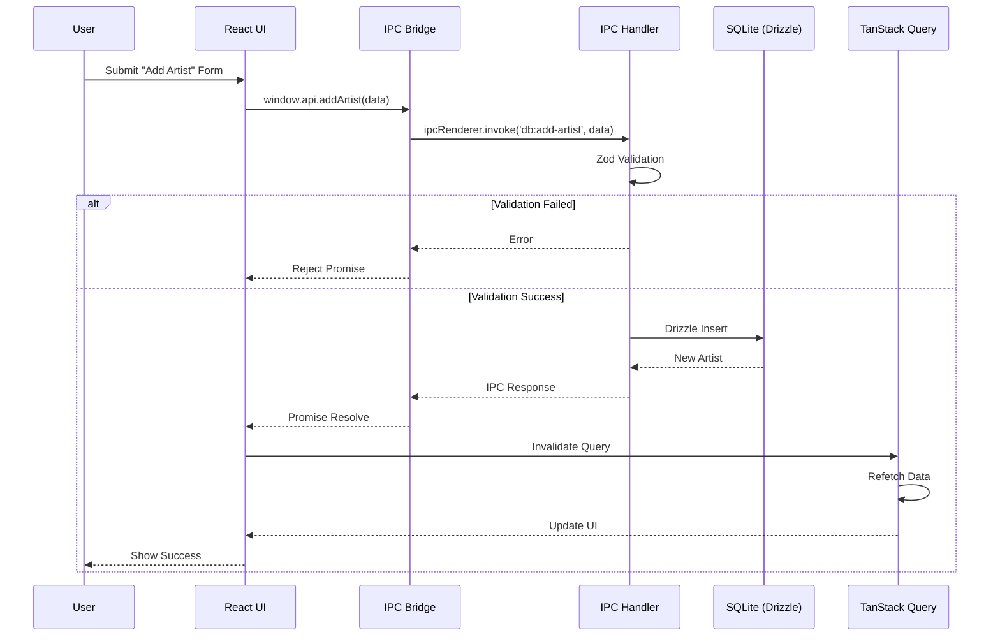

**Реальный сценарий: Пользователь добавляет нового Artist'а**

1.  **Пользователь заполняет форму** - Пользователь вводит имя Artist'а "example_artist", Tag "tag_name", выбирает тип "tag" и нажимает "Add".

2.  **Отправка формы** - React Component вызывает:
    ```typescript
    const handleAddArtist = async (name, tag, type) => {
      await window.api.addArtist({ name, tag, type, provider: "rule34" });
    };
    ```

3.  **Вызов IPC** - Запрос проходит через IPC bridge в Main Process.

4.  **Валидация** - `ArtistsController` проверяет входные данные с помощью Zod-схемы:
    ```typescript
    // Zod schema checks:
    // - name is non-empty string
    // - tag is non-empty string
    // - apiEndpoint is valid URL
    ```

5.  **Два пути:**

    **Путь А: Валидация не удалась**
    -   Zod выбрасывает ошибку валидации
    -   `BaseController` перехватывает ее и возвращает удобную для пользователя ошибку
    -   Promise отклоняется в Renderer
    -   Component показывает сообщение об ошибке пользователю
    -   **Запись в базу данных не происходит**

    **Путь B: Валидация успешна**
    -   Контроллер вызывает сервис: `dbService.addArtist(validatedData)`
    -   Сервис выполняет вставку Drizzle:
        ```typescript
        await db.insert(artists).values({
          name: "example_artist",
          tag: "tag_name",
          // ... other fields
        }).returning();
        ```
    -   База данных возвращает нового Artist'а с сгенерированным ID
    -   Ответ возвращается в Renderer

6.  **Инвалидация кэша** - В случае успеха Component инвалидирует кэш React Query:
    ```typescript
    queryClient.invalidateQueries({ queryKey: ["artists"] });
    ```

7.  **Автоматическая повторная выборка** - React Query автоматически повторно извлекает `["artists"]`, поскольку кэш был инвалидирован.

8.  **Обновления UI** - Новый Artist автоматически появляется в списке (ручное обновление State не требуется).

**Почему этот паттерн?**

-   **Сначала валидация** - Недопустимые данные никогда не попадают в базу данных
-   **Типобезопасность** - TypeScript + Zod обеспечивают корректность данных
-   **Автоматическая синхронизация UI** - Инвалидация кэша гарантирует, что UI всегда отображает самые актуальные данные
-   **Обработка ошибок** - Удобные для пользователя ошибки, а не технические трассировки стека

**Пример обработки ошибок:**

```typescript
try {
  await window.api.addArtist(data);
  // Success - cache invalidation happens automatically
} catch (error) {
  // Error could be:
  // - Validation error: "Username is required"
  // - Database error: "Tag already exists"
  // - Network error: "Failed to connect"
  
  log.error("Failed to add artist:", error);
  // Show error toast to user
}
```

### Поток синхронизации

Схема ниже показывает, как работает фоновая синхронизация. **Прочтите объяснение**, чтобы понять полный асинхронный поток с обновлениями прогресса.

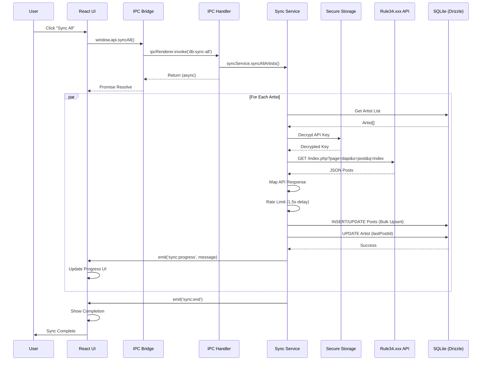

**Реальный сценарий: Пользователь нажимает кнопку "Sync All"**

1.  **Действие пользователя** - Пользователь нажимает кнопку "Sync All" в боковой панели или на странице Tracked.

2.  **Вызов IPC** - Component вызывает `window.api.syncAll()`. Этот метод возвращается **немедленно** (не ждет завершения синхронизации), потому что синхронизация выполняется в фоновом режиме.

3.  **Запуск сервиса синхронизации** - `SyncService` начинает асинхронную обработку Artist'ов. UI показывает индикатор "Syncing...".

4.  **Для каждого Artist'а сервис:**

    a.  **Получает данные Artist'а** из базы данных:
        ```typescript
        const artists = await db.query.artists.findMany();
        ```

    b.  **Расшифровывает API key** - Зашифрованный API key расшифровывается с использованием Electron `safeStorage` API. Это происходит только в Main Process (безопасно).

    c.  **Извлекает посты из API** - Выполняет HTTP-запрос к Rule34.xxx API:
        ```
        GET https://api.rule34.xxx/index.php?page=dapi&s=post&q=index&tags=tag_name&limit=1000
        ```

    d.  **Сопоставляет ответ API** - Преобразует формат JSON API в формат схемы базы данных.

    e.  **Ограничение скорости** - Ждет 1.5 секунды перед обработкой следующего Artist'а (предотвращает злоупотребление API).

    f.  **Массовое upsert** - Сохраняет посты в базу данных с использованием обработки `ON CONFLICT` (обновляет существующие, вставляет новые):
        ```typescript
        await db.insert(posts).values(newPosts)
          .onConflictDoUpdate({
            target: [posts.artistId, posts.postId],
            set: { /* update fields */ }
          });
        ```

    g.  **Обновляет Artist** - Обновляет `lastPostId` и `newPostsCount` Artist'а.

    h.  **Событие прогресса** - Генерирует IPC-событие: `emit('sync:progress', 'Syncing artist_name...')`

5.  **Обновления UI в реальном времени** - React Component слушает события прогресса:
    ```typescript
    useEffect(() => {
      const unsubscribe = window.api.onSyncProgress((message) => {
        setSyncMessage(message); // Update progress text
      });
      return () => unsubscribe();
    }, []);
    ```

6.  **Завершение** - Когда все Artist'ы обработаны, сервис генерирует событие `sync:end`. UI показывает сообщение "Sync complete".

**Почему асинхронность с событиями?**

-   **Неблокирующий** - UI остается отзывчивым во время синхронизации
-   **Обратная связь о прогрессе** - Пользователь видит прогресс в реальном времени
-   **Обработка ошибок** - Отдельные сбои Artist'ов не останавливают всю синхронизацию
-   **Возобновляемый** - Можно остановить и возобновить синхронизацию позже

**Пример: Обработка событий синхронизации**

```typescript
// In component
const [syncMessage, setSyncMessage] = useState<string | null>(null);

useEffect(() => {
  const unsubscribeStart = window.api.onSyncStart(() => {
    setSyncMessage("Starting sync...");
  });

  const unsubscribeProgress = window.api.onSyncProgress((message) => {
    setSyncMessage(message); // "Syncing artist_name..."
  });

  const unsubscribeEnd = window.api.onSyncEnd(() => {
    setSyncMessage("Sync complete!");
    // Refresh artist list to show new posts count
    queryClient.invalidateQueries({ queryKey: ["artists"] });
  });

  const unsubscribeError = window.api.onSyncError((error) => {
    setSyncMessage(`Sync error: ${error}`);
  });

  return () => {
    unsubscribeStart();
    unsubscribeProgress();
    unsubscribeEnd();
    unsubscribeError();
  };
}, []);
```

**Соображения производительности:**

-   **Ограничение скорости** - Задержка в 1.5 с между Artist'ами предотвращает блокировку API
-   **Массовые операции** - Посты вставляются партиями (200 за партию) для эффективности
-   **Инкрементная синхронизация** - Извлекает только посты новее `lastPostId` (не все посты)
-   **Фоновое выполнение** - Синхронизация не блокирует UI или другие операции

## Архитектура базы данных

### Схема

База данных использует SQLite со следующими таблицами:

1.  **artists** - Отслеживаемые Artist'ы/пользователи (по Tag'у или загрузчику)
2.  **posts** - Кэшированные метаданные постов с Tag'ами, рейтингами и URL
3.  **settings** - Учетные данные API (User ID и зашифрованный API Key), safe mode, подтверждение возраста

См. [Документацию по базе данных](./database.md) для подробной информации о схеме.

### ORM-слой

**Drizzle ORM** предоставляет:

-   Типобезопасные запросы
-   Миграции схемы
-   Вывод типов
-   Генерацию SQL

### Архитектура базы данных

**Клиент базы данных** (`src/main/db/client.ts`):

-   Прямой синхронный доступ к SQLite через `better-sqlite3`
-   Режим WAL (Write-Ahead Logging) включен для параллельных чтений
-   Автоматическое выполнение миграций при инициализации
-   Типобезопасные запросы через Drizzle ORM
-   Управление подключением к базе данных в Main Process

## Архитектура Компонентов

### Иерархия React Компонентов

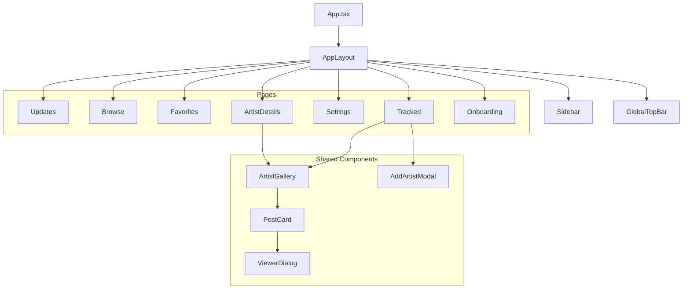

## Интеграция с внешними API

### Архитектура паттерна Provider

Вызовы внешних API абстрагированы через **Паттерн Provider** (`src/main/providers/`):

1.  **Интерфейс IBooruProvider:** Стандартизированный интерфейс для всех Booru-источников
    -   `checkAuth()` - Проверка учетных данных
    -   `fetchPosts()` - Получение постов по Tag'ам
    -   `searchTags()` - Автозаполнение Tag'ов
    -   `formatTag()` - Форматирование Tag'ов на основе типа Artist'а
    -   `getDefaultApiEndpoint()` - Получение URL API endpoint

2.  **Реализации провайдера:**
    -   `Rule34Provider` - Реализация Rule34.xxx API
    -   `GelbooruProvider` - Реализация Gelbooru API

3.  **Интеграция SyncService:**
    -   Использует паттерн Provider для получения постов
    -   **Ограничение скорости:** Задержка 1.5 секунды между Artist'ами, 0.5 секунды между страницами
    -   **Пагинация:** Обрабатывает пагинацию, специфичную для Booru (до 1000 постов на страницу)
    -   **Инкрементная синхронизация:** Извлекает только посты новее `lastPostId`
    -   **Обработка ошибок:** Корректная обработка ошибок API и сбоев сети
    -   **Аутентификация:** Использует User ID и API Key из таблицы Settings

### Поток загрузки

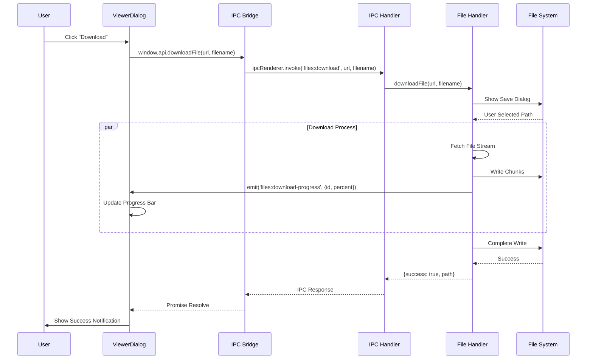

## Архитектура сборки

### Инструмент сборки: Vite

Проект использует **electron-vite** для сборки как Main, так и Renderer процессов.

**Конфигурация:** `electron.vite.config.ts`

**Цели сборки:**

1.  **Main:** Node.js bundle (`out/main/`)
2.  **Preload:** CommonJS bridge (`out/preload/`)
3.  **Renderer:** Приложение React (`out/renderer/`)

### Режим разработки

-   Hot Module Replacement (HMR) для Renderer ✅
-   Быстрая пересборка с Vite
-   DevTools включены в режиме разработки
-   Main Process: Требуется ручной перезапуск (без автоперезапуска) ⚠️

## Управление State

### State Renderer

**TanStack Query (React Query):**

-   Server State (данные из Main Process)
-   Кэширование и синхронизация
-   Состояния загрузки и ошибок

**Zustand:**

-   Client-side UI State
-   Минимальный boilerplate
-   Соответствие принципу KISS

**⚠️ ВАЖНО: Используйте Селекторы для предотвращения ненужных повторных рендеров**

Zustand Stores могут вызывать проблемы с производительностью, если используются неправильно. **Всегда используйте селекторы**, чтобы подписываться только на конкретный State, который вам нужен, а не на весь Store.

**Почему селекторы важны:**

Когда вы подписываетесь на весь Store, Component повторно рендерится при **любом** изменении State, даже если он не использует эту часть State. Это может привести к:
-   Ненужным повторным рендерам больших деревьев Component'ов
-   Снижению производительности со сложными UI
-   Зависанию UI при частых обновлениях State

**❌ НЕПРАВИЛЬНО: Подписка на весь Store**

```typescript
// ❌ BAD: Component re-renders on ANY state change
const store = useViewerStore(); // Gets entire store
const isOpen = store.isOpen; // But only uses isOpen

// If controlsVisible changes, this component still re-renders!
```

**✅ ПРАВИЛЬНО: Использование селекторов**

```typescript
// ✅ GOOD: Component only re-renders when isOpen changes
const isOpen = useViewerStore((state) => state.isOpen);

// Component ignores other state changes (controlsVisible, queue, etc.)
```

**✅ ПРАВИЛЬНО: Использование нескольких селекторов с useShallow**

Когда вам нужны несколько значений, используйте `useShallow`, чтобы предотвратить повторные рендеры при изменении несвязанного State:

```typescript
import { useShallow } from "zustand/react/shallow";

// ✅ GOOD: Only re-renders when isOpen or close function changes
const { isOpen, close } = useViewerStore(
  useShallow((state) => ({
    isOpen: state.isOpen,
    close: state.close,
  }))
);

// ✅ GOOD: Split into logical groups for better performance
const { currentPostId, queue } = useViewerStore(
  useShallow((state) => ({
    currentPostId: state.currentPostId,
    queue: state.queue,
  }))
);

const { currentIndex, next, prev } = useViewerStore(
  useShallow((state) => ({
    currentIndex: state.currentIndex,
    next: state.next,
    prev: state.prev,
  }))
);
```

**Пример из реального мира из ViewerDialog:**

```typescript
// In ViewerDialog.tsx - split selectors into logical groups
export const ViewerDialog = () => {
  // Group 1: Open/close state
  const { isOpen, close } = useViewerStore(
    useShallow((state) => ({
      isOpen: state.isOpen,
      close: state.close,
    }))
  );

  // Group 2: Current post data
  const { currentPostId, queue } = useViewerStore(
    useShallow((state) => ({
      currentPostId: state.currentPostId,
      queue: state.queue,
    }))
  );

  // Group 3: Navigation
  const { currentIndex, next, prev } = useViewerStore(
    useShallow((state) => ({
      currentIndex: state.currentIndex,
      next: state.next,
      prev: state.prev,
    }))
  );

  // Each group only re-renders when its specific values change
  // If controlsVisible changes, none of these groups re-render
};
```

**Лучшие практики:**

1.  **Единое значение:** Используйте простой селектор `useStore((s) => s.value)`
2.  **Несколько значений:** Используйте `useShallow` с объектным селектором
3.  **Разделение селекторов:** Группируйте связанные значения вместе
4.  **Избегайте полного Store:** Никогда не используйте `useStore()` без селектора
5.  **Мемоизируйте селекторы:** Для сложных селекторов используйте `useMemo` или выносите в функцию

**Влияние на производительность:**

-   **Без селекторов:** Component повторно рендерится при каждом обновлении Store (даже несвязанном)
-   **С селекторами:** Component повторно рендерится только при изменении выбранных значений
-   **С useShallow:** Предотвращает повторные рендеры, когда ссылка на объект изменяется, но значения остаются теми же

**Пример: Простой селектор одиночного значения**

```typescript
// In AppLayout.tsx - only needs isOpen
const isViewerOpen = useViewerStore((state) => state.isOpen);

// Component only re-renders when isOpen changes
// Ignores changes to controlsVisible, queue, currentIndex, etc.
```

### State Main Process

-   База данных является источником истины
-   Сервисы поддерживают минимальный in-memory State
-   Фоновые задания используют таймеры, а не постоянный State

## Структура файлов

```
src/
├── main/                          # Electron Main Process
│   ├── db/                        # Database layer
│   │   ├── repositories/         # Repository pattern implementations
│   │   │   ├── artists.repo.ts    # Artists repository
│   │   │   └── posts.repo.ts       # Posts repository
│   │   ├── db-service.ts          # Legacy database service (deprecated)
│   │   ├── db-worker.ts           # Database worker thread implementation
│   │   ├── db-worker-client.ts    # Worker client interface
│   │   ├── migrate.ts             # Migration runner
│   │   ├── schema.ts              # Drizzle ORM schema definitions
│   │   └── worker-types.ts        # Worker thread type definitions
│   ├── ipc/                       # IPC (Inter-Process Communication)
│   │   ├── controllers/           # IPC Controllers (domain-based)
│   │   │   ├── ArtistsController.ts
│   │   │   ├── PostsController.ts
│   │   │   ├── SettingsController.ts
│   │   │   ├── AuthController.ts
│   │   │   ├── MaintenanceController.ts
│   │   │   ├── ViewerController.ts
│   │   │   ├── FileController.ts
│   │   │   └── SystemController.ts
│   │   ├── channels.ts            # IPC channel constants
│   │   └── index.ts               # IPC setup and registration
│   ├── core/                      # Core infrastructure
│   │   ├── di/                    # Dependency Injection
│   │   │   ├── Container.ts       # DI Container (Singleton)
│   │   │   └── Token.ts           # Type-safe DI tokens
│   │   └── ipc/                    # IPC infrastructure
│   │       └── BaseController.ts   # Base controller with error handling
│   ├── providers/                 # Booru provider implementations
│   │   ├── rule34-provider.ts     # Rule34.xxx provider
│   │   ├── gelbooru-provider.ts   # Gelbooru provider
│   │   ├── types.ts               # Provider interfaces
│   │   └── index.ts               # Provider registry
│   ├── services/                  # Background services
│   │   ├── secure-storage.ts       # Secure storage for API credentials
│   │   ├── sync-service.ts        # Rule34.xxx API synchronization
│   │   └── updater-service.ts     # Auto-updater service
│   ├── lib/                       # Utilities
│   │   └── logger.ts             # Logging utility
│   ├── bridge.ts                  # IPC bridge interface definition
│   ├── main.d.ts                  # Main process type definitions
│   └── main.ts                    # Main process entry point
│
├── renderer/                      # Electron Renderer Process
│   ├── components/                # React components
│   │   ├── dialogs/               # Dialog components
│   │   │   ├── AddArtistModal.tsx
│   │   │   ├── DeleteArtistDialog.tsx
│   │   │   ├── Onboarding.tsx
│   │   │   └── UpdateNotification.tsx
│   │   ├── gallery/               # Gallery components
│   │   │   ├── ArtistCard.tsx
│   │   │   ├── ArtistGallery.tsx
│   │   │   └── PostCard.tsx
│   │   ├── inputs/                # Input components
│   │   │   └── AsyncAutocomplete.tsx
│   │   ├── layout/                 # Layout components
│   │   │   ├── AppLayout.tsx
│   │   │   ├── GlobalTopBar.tsx
│   │   │   └── Sidebar.tsx
│   │   ├── pages/                  # Page components
│   │   │   ├── ArtistDetails.tsx
│   │   │   ├── Browse.tsx
│   │   │   ├── Favorites.tsx
│   │   │   ├── Onboarding.tsx
│   │   │   ├── Settings.tsx
│   │   │   ├── Tracked.tsx
│   │   │   └── Updates.tsx
│   │   ├── settings/               # Settings components
│   │   │   └── BackupControls.tsx
│   │   ├── ui/                     # shadcn/ui components
│   │   │   ├── alert.tsx
│   │   │   ├── button.tsx
│   │   │   ├── card.tsx
│   │   │   ├── dialog.tsx
│   │   │   ├── dropdown-menu.tsx
│   │   │   ├── input.tsx
│   │   │   ├── label.tsx
│   │   │   ├── select.tsx
│   │   │   └── separator.tsx
│   │   └── viewer/                 # Viewer components
│   │       └── ViewerDialog.tsx
│   ├── i18n/                       # Internationalization
│   │   └── index.ts
│   ├── lib/                        # Utilities
│   │   ├── hooks/                  # Custom React hooks
│   │   │   └── useDebounce.ts
│   │   ├── artist-utils.ts
│   │   ├── tag-utils.ts
│   │   └── utils.ts
│   ├── locales/                    # Translation files
│   │   └── en/
│   │       └── translation.json
│   ├── schemas/                    # Form validation schemas
│   │   └── form-schemas.ts
│   ├── store/                       # State management (Zustand)
│   │   └── viewerStore.ts
│   ├── App.tsx                     # Main React component
│   ├── index.css                   # Global styles
│   ├── index.html                  # HTML template
│   ├── main.tsx                    # Renderer entry point
│   └── renderer.d.ts               # Renderer type definitions
│
└── preload/                        # Preload scripts (generated by electron-vite)
    └── bridge.cjs                  # Compiled preload script

Root:
├── drizzle/                        # Database migrations
│   ├── meta/                       # Migration metadata
│   │   ├── _journal.json
│   │   └── *_snapshot.json
│   └── *.sql                       # SQL migration files
├── docs/                           # Documentation
│   ├── api.md
│   ├── architecture.md
│   ├── contributing.md
│   ├── database.md
│   ├── development.md
│   ├── roadmap.md
│   └── rule34-api-reference.md
├── scripts/                        # Build and utility scripts
│   ├── ai_reviewer.py
│   └── system_prompt.md
├── .github/                        # GitHub workflows
│   └── workflows/
│       ├── ai-review.yml
│       └── ci.yml
├── electron.vite.config.ts         # Electron-Vite configuration
├── drizzle.config.ts               # Drizzle ORM configuration
├── tailwind.config.js              # Tailwind CSS configuration
├── tsconfig.json                   # TypeScript configuration
└── package.json                    # Project dependencies and scripts
```

## Принципы проектирования

### Принципы SOLID

-   **Единая ответственность (Single Responsibility):** Каждый модуль имеет одну четкую цель
-   **Открытость/Закрытость (Open/Closed):** Расширять через композицию, а не через модификацию
-   **Инверсия зависимостей (Dependency Inversion):** Сервисы зависят от абстракций

### KISS и YAGNI

-   **KISS:** Простой, читаемый код вместо хитрых решений
-   **YAGNI:** Реализуйте только то, что нужно сейчас

### DRY

-   Общие типы между Main и Renderer
-   Переиспользуемые Components и утилиты
-   Отсутствие дублирования кода

## Текущий статус

### ✅ Завершенные функции

**Инфраструктура и сборка:**

-   **Версия Electron:** 39.2.7 с последними функциями безопасности
-   **Система сборки:** electron-vite для оптимальной производительности сборки
-   **Архитектура базы данных:** Прямой синхронный доступ через `better-sqlite3` с режимом WAL для параллельного чтения
-   **Портативный режим (Portable Mode):** Автоматическое обнаружение и поддержка портативных исполняемых файлов

**База данных и схема:**

-   **Схема:** Три основные таблицы (`artists`, `posts`, `settings`) с правильными связями и Indexes
-   **Миграции:** Полностью функциональная система миграций с использованием `drizzle-kit`
-   **Indexes:** Оптимизированные Indexes по `artistId`, `isViewed`, `publishedAt`, `isFavorited`, `lastChecked`, `createdAt`
-   **Поддержка провайдеров:** Поддержка нескольких Booru с полем `provider` (Rule34, Gelbooru)
-   **Типы Artist'ов:** Поддержка типов `tag`, `uploader` и `query`

**Безопасность и надежность:**

-   **Безопасное хранилище:** Учетные данные API зашифрованы с использованием Electron `safeStorage` API (Windows Credential Manager, macOS Keychain, Linux libsecret)
-   **Резервное копирование/восстановление базы данных:** Функциональность ручного резервного копирования и восстановления с проверкой целостности
-   **Изоляция контекста (Context Isolation):** Включена глобально с режимом sandbox
-   **CSP:** Строгая политика безопасности контента (Content Security Policy) в production, ослабленная для разработки (поддержка HMR)
-   **Архитектура IPC:** IPC-обработчики на основе контроллеров с `BaseController` для централизованной обработки ошибок

**Целостность данных и синхронизация:**

-   **Нормализация Tag'ов:** Автоматическое удаление метаданных из имен Tag'ов (например, "tag (123)" → "tag")
-   **Сервис синхронизации:** Корректно обрабатывает `ON CONFLICT` с правильной логикой upsert
-   **Паттерн Provider:** Поддержка нескольких Booru через интерфейс `IBooruProvider`
-   **Ограничение скорости:** Интеллектуальное ограничение скорости с настраиваемыми задержками

**UI/UX:**

-   **Прогрессивная загрузка изображений:** 3-слойная система (Preview → Sample → Original)
-   **Виртуализация:** `react-virtuoso` для эффективного рендеринга больших списков
-   **Функциональность поиска:** Поиск локальных Artist'ов и удаленных Tag'ов (несколько провайдеров)
-   **Боковая навигация:** Постоянная боковая панель с основными разделами навигации
-   **Глобальная верхняя панель:** Унифицированная верхняя панель с поиском, фильтрами, элементами управления сортировкой (UI реализован, бэкенд в ожидании)
-   **Полноэкранный Viewer:** Иммерсивный Viewer с горячими клавишами, загрузкой, избранным
-   **Менеджер загрузок:** Загрузка файлов в полном разрешении с отслеживанием прогресса
-   **Система избранного:** Полная реализация с полем базы данных и функциональностью переключения

## Реализованные функции

1.  ✅ **Сервис синхронизации:** Выделенный сервис для синхронизации API нескольких Booru с отслеживанием прогресса
2.  ✅ **Управление Settings:** Безопасное хранение учетных данных API с шифрованием с использованием Electron `safeStorage` API
3.  ✅ **Отслеживание Artist'ов:** Поддержка отслеживания по Tag'ам с поиском с автозаполнением и нормализацией Tag'ов (несколько провайдеров)
4.  ✅ **Галерея постов:** Сетка кэшированных постов с предварительным просмотром изображений и пагинацией
5.  ✅ **Прогрессивная загрузка изображений:** 3-слойная система загрузки (Preview → Sample → Original) для мгновенного просмотра
6.  ✅ **Восстановление Artist'а:** Функциональность повторной синхронизации для обновления превью и устранения проблем синхронизации
7.  ✅ **Автообновление:** Автоматическая проверка и установка обновлений через electron-updater
8.  ✅ **Система событий:** IPC-события в реальном времени для прогресса синхронизации, статуса обновления и прогресса загрузки
9.  ✅ **Архитектура базы данных:** Прямой синхронный доступ через `better-sqlite3` с режимом WAL для параллельного чтения
10. ✅ **Безопасное хранилище:** Учетные данные API зашифрованы в состоянии покоя с использованием Electron `safeStorage` API
11. ✅ **Резервное копирование/восстановление:** Функциональность ручного резервного копирования и восстановления базы данных с проверками целостности и резервными копиями с отметками времени
12. ✅ **Функциональность поиска:** Поиск локальных Artist'ов и удаленных Tag'ов через API автозаполнения Booru (несколько провайдеров)
13. ✅ **Отметить как просмотренное:** Возможность отмечать посты как просмотренные для лучшей организации
14. ✅ **Система избранного:** Отметка и управление избранными постами с функциональностью переключения
15. ✅ **Менеджер загрузок:** Загрузка файлов в полном разрешении с отслеживанием прогресса
16. ✅ **Полноэкранный Viewer:** Иммерсивный Viewer с горячими клавишами, загрузкой, избранным и управлением Tag'ами
17. ✅ **Боковая навигация:** Постоянная боковая панель с основными разделами навигации (Updates, Browse, Favorites, Tracked, Settings)
18. ✅ **Глобальная верхняя панель:** Унифицированная верхняя панель с поиском, фильтрами, элементами управления сортировкой (UI реализован, бэкенд-фильтрация в ожидании)
19. ✅ **Проверка учетных данных:** Проверка учетных данных API перед сохранением и во время операций синхронизации
20. ✅ **Интеграция с буфером обмена:** Копирование метаданных и отладочной информации в буфер обмена
21. ✅ **Функциональность выхода из системы:** Очистка сохраненных учетных данных и возврат к Onboarding
22. ✅ **Портативный режим:** Автоматическое обнаружение и поддержка портативных исполняемых файлов
23. ✅ **IPC-контроллеры:** Архитектура на основе контроллеров с `BaseController` и внедрением зависимостей
24. ✅ **Паттерн Provider:** Поддержка нескольких Booru через интерфейс `IBooruProvider` (Rule34, Gelbooru)

## Активная дорожная карта (Приоритетные задачи)

### А. Фильтры (Расширенный поиск) 🚧 UI готов, бэкенд в ожидании

**Цель:** Позволить пользователям уточнять представление галереи.

-   ✅ **UI глобальной верхней панели:** Панель поиска, кнопка фильтра, выпадающий список сортировки и переключатель вида реализованы в `GlobalTopBar.tsx`
-   ⏳ Фильтрация по **Рейтингу** (Safe, Questionable, Explicit) - UI готов, бэкенд-фильтрация в ожидании
-   ⏳ Фильтрация по **Типу медиа** (Изображение vs Видео) - UI готов, бэкенд-фильтрация в ожидании
-   ⏳ Фильтрация по **Tag'ам** (Локальный поиск среди загруженных постов) - UI готов, бэкенд-фильтрация в ожидании
-   ⏳ Сортировка по: Дате добавления (Новые/Старые), Дате публикации - UI готов, бэкенд-сортировка в ожидании

**Статус:** UI глобальной верхней панели полностью реализован и виден в приложении. Логика бэкенд-фильтрации и сортировки должна быть подключена к элементам управления UI через IPC-обработчики и интегрирована с Component'ом `ArtistGallery`.

### Б. Менеджер загрузок ✅ Реализовано (Основные функции)

**Цель:** Позволить сохранять файлы в полном разрешении в локальную файловую систему.

-   ✅ Кнопка "Download Original" на просмотре Post'а (реализована в ViewerDialog)
-   ✅ **Обработчик загрузки:** Загрузки выполняются в Main Process с отслеживанием прогресса
-   ✅ **События прогресса:** Прогресс загрузки в реальном времени через IPC-события (`onDownloadProgress`)
-   ✅ **Управление файлами:** Открыть загруженный файл в папке (`openFileInFolder`)
-   ⏳ "Download All" для текущего фильтра/Artist'а (планируется)
-   ⏳ **Settings:** Разрешить выбор папки для загрузки по умолчанию (планируется)

**Статус:** ✅ Основная функциональность загрузки реализована. Индивидуальные загрузки файлов работают с отслеживанием прогресса. Пакетная загрузка и настройки папки по умолчанию планируются для будущих выпусков.

### В. Плейлисты / Коллекции ⏳ Не начато

**Цель:** Создание курированных коллекций постов независимо от Artist'ов/Трекеров.

**Фаза 1: MVP**

-   Новая таблица `playlists` (`id`, `name`, `created_at`)
-   Новая таблица `playlist_posts` (`playlist_id`, `post_id`, `added_at`)
-   Кнопка "⭐ Add to playlist" на Post Card
-   Новая страница/вкладка: "Playlists"
-   Просмотр плейлиста: Сетка с фильтрацией и сортировкой

**Статус:** В схеме нет таблиц плейлистов, код, связанный с плейлистами, не реализован.

### 🛡️ Безопасность и надежность (Укрепление)

См. [Дорожную карту](./roadmap.md#-security--reliability-hardening) для подробных улучшений безопасности:

-   ✅ **Архитектура базы данных** - ✅ **ЗАВЕРШЕНО:** Прямой синхронный доступ через `better-sqlite3` с режимом WAL для параллельного чтения
-   ✅ **Шифрование / Безопасное хранение учетных данных API** - ✅ **ЗАВЕРШЕНО:** Использование Electron `safeStorage` API для шифрования
-   ✅ **Система резервного копирования / восстановления базы данных** - ✅ **ЗАВЕРШЕНО:** Реализована функциональность ручного резервного копирования и восстановления с проверкой целостности

### Будущие соображения

1.  **Подписки на Tag'и:** Подписка на комбинации Tag'ов (схема готова)
2.  **Инъекция Content Script:** Улучшения DOM для внешних сайтов
3.  **Панель статистики:** Аналитика по отслеживаемым Artist'ам и постам
4.  **Двухмодульная система:** Режим библиотеки (локальная база данных) и режим браузера (встроенный webview)
5.  **Поддержка нескольких Booru:** Абстракция паттерна Provider для нескольких Booru-источников

### Масштабируемость

-   База данных может обрабатывать тысячи Artist'ов и постов
-   Опрос можно оптимизировать с помощью пакетной обработки
-   UI может быть виртуализирован для больших списков
-   Абстракция Provider позволяет добавлять новые Booru-источники без изменений ядра

## Соображения производительности

1.  **Индексирование базы данных:** Правильные Indexes по часто запрашиваемым полям
2.  **Оптимизация запросов:** Эффективные запросы Drizzle
3.  **Оптимизация React:** Мемоизация там, где это необходимо
4.  **Ленивая загрузка (Lazy Loading):** Разделение кода для больших Components

## Стратегия обработки ошибок

1.  **Быстрый отказ (Fail Fast):** Проверка входных данных на границах
2.  **Описательные ошибки:** Четкие сообщения об ошибках
3.  **Логирование ошибок:** Все ошибки логируются через `electron-log`
4.  **Обратная связь с пользователем:** Ошибки корректно отображаются в UI

## Статус реализации (Технический аудит)

Основываясь на всестороннем техническом аудите, вот текущий статус реализации ключевых функций:

### ✅ Полностью реализовано

-   **Виртуализация:** `react-virtuoso` реализован для эффективного рендеринга больших списков (`ArtistGallery.tsx`)
-   **Поддержка видео:** Форматы `.mp4` и `.webm` обрабатываются с использованием нативного элемента `<video>`
-   **Проверка входных данных:** Zod-валидация реализована для каждого IPC-обработчика
-   **Обработка ошибок:** Блоки try-catch в IPC-обработчиках с логированием ошибок

### ⚠️ Частично реализовано

-   **Developer HMR:** Renderer Process имеет полную поддержку HMR. Main Process требует ручного перезапуска (без автоперезапуска при изменениях файлов)
-   **Санитизация входных данных:** Zod-валидация для каждого обработчика (децентрализованная), нет централизованной утилиты
-   **Обработка ошибок:** IPC-обработчики имеют блоки try-catch, но некоторые возвращают необработанные ошибки вместо удобных для пользователя сообщений
-   **Современное видео:** Обработка видео существует, но нет явной конфигурации аппаратного ускорения в `webPreferences`

### ⏳ Отсутствует / Запланировано

-   **Safe Mode / NSFW Filter:** Нет логики размытия или флага `safeMode` в базе данных/Settings
-   **Возрастные ограничения (Age Gate):** Только текст дисклеймера в README, нет оверлея подтверждения или флага `isAdult`
-   **Портативный режим:** Использует абсолютные пути через `app.getPath("userData")`, нет поддержки относительных путей
-   **Меры по борьбе с ботами:** Статические строки User-Agent, фиксированные задержки (1.5с/0.5с), но без рандомизации или ротации
-   **Оптимизация БД (FTS5):** Только стандартные Indexes, нет виртуальных таблиц FTS5 для поиска по Tag'ам
-   **Централизованная валидация:** Нет общей утилиты валидации (`src/main/lib/validation.ts`)

См. [Дорожную карту](./roadmap.md#-technical-improvements-from-audit) для подробных планов реализации.