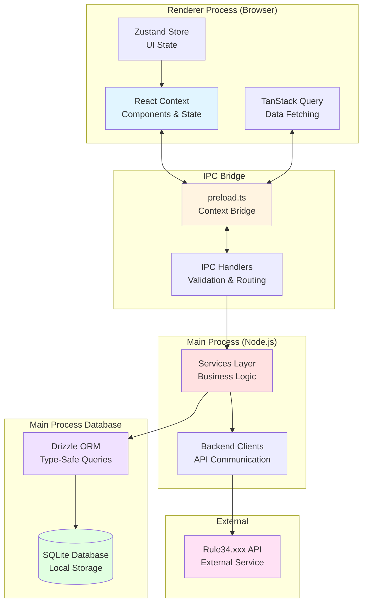
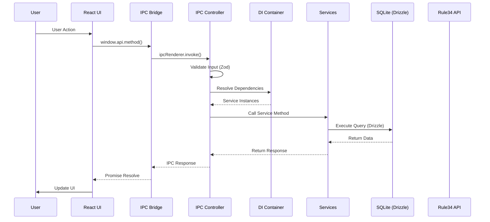
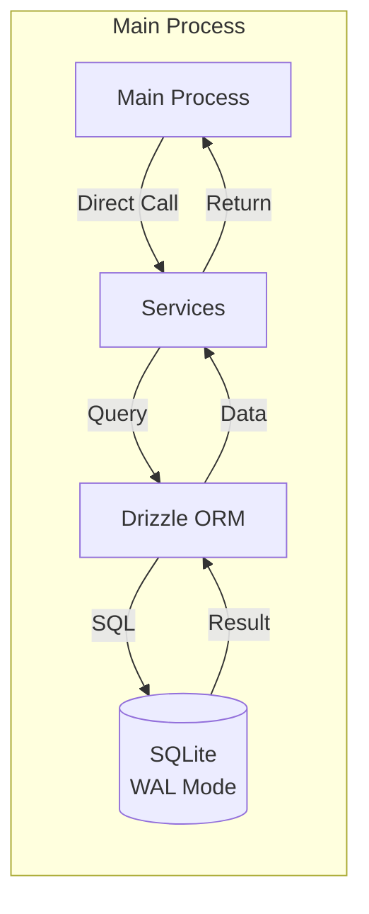
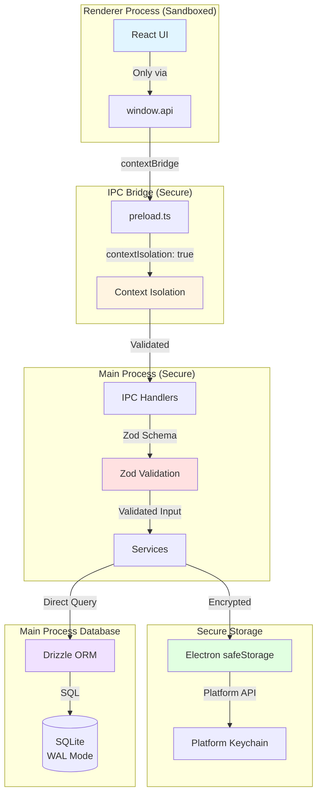
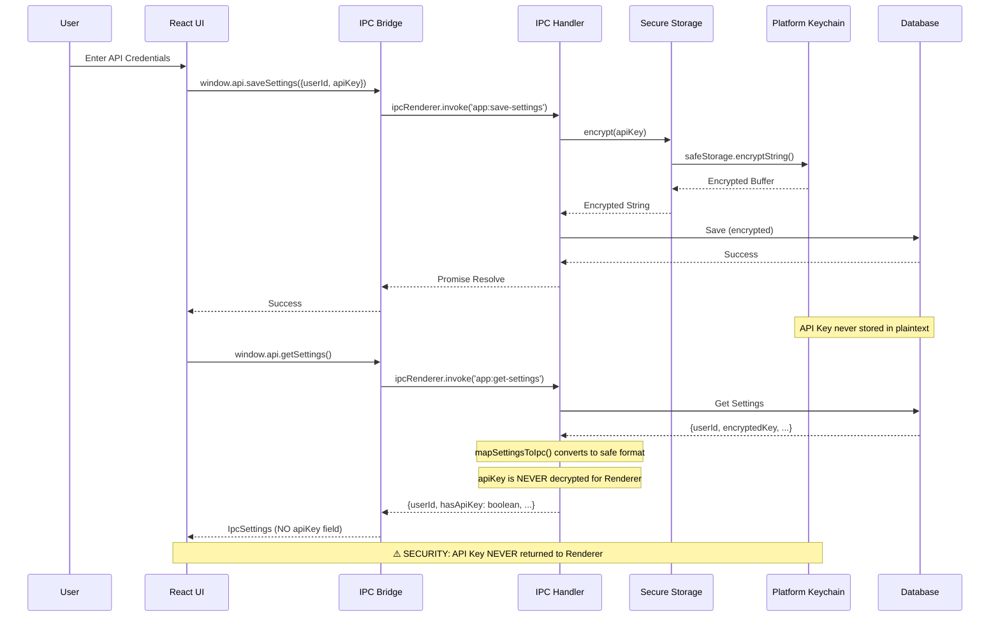
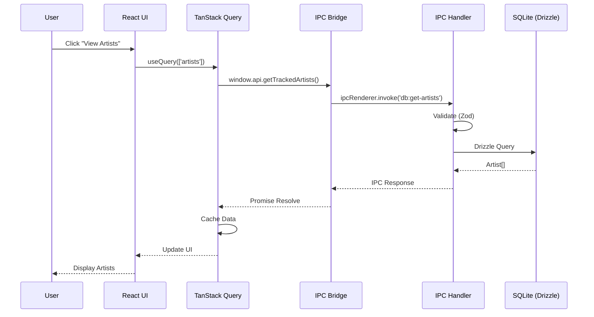
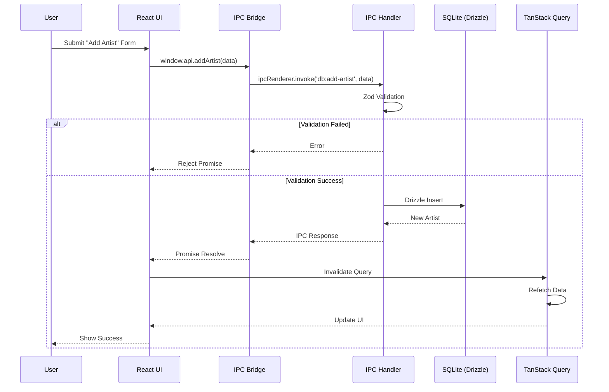
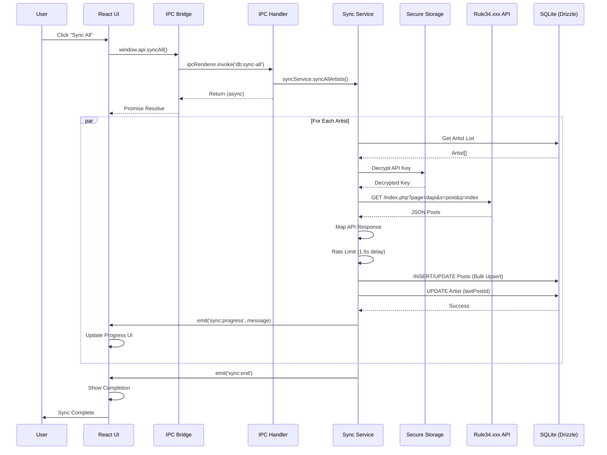
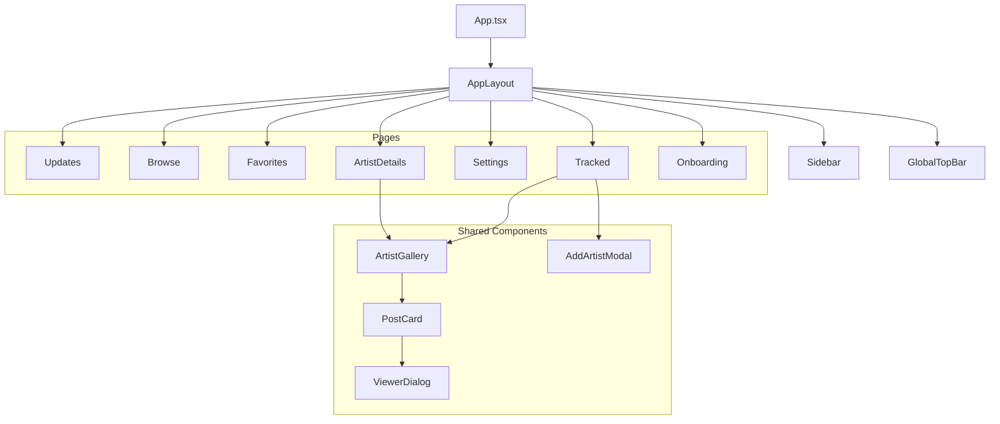
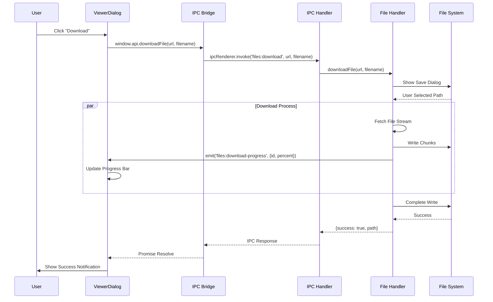

# Архитектурная документация

## 📑 Оглавление

- [Обзор](#overview)
- [Концепция архитектуры](#architecture-concept)
- [Высокоуровневая архитектура](#high-level-architecture)
- [Разделение процессов](#process-separation)
- [Архитектура безопасности](#security-architecture)
- [Поток данных](#data-flow)
- [Архитектура базы данных](#database-architecture)
- [Архитектура компонентов](#component-architecture)
- [Интеграция с внешними API](#external-api-integration)
- [Архитектура сборки](#build-architecture)
- [Управление состоянием](#state-management)
- [Структура файлов](#file-structure)
- [Принципы проектирования](#design-principles)
- [Текущий статус](#current-status)

---

## Обзор

Это приложение придерживается строгой архитектуры **Separation of Concerns (SoC)**, разделяя обязанности между Electron Main Process (безопасная среда Node.js) и Renderer Process (изолированная браузерная среда).

**📖 Связанная документация:**

- [API Documentation](./api.md) - Справочник по IPC API
- [Database Documentation](./database.md) - Детали архитектуры базы данных
- [Development Guide](./development.md) - Настройка разработки и рабочие процессы
- [Glossary](./glossary.md) - Ключевые термины (Main Process, Renderer Process, IPC и т.д.)

### Архитектурная диаграмма

Диаграмма ниже показывает высокоуровневую архитектуру. **Прочитайте объяснение под диаграммой** для удобочитаемого описания.


```mermaid
graph TB
    subgraph "Renderer Process (Browser)"
        ReactContext[React Context<br/>Components & State]
        TanStackQuery[TanStack Query<br/>Data Fetching]
        Zustand[Zustand Store<br/>UI State]
    end

    subgraph "IPC Bridge"
        Preload[preload.ts<br/>Context Bridge]
        IPCHandlers[IPC Handlers<br/>Validation & Routing]
    end

    subgraph "Main Process (Node.js)"
        ServicesLayer[Services Layer<br/>Business Logic]
        BackendClients[Backend Clients<br/>API Communication]
    end

    subgraph "Main Process Database"
        DrizzleORM[Drizzle ORM<br/>Type-Safe Queries]
        SQLiteDB[(SQLite Database<br/>WAL Mode)]
    end

    subgraph "External"
        Rule34API[Rule34.xxx API<br/>External Service]
        SQLiteDB[(SQLite Database<br/>Local Storage)]
    end

    ReactContext <--> Preload
    TanStackQuery <--> Preload
    Zustand --> ReactContext
    Preload <--> IPCHandlers
    IPCHandlers --> ServicesLayer
    ServicesLayer --> BackendClients
    ServicesLayer --> DrizzleORM
    DrizzleORM --> SQLiteDB
    BackendClients --> Rule34API

    style ReactContext fill:#e1f5ff
    style Preload fill:#fff4e1
    style ServicesLayer fill:#ffe1e1
    style DrizzleORM fill:#f0e1ff
    style SQLiteDB fill:#e1ffe1
    style Rule34API fill:#ffe1f5
```

**Что означает эта диаграмма:**

RuleDesk построен на Electron, который запускает два отдельных процесса:

1.  **Renderer Process (Браузер)** - Здесь находится ваш React UI. Это изолированная браузерная среда, которая не может напрямую обращаться к Node.js API или файловой системе. Она использует:
    -   **React Context** для состояния Components и потока данных
    -   **TanStack Query** для получения данных из Main Process через IPC
    -   **Zustand Store** для легковесного состояния UI (например, какой диалог открыт)

2.  **IPC Bridge** - Это безопасный слой связи между Renderer Process и Main Process:
    -   **Preload script** (`preload.ts`) предоставляет безопасный API (`window.api`) для Renderer Process
    -   **IPC Handlers** в Main Process проверяют и маршрутизируют запросы к соответствующим Services

3.  **Main Process (Node.js)** - Это безопасный бэкенд, который обрабатывает:
    -   **Services Layer** - Бизнес-логика (синхронизация, обновления, файловые операции)
    -   **Backend Clients** - Связь с внешними API (Rule34.xxx, Gelbooru)

4.  **База данных** - SQLite база данных, доступ к которой осуществляется напрямую в Main Process:
    -   **Drizzle ORM** предоставляет типобезопасные запросы
    -   **SQLite** хранит все данные локально в режиме WAL для производительности

**Пример потока данных:**

Когда вы нажимаете "Add Artist" в UI:

1.  React Component вызывает `window.api.addArtist(data)`
2.  Preload script перенаправляет запрос в Main Process через IPC
3.  IPC Handler проверяет входные данные с использованием Zod схем
4.  Слой Services сохраняет Artist в базу данных через Drizzle ORM
5.  Ответ передается обратно через IPC в Renderer Process
6.  React Query обновляет UI с новым Artist

Такое разделение обеспечивает безопасность (Renderer Process не может получить доступ к конфиденциальным данным) и производительность (операции с базой данных выполняются в Main Process).

## Концепция архитектуры

### 1. Двухмодульный интерфейс

-   **Режим библиотеки:** Работает с локальной SQLite базой данных. Максимальная производительность, виртуализация.
-   **Режим браузера:** Изолированный процесс `<webview>`. Позволяет пользователям просматривать источник (Source) нативно. "Мост" между сайтом и приложением реализован через инъекцию скриптов (DOM scraping + IPC триггеры).

### 2. Абстракция Provider (перспектива на будущее)

-   В будущем `SyncService` больше не будет тесно связан с Rule34.
-   Вводится интерфейс `BooruProvider` (методы: `getPosts`, `getArtistInfo`, `search`).
-   Текущая реализация станет `Rule34Provider`. Это позволяет добавлять новые источники без переписывания основной базы данных.

## Высокоуровневая архитектура

### Обзор системы


```mermaid
graph TB
    subgraph "Electron Application"
        subgraph "Renderer Process (Browser)"
            ReactUI[React UI Components]
            Zustand[Zustand Store]
            ReactQuery[TanStack Query]
        end

        subgraph "IPC Bridge"
            Preload[preload.ts]
            IPC[IPC Handlers]
        end

        subgraph "Main Process (Node.js)"
            Services[Services Layer]
            BackendClients[Backend Clients]
        end

        subgraph "Main Process Database"
            Drizzle[Drizzle ORM]
            SQLite[(SQLite)]
        end
    end

    subgraph "External"
        Rule34API[Rule34.xxx API]
        SQLite[(SQLite Database)]
    end

    ReactUI <--> Preload
    Preload <--> IPC
    IPC --> Services
    Services --> BackendClients
    Services --> Drizzle
    Drizzle --> SQLite
    BackendClients --> Rule34API

    ReactUI --> Zustand
    ReactUI --> ReactQuery
    ReactQuery --> Preload
```

### Поток межпроцессного взаимодействия

Диаграмма ниже показывает, как пользовательское действие проходит через систему. **Прочитайте объяснение ниже** для пошагового обзора.


```mermaid
sequenceDiagram
    participant User
    participant ReactUI as React UI
    participant Bridge as IPC Bridge
    participant Controller as IPC Controller
    participant DI as DI Container
    participant Service as Services
    participant DB as SQLite (Drizzle)
    participant API as Rule34 API

    User->>ReactUI: User Action
    ReactUI->>Bridge: window.api.method()
    Bridge->>Controller: ipcRenderer.invoke()
    Controller->>Controller: Validate Input (Zod)
    Controller->>DI: Resolve Dependencies
    DI-->>Controller: Service Instances
    Controller->>Service: Call Service Method
    Service->>DB: Execute Query (Drizzle)
    DB-->>Service: Return Data
    Service-->>Controller: Return Response
    Controller-->>Bridge: IPC Response
    Bridge-->>ReactUI: Promise Resolve
    ReactUI->>User: Update UI
```

**Пошаговое объяснение:**

Давайте проследим, что происходит, когда пользователь нажимает "Add Artist":

1.  **Действие пользователя** - Пользователь заполняет форму и нажимает кнопку "Add Artist".

2.  **React UI** - React Component вызывает `window.api.addArtist(artistData)`. Это Promise, который разрешится по завершении операции.

3.  **IPC Bridge** - Preload script (`preload.ts`) получает вызов и перенаправляет его в Main Process, используя `ipcRenderer.invoke('db:add-artist', artistData)`. Это безопасный IPC механизм Electron.

4.  **IPC Controller** - В Main Process `ArtistsController` получает запрос. Прежде чем что-либо делать, он:
    -   **Проверяет входные данные** с использованием Zod схемы (обеспечивает, что `name` и `tag` являются действительными строками, `apiEndpoint` - действительным URL)
    -   Если проверка не удалась, он выбрасывает ошибку, которая распространяется обратно в Renderer Process

5.  **Внедрение зависимостей** - Controller нуждается в Services (таких как база данных). Он просит DI Container разрешить зависимости. Контейнер предоставляет singleton экземпляры Services.

6.  **Слой Services** - Controller вызывает соответствующий метод Service (например, `dbService.addArtist()`). Services содержат бизнес-логику.

7.  **База данных** - Service использует Drizzle ORM для выполнения типобезопасного запроса: `db.insert(artists).values(artistData)`. SQLite хранит данные.

8.  **Поток ответа** - Данные возвращаются:
    -   База данных возвращает вставленный Artist (с сгенерированным ID)
    -   Service возвращает объект Artist
    -   Controller возвращает его через IPC
    -   Bridge разрешает Promise в Renderer Process
    -   React Query обновляет кеш и UI

**Обработка ошибок:**

Если какой-либо шаг завершается неудачей (ошибка валидации, ошибка базы данных, ошибка сети), ошибка перехватывается `BaseController`, логируется, и удобное для пользователя сообщение об ошибке отправляется обратно в Renderer Process. Затем UI может отобразить уведомление об ошибке.

**Почему такая архитектура?**

-   **Безопасность:** Renderer Process не может напрямую получить доступ к базе данных или файловой системе
-   **Типобезопасность:** TypeScript обеспечивает корректность типов на каждом шаге
-   **Валидация:** Zod схемы перехватывают недопустимые данные до того, как они достигнут Services
-   **Разделение ответственности:** Каждый слой имеет одну ответственность
-   **Тестируемость:** Каждый слой может быть протестирован независимо

### Архитектура базы данных

Диаграмма ниже показывает, как работают операции с базой данных. **Прочитайте объяснение** для практического понимания.


```mermaid
graph LR
    subgraph "Main Process"
        Main[Main Process]
        Services[Services]
        DrizzleORM[Drizzle ORM]
        SQLiteDB[(SQLite<br/>WAL Mode)]
    end

    Main -->|Direct Call| Services
    Services -->|Query| DrizzleORM
    DrizzleORM -->|SQL| SQLiteDB
    SQLiteDB -->|Result| DrizzleORM
    DrizzleORM -->|Data| Services
    Services -->|Return| Main
```

**Что это означает на практике:**

Все операции с базой данных происходят **непосредственно в Main Process** с использованием синхронного доступа. Вот как это работает:

1.  **Services вызывают Drizzle ORM** - Когда Service необходимо запросить базу данных, он использует типобезопасный конструктор запросов Drizzle:

    ```typescript
    const artists = await db.query.artists.findMany({
      orderBy: [asc(artists.name)],
    });
    ```

2.  **Drizzle генерирует SQL** - Drizzle ORM преобразует запрос TypeScript в оптимизированный SQL:

    ```sql
    SELECT * FROM artists ORDER BY name ASC;
    ```

3.  **SQLite выполняет** - База данных SQLite (через `better-sqlite3`) выполняет запрос **синхронно**.

    **⚠️ КРИТИЧЕСКИ ВАЖНО: Синхронное выполнение блокирует Main Process**

    `better-sqlite3` использует **синхронные** операции с базой данных. Это означает:

    -   ✅ **Быстро для простых запросов** - Нет асинхронных накладных расходов, прямые вызовы функций
    -   ⚠️ **Блокирует Main Process** - Тяжелые запросы (например, полное сканирование таблицы без индексов) **заморозят все приложение Electron**
    -   ⚠️ **UI зависает** - Если запрос занимает 2 секунды, UI зависает на 2 секунды

    **Почему это быстро для типичных запросов:**

    -   Нет накладных расходов сети (локальная база данных)
    -   Синхронное выполнение (без задержек async/await)
    -   Режим WAL позволяет параллельные чтения во время записи
    -   **Правильные индексы** делают запросы быстрыми (миллисекунды, а не секунды)

    **⚠️ ОБЯЗАТЕЛЬНО: Всегда используйте лимиты и индексы**

    Чтобы предотвратить блокировку Main Process:

    -   **Всегда используйте `limit`** в запросах SELECT (см. [Database Limits](#-critical-always-use-limits-for-select-queries))
    -   **Убедитесь, что существуют правильные индексы** для WHERE clauses
    -   **Используйте пагинацию** для больших наборов данных
    -   **Избегайте полного сканирования таблицы** - Всегда фильтруйте по индексированным столбцам

    **Пример опасного запроса:**

    ```typescript
    // ❌ ОПАСНО: Нет лимита, нет индекса на столбце tags
    // Если база данных содержит 100 тысяч Posts, это заморозит UI на секунды
    const posts = await db.query.posts.findMany({
      where: like(posts.tags, "%some_tag%"), // Полное сканирование таблицы!
      // Отсутствует limit!
    });
    ```

    **Пример безопасного запроса с индексированным столбцом:**

    ```typescript
    // ✅ БЕЗОПАСНО: Использует индексированный столбец и limit
    const posts = await db.query.posts.findMany({
      where: eq(posts.artistId, artistId), // Индексированный столбец
      orderBy: [desc(posts.postId)],
      limit: 50, // ← Предотвращает большие наборы результатов
      offset: (page - 1) * 50,
    });
    ```

    **Пример безопасного поиска Tag с FTS5:**

    ```typescript
    // ✅ БЕЗОПАСНО: Использует FTS5 индекс для поиска Tag (быстро даже при 100k+ записей)
    // FTS5 используется автоматически при фильтрации по Tags через PostsController
    const posts = await db.getPosts({
      filters: { tags: "blue_hair" }, // Использует FTS5 индекс, а не LIKE
      page: 1,
      limit: 50,
    });
    ```

4.  **Результаты возвращаются** - SQLite возвращает необработанные данные → Drizzle отображает их на типы TypeScript → Service возвращает типизированные объекты

**Почему синхронный доступ?**

-   **Производительность:** Нет асинхронных накладных расходов для локальных операций с базой данных (для простых запросов)
-   **Простота:** Прямые вызовы функций, нет цепочек Promise
-   **Типобезопасность:** Drizzle гарантирует соответствие типов TypeScript схеме базы данных
-   **Режим WAL:** Write-Ahead Logging позволяет параллельные чтения даже во время записи

**⚠️ Режим WAL обязателен**

SQLite должен работать в **режиме WAL (Write-Ahead Logging)**, чтобы обеспечить:

-   **Параллельные чтения** во время записи
-   **Лучшую производительность** для рабочих нагрузок с интенсивным чтением
-   **Неблокирующие чтения** во время выполнения записи

Режим WAL автоматически включается в `src/main/db/client.ts`:

```typescript
// Режим WAL включается автоматически
sqlite.pragma("journal_mode = WAL");
```

**Без режима WAL:**

-   Запись блокирует все чтения
-   Ошибки "Database locked" при параллельном доступе
-   Низкая производительность при работе нескольких читателей

**Пример: Добавление Artist**

```typescript
// В ArtistsController
const db = container.resolve(DI_TOKENS.DB);

// Drizzle запрос (типобезопасный)
const result = await db
  .insert(artists)
  .values({
    name: "artist_name",
    tag: "tag_name",
    type: "tag",
    apiEndpoint: "https://api.rule34.xxx",
  })
  .returning();

// result[0] типизирован как Artist
return result[0];
```

**⚠️ КРИТИЧЕСКИ ВАЖНО: Всегда используйте лимиты для запросов SELECT**

**Почему лимиты обязательны:**

При запросе Posts или других данных, которые могут стать очень большими, **всегда используйте `limit`** в ваших запросах Drizzle. Без лимитов SQLite может вернуть десятки или сотни тысяч записей, что приведет к:

1.  **Перегрузке Renderer Process** - Попытка сериализовать и отправить более 100 тысяч записей через IPC заморозит UI
2.  **Исчерпанию памяти** - Большие массивы потребляют значительную память как в Main Process, так и в Renderer Process
3.  **Блокировке IPC Channel** - Большие объемы данных блокируют IPC Channel, предотвращая другие операции

**Пример: Запрос Posts с лимитом**

```typescript
// ✅ ПРАВИЛЬНО: Всегда используйте limit
const posts = await db.query.posts.findMany({
  where: eq(posts.artistId, artistId),
  orderBy: [desc(posts.postId)],
  limit: 50, // ← КРИТИЧЕСКИ ВАЖНО: Всегда ограничивайте результаты
  offset: (page - 1) * 50,
});

// ❌ НЕПРАВИЛЬНО: Нет лимита - приведет к сбою с большими базами данных
const posts = await db.query.posts.findMany({
  where: eq(posts.artistId, artistId),
  // Отсутствует limit - опасно!
});
```

**Лучшие практики:**

-   **Лимит по умолчанию:** 50 записей на страницу (используется в `getArtistPosts`)
-   **Максимальный лимит:** Никогда не превышайте 1000 записей в одном запросе
-   **Пагинация:** Используйте `offset` и `limit` для пагинации
-   **Бесконечная прокрутка:** Используйте `useInfiniteQuery` с пагинацией на основе страниц
-   **Запросы на подсчет:** Используйте отдельные запросы на подсчет (`getArtistPostsCount`) вместо `array.length`

**Методы IPC со встроенными лимитами:**

-   `getArtistPosts()` - Возвращает максимум 50 Posts на страницу
-   `getTrackedArtists()` - Должен быть ограничен, если вы ожидаете более 1000 Artists (в настоящее время без лимита, но таблица Artists обычно небольшая)

**Ключевые моменты:**

-   Доступ к базе данных **никогда** не осуществляется из Renderer Process (безопасность)
-   Все запросы **типобезопасны** через Drizzle ORM
-   Операции **синхронны** для производительности
-   Режим WAL обеспечивает **параллельные чтения** во время записи
-   **Всегда используйте `limit`** для запросов SELECT, чтобы предотвратить перегрузку Renderer Process

## Разделение процессов

### Main Process (Мозг)

**Расположение:** `src/main/`

**Обязанности:**

-   Операции с базой данных (SQLite через Drizzle ORM)
-   Связь с внешними API
-   Операции с файловой системой
-   Фоновые задачи опроса
-   Операции, критичные для безопасности

**Ключевые Components:**

1.  **Database Client** (`src/main/db/client.ts`)
    -   Прямой синхронный доступ к SQLite через `better-sqlite3`
    -   Режим WAL (Write-Ahead Logging) включен для параллельных чтений
    -   Управляет инициализацией и миграциями базы данных
    -   Предоставляет функции `getDb()` и `getSqliteInstance()`
    -   Автоматическое выполнение миграций при запуске

2.  **Database Schema** (`src/main/db/schema.ts`)
    -   Определения схемы Drizzle ORM для всех таблиц
    -   Типобезопасные определения таблиц с правильными индексами
    -   Таблицы: `artists`, `posts`, `settings`
    -   Вывод типов: `Artist`, `Post`, `Settings`, `NewArtist`, `NewPost`

3.  **Sync Service** (`src/main/services/sync-service.ts`)
    -   Обрабатывает синхронизацию с Rule34.xxx API
    -   Реализует ограничение скорости и пагинацию
    -   Сопоставляет ответы API со схемой базы данных
    -   Обновляет счетчики Posts для Artists
    -   Предоставляет функциональность восстановления/повторной синхронизации для Artists
    -   Выдает IPC события для отслеживания прогресса синхронизации

4.  **IPC Controllers** (`src/main/ipc/controllers/`)
    -   Архитектура на основе Controller с базовым классом `BaseController`
    -   Централизованная обработка ошибок и проверка входных данных через Zod схемы
    -   Типобезопасное внедрение зависимостей с использованием DI Container
    -   Каждый Controller обрабатывает определенную область операций IPC

    **Модули Controller:**

    -   `ArtistsController.ts` - Операции управления Artists
    -   `PostsController.ts` - Операции, связанные с Posts
    -   `SettingsController.ts` - Управление настройками (включая `confirmLegal` для возрастного ограничения)
    -   `AuthController.ts` - Аутентификация и проверка учетных данных
    -   `MaintenanceController.ts` - Операции резервного копирования/восстановления базы данных
    -   `ViewerController.ts` - Операции, связанные с Viewer
    -   `FileController.ts` - Загрузка и управление файлами
    -   `SystemController.ts` - Системные операции (версия, буфер обмена и т.д.)
    -   `SearchController.ts` - Операции поиска Booru и разрешения Tags (`searchBooru`, `resolveTags`, `resolveCharacterTags`, `resolveCopyrightTags`, `resolveTagsByType`)

    **BaseController** (`src/main/core/ipc/BaseController.ts`):

    -   Обеспечивает централизованную обработку ошибок
    -   Автоматическая проверка входных данных с использованием Zod схем
    -   Типобезопасная регистрация обработчиков
    -   Предотвращает ошибки повторной регистрации обработчиков

    **⚠️ КРИТИЧЕСКИ ВАЖНО: Всегда используйте лимиты в запросах к базе данных**

    При реализации IPC обработчиков, которые запрашивают базу данных, **всегда используйте `limit`** в ваших запросах Drizzle. Без лимитов SQLite может вернуть десятки или сотни тысяч записей, что приведет к:

    -   **Перегрузке Renderer Process** - Большие массивы блокируют IPC и замораживают UI
    -   **Исчерпанию памяти** - Сериализация более 100 тысяч записей потребляет значительную память
    -   **Блокировке IPC Channel** - Большие объемы данных предотвращают другие операции

    **Пример в Controller:**

    ```typescript
    // ✅ ПРАВИЛЬНО: Всегда используйте limit
    export class PostsController extends BaseController {
      setup() {
        this.handle(
          IPC_CHANNELS.DB.GET_POSTS,
          GetPostsSchema,
          this.getPosts.bind(this)
        );
      }

      private async getPosts(_event: IpcMainInvokeEvent, data: GetPostsRequest) {
        const db = container.resolve(DI_TOKENS.DB);
        const { artistId, page = 1 } = data;
        const limit = 50; // ← КРИТИЧЕСКИ ВАЖНО: Всегда ограничивайте результаты
        const offset = (page - 1) * limit;

        return await db.query.posts.findMany({
          where: eq(posts.artistId, artistId),
          orderBy: [desc(posts.postId)],
          limit, // ← Требуется
          offset,
        });
      }
    }
    ```

    **Лимиты по умолчанию:**

    -   Posts: 50 на страницу (макс. 1000 на запрос)
    -   Artists: Без лимита (обычно мало, но рассмотрите возможность добавления, если ожидается > 1000)
    -   Settings: Одна запись (лимит не нужен)

    **Рекомендации по производительности:**

    -   **Тяжелые запросы** (полное сканирование таблицы, сложные WHERE clauses) → Всегда используйте пагинацию
    -   **Индексированные запросы** (WHERE по индексированным столбцам) → Могут обрабатывать большие лимиты (до 1000)
    -   **Неиндексированные запросы** → Должны использовать строгие лимиты (50-100) для предотвращения блокировки
    -   **Режим WAL** → Требуется для параллельных чтений (включается автоматически)

5.  **Dependency Injection Container** (`src/main/core/di/Container.ts`)
    -   Типобезопасный DI Container с регистрацией на основе Token
    -   Паттерн Singleton для управления Services
    -   Обнаружение циклических зависимостей
    -   Services: Database, SyncService, SecureStorage

6.  **Maintenance Queue** (`src/main/db/maintenance-queue.ts`)
    -   Последовательная очередь выполнения для операций обслуживания базы данных
    -   Предотвращает race conditions и ошибки "Database is closed"
    -   Очередь на основе Promise гарантирует завершение операций перед началом следующей
    -   Используется для резервного копирования, восстановления и закрытия базы данных

7.  **Booru Providers** (`src/main/providers/`)
    -   Абстракция паттерна Provider для поддержки нескольких Booru
    -   Интерфейс `IBooruProvider` для стандартизированных операций Booru
    -   Реализации: `Rule34Provider`, `GelbooruProvider`
    -   Методы: `checkAuth`, `fetchPosts`, `searchTags`, `formatTag`

8.  **Updater Service** (`src/main/services/updater-service.ts`)
    -   Управляет автоматической проверкой обновлений через `electron-updater`
    -   Обрабатывает загрузку и установку обновлений
    -   Выдает IPC события для статуса и прогресса обновления
    -   Загрузка, контролируемая пользователем (ручной запуск загрузки)

9.  **Secure Storage** (`src/main/services/secure-storage.ts`)
    -   Шифрует и дешифрует конфиденциальные данные с использованием API `safeStorage` Electron
    -   Статический класс с методами `encrypt()` и `decrypt()`
    -   Используется для шифрования учетных данных API в покое
    -   Дешифрование происходит только в Main Process, когда это необходимо для вызовов API
    -   Использует связку ключей платформы (Windows Credential Manager, macOS Keychain, Linux libsecret)

10. **Bridge** (`src/main/bridge.ts`)
    -   Определяет IPC интерфейс
    -   Предоставляется через Preload script
    -   Типобезопасный контракт связи
    -   Управление слушателями событий для обновлений в реальном времени

11. **Main Entry** (`src/main/main.ts`)
    -   Инициализация приложения
    -   Создание окна
    -   Конфигурация безопасности
    -   Инициализация и миграции базы данных

### Renderer Process (Лицо)

**Расположение:** `src/renderer/`

**Обязанности:**

-   Рендеринг пользовательского интерфейса
-   Взаимодействие с пользователем
-   Управление State
-   Представление данных

**Ключевые Components:**

1.  **React Application** (`src/renderer/App.tsx`)
    -   Основной UI Component с логикой маршрутизации
    -   Экран адаптации для учетных данных API
    -   Боковая панель навигации с несколькими страницами
    -   Использует TanStack Query для получения данных
    -   Управление State через React hooks и Zustand

2.  **Components** (`src/renderer/components/`)
    -   **Pages:**
        -   **Updates.tsx** - Лента подписок (stub - компонент-заполнитель)
        -   **Browse.tsx** - Просмотр всех Posts с фильтрацией (stub - компонент-заполнитель)
        -   **Favorites.tsx** - Коллекция избранного (stub - компонент-заполнитель)
        -   **Tracked.tsx** - Управление Artists и Tags (полностью реализовано)
        -   **Settings.tsx** - Конфигурация приложения (полностью реализовано)
        -   **ArtistDetails.tsx** - Просмотр галереи Artist (полностью реализовано)
        -   **Onboarding.tsx** - Форма ввода учетных данных API (полностью реализовано)
    -   **Layout:**
        -   **AppLayout.tsx** - Основной макет приложения с боковой панелью и глобальной верхней панелью
        -   **Sidebar.tsx** - Постоянная боковая панель навигации с кнопкой синхронизации и выходом
        -   **GlobalTopBar.tsx** - Единая верхняя панель с строкой поиска, выпадающим списком сортировки, кнопкой фильтров и переключателем вида (UI реализован, бэкенд-фильтрация в ожидании)
    -   **Gallery:**
        -   **ArtistCard.tsx** - Компонент карточки Artist
        -   **ArtistGallery.tsx** - Сеточный вид Posts для Artist
        -   **PostCard.tsx** - Компонент индивидуальной карточки Post
    -   **Viewer:**
        -   **ViewerDialog.tsx** - Полноэкранный Viewer с загрузкой, избранным, сочетаниями клавиш
    -   **Dialogs:**
        -   **AddArtistModal.tsx** - Модальное окно для добавления новых Artists
        -   **DeleteArtistDialog.tsx** - Диалог подтверждения удаления Artist
        -   **UpdateNotification.tsx** - Компонент уведомления об обновлении
    -   **Settings:**
        -   **BackupControls.tsx** - Элементы управления резервным копированием и восстановлением базы данных
    -   **Inputs:**
        -   **AsyncAutocomplete.tsx** - Компонент автозаполнения с локальным и удаленным поиском
    -   **ui/** - shadcn/ui Components (Button, Dialog, Select, Input и т.д.)

3.  **IPC Client** (`window.api`)
    -   Типизированный интерфейс к Main Process
    -   Все взаимодействие происходит через этот Bridge
    -   Методы: getSettings, saveSettings, confirmLegal, getTrackedArtists, addArtist, deleteArtist, getArtistPosts, getArtistPostsCount, syncAll, openExternal, searchArtists, searchRemoteTags, searchBooru, resolveTags, resolveCharacterTags, resolveCopyrightTags, resolveTagsByType, markPostAsViewed, togglePostViewed, togglePostFavorite, downloadFile, openFileInFolder, createBackup, restoreBackup, writeToClipboard, verifyCredentials, logout, resetPostCache, repairArtist, checkForUpdates, quitAndInstall, startDownload

## Архитектура безопасности

### Уровни безопасности


```mermaid
graph TB
    subgraph "Renderer Process (Sandboxed)"
        ReactUI[React UI]
        BridgeAPI[window.api]
    end

    subgraph "IPC Bridge (Secure)"
        Preload[preload.ts]
        ContextIsolation[Context Isolation]
    end

    subgraph "Main Process (Secure)"
        IPCHandlers[IPC Handlers]
        ZodValidation[Zod Validation]
        Services[Services]
    end

    subgraph "Secure Storage"
        SafeStorage[Electron safeStorage]
        Keychain[Platform Keychain]
    end

    subgraph "Main Process Database"
        DrizzleORM[Drizzle ORM]
        SQLite[(SQLite<br/>WAL Mode)]
    end

    ReactUI -->|Only via| BridgeAPI
    BridgeAPI -->|contextBridge| Preload
    Preload -->|contextIsolation: true| ContextIsolation
    ContextIsolation -->|Validated| IPCHandlers
    IPCHandlers -->|Zod Schema| ZodValidation
    ZodValidation -->|Validated Input| Services
    Services -->|Encrypted| SafeStorage
    SafeStorage -->|Platform API| Keychain
    Services -->|Direct Query| DrizzleORM
    DrizzleORM -->|SQL| SQLite

    style ReactUI fill:#e1f5ff
    style ContextIsolation fill:#fff4e1
    style ZodValidation fill:#ffe1e1
    style SafeStorage fill:#e1ffe1
    style DrizzleORM fill:#f0e1ff
```

### Context Isolation

**Статус:** ✅ Включен

Renderer Process работает в изолированной среде без прямого доступа к Node.js. Это предотвращает атаки Remote Code Execution (RCE).

**Конфигурация:**

```typescript
webPreferences: {
  contextIsolation: true,  // Требуется
  nodeIntegration: false,  // Никогда не true
  sandbox: true,           // Дополнительная безопасность
  preload: path.join(__dirname, "../preload/bridge.cjs"),
}
```

### Безопасность IPC

**⚠️ КРИТИЧЕСКИ ВАЖНО: Контракт безопасности API Key**

Слой IPC обеспечивает строгий контракт безопасности для учетных данных API:

-   **`saveSettings(creds: { userId: string; apiKey: string })`** - Принимает API Key в открытом виде (неизбежно при адаптации)
-   **`getSettings()`** - Возвращает `IpcSettings` с `hasApiKey: boolean`, **НИКОГДА сам API Key**
-   **Жизненный цикл API Key:**
    -   Вводится в Renderer Process → Отправляется в Main Process через IPC → Шифруется в Main Process → Хранится в зашифрованном виде
    -   **Никогда не дешифруется для Renderer Process** - Дешифруется только в Main Process, когда это необходимо для вызовов API (например, в `SyncService`)

**Почему это важно:** Если `getSettings()` возвращал API Key, любой скомпрометированный Renderer Process (XSS, вредоносное расширение и т.д.) мог бы украсть учетные данные. Логический флаг `hasApiKey` позволяет UI проверять, настроены ли учетные данные, не раскрывая сам ключ.

1.  **Типобезопасность:** Все IPC коммуникации строго типизированы
2.  **Валидация ввода:** Все входные данные проверяются в Main Process с использованием Zod схем
3.  **Обработка ошибок:** Ошибки правильно обрабатываются без раскрытия конфиденциальных данных
4.  **Нет прямого доступа к Node:** Renderer Process не может напрямую получить доступ к Node.js API
5.  **Безопасные учетные данные:** API Key шифруется в покое, **НИКОГДА не возвращается в Renderer Process** (только логический флаг `hasApiKey`)
6.  **Maintenance Queue:** Операции обслуживания базы данных используют последовательную очередь для предотвращения race conditions

### Поток безопасности учетных данных


```mermaid
sequenceDiagram
    participant User
    participant ReactUI as React UI
    participant Bridge as IPC Bridge
    participant IPC as IPC Handler
    participant SecureStorage as Secure Storage
    participant Keychain as Platform Keychain
    participant DB as Database

    User->>ReactUI: Enter API Credentials
    ReactUI->>Bridge: window.api.saveSettings({userId, apiKey})
    Bridge->>IPC: ipcRenderer.invoke('app:save-settings')
    IPC->>SecureStorage: encrypt(apiKey)
    SecureStorage->>Keychain: safeStorage.encryptString()
    Keychain-->>SecureStorage: Encrypted Buffer
    SecureStorage-->>IPC: Encrypted String
    IPC->>DB: Save (encrypted)
    DB-->>IPC: Success
    IPC-->>Bridge: Promise Resolve
    Bridge-->>ReactUI: Success

    Note over DB,Keychain: API Key never stored in plaintext

    ReactUI->>Bridge: window.api.getSettings()
    Bridge->>IPC: ipcRenderer.invoke('app:get-settings')
    IPC->>DB: Get Settings
    DB-->>IPC: {userId, encryptedKey, ...}
    Note over IPC: mapSettingsToIpc() converts to safe format
    Note over IPC: apiKey is NEVER decrypted for Renderer
    IPC-->>Bridge: {userId, hasApiKey: boolean, ...}
    Bridge-->>ReactUI: IpcSettings (NO apiKey field)

    Note over ReactUI,Keychain: ⚠️ SECURITY: API Key NEVER returned to Renderer
```

**Человекочитаемое объяснение:**

1.  **Сохранение учетных данных (Onboarding):**
    -   Пользователь вводит API Key в Renderer Process (открытый текст, неизбежно при вводе)
    -   `saveSettings()` отправляет учетные данные через IPC в Main Process
    -   Main Process шифрует API Key с использованием API `safeStorage` Electron (связка ключей платформы)
    -   Зашифрованный ключ хранится в базе данных
    -   Renderer Process получает подтверждение успеха (конфиденциальные данные не возвращаются)

2.  **Получение настроек (Контракт безопасности):**
    -   `getSettings()` вызывается из Renderer Process
    -   Main Process извлекает зашифрованный ключ из базы данных
    -   **⚠️ КРИТИЧЕСКОЕ ПРАВИЛО БЕЗОПАСНОСТИ: API Key НИКОГДА не дешифруется для Renderer Process**
    -   Функция `mapSettingsToIpc()` преобразует запись базы данных в безопасный формат IPC:
        -   ✅ Возвращает: `userId` (безопасный, неконфиденциальный)
        -   ✅ Возвращает: `hasApiKey: boolean` (флаг, указывающий, существует ли ключ, безопасно)
        -   ✅ Возвращает: Другие флаги настроек (safe mode, adult confirmation и т.д.)
        -   ❌ **НИКОГДА не возвращает:** `apiKey` (зашифрованный или дешифрованный)
    -   Renderer Process получает тип `IpcSettings`, который **не содержит поля `apiKey`**
    -   API Key дешифруется только в Main Process, когда это необходимо для вызовов API (например, в `SyncService`)

**Контракт безопасности:**

-   **Ввод (saveSettings):** API Key отправляется из Renderer Process в открытом виде (неизбежно при адаптации)
-   **Хранение:** API Key шифруется с использованием связки ключей платформы, хранится в зашифрованном виде в базе данных
-   **Вывод (getSettings):** Renderer Process получает `IpcSettings` с `hasApiKey: boolean`, **НИКОГДА сам ключ**
-   **Внутреннее использование:** API Key дешифруется только в Main Process для вызовов API, никогда не раскрывается для Renderer Process

**Почему это важно:**

Если `getSettings()` возвращал API Key (даже дешифрованный), любой скомпрометированный Renderer Process (XSS, вредоносное расширение и т.д.) мог бы украсть учетные данные. Возвращая только логический флаг, Renderer Process может проверять, настроены ли учетные данные, никогда не видя сам ключ.

## Поток данных

### Поток чтения данных

Диаграмма ниже показывает, как данные считываются из базы данных и отображаются в UI. **Прочитайте объяснение**, чтобы понять полный поток.


```mermaid
sequenceDiagram
    participant User
    participant ReactUI as React UI
    participant ReactQuery as TanStack Query
    participant Bridge as IPC Bridge
    participant IPC as IPC Handler
    participant DB as SQLite (Drizzle)

    User->>ReactUI: Click "View Artists"
    ReactUI->>ReactQuery: useQuery(['artists'])
    ReactQuery->>Bridge: window.api.getTrackedArtists()
    Bridge->>IPC: ipcRenderer.invoke('db:get-artists')
    IPC->>IPC: Validate (Zod)
    IPC->>DB: Drizzle Query
    DB-->>IPC: Artist[]
    IPC-->>Bridge: IPC Response
    Bridge-->>ReactQuery: Promise Resolve
    ReactQuery->>ReactQuery: Cache Data
    ReactQuery-->>ReactUI: Update UI
    ReactUI-->>User: Display Artists
```

**Реальный сценарий: Пользователь открывает страницу Tracked**

1.  **Пользователь нажимает "Tracked"** в боковой панели навигации

2.  **React Component рендерится** - Компонент `Tracked.tsx` монтируется и вызывает:

    ```typescript
    const { data: artists } = useQuery({
      queryKey: ["artists"],
      queryFn: () => window.api.getTrackedArtists(),
    });
    ```

3.  **React Query проверяет кеш** - React Query сначала проверяет, есть ли у него кешированные данные для `["artists"]`. Если да, он немедленно возвращает кешированные данные (без сетевого вызова).

4.  **Вызов IPC** - Если кеш пуст или устарел, React Query вызывает `window.api.getTrackedArtists()`, который проходит через IPC Bridge в Main Process.

5.  **Валидация** - IPC Handler проверяет запрос (хотя `getTrackedArtists` не имеет параметров, валидация все равно выполняется для обеспечения согласованности).

6.  **Запрос к базе данных** - Handler выполняет запрос Drizzle:

    ```typescript
    const artists = await db.query.artists.findMany({
      orderBy: [asc(artists.name)],
    });
    ```

7.  **Ответ** - Массив Artists возвращается:

    -   База данных → IPC Handler → IPC Bridge → React Query → Component

8.  **Кеширование** - React Query автоматически кеширует результат. Если пользователь уходит и возвращается, данные подаются из кеша (мгновенная загрузка).

9.  **Обновление UI** - React перерисовывается с данными Artists, отображая их в сетке.

**Почему React Query?**

-   **Автоматическое кеширование** - Данные кешируются и повторно используются
-   **Состояния загрузки** - Состояния `isLoading` и `error` обрабатываются автоматически
-   **Фоновая повторная выборка** - Может повторно получать данные в фоновом режиме, когда данные могут быть устаревшими
-   **Оптимистические обновления** - Может обновлять UI до подтверждения сервером (для мутаций)

**Преимущества производительности:**

-   Первая загрузка: ~50-100 мс (запрос к базе данных + накладные расходы IPC)
-   Последующие загрузки: ~0 мс (подается из кеша React Query)
-   Фоновая повторная выборка: Происходит автоматически, не блокируя UI

### Поток записи данных

Диаграмма ниже показывает, как данные записываются в базу данных. **Прочитайте объяснение** для полного понимания потока, включая обработку ошибок.


```mermaid
sequenceDiagram
    participant User
    participant ReactUI as React UI
    participant Bridge as IPC Bridge
    participant IPC as IPC Handler
    participant DB as SQLite (Drizzle)
    participant ReactQuery as TanStack Query

    User->>ReactUI: Submit "Add Artist" Form
    ReactUI->>Bridge: window.api.addArtist(data)
    Bridge->>IPC: ipcRenderer.invoke('db:add-artist', data)
    IPC->>IPC: Zod Validation
    alt Validation Failed
        IPC-->>Bridge: Error
        Bridge-->>ReactUI: Reject Promise
    else Validation Success
        IPC->>DB: Drizzle Insert
        DB-->>IPC: New Artist
        IPC-->>Bridge: IPC Response
        Bridge-->>ReactUI: Promise Resolve
        ReactUI->>ReactQuery: Invalidate Query
        ReactQuery->>ReactQuery: Refetch Data
        ReactQuery-->>ReactUI: Update UI
        ReactUI-->>User: Show Success
    end
```

**Реальный сценарий: Пользователь добавляет нового Artist**

1.  **Пользователь заполняет форму** - Пользователь вводит имя Artist "example_artist", Tag "tag_name", выбирает тип "tag" и нажимает "Add".

2.  **Отправка формы** - React Component вызывает:

    ```typescript
    const handleAddArtist = async (name, tag, type) => {
      await window.api.addArtist({ name, tag, type, provider: "rule34" });
    };
    ```

3.  **Вызов IPC** - Запрос проходит через IPC Bridge в Main Process.

4.  **Валидация** - `ArtistsController` проверяет входные данные с использованием Zod схемы:

    ```typescript
    // Zod схема проверяет:
    // - name является непустой строкой
    // - tag является непустой строкой
    // - apiEndpoint является действительным URL
    ```

5.  **Два пути:**

    **Путь А: Валидация не удалась**

    -   Zod выбрасывает ошибку валидации
    -   `BaseController` перехватывает ее и возвращает удобное для пользователя сообщение об ошибке
    -   Promise отклоняется в Renderer Process
    -   Компонент показывает пользователю сообщение об ошибке
    -   **Запись в базу данных не происходит**

    **Путь Б: Валидация прошла успешно**

    -   Controller вызывает Service: `dbService.addArtist(validatedData)`
    -   Service выполняет вставку Drizzle:
        ```typescript
        await db
          .insert(artists)
          .values({
            name: "example_artist",
            tag: "tag_name",
            // ... другие поля
          })
          .returning();
        ```
    -   База данных возвращает нового Artist с сгенерированным ID
    -   Ответ возвращается в Renderer Process

6.  **Инвалидация кеша** - При успешном выполнении компонент инвалидирует кеш React Query:

    ```typescript
    queryClient.invalidateQueries({ queryKey: ["artists"] });
    ```

7.  **Автоматическая повторная выборка** - React Query автоматически повторно получает `["artists"]`, потому что кеш был инвалидирован.

8.  **Обновления UI** - Новый Artist автоматически появляется в списке (ручное обновление State не требуется).

**Почему этот паттерн?**

-   **Сначала валидация** - Некорректные данные никогда не достигают базы данных
-   **Типобезопасность** - TypeScript + Zod обеспечивают корректность данных
-   **Автоматическая синхронизация UI** - Инвалидация кеша гарантирует, что UI всегда показывает самые свежие данные
-   **Обработка ошибок** - Удобные для пользователя ошибки, а не технические трассировки стека

**Пример обработки ошибок:**

```typescript
try {
  await window.api.addArtist(data);
  // Успех - инвалидация кеша происходит автоматически
} catch (error) {
  // Ошибка может быть:
  // - Ошибка валидации: "Username is required"
  // - Ошибка базы данных: "Tag already exists"
  // - Ошибка сети: "Failed to connect"

  log.error("Failed to add artist:", error);
  // Показать пользователю всплывающее уведомление об ошибке
}
```

### Поток синхронизации

Диаграмма ниже показывает, как работает фоновая синхронизация. **Прочитайте объяснение**, чтобы понять полный асинхронный поток с обновлениями прогресса.


```mermaid
sequenceDiagram
    participant User
    participant ReactUI as React UI
    participant Bridge as IPC Bridge
    participant IPC as IPC Handler
    participant SyncService as Sync Service
    participant SecureStorage as Secure Storage
    participant Rule34API as Rule34.xxx API
    participant DB as SQLite (Drizzle)

    User->>ReactUI: Click "Sync All"
    ReactUI->>Bridge: window.api.syncAll()
    Bridge->>IPC: ipcRenderer.invoke('db:sync-all')
    IPC->>SyncService: syncService.syncAllArtists()
    IPC-->>Bridge: Return (async)
    Bridge-->>ReactUI: Promise Resolve

    par For Each Artist
        SyncService->>DB: Get Artist List
        DB-->>SyncService: Artist[]

        SyncService->>SecureStorage: Decrypt API Key
        SecureStorage-->>SyncService: Decrypted Key

        SyncService->>Rule34API: GET /index.php?page=dapi&s=post&q=index
        Rule34API-->>SyncService: JSON Posts

        SyncService->>SyncService: Map API Response
        SyncService->>SyncService: Rate Limit (1.5s delay)

        SyncService->>DB: INSERT/UPDATE Posts (Bulk Upsert)
        SyncService->>DB: UPDATE Artist (lastPostId)
        DB-->>SyncService: Success

        SyncService->>ReactUI: emit('sync:progress', message)
        ReactUI->>ReactUI: Update Progress UI
    end

    SyncService->>ReactUI: emit('sync:end')
    ReactUI->>ReactUI: Show Completion
    ReactUI->>User: Sync Complete
```

**Реальный сценарий: Пользователь нажимает кнопку "Sync All"**

1.  **Действие пользователя** - Пользователь нажимает кнопку "Sync All" в боковой панели или на странице Tracked.

2.  **Вызов IPC** - Компонент вызывает `window.api.syncAll()`. Этот метод возвращается **немедленно** (не ждет завершения синхронизации), потому что синхронизация выполняется в фоновом режиме.

3.  **Запускается Sync Service** - `SyncService` начинает асинхронную обработку Artists. UI показывает индикатор "Syncing...".

4.  **Для каждого Artist Service:**

    a.  **Получает данные Artist** из базы данных:

    ```typescript
    const artists = await db.query.artists.findMany();
    ```

    b.  **Дешифрует API Key** - Зашифрованный API Key дешифруется с использованием API `safeStorage` Electron. Это происходит только в Main Process (безопасно).

    c.  **Получает Posts из API** - Выполняет HTTP запрос к Rule34.xxx API:

    ```
    GET https://api.rule34.xxx/index.php?page=dapi&s=post&q=index&tags=tag_name&limit=1000
    ```

    d.  **Сопоставляет ответ API** - Преобразует формат JSON API в формат схемы базы данных.

    e.  **Ограничение скорости** - Ждет 1.5 секунды перед обработкой следующего Artist (предотвращает злоупотребление API).

    f.  **Массовое обновление/вставка (Bulk upsert)** - Сохраняет Posts в базу данных с использованием обработки `ON CONFLICT` (обновляет существующие, вставляет новые):

    ```typescript
    await db
      .insert(posts)
      .values(newPosts)
      .onConflictDoUpdate({
        target: [posts.artistId, posts.postId],
        set: {
          /* update fields */
        },
      });
    ```

    g.  **Обновляет Artist** - Обновляет `lastPostId` и `newPostsCount` Artist.

    h.  **Событие прогресса** - Выдает IPC событие: `emit('sync:progress', 'Syncing artist_name...')`

5.  **UI обновляется в реальном времени** - React Component слушает события прогресса:

    ```typescript
    useEffect(() => {
      const unsubscribe = window.api.onSyncProgress((message) => {
        setSyncMessage(message); // Обновляет текст прогресса
      });
      return () => unsubscribe();
    }, []);
    ```

6.  **Завершение** - Когда все Artists обработаны, Service выдает событие `sync:end`. UI показывает сообщение "Sync complete".

**Почему асинхронность с событиями?**

-   **Неблокирующий** - UI остается отзывчивым во время синхронизации
-   **Обратная связь о прогрессе** - Пользователь видит прогресс в реальном времени
-   **Обработка ошибок** - Сбои отдельных Artists не останавливают всю синхронизацию
-   **Возобновляемый** - Можно остановить и возобновить синхронизацию позже

**Пример: Обработка событий синхронизации**

```typescript
// В компоненте
const [syncMessage, setSyncMessage] = useState<string | null>(null);

useEffect(() => {
  const unsubscribeStart = window.api.onSyncStart(() => {
    setSyncMessage("Starting sync...");
  });

  const unsubscribeProgress = window.api.onSyncProgress((message) => {
    setSyncMessage(message); // "Syncing artist_name..."
  });

  const unsubscribeEnd = window.api.onSyncEnd(() => {
    setSyncMessage("Sync complete!");
    // Обновляет список Artists для отображения нового количества Posts
    queryClient.invalidateQueries({ queryKey: ["artists"] });
  });

  const unsubscribeError = window.api.onSyncError((error) => {
    setSyncMessage(`Sync error: ${error}`);
  });

  return () => {
    unsubscribeStart();
    unsubscribeProgress();
    unsubscribeEnd();
    unsubscribeError();
  };
}, []);
```

**Вопросы производительности:**

-   **Ограничение скорости** - Задержка 1.5 с между Artists предотвращает блокировку API
-   **Массовые операции** - Posts вставляются партиями (200 за партию) для эффективности
-   **Инкрементальная синхронизация** - Получает только Posts новее, чем `lastPostId` (не все Posts)
-   **Фоновое выполнение** - Синхронизация не блокирует UI или другие операции

## Архитектура базы данных

### Схема

База данных использует SQLite со следующими таблицами:

1.  **artists** - Отслеживаемые Artists/Users (по Tag или uploader)
2.  **posts** - Кешированные метаданные Posts с Tags, рейтингами и URL
3.  **settings** - Учетные данные API (User ID и зашифрованный API Key), safe mode, adult confirmation

См. [Database Documentation](./database.md) для получения подробной информации о схеме.

### Слой ORM

**Drizzle ORM** предоставляет:

-   Типобезопасные запросы
-   Миграции схемы
-   Вывод типов
-   Генерацию SQL

### Архитектура базы данных

**Database Client** (`src/main/db/client.ts`):

-   Прямой синхронный доступ к SQLite через `better-sqlite3`
-   Режим WAL (Write-Ahead Logging) включен для параллельных чтений
-   Автоматическое выполнение миграций при инициализации
-   Типобезопасные запросы через Drizzle ORM
-   Соединение с базой данных управляется в Main Process

## Архитектура компонентов

### Иерархия React Components


```mermaid
graph TD
    App[App.tsx]
    AppLayout[AppLayout]
    Sidebar[Sidebar]
    GlobalTopBar[GlobalTopBar]

    App --> AppLayout
    AppLayout --> Sidebar
    AppLayout --> GlobalTopBar

    subgraph "Pages"
        Updates[Updates]
        Browse[Browse]
        Favorites[Favorites]
        Tracked[Tracked]
        Settings[Settings]
        ArtistDetails[ArtistDetails]
        Onboarding[Onboarding]
    end

    AppLayout --> Updates
    AppLayout --> Browse
    AppLayout --> Favorites
    AppLayout --> Tracked
    AppLayout --> Settings
    AppLayout --> ArtistDetails
    AppLayout --> Onboarding

    subgraph "Shared Components"
        ArtistGallery[ArtistGallery]
        PostCard[PostCard]
        ViewerDialog[ViewerDialog]
        AddArtistModal[AddArtistModal]
    end

    Tracked --> ArtistGallery
    ArtistDetails --> ArtistGallery
    ArtistGallery --> PostCard
    PostCard --> ViewerDialog
    Tracked --> AddArtistModal
```

## Интеграция с внешними API

### Архитектура паттерна Provider

Вызовы внешних API абстрагируются через **паттерн Provider** (`src/main/providers/`):

1.  **Интерфейс IBooruProvider:** Стандартизированный интерфейс для всех источников Booru
    -   `checkAuth()` - Проверка учетных данных
    -   `fetchPosts()` - Получение Posts по Tags
    -   `searchTags()` - Автозаполнение Tag
    -   `formatTag()` - Форматирование Tags на основе типа Artist
    -   `getDefaultApiEndpoint()` - Получение URL конечной точки API

2.  **Реализации Provider:**
    -   `Rule34Provider` - Реализация API Rule34.xxx
    -   `GelbooruProvider` - Реализация API Gelbooru

3.  **Интеграция SyncService:**
    -   Использует паттерн Provider для получения Posts
    -   **Ограничение скорости:** Задержка 1.5 секунды между Artists, 0.5 секунды между страницами
    -   **Пагинация:** Обрабатывает специфичную для Booru пагинацию (до 1000 Posts на страницу)
    -   **Инкрементальная синхронизация:** Получает только Posts новее, чем `lastPostId`
    -   **Обработка ошибок:** Корректная обработка ошибок API и сбоев сети
    -   **Аутентификация:** Использует User ID и API Key из таблицы Settings

### Поток загрузки


```mermaid
sequenceDiagram
    participant User
    participant Viewer as ViewerDialog
    participant Bridge as IPC Bridge
    participant IPC as IPC Handler
    participant FileHandler as File Handler
    participant FileSystem as File System

    User->>Viewer: Click "Download"
    Viewer->>Bridge: window.api.downloadFile(url, filename)
    Bridge->>IPC: ipcRenderer.invoke('files:download', url, filename)
    IPC->>FileHandler: downloadFile(url, filename)
    FileHandler->>FileSystem: Show Save Dialog
    FileSystem-->>FileHandler: User Selected Path

    par Download Process
        FileHandler->>FileHandler: Fetch File Stream
        FileHandler->>FileSystem: Write Chunks
        FileHandler->>Viewer: emit('files:download-progress', {id, percent})
        Viewer->>Viewer: Update Progress Bar
    end

    FileHandler->>FileSystem: Complete Write
    FileSystem-->>FileHandler: Success
    FileHandler-->>IPC: {success: true, path}
    IPC-->>Bridge: IPC Response
    Bridge-->>Viewer: Promise Resolve
    Viewer->>User: Show Success Notification
```

## Архитектура сборки

### Инструмент сборки: Vite

Проект использует **electron-vite** для сборки как Main Process, так и Renderer Process.

**Конфигурация:** `electron.vite.config.ts`

**Цели сборки:**

1.  **Main:** Сборка Node.js (`out/main/`)
2.  **Preload:** CommonJS Bridge (`out/preload/`)
3.  **Renderer:** React приложение (`out/renderer/`)

### Режим разработки

-   Hot Module Replacement (HMR) для Renderer Process ✅
-   Быстрая пересборка с Vite
-   DevTools включены в разработке
-   Main Process: Требуется ручной перезапуск (нет автоперезапуска) ⚠️

## Управление состоянием

### State Renderer Process

**TanStack Query (React Query):**

-   Состояние сервера (данные из Main Process)
-   Кеширование и синхронизация
-   Состояния загрузки и ошибки

**Zustand:**

-   Клиентское состояние UI
-   Минимальный шаблон
-   Соответствие принципу KISS

**⚠️ КРИТИЧЕСКИ ВАЖНО: Используйте селекторы для предотвращения ненужных перерисовок**

Zustand Store могут вызывать проблемы с производительностью, если используются неправильно. **Всегда используйте селекторы**, чтобы подписываться только на конкретный State, который вам нужен, а не на весь Store.

**Почему селекторы важны:**

Когда вы подписываетесь на весь Store, компонент перерисовывается при **любом** изменении State, даже если он не использует эту часть State. Это может вызвать:

-   Ненужные перерисовки больших деревьев Components
-   Снижение производительности со сложными UI
-   Зависание UI при частых обновлениях State

**❌ НЕПРАВИЛЬНО: Подписка на весь Store**

```typescript
// ❌ ПЛОХО: Компонент перерисовывается при ЛЮБОМ изменении State
const store = useViewerStore(); // Получает весь Store
const isOpen = store.isOpen; // Но использует только isOpen

// Если controlsVisible меняется, этот компонент все равно перерисовывается!
```

**✅ ПРАВИЛЬНО: Использование селекторов**

```typescript
// ✅ ХОРОШО: Компонент перерисовывается только при изменении isOpen
const isOpen = useViewerStore((state) => state.isOpen);

// Компонент игнорирует другие изменения State (controlsVisible, queue и т.д.)
```

**✅ ПРАВИЛЬНО: Использование нескольких селекторов с useShallow**

Когда вам нужны несколько значений, используйте `useShallow`, чтобы предотвратить перерисовки при изменении несвязанного State:

```typescript
import { useShallow } from "zustand/react/shallow";

// ✅ ХОРОШО: Перерисовывается только при изменении isOpen или функции close
const { isOpen, close } = useViewerStore(
  useShallow((state) => ({
    isOpen: state.isOpen,
    close: state.close,
  }))
);

// ✅ ХОРОШО: Разделено на логические группы для лучшей производительности
const { currentPostId, queue } = useViewerStore(
  useShallow((state) => ({
    currentPostId: state.currentPostId,
    queue: state.queue,
  }))
);

const { currentIndex, next, prev } = useViewerStore(
  useShallow((state) => ({
    currentIndex: state.currentIndex,
    next: state.next,
    prev: state.prev,
  }))
);
```

**Реальный пример из ViewerDialog:**

```typescript
// В ViewerDialog.tsx - селекторы разделены на логические группы
export const ViewerDialog = () => {
  // Группа 1: Состояние открытия/закрытия
  const { isOpen, close } = useViewerStore(
    useShallow((state) => ({
      isOpen: state.isOpen,
      close: state.close,
    }))
  );

  // Группа 2: Данные текущего Posts
  const { currentPostId, queue } = useViewerStore(
    useShallow((state) => ({
      currentPostId: state.currentPostId,
      queue: state.queue,
    }))
  );

  // Группа 3: Навигация
  const { currentIndex, next, prev } = useViewerStore(
    useShallow((state) => ({
      currentIndex: state.currentIndex,
      next: state.next,
      prev: state.prev,
    }))
  );

  // Каждая группа перерисовывается только при изменении ее конкретных значений
  // Если controlsVisible меняется, ни одна из этих групп не перерисовывается
};
```

**Лучшие практики:**

1.  **Единичное значение:** Используйте простой селектор `useStore((s) => s.value)`
2.  **Несколько значений:** Используйте `useShallow` с селектором объекта
3.  **Разделяйте селекторы:** Группируйте связанные значения вместе
4.  **Избегайте полного Store:** Никогда не используйте `useStore()` без селектора
5.  **Мемоизируйте селекторы:** Для сложных селекторов используйте `useMemo` или выносите в функцию

**Влияние на производительность:**

-   **Без селекторов:** Компонент перерисовывается при каждом обновлении Store (даже несвязанном)
-   **С селекторами:** Компонент перерисовывается только при изменении выбранных значений
-   **С useShallow:** Предотвращает перерисовки, когда ссылка на объект изменяется, но значения остаются теми же

**Пример: Простой селектор для одного значения**

```typescript
// В AppLayout.tsx - требуется только isOpen
const isViewerOpen = useViewerStore((state) => state.isOpen);

// Компонент перерисовывается только при изменении isOpen
// Игнорирует изменения controlsVisible, queue, currentIndex и т.д.
```

### State Main Process

-   База данных является источником истины
-   Services поддерживают минимальное состояние в памяти
-   Фоновые задачи используют таймеры, а не постоянное состояние

## Структура файлов

```
src/
├── main/                          # Основной процесс Electron
│   ├── db/                        # Слой базы данных
│   │   ├── client.ts              # Клиент базы данных (инициализация, getDb, getSqliteInstance)
│   │   ├── maintenance-queue.ts   # Очередь операций обслуживания (последовательное выполнение)
│   │   ├── schema.ts              # Определения схемы Drizzle ORM
│   ├── ipc/                       # IPC (Inter-Process Communication)
│   │   ├── controllers/           # IPC Controllers (по доменам)
│   │   │   ├── ArtistsController.ts
│   │   │   ├── PostsController.ts
│   │   │   ├── SettingsController.ts
│   │   │   ├── AuthController.ts
│   │   │   ├── MaintenanceController.ts
│   │   │   ├── ViewerController.ts
│   │   │   ├── FileController.ts
│   │   │   └── SystemController.ts
│   │   ├── channels.ts            # Константы каналов IPC
│   │   └── index.ts               # Настройка и регистрация IPC
│   ├── core/                      # Основная инфраструктура
│   │   ├── di/                    # Внедрение зависимостей
│   │   │   ├── Container.ts       # DI Container (Singleton)
│   │   │   └── Token.ts           # Типобезопасные DI токены
│   │   └── ipc/                    # Инфраструктура IPC
│   │       └── BaseController.ts   # Базовый Controller с обработкой ошибок
│   ├── providers/                 # Реализации провайдеров Booru
│   │   ├── rule34-provider.ts     # Провайдер Rule34.xxx
│   │   ├── gelbooru-provider.ts   # Провайдер Gelbooru
│   │   ├── types.ts               # Интерфейсы провайдеров
│   │   └── index.ts               # Реестр провайдеров
│   ├── services/                  # Фоновые Services
│   │   ├── secure-storage.ts       # Безопасное хранилище для учетных данных API
│   │   ├── sync-service.ts        # Синхронизация с API Rule34.xxx
│   │   └── updater-service.ts     # Service автообновления
│   ├── lib/                       # Утилиты
│   │   └── logger.ts             # Утилита логирования
│   ├── bridge.ts                  # Определение интерфейса IPC Bridge
│   ├── main.d.ts                  # Определения типов Main Process
│   └── main.ts                    # Точка входа Main Process
│
├── renderer/                      # Процесс рендеринга Electron
│   ├── components/                # React Components
│   │   ├── dialogs/               # Компоненты диалогов
│   │   │   ├── AddArtistModal.tsx
│   │   │   ├── DeleteArtistDialog.tsx
│   │   │   ├── Onboarding.tsx
│   │   │   └── UpdateNotification.tsx
│   │   ├── gallery/               # Компоненты галереи
│   │   │   ├── ArtistCard.tsx
│   │   │   ├── ArtistGallery.tsx
│   │   │   └── PostCard.tsx
│   │   ├── inputs/                # Компоненты ввода
│   │   │   └── AsyncAutocomplete.tsx
│   │   ├── layout/                 # Компоненты макета
│   │   │   ├── AppLayout.tsx
│   │   │   ├── GlobalTopBar.tsx
│   │   │   └── Sidebar.tsx
│   │   ├── pages/                  # Компоненты страниц
│   │   │   ├── ArtistDetails.tsx
│   │   │   ├── Browse.tsx
│   │   │   ├── Favorites.tsx
│   │   │   ├── Onboarding.tsx
│   │   │   ├── Settings.tsx
│   │   │   ├── Tracked.tsx
│   │   │   └── Updates.tsx
│   │   ├── settings/               # Компоненты настроек
│   │   │   └── BackupControls.tsx
│   │   ├── ui/                     # shadcn/ui Components
│   │   │   ├── alert.tsx
│   │   │   ├── button.tsx
│   │   │   ├── card.tsx
│   │   │   ├── dialog.tsx
│   │   │   ├── dropdown-menu.tsx
│   │   │   ├── input.tsx
│   │   │   ├── label.tsx
│   │   │   ├── select.tsx
│   │   │   └── separator.tsx
│   │   └── viewer/                 # Компоненты Viewer
│   │       └── ViewerDialog.tsx
│   ├── i18n/                       # Интернационализация
│   │   └── index.ts
│   ├── lib/                        # Утилиты
│   │   ├── hooks/                  # Пользовательские React hooks
│   │   │   └── useDebounce.ts
│   │   ├── artist-utils.ts
│   │   ├── tag-utils.ts
│   │   └── utils.ts
│   ├── locales/                    # Файлы переводов
│   │   └── en/
│   │       └── translation.json
│   ├── schemas/                    # Схемы валидации форм
│   │   └── form-schemas.ts
│   ├── store/                       # Управление состоянием (Zustand)
│   │   └── viewerStore.ts
│   ├── App.tsx                     # Основной React Component
│   ├── index.css                   # Глобальные стили
│   ├── index.html                  # HTML шаблон
│   ├── main.tsx                    # Точка входа Renderer Process
│   └── renderer.d.ts               # Определения типов Renderer Process
│
└── preload/                        # Preload скрипты (генерируются electron-vite)
    └── bridge.cjs                  # Скомпилированный Preload script

Root:
├── drizzle/                        # Миграции базы данных
│   ├── meta/                       # Метаданные миграций
│   │   ├── _journal.json
│   │   └── *_snapshot.json
│   └── *.sql                       # SQL файлы миграций
├── docs/                           # Документация
│   ├── api.md
│   ├── architecture.md
│   ├── contributing.md
│   ├── database.md
│   ├── development.md
│   ├── roadmap.md
│   └── rule34-api-reference.md
├── scripts/                        # Скрипты сборки и утилит
│   ├── ai_reviewer.py
│   └── system_prompt.md
├── .github/                        # Рабочие процессы GitHub
│   └── workflows/
│       ├── ai-review.yml
│       └── ci.yml
├── electron.vite.config.ts         # Конфигурация Electron-Vite
├── drizzle.config.ts               # Конфигурация Drizzle ORM
├── tailwind.config.js              # Конфигурация Tailwind CSS
├── tsconfig.json                   # Конфигурация TypeScript
└── package.json                    # Зависимости проекта и скрипты
```

## Принципы проектирования

### Принципы SOLID

-   **Единая ответственность:** Каждый модуль имеет одну четкую цель
-   **Открытость/Закрытость:** Расширяется через композицию, а не модификацию
-   **Инверсия зависимостей:** Services зависят от абстракций

### KISS & YAGNI

-   **KISS:** Простой, читаемый код вместо умных решений
-   **YAGNI:** Реализуйте только то, что необходимо сейчас

### DRY

-   Общие типы между Main Process и Renderer Process
-   Повторно используемые Components и утилиты
-   Без дублирования кода

## Текущий статус

### ✅ Завершенные функции

**Инфраструктура и сборка:**

-   **Версия Electron:** 39.2.7 с последними функциями безопасности
-   **Система сборки:** electron-vite для оптимальной производительности сборки
-   **Архитектура базы данных:** Прямой синхронный доступ через `better-sqlite3` с режимом WAL для параллельных чтений
-   **Портативный режим:** Автоматическое обнаружение и поддержка портативных исполняемых файлов

**База данных и схема:**

-   **Схема:** Три основные таблицы (`artists`, `posts`, `settings`) с правильными связями и индексами
-   **Миграции:** Полностью функциональная система миграций с использованием `drizzle-kit`
-   **Индексы:** Оптимизированные индексы по `artistId`, `isViewed`, `publishedAt`, `isFavorited`, `lastChecked`, `createdAt`
-   **Поддержка Provider:** Поддержка нескольких Booru с полем `provider` (rule34, gelbooru)
-   **Типы Artist:** Поддержка типов `tag`, `uploader` и `query`

**Безопасность и надежность:**

-   **Безопасное хранилище:** Учетные данные API шифруются с использованием API `safeStorage` Electron (Windows Credential Manager, macOS Keychain, Linux libsecret)
-   **Резервное копирование/восстановление базы данных:** Функциональность ручного резервного копирования и восстановления с проверкой целостности
-   **Context Isolation:** Включен глобально с режимом sandbox
-   **CSP:** Строгая Content Security Policy в production, ослабленная для разработки (поддержка HMR)
-   **Архитектура IPC:** IPC обработчики на основе Controller с `BaseController` для централизованной обработки ошибок

**Целостность данных и синхронизация:**

-   **Нормализация Tag:** Автоматическое удаление метаданных из имен Tag (например, "tag (123)" → "tag")
-   **Sync Service:** Корректно обрабатывает `ON CONFLICT` с правильной логикой upsert
-   **Паттерн Provider:** Поддержка нескольких Booru через интерфейс `IBooruProvider`
-   **Ограничение скорости:** Интеллектуальное ограничение скорости с настраиваемыми задержками

**UI/UX:**

-   **Прогрессивная загрузка изображений:** 3-слойная система (Preview → Sample → Original)
-   **Виртуализация:** `react-virtuoso` для эффективного рендеринга больших списков
-   **Функциональность поиска:** Локальный поиск Artists и удаленный поиск Tags (несколько провайдеров)
-   **Боковая панель навигации:** Постоянная боковая панель с основными разделами навигации
-   **Глобальная верхняя панель:** Единая верхняя панель с строкой поиска, фильтрами, элементами управления сортировкой (UI реализован, бэкенд-фильтрация в ожидании)
-   **Полноэкранный Viewer:** Иммерсивный Viewer с сочетаниями клавиш, загрузкой, избранным
-   **Менеджер загрузок:** Загрузка файлов в полном разрешении с отслеживанием прогресса
-   **Система избранного:** Полная реализация с полем базы данных и функцией переключения

## Реализованные функции

1.  ✅ **Sync Service:** Выделенный Service для синхронизации API нескольких Booru с отслеживанием прогресса
2.  ✅ **Управление настройками:** Безопасное хранилище учетных данных API с шифрованием с использованием API `safeStorage` Electron
3.  ✅ **Отслеживание Artists:** Поддержка отслеживания на основе Tags с автозаполнением поиска и нормализацией Tags (несколько провайдеров)
4.  ✅ **Галерея Posts:** Сеточный вид кешированных Posts с изображениями-предварительными просмотрами и пагинацией
5.  ✅ **Прогрессивная загрузка изображений:** 3-слойная система загрузки (Preview → Sample → Original) для мгновенного просмотра
6.  ✅ **Восстановление Artist:** Функциональность повторной синхронизации для обновления предварительных просмотров и исправления проблем синхронизации
7.  ✅ **Автообновление:** Автоматическая проверка и установка обновлений через electron-updater
8.  ✅ **Система событий:** IPC события в реальном времени для прогресса синхронизации, статуса обновления и прогресса загрузки
9.  ✅ **Архитектура базы данных:** Прямой синхронный доступ через `better-sqlite3` с режимом WAL для параллельных чтений
10. ✅ **Безопасное хранилище:** Учетные данные API шифруются в покое с использованием API `safeStorage` Electron
11. ✅ **Резервное копирование/восстановление:** Функциональность ручного резервного копирования и восстановления базы данных с проверкой целостности и резервными копиями с отметками времени
12. ✅ **Функциональность поиска:** Локальный поиск Artists и удаленный поиск Tags через API автозаполнения Booru (несколько провайдеров)
13. ✅ **Пометить как просмотренное:** Возможность помечать Posts как просмотренные для лучшей организации
14. ✅ **Система избранного:** Пометка и управление избранными Posts с функцией переключения
15. ✅ **Менеджер загрузок:** Загрузка файлов в полном разрешении с отслеживанием прогресса
16. ✅ **Полноэкранный Viewer:** Иммерсивный Viewer с сочетаниями клавиш, загрузкой, избранным и управлением Tags
17. ✅ **Боковая панель навигации:** Постоянная боковая панель с основными разделами навигации (Updates, Browse, Favorites, Tracked, Settings)
18. ✅ **Глобальная верхняя панель:** Единая верхняя панель с поиском, фильтрами, элементами управления сортировкой (UI реализован, бэкенд-фильтрация в ожидании)
19. ✅ **Проверка учетных данных:** Проверка учетных данных API перед сохранением и во время операций синхронизации
20. ✅ **Интеграция с буфером обмена:** Копирование метаданных и отладочной информации в буфер обмена
21. ✅ **Функциональность выхода:** Очистка сохраненных учетных данных и возврат к адаптации
22. ✅ **Портативный режим:** Автоматическое обнаружение и поддержка портативных исполняемых файлов
23. ✅ **IPC Controllers:** Архитектура на основе Controller с `BaseController` и внедрением зависимостей
24. ✅ **Паттерн Provider:** Поддержка нескольких Booru через интерфейс `IBooruProvider` (Rule34, Gelbooru)

## Активная дорожная карта (Приоритетные задачи)

### A. Фильтры (Расширенный поиск) 🚧 UI готов, бэкенд в ожидании

**Цель:** Позволить пользователям уточнять представление галереи.

-   ✅ **UI глобальной верхней панели:** Строка поиска, кнопка фильтра, выпадающий список сортировки и переключатель вида реализованы в `GlobalTopBar.tsx`
-   ⏳ Фильтрация по **рейтингу** (Safe, Questionable, Explicit) - UI готов, бэкенд-фильтрация в ожидании
-   ⏳ Фильтрация по **типу медиа** (Изображение против Видео) - UI готов, бэкенд-фильтрация в ожидании
-   ⏳ Фильтрация по **Tags** (Локальный поиск среди загруженных Posts) - UI готов, бэкенд-фильтрация в ожидании
-   ⏳ Сортировка по: Дате добавления (Новые/Старые), Дате публикации - UI готов, бэкенд-сортировка в ожидании

**Статус:** UI глобальной верхней панели полностью реализован и виден в приложении. Логика бэкенд-фильтрации и сортировки должна быть подключена к элементам управления UI через IPC обработчики и интегрирована с компонентом `ArtistGallery`.

### B. Менеджер загрузок ✅ Реализовано (Основные функции)

**Цель:** Позволить сохранять файлы в полном разрешении в локальную файловую систему.

-   ✅ Кнопка "Download Original" на просмотре Posts (реализована в ViewerDialog)
-   ✅ **Обработчик загрузок:** Загрузки выполняются в Main Process с отслеживанием прогресса
-   ✅ **События прогресса:** Прогресс загрузки в реальном времени через IPC события (`onDownloadProgress`)
-   ✅ **Управление файлами:** Открытие загруженного файла в папке (`openFileInFolder`)
-   ⏳ "Download All" для текущего фильтра/Artist (запланировано)
-   ⏳ **Настройки:** Разрешить выбор папки загрузки по умолчанию (запланировано)

**Статус:** ✅ Основная функциональность загрузки реализована. Индивидуальные загрузки файлов работают с отслеживанием прогресса. Пакетная загрузка и настройки каталога по умолчанию запланированы на будущие релизы.

### C. Плейлисты / Коллекции ⏳ Не начато

**Цель:** Создание курируемых коллекций Posts независимо от Artists/Trackers.

**Фаза 1: MVP**

-   Новая таблица `playlists` (`id`, `name`, `created_at`)
-   Новая таблица `playlist_posts` (`playlist_id`, `post_id`, `added_at`)
-   Кнопка "⭐ Add to playlist" на Post Card
-   Новая страница/вкладка: "Playlists"
-   Просмотр плейлиста: Сеточный вид с фильтрацией и сортировкой

**Статус:** В схеме нет таблиц плейлистов, код, связанный с плейлистами, не реализован.

### 🛡️ Безопасность и надежность (Усиление)

См. [Roadmap](./roadmap.md#-security--reliability-hardening) для подробных улучшений безопасности:

-   ✅ **Архитектура базы данных** - ✅ **ЗАВЕРШЕНО:** Прямой синхронный доступ через `better-sqlite3` с режимом WAL для параллельных чтений
-   ✅ **Шифрование / Безопасное хранилище для учетных данных API** - ✅ **ЗАВЕРШЕНО:** Использование API `safeStorage` Electron для шифрования
-   ✅ **Система резервного копирования / восстановления базы данных** - ✅ **ЗАВЕРШЕНО:** Реализована функциональность ручного резервного копирования и восстановления с проверками целостности

### Будущие соображения

1.  **Подписки на Tags:** Подписка на комбинации Tags (схема готова)
2.  **Внедрение Content Script:** Улучшения DOM для внешних сайтов
3.  **Панель статистики:** Аналитика по отслеживаемым Artists и Posts
4.  **Двухмодульная система:** Режим библиотеки (локальная база данных) и режим браузера (встроенный webview)
5.  **Поддержка нескольких Booru:** Абстракция паттерна Provider для нескольких источников Booru

### Масштабируемость

-   База данных может обрабатывать тысячи Artists и Posts
-   Опрос может быть оптимизирован с помощью пакетной обработки
-   UI может быть виртуализирован для больших списков
-   Абстракция Provider позволяет добавлять новые источники Booru без изменений в ядре

## Вопросы производительности

1.  **Индексирование базы данных:** Правильные индексы для часто запрашиваемых полей
2.  **Оптимизация запросов:** Эффективные запросы Drizzle
3.  **Оптимизация React:** Мемоизация там, где это необходимо
4.  **Ленивая загрузка:** Разделение кода для больших Components

## Стратегия обработки ошибок

1.  **Fail Fast:** Проверка входных данных на границах
2.  **Описательные ошибки:** Четкие сообщения об ошибках
3.  **Логирование ошибок:** Все ошибки логируются через `electron-log`
4.  **Обратная связь с пользователем:** Ошибки соответствующим образом выводятся в UI

## Статус реализации (Технический аудит)

На основе комплексного технического аудита, вот текущий статус реализации ключевых функций:

### ✅ Полностью реализовано

-   **Виртуализация:** `react-virtuoso` реализована для эффективного рендеринга больших списков (`ArtistGallery.tsx`)
-   **Поддержка видео:** Форматы `.mp4` и `.webm` обрабатываются с помощью нативного элемента `<video>`
-   **Валидация ввода:** Zod валидация реализована для каждого IPC обработчика
-   **Обработка ошибок:** Блоки try-catch в IPC обработчиках с логированием ошибок

### ⚠️ Частично реализовано

-   **HMR для разработчиков:** Процесс Renderer имеет полную поддержку HMR. Main Process требует ручного перезапуска (нет автоперезапуска при изменении файлов)
-   **Санитизация ввода:** Zod валидация для каждого обработчика (децентрализованная), нет централизованной утилиты
-   **Обработка ошибок:** IPC обработчики имеют блоки try-catch, но некоторые возвращают необработанные ошибки вместо удобных для пользователя сообщений
-   **Современное видео:** Обработка видео существует, но явная конфигурация аппаратного ускорения в `webPreferences` отсутствует

### ⏳ Отсутствует / Запланировано

-   **Safe Mode / NSFW фильтр:** Нет логики размытия или флага `safeMode` в базе данных/настройках
-   **Возрастное ограничение:** ✅ **ЗАВЕРШЕНО:** Компонент возрастного ограничения (`AgeGate.tsx`) и метод IPC `confirmLegal` реализованы
-   **Портативный режим:** Использует абсолютные пути через `app.getPath("userData")`, нет поддержки относительных путей
-   **Меры против ботов:** Статические строки User-Agent, фиксированные задержки (1.5с/0.5с), но без рандомизации или ротации
-   **Оптимизация БД (FTS5):** ✅ Виртуальная таблица FTS5 `posts_fts` реализована с токенизатором `unicode61` для быстрого поиска Tags
-   **Составные индексы:** ✅ Составной индекс по `(artist_id, rating, is_viewed)` для оптимизированных запросов фильтрации
-   **Централизованная валидация:** Нет общей утилиты валидации (`src/main/lib/validation.ts`)

См. [Roadmap](./roadmap.md#-technical-improvements-from-audit) для подробных планов реализации.