# Документация по архитектуре

## 📑 Оглавление

- [Обзор](#overview)
- [Концепция архитектуры](#architecture-concept)
- [Высокоуровневая архитектура](#high-level-architecture)
- [Разделение процессов](#process-separation)
- [Архитектура безопасности](#security-architecture)
- [Поток данных](#data-flow)
- [Архитектура базы данных](#database-architecture)
- [Архитектура компонентов](#component-architecture)
- [Интеграция с внешними API](#external-api-integration)
- [Архитектура сборки](#build-architecture)
- [Управление состоянием](#state-management)
- [Структура файлов](#file-structure)
- [Принципы проектирования](#design-principles)
- [Текущий статус](#current-status)

---

## Обзор

Это приложение следует строгой архитектуре **разделения ответственности (Separation of Concerns, SoC)**, разделяя обязанности между Electron Main Process (безопасная среда Node.js) и Renderer Process (изолированная браузерная среда).

**📖 Связанная документация:**

- [Документация по API](./api.md) - Справочник по IPC API
- [Документация по базе данных](./database.md) - Подробности архитектуры базы данных
- [Руководство по разработке](./development.md) - Настройка и рабочие процессы разработки
- [Глоссарий](./glossary.md) - Ключевые термины (Main Process, Renderer Process, IPC и т.д.)

### Схема архитектуры

Приведенная ниже схема демонстрирует высокоуровневую архитектуру. **Прочтите объяснение под схемой** для понятного описания.

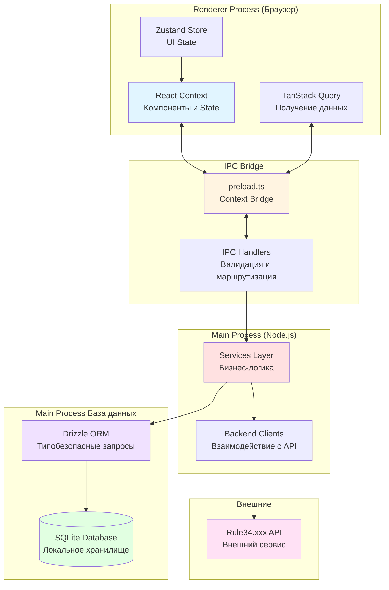
```mermaid
graph TB
    subgraph "Renderer Process (Браузер)"
        ReactContext[React Context<br/>Компоненты и State]
        TanStackQuery[TanStack Query<br/>Получение данных]
        Zustand[Zustand Store<br/>UI State]
    end

    subgraph "IPC Bridge"
        Preload[preload.ts<br/>Context Bridge]
        IPCHandlers[IPC Handlers<br/>Валидация и маршрутизация]
    end

    subgraph "Main Process (Node.js)"
        ServicesLayer[Services Layer<br/>Бизнес-логика]
        BackendClients[Backend Clients<br/>Взаимодействие с API]
    end

    subgraph "Main Process База данных"
        DrizzleORM[Drizzle ORM<br/>Типобезопасные запросы]
        SQLiteDB[(SQLite Database<br/>WAL Mode)]
    end

    subgraph "Внешние"
        Rule34API[Rule34.xxx API<br/>Внешний сервис]
        SQLiteDB[(SQLite Database<br/>Локальное хранилище)]
    end

    ReactContext <--> Preload
    TanStackQuery <--> Preload
    Zustand --> ReactContext
    Preload <--> IPCHandlers
    IPCHandlers --> ServicesLayer
    ServicesLayer --> BackendClients
    ServicesLayer --> DrizzleORM
    DrizzleORM --> SQLiteDB
    BackendClients --> Rule34API

    style ReactContext fill:#e1f5ff
    style Preload fill:#fff4e1
    style ServicesLayer fill:#ffe1e1
    style DrizzleORM fill:#f0e1ff
    style SQLiteDB fill:#e1ffe1
    style Rule34API fill:#ffe1f5
```

**Что означает эта схема:**

RuleDesk построен на Electron, который запускает два отдельных процесса:

1.  **Renderer Process (Браузер)** - Здесь находится ваш React UI. Это изолированная браузерная среда, которая не может напрямую получать доступ к Node.js API или файловой системе. Она использует:

    -   **React Context** для состояния компонентов и потока данных
    -   **TanStack Query** для получения данных из Main Process через IPC
    -   **Zustand** для легковесного состояния UI (например, какой диалог открыт)

2.  **IPC Bridge** - Это безопасный слой связи между Renderer Process и Main Process:

    -   **Preload script** (`preload.ts`) предоставляет безопасный API (`window.api`) для Renderer Process
    -   **IPC Handlers** в Main Process проверяют и маршрутизируют запросы к соответствующим сервисам

3.  **Main Process (Node.js)** - Это безопасный бэкенд, который обрабатывает:

    -   **Services Layer** - Бизнес-логика (синхронизация, обновления, файловые операции)
    -   **Backend Clients** - Взаимодействие с внешними API (Rule34.xxx, Gelbooru)

4.  **База данных** - база данных SQLite, к которой осуществляется прямой доступ в Main Process:
    -   **Drizzle ORM** предоставляет типобезопасные запросы
    -   **SQLite** хранит все данные локально с режимом WAL для повышения производительности

**Пример потока данных:**

Когда вы нажимаете "Add Artist" в UI:

1.  React компонент вызывает `window.api.addArtist(data)`
2.  Preload script перенаправляет запрос в Main Process через IPC
3.  IPC Handler валидирует ввод, используя Zod схемы
4.  Services Layer сохраняет художника в базу данных через Drizzle ORM
5.  Ответ возвращается через IPC в Renderer Process
6.  React Query обновляет UI с новым художником

Такое разделение обеспечивает безопасность (Renderer Process не может получить доступ к конфиденциальным данным) и производительность (операции с базой данных выполняются в Main Process).

## Концепция архитектуры

### 1. Двухмодульный интерфейс

-   **Режим библиотеки:** Работает с локальной базой данных SQLite. Максимальная производительность, виртуализация.
-   **Режим браузера:** Изолированный процесс `<webview>`. Позволяет пользователям просматривать источник (Source) нативно. "Мост" между сайтом и приложением реализован через инъекцию скриптов (DOM scraping + IPC-триггеры).

### 2. Абстракция провайдера (Задел на будущее)

-   В будущем `SyncService` больше не будет тесно связан с Rule34.
-   Вводится интерфейс `BooruProvider` (методы: `getPosts`, `getArtistInfo`, `search`).
-   Текущая реализация станет `Rule34Provider`. Это позволяет добавлять новые источники без переписывания основной базы данных.

## Высокоуровневая архитектура

### Обзор системы

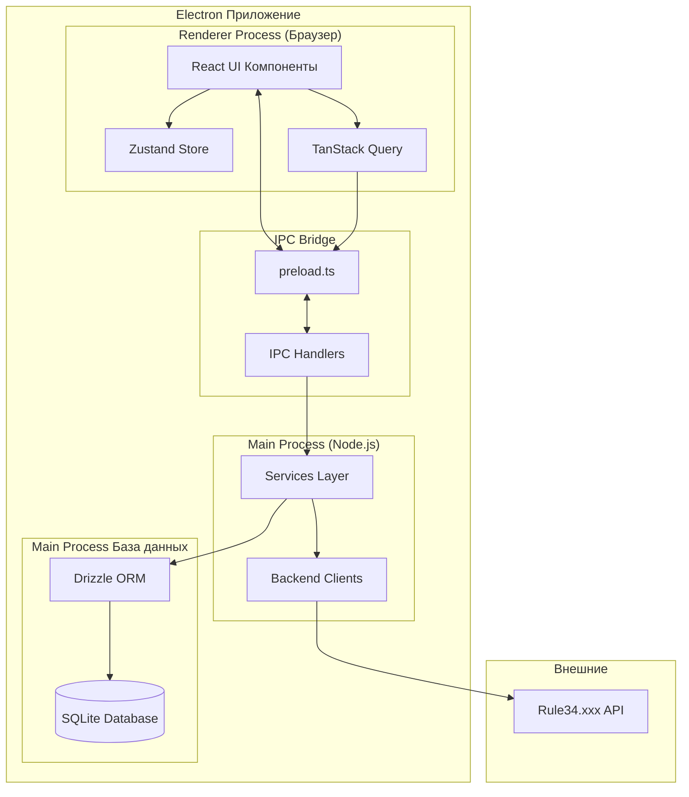
```mermaid
graph TB
    subgraph "Electron Приложение"
        subgraph "Renderer Process (Браузер)"
            ReactUI[React UI Компоненты]
            Zustand[Zustand Store]
            ReactQuery[TanStack Query]
        end

        subgraph "IPC Bridge"
            Preload[preload.ts]
            IPC[IPC Handlers]
        end

        subgraph "Main Process (Node.js)"
            Services[Services Layer]
            BackendClients[Backend Clients]
        end

        subgraph "Main Process База данных"
            Drizzle[Drizzle ORM]
            SQLite[(SQLite)]
        end
    end

    subgraph "Внешние"
        Rule34API[Rule34.xxx API]
        SQLite[(SQLite Database)]
    end

    ReactUI <--> Preload
    Preload <--> IPC
    IPC --> Services
    Services --> BackendClients
    Services --> Drizzle
    Drizzle --> SQLite
    BackendClients --> Rule34API

    ReactUI --> Zustand
    ReactUI --> ReactQuery
    ReactQuery --> Preload
```

### Поток взаимодействия процессов

Приведенная ниже схема показывает, как действие пользователя проходит через систему. **Прочтите объяснение ниже** для пошагового описания.

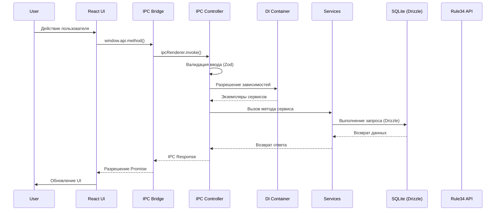
```mermaid
sequenceDiagram
    participant User
    participant ReactUI as React UI
    participant Bridge as IPC Bridge
    participant Controller as IPC Controller
    participant DI as DI Container
    participant Service as Services
    participant DB as SQLite (Drizzle)
    participant API as Rule34 API

    User->>ReactUI: Действие пользователя
    ReactUI->>Bridge: window.api.method()
    Bridge->>Controller: ipcRenderer.invoke()
    Controller->>Controller: Валидация ввода (Zod)
    Controller->>DI: Разрешение зависимостей
    DI-->>Controller: Экземпляры сервисов
    Controller->>Service: Вызов метода сервиса
    Service->>DB: Выполнение запроса (Drizzle)
    DB-->>Service: Возврат данных
    Service-->>Controller: Возврат ответа
    Controller-->>Bridge: IPC Response
    Bridge-->>ReactUI: Разрешение Promise
    ReactUI->>User: Обновление UI
```

**Пошаговое объяснение:**

Давайте проследим, что происходит, когда пользователь нажимает "Add Artist":

1.  **Действие пользователя** - Пользователь заполняет форму и нажимает кнопку "Add Artist"
2.  **React UI** - React компонент вызывает `window.api.addArtist(artistData)`. Это Promise, который будет разрешен по завершении операции.
3.  **IPC Bridge** - Preload script (`preload.ts`) получает вызов и перенаправляет его в Main Process, используя `ipcRenderer.invoke('db:add-artist', artistData)`. Это безопасный механизм IPC Electron.
4.  **IPC Controller** - В Main Process `ArtistsController` получает запрос. Прежде чем что-либо сделать, он:
    -   **Валидирует ввод**, используя Zod схему (убеждается, что `name` и `tag` являются действительными строками, `apiEndpoint` — действительным URL)
    -   Если валидация не удается, он выбрасывает ошибку, которая передается обратно в Renderer Process
5.  **Внедрение зависимостей** - Контроллеру нужны сервисы (например, база данных). Он просит DI Container разрешить зависимости. Контейнер предоставляет экземпляры сервисов в виде синглтонов.
6.  **Services Layer** - Контроллер вызывает соответствующий метод сервиса (например, `dbService.addArtist()`). Services содержат бизнес-логику.
7.  **База данных** - Сервис использует Drizzle ORM для выполнения типобезопасного запроса: `db.insert(artists).values(artistData)`. SQLite хранит данные.
8.  **Поток ответа** - Данные возвращаются:
    -   База данных возвращает вставленного художника (с сгенерированным ID)
    -   Сервис возвращает объект художника
    -   Контроллер возвращает его через IPC
    -   Bridge разрешает Promise в Renderer Process
    -   React Query обновляет кеш и UI

**Обработка ошибок:**

Если какой-либо шаг завершается ошибкой (ошибка валидации, ошибка базы данных, сетевая ошибка), ошибка перехватывается `BaseController`, регистрируется, и удобное для пользователя сообщение об ошибке отправляется обратно в Renderer Process. Затем UI может отобразить уведомление об ошибке.

**Почему эта архитектура?**

-   **Безопасность:** Renderer Process не может напрямую получить доступ к базе данных или файловой системе
-   **Типобезопасность:** TypeScript обеспечивает корректность типов на каждом шаге
-   **Валидация:** Zod схемы перехватывают недопустимые данные до того, как они достигнут сервисов
-   **Разделение ответственности:** Каждый слой имеет одну ответственность
-   **Тестируемость:** Каждый слой может быть протестирован независимо

### Архитектура базы данных

Приведенная ниже схема показывает, как работают операции с базой данных. **Прочтите объяснение** для практического понимания.

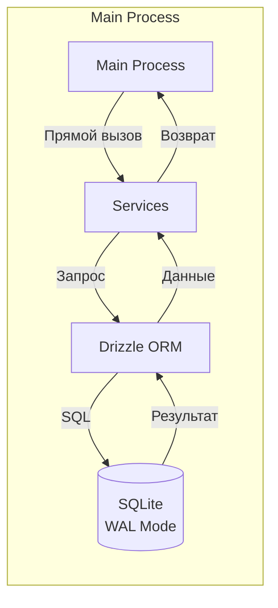
```mermaid
graph LR
    subgraph "Main Process"
        Main[Main Process]
        Services[Services]
        DrizzleORM[Drizzle ORM]
        SQLiteDB[(SQLite<br/>WAL Mode)]
    end

    Main -->|Прямой вызов| Services
    Services -->|Запрос| DrizzleORM
    DrizzleORM -->|SQL| SQLiteDB
    SQLiteDB -->|Результат| DrizzleORM
    DrizzleORM -->|Данные| Services
    Services -->|Возврат| Main
```

**Что это означает на практике:**

Все операции с базой данных происходят **непосредственно в Main Process**, используя синхронный доступ. Вот как это работает:

1.  **Services вызывают Drizzle ORM** - Когда сервису необходимо запросить базу данных, он использует типобезопасный конструктор запросов Drizzle:

    ```typescript
    const artists = await db.query.artists.findMany({
      orderBy: [asc(artists.name)],
    });
    ```

2.  **Drizzle генерирует SQL** - Drizzle ORM преобразует запрос TypeScript в оптимизированный SQL:

    ```sql
    SELECT * FROM artists ORDER BY name ASC;
    ```

3.  **SQLite выполняет** - База данных SQLite (через `better-sqlite3`) выполняет запрос **синхронно**.

    **⚠️ КРИТИЧЕСКИ ВАЖНО: Синхронное выполнение блокирует Main Process**

    `better-sqlite3` использует **синхронные** операции с базой данных. Это означает:

    -   ✅ **Быстро для простых запросов** - Отсутствие асинхронных накладных расходов, прямые вызовы функций
    -   ⚠️ **Блокирует Main Process** - Тяжелые запросы (например, полное сканирование таблицы без индексов) **заморозят все приложение Electron**
    -   ⚠️ **UI зависает** - Если запрос занимает 2 секунды, UI зависает на 2 секунды

    **Почему это быстро для типичных запросов:**

    -   Отсутствие сетевых накладных расходов (локальная база данных)
    -   Синхронное выполнение (без задержек async/await)
    -   WAL mode позволяет параллельно читать данные во время записи
    -   **Правильные индексы** делают запросы быстрыми (миллисекунды, а не секунды)

    **⚠️ ОБЯЗАТЕЛЬНО: Всегда используйте лимиты и индексы**

    Чтобы предотвратить блокировку Main Process:

    -   **Всегда используйте `limit`** в SELECT-запросах (см. [Ограничения базы данных](#-critical-always-use-limits-for-select-queries))
    -   **Убедитесь, что существуют правильные индексы** для WHERE-условий
    -   **Используйте пагинацию** для больших наборов данных
    -   **Избегайте полного сканирования таблиц** - Всегда фильтруйте по индексированным столбцам

    **Пример опасного запроса:**

    ```typescript
    // ❌ DANGEROUS: No limit, no index on tags column
    // If database has 100k posts, this will freeze UI for seconds
    const posts = await db.query.posts.findMany({
      where: like(posts.tags, "%some_tag%"), // Full table scan!
      // Missing limit!
    });
    ```

    **Пример безопасного запроса с индексированным столбцом:**

    ```typescript
    // ✅ SAFE: Uses indexed column and limit
    const posts = await db.query.posts.findMany({
      where: eq(posts.artistId, artistId), // Indexed column
      orderBy: [desc(posts.postId)],
      limit: 50, // ← Prevents large result sets
      offset: (page - 1) * 50,
    });
    ```

    **Пример безопасного поиска Tag с FTS5:**

    ```typescript
    // ✅ SAFE: Uses FTS5 index for tag search (fast even on 100k+ records)
    // FTS5 is used automatically when filtering by tags via PostsController
    const posts = await db.getPosts({
      filters: { tags: "blue_hair" }, // Uses FTS5 index, not LIKE
      page: 1,
      limit: 50,
    });
    ```

4.  **Результаты возвращаются** - SQLite возвращает необработанные данные → Drizzle сопоставляет их с TypeScript типами → Сервис возвращает типизированные объекты

**Почему синхронный доступ?**

-   **Производительность:** Отсутствие асинхронных накладных расходов для локальных операций с базой данных (для простых запросов)
-   **Простота:** Прямые вызовы функций, без цепочек Promise
-   **Типобезопасность:** Drizzle гарантирует, что TypeScript типы соответствуют схеме базы данных
-   **WAL Mode:** Журналирование с упреждением (Write-Ahead Logging) позволяет выполнять параллельное чтение даже во время записи

**⚠️ WAL Mode является обязательным**

SQLite должен работать в режиме **WAL (Write-Ahead Logging)**, чтобы обеспечить:

-   **Параллельное чтение** во время записи
-   **Лучшую производительность** для рабочих нагрузок с интенсивным чтением
-   **Неблокирующее чтение** во время выполнения записи

WAL mode автоматически включается в `src/main/db/client.ts`:

```typescript
// WAL mode is enabled automatically
sqlite.pragma("journal_mode = WAL");
```

**Без WAL mode:**

-   Запись блокирует все операции чтения
-   Ошибки блокировки базы данных при одновременном доступе
-   Низкая производительность при наличии нескольких читателей

**Пример: Добавление художника**

```typescript
// In ArtistsController
const db = container.resolve(DI_TOKENS.DB);

// Drizzle query (type-safe)
const result = await db
  .insert(artists)
  .values({
    name: "artist_name",
    tag: "tag_name",
    type: "tag",
    apiEndpoint: "https://api.rule34.xxx",
  })
  .returning();

// result[0] is typed as Artist
return result[0];
```

**⚠️ КРИТИЧЕСКИ ВАЖНО: Всегда используйте лимиты для SELECT-запросов**

**Почему лимиты обязательны:**

При запросе постов или других данных, объем которых может значительно увеличиваться, **всегда используйте `limit`** в ваших запросах Drizzle. Без лимитов SQLite может вернуть десятки или сотни тысяч записей, что приведет к:

1.  **Перегрузке Renderer Process** - Попытка сериализовать и отправить более 100 тысяч записей через IPC заморозит UI
2.  **Истощению памяти** - Большие массивы потребляют значительный объем памяти как в Main Process, так и в Renderer Process
3.  **Блокировке IPC Channel** - Большие объемы данных блокируют IPC channel, препятствуя другим операциям

**Пример: Запрос постов с лимитом**

```typescript
// ✅ CORRECT: Always use limit
const posts = await db.query.posts.findMany({
  where: eq(posts.artistId, artistId),
  orderBy: [desc(posts.postId)],
  limit: 50, // ← CRITICAL: Always limit results
  offset: (page - 1) * 50,
});

// ❌ WRONG: No limit - will crash with large databases
const posts = await db.query.posts.findMany({
  where: eq(posts.artistId, artistId),
  // Missing limit - dangerous!
});
```

**Рекомендации:**

-   **Лимит по умолчанию:** 50 записей на страницу (используется в `getArtistPosts`)
-   **Максимальный лимит:** Никогда не превышайте 1000 записей в одном запросе
-   **Пагинация:** Используйте `offset` и `limit` для пагинации
-   **Бесконечная прокрутка:** Используйте `useInfiniteQuery` с постраничной пагинацией
-   **Запросы на подсчет:** Используйте отдельные запросы на подсчет (`getArtistPostsCount`) вместо `array.length`

**IPC-методы со встроенными лимитами:**

-   `getArtistPosts()` - Возвращает до 50 постов на страницу
-   `getTrackedArtists()` - Следует ограничить, если вы ожидаете более 1000 художников (в настоящее время без лимита, но таблица художников обычно невелика)

**Ключевые моменты:**

-   Доступ к базе данных **никогда не осуществляется** из Renderer Process (безопасность)
-   Все запросы **типобезопасны** благодаря Drizzle ORM
-   Операции **синхронны** для повышения производительности
-   WAL mode обеспечивает **параллельное чтение** во время записи
-   **Всегда используйте `limit`** для SELECT-запросов, чтобы предотвратить перегрузку Renderer Process

## Разделение процессов

### Main Process (Мозг)

**Location:** `src/main/`

**Обязанности:**

-   Операции с базой данных (SQLite через Drizzle ORM)
-   Взаимодействие с внешними API
-   Операции с файловой системой
-   Фоновые задачи опроса
-   Операции, чувствительные к безопасности

**Ключевые компоненты:**

1.  **Database Client** (`src/main/db/client.ts`)

    -   Прямой синхронный доступ к SQLite через `better-sqlite3`
    -   WAL (Write-Ahead Logging) mode включен для параллельного чтения
    -   Управляет инициализацией и миграциями базы данных
    -   Предоставляет функции `getDb()` и `getSqliteInstance()`
    -   Автоматическое выполнение миграций при запуске

2.  **Database Schema** (`src/main/db/schema.ts`)

    -   Определения схем Drizzle ORM для всех таблиц
    -   Типобезопасные определения таблиц с правильными индексами
    -   Таблицы: `artists`, `posts`, `settings`
    -   Вывод типов: `Artist`, `Post`, `Settings`, `NewArtist`, `NewPost`

3.  **Sync Service** (`src/main/services/sync-service.ts`)

    -   Обрабатывает синхронизацию с Rule34.xxx API
    -   Реализует ограничение скорости и пагинацию
    -   Сопоставляет ответы API со схемой базы данных
    -   Обновляет количество постов художников
    -   Предоставляет функциональность восстановления/повторной синхронизации для художников
    -   Выпускает IPC события для отслеживания прогресса синхронизации

4.  **IPC Controllers** (`src/main/ipc/controllers/`)

    -   Архитектура на основе контроллеров с базовым классом `BaseController`
    -   Централизованная обработка ошибок и валидация ввода через Zod схемы
    -   Типобезопасное внедрение зависимостей с использованием DI Container
    -   Каждый контроллер обрабатывает определенную область IPC операций

    **Модули контроллеров:**

    -   `ArtistsController.ts` - Операции управления художниками
    -   `PostsController.ts` - Операции, связанные с постами
    -   `SettingsController.ts` - Управление настройками (включая `confirmLegal` для возрастных ограничений)
    -   `AuthController.ts` - Аутентификация и проверка учетных данных
    -   `MaintenanceController.ts` - Операции резервного копирования/восстановления базы данных
    -   `ViewerController.ts` - Операции, связанные с просмотрщиком
    -   `FileController.ts` - Загрузка и управление файлами
    -   `SystemController.ts` - Операции системного уровня (версия, буфер обмена и т.д.)
    -   `SearchController.ts` - Операции поиска Booru и разрешения Tag (`searchBooru`, `resolveTags`, `resolveCharacterTags`, `resolveCopyrightTags`, `resolveTagsByType`)

    **BaseController** (`src/main/core/ipc/BaseController.ts`):

    -   Обеспечивает централизованную обработку ошибок
    -   Автоматическая валидация ввода с использованием Zod схем
    -   Типобезопасная регистрация обработчиков
    -   Предотвращает ошибки повторной регистрации обработчиков

    **⚠️ КРИТИЧЕСКИ ВАЖНО: Всегда используйте лимиты в запросах к базе данных**

    При реализации IPC обработчиков, которые запрашивают базу данных, **всегда используйте `limit`** в ваших запросах Drizzle. Без лимитов SQLite может вернуть десятки или сотни тысяч записей, что приведет к:

    -   **Перегрузке Renderer Process** - Большие массивы блокируют IPC и замораживают UI
    -   **Истощению памяти** - Сериализация более 100 тысяч записей потребляет значительный объем памяти
    -   **Блокировке IPC Channel** - Большие объемы данных препятствуют другим операциям

    **Пример в контроллере:**

    ```typescript
    // ✅ CORRECT: Always use limit
    export class PostsController extends BaseController {
      setup() {
        this.handle(
          IPC_CHANNELS.DB.GET_POSTS,
          GetPostsSchema,
          this.getPosts.bind(this)
        );
      }

      private async getPosts(_event: IpcMainInvokeEvent, data: GetPostsRequest) {
        const db = container.resolve(DI_TOKENS.DB);
        const { artistId, page = 1 } = data;
        const limit = 50; // ← CRITICAL: Always limit results
        const offset = (page - 1) * limit;

        return await db.query.posts.findMany({
          where: eq(posts.artistId, artistId),
          orderBy: [desc(posts.postId)],
          limit, // ← Required
          offset,
        });
      }
    }
    ```

    **Лимиты по умолчанию:**

    -   Посты: 50 на страницу (максимум 1000 на запрос)
    -   Художники: Без лимита (обычно мало, но рассмотрите добавление, если ожидается > 1000)
    -   Настройки: Одна запись (лимит не требуется)

    **Рекомендации по производительности:**

    -   **Тяжелые запросы** (полное сканирование таблиц, сложные WHERE-условия) → Всегда используйте пагинацию
    -   **Индексированные запросы** (WHERE по индексированным столбцам) → Могут обрабатывать большие лимиты (до 1000)
    -   **Неиндексированные запросы** → Должны использовать строгие лимиты (50-100) для предотвращения блокировки
    -   **WAL mode** → Требуется для параллельного чтения (включается автоматически)

5.  **Dependency Injection Container** (`src/main/core/di/Container.ts`)

    -   Типобезопасный DI-контейнер с регистрацией на основе токенов
    -   Паттерн синглтона для управления сервисами
    -   Обнаружение циклических зависимостей
    -   Сервисы: Database, SyncService, SecureStorage

6.  **Maintenance Queue** (`src/main/db/maintenance-queue.ts`)

    -   Последовательная очередь выполнения для операций обслуживания базы данных
    -   Предотвращает состояния гонки и ошибки "Database is closed"
    -   Очередь на основе Promise гарантирует завершение операций до начала следующей
    -   Используется для операций резервного копирования, восстановления и закрытия базы данных

7.  **Booru Providers** (`src/main/providers/`)

    -   Абстракция паттерна провайдера для поддержки нескольких Booru
    -   Интерфейс `IBooruProvider` для стандартизированных операций Booru
    -   Реализации: `Rule34Provider`, `GelbooruProvider`
    -   Методы: `checkAuth`, `fetchPosts`, `searchTags`, `formatTag`

8.  **Updater Service** (`src/main/services/updater-service.ts`)

    -   Управляет автоматической проверкой обновлений через `electron-updater`
    -   Обрабатывает загрузку и установку обновлений
    -   Выпускает IPC события для статуса и прогресса обновления
    -   Загрузка, управляемая пользователем (ручной триггер загрузки)

9.  **Secure Storage** (`src/main/services/secure-storage.ts`)

    -   Шифрует и дешифрует конфиденциальные данные с использованием Electron `safeStorage` API
    -   Статический класс с методами `encrypt()` и `decrypt()`
    -   Используется для шифрования API учетных данных в состоянии покоя
    -   Дешифрование происходит только в Main Process, когда это необходимо для вызовов API
    -   Использует системное хранилище ключей (Windows Credential Manager, macOS Keychain, Linux libsecret)

10. **Bridge** (`src/main/bridge.ts`)
    -   Определяет IPC интерфейс
    -   Предоставляется через preload script
    -   Типобезопасный контракт связи
    -   Управление прослушивателями событий для обновлений в реальном времени

11. **Main Entry** (`src/main/main.ts`)
    -   Инициализация приложения
    -   Создание окна
    -   Конфигурация безопасности
    -   Инициализация и миграции базы данных

### Renderer Process (Лицо)

**Location:** `src/renderer/`

**Обязанности:**

-   Отображение пользовательского интерфейса
-   Взаимодействия с пользователем
-   Управление состоянием
-   Представление данных

**Ключевые компоненты:**

1.  **React Application** (`src/renderer/App.tsx`)

    -   Основной UI компонент с логикой маршрутизации
    -   Экран онбординга для API учетных данных
    -   Боковая навигация с несколькими страницами
    -   Использует TanStack Query для получения данных
    -   Управление состоянием через React хуки и Zustand

2.  **Components** (`src/renderer/components/`)

    -   **Страницы:**

        -   **Updates.tsx** - Лента подписок (заглушка - компонент-плейсхолдер)
        -   **Browse.tsx** - Просмотр всех постов с фильтрацией (заглушка - компонент-плейсхолдер)
        -   **Favorites.tsx** - Коллекция избранного (заглушка - компонент-плейсхолдер)
        -   **Tracked.tsx** - Управление художниками и Tag (полностью реализовано)
        -   **Settings.tsx** - Конфигурация приложения (полностью реализовано)
        -   **ArtistDetails.tsx** - Просмотр галереи художника (полностью реализовано)
        -   **Onboarding.tsx** - Форма ввода API учетных данных (полностью реализовано)

    -   **Макет:**

        -   **AppLayout.tsx** - Основной макет приложения с боковой панелью и глобальной верхней панелью
        -   **Sidebar.tsx** - Постоянная боковая навигация с кнопкой синхронизации и выходом
        -   **GlobalTopBar.tsx** - Единая верхняя панель с полем поиска, выпадающим списком сортировки, кнопкой фильтров и переключателем вида (UI реализован, бэкенд фильтрации ожидает)

    -   **Галерея:**

        -   **ArtistCard.tsx** - Компонент карточки художника
        -   **ArtistGallery.tsx** - Сетка постов для художника
        -   **PostCard.tsx** - Компонент отдельной карточки поста

    -   **Просмотрщик:**

        -   **ViewerDialog.tsx** - Полноэкранный просмотрщик с загрузкой, избранным, сочетаниями клавиш

    -   **Диалоги:**

        -   **AddArtistModal.tsx** - Модальное окно для добавления новых художников
        -   **DeleteArtistDialog.tsx** - Диалог подтверждения удаления художника
        -   **UpdateNotification.tsx** - Компонент уведомления об обновлении

    -   **Настройки:**

        -   **BackupControls.tsx** - Элементы управления резервным копированием и восстановлением базы данных

    -   **Вводы:**

        -   **AsyncAutocomplete.tsx** - Компонент автозаполнения с локальным и удаленным поиском

    -   **ui/** - компоненты shadcn/ui (Button, Dialog, Select, Input и т.д.)

3.  **IPC Client** (`window.api`)
    -   Типизированный интерфейс к Main Process
    -   Вся связь проходит через этот Bridge
    -   Методы: getSettings, saveSettings, confirmLegal, getTrackedArtists, addArtist, deleteArtist, getArtistPosts, getArtistPostsCount, syncAll, openExternal, searchArtists, searchRemoteTags, searchBooru, resolveTags, resolveCharacterTags, resolveCopyrightTags, resolveTagsByType, markPostAsViewed, togglePostViewed, togglePostFavorite, downloadFile, openFileInFolder, createBackup, restoreBackup, writeToClipboard, verifyCredentials, logout, resetPostCache, repairArtist, checkForUpdates, quitAndInstall, startDownload

## Архитектура безопасности

### Уровни безопасности

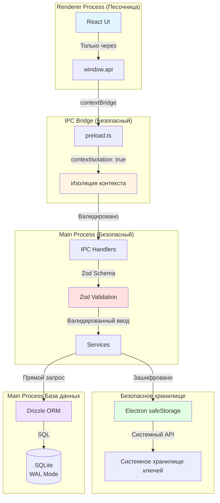
```mermaid
graph TB
    subgraph "Renderer Process (Песочница)"
        ReactUI[React UI]
        BridgeAPI[window.api]
    end

    subgraph "IPC Bridge (Безопасный)"
        Preload[preload.ts]
        ContextIsolation[Изоляция контекста]
    end

    subgraph "Main Process (Безопасный)"
        IPCHandlers[IPC Handlers]
        ZodValidation[Zod Validation]
        Services[Services]
    end

    subgraph "Безопасное хранилище"
        SafeStorage[Electron safeStorage]
        Keychain[Системное хранилище ключей]
    end

    subgraph "Main Process База данных"
        DrizzleORM[Drizzle ORM]
        SQLite[(SQLite<br/>WAL Mode)]
    end

    ReactUI -->|Только через| BridgeAPI
    BridgeAPI -->|contextBridge| Preload
    Preload -->|contextIsolation: true| ContextIsolation
    ContextIsolation -->|Валидировано| IPCHandlers
    IPCHandlers -->|Zod Schema| ZodValidation
    ZodValidation -->|Валидированный ввод| Services
    Services -->|Зашифровано| SafeStorage
    SafeStorage -->|Системный API| Keychain
    Services -->|Прямой запрос| DrizzleORM
    DrizzleORM -->|SQL| SQLite

    style ReactUI fill:#e1f5ff
    style ContextIsolation fill:#fff4e1
    style ZodValidation fill:#ffe1e1
    style SafeStorage fill:#e1ffe1
    style DrizzleORM fill:#f0e1ff
```

### Изоляция контекста

**Статус:** ✅ Включено

Renderer Process работает в изолированной среде без прямого доступа к Node.js. Это предотвращает атаки удаленного выполнения кода (Remote Code Execution, RCE).

**Конфигурация:**

```typescript
webPreferences: {
  contextIsolation: true,  // Required
  nodeIntegration: false,  // Never true
  sandbox: true,           // Additional security
  preload: path.join(__dirname, "../preload/bridge.cjs"),
}
```

### Безопасность IPC

**⚠️ КРИТИЧЕСКИ ВАЖНО: Контракт безопасности API Key**

Уровень IPC обеспечивает строгий контракт безопасности для API учетных данных:

-   `saveSettings(creds: { userId: string; apiKey: string })` - Принимает API key в открытом виде (неизбежно при онбординге)
-   `getSettings()` - Возвращает `IpcSettings` с `hasApiKey: boolean`, **НИКОГДА не возвращает фактический API key**
-   **Жизненный цикл API Key:**
    -   Вводится в Renderer Process → Отправляется в Main Process через IPC → Шифруется в Main Process → Хранится в зашифрованном виде
    -   **Никогда не расшифровывается для Renderer Process** - Дешифруется только в Main Process, когда это необходимо для вызовов API (например, в `SyncService`)

**Почему это важно:** Если `getSettings()` возвращал API key, любой скомпрометированный Renderer Process (XSS, вредоносное расширение и т.д.) мог бы украсть учетные данные. Логический флаг `hasApiKey` позволяет UI проверять, настроены ли учетные данные, не раскрывая фактический ключ.

1.  **Типобезопасность:** Вся IPC связь строго типизирована
2.  **Валидация ввода:** Все вводы валидируются в Main Process с использованием Zod схем
3.  **Обработка ошибок:** Ошибки правильно обрабатываются без раскрытия конфиденциальных данных
4.  **Отсутствие прямого доступа к Node:** Renderer Process не может напрямую получить доступ к Node.js API
5.  **Безопасные учетные данные:** API keys шифруются в состоянии покоя, **НИКОГДА не возвращаются в Renderer Process** (только логический флаг `hasApiKey`)
6.  **Очередь обслуживания:** Операции обслуживания базы данных используют последовательную очередь для предотвращения состояний гонки

### Поток безопасности учетных данных

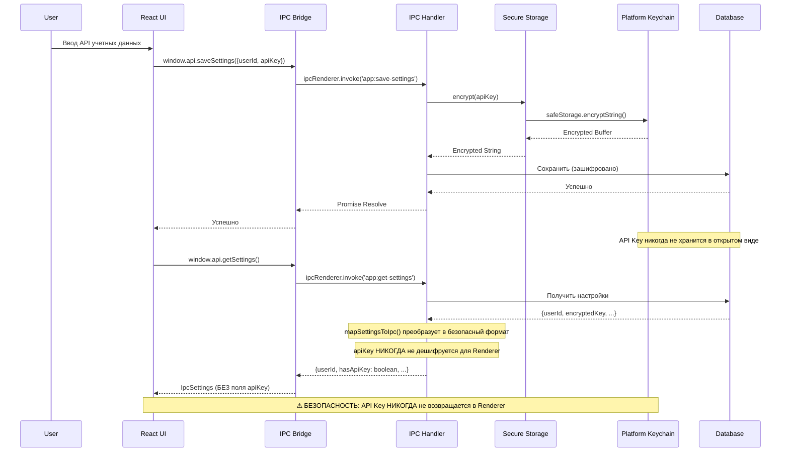
```mermaid
sequenceDiagram
    participant User
    participant ReactUI as React UI
    participant Bridge as IPC Bridge
    participant IPC as IPC Handler
    participant SecureStorage as Secure Storage
    participant Keychain as Platform Keychain
    participant DB as Database

    User->>ReactUI: Ввод API учетных данных
    ReactUI->>Bridge: window.api.saveSettings({userId, apiKey})
    Bridge->>IPC: ipcRenderer.invoke('app:save-settings')
    IPC->>SecureStorage: encrypt(apiKey)
    SecureStorage->>Keychain: safeStorage.encryptString()
    Keychain-->>SecureStorage: Encrypted Buffer
    SecureStorage-->>IPC: Encrypted String
    IPC->>DB: Сохранить (зашифровано)
    DB-->>IPC: Успешно
    IPC-->>Bridge: Promise Resolve
    Bridge-->>ReactUI: Успешно

    Note over DB,Keychain: API Key никогда не хранится в открытом виде

    ReactUI->>Bridge: window.api.getSettings()
    Bridge->>IPC: ipcRenderer.invoke('app:get-settings')
    IPC->>DB: Получить настройки
    DB-->>IPC: {userId, encryptedKey, ...}
    Note over IPC: mapSettingsToIpc() преобразует в безопасный формат
    Note over IPC: apiKey НИКОГДА не дешифруется для Renderer
    IPC-->>Bridge: {userId, hasApiKey: boolean, ...}
    Bridge-->>ReactUI: IpcSettings (БЕЗ поля apiKey)

    Note over ReactUI,Keychain: ⚠️ БЕЗОПАСНОСТЬ: API Key НИКОГДА не возвращается в Renderer
```

**Понятное объяснение:**

1.  **Сохранение учетных данных (Онбординг):**

    -   Пользователь вводит API key в Renderer Process (открытым текстом, неизбежно при вводе)
    -   `saveSettings()` отправляет учетные данные через IPC в Main Process
    -   Main Process шифрует API key, используя Electron `safeStorage` API (системное хранилище ключей)
    -   Зашифрованный ключ хранится в базе данных
    -   Renderer Process получает подтверждение успеха (конфиденциальные данные не возвращаются)

2.  **Получение настроек (Контракт безопасности):**
    -   `getSettings()` вызывается из Renderer Process
    -   Main Process извлекает зашифрованный ключ из базы данных
    -   **⚠️ КРИТИЧЕСКОЕ ПРАВИЛО БЕЗОПАСНОСТИ: API Key НИКОГДА не дешифруется для Renderer Process**
    -   Функция `mapSettingsToIpc()` преобразует запись базы данных в безопасный формат IPC:
        -   ✅ Возвращает: `userId` (безопасный, неконфиденциальный)
        -   ✅ Возвращает: `hasApiKey: boolean` (флаг, указывающий, существует ли ключ, безопасный)
        -   ✅ Возвращает: Другие флаги настроек (safe mode, подтверждение совершеннолетия и т.д.)
        -   ❌ **НИКОГДА не возвращает:** `apiKey` (зашифрованный или расшифрованный)
    -   Renderer Process получает тип `IpcSettings`, который **не содержит поля `apiKey`**
    -   API key дешифруется только в Main Process, когда это необходимо для вызовов API (например, в `SyncService`)

**Контракт безопасности:**

-   **Ввод (saveSettings):** API key отправляется из Renderer Process в открытом виде (неизбежно при онбординге)
-   **Хранение:** API key шифруется с использованием системного хранилища ключей, хранится в зашифрованном виде в базе данных
-   **Вывод (getSettings):** Renderer Process получает `IpcSettings` с `hasApiKey: boolean`, **НИКОГДА не получает фактический ключ**
-   **Внутреннее использование:** API key дешифруется только в Main Process для вызовов API, никогда не раскрывается для Renderer Process

**Почему это важно:**

Если `getSettings()` возвращал API key (даже дешифрованный), любой скомпрометированный Renderer Process (XSS, вредоносное расширение и т.д.) мог бы украсть учетные данные. Возвращая только логический флаг, Renderer Process может проверить, настроены ли учетные данные, никогда не видя фактического ключа.

## Поток данных

### Поток чтения данных

Приведенная ниже схема показывает, как данные считываются из базы данных и отображаются в UI. **Прочтите объяснение**, чтобы понять полный поток.

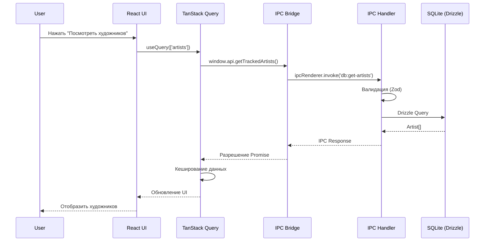
```mermaid
sequenceDiagram
    participant User
    participant ReactUI as React UI
    participant ReactQuery as TanStack Query
    participant Bridge as IPC Bridge
    participant IPC as IPC Handler
    participant DB as SQLite (Drizzle)

    User->>ReactUI: Нажать "Посмотреть художников"
    ReactUI->>ReactQuery: useQuery(['artists'])
    ReactQuery->>Bridge: window.api.getTrackedArtists()
    Bridge->>IPC: ipcRenderer.invoke('db:get-artists')
    IPC->>IPC: Валидация (Zod)
    IPC->>DB: Drizzle Query
    DB-->>IPC: Artist[]
    IPC-->>Bridge: IPC Response
    Bridge-->>ReactQuery: Разрешение Promise
    ReactQuery->>ReactQuery: Кеширование данных
    ReactQuery-->>ReactUI: Обновление UI
    ReactUI-->>User: Отобразить художников
```

**Реальный сценарий: Пользователь открывает страницу "Tracked"**

1.  **Пользователь нажимает "Tracked"** в боковой навигации

2.  **React компонент рендерится** - Компонент `Tracked.tsx` монтируется и вызывает:

    ```typescript
    const { data: artists } = useQuery({
      queryKey: ["artists"],
      queryFn: () => window.api.getTrackedArtists(),
    });
    ```

3.  **React Query проверяет кеш** - React Query сначала проверяет, есть ли у него кешированные данные для `["artists"]`. Если да, он немедленно возвращает кешированные данные (без сетевого вызова).

4.  **Вызов IPC** - Если кеш пуст или устарел, React Query вызывает `window.api.getTrackedArtists()`, который проходит через IPC bridge в Main Process.

5.  **Валидация** - IPC обработчик валидирует запрос (хотя `getTrackedArtists` не имеет параметров, валидация все равно выполняется для обеспечения согласованности).

6.  **Запрос к базе данных** - Обработчик выполняет Drizzle запрос:

    ```typescript
    const artists = await db.query.artists.findMany({
      orderBy: [asc(artists.name)],
    });
    ```

7.  **Ответ** - Массив художников возвращается:

    -   База данных → IPC Handler → IPC Bridge → React Query → Компонент

8.  **Кеширование** - React Query автоматически кеширует результат. Если пользователь уходит со страницы и возвращается, данные предоставляются из кеша (мгновенная загрузка).

9.  **Обновление UI** - React перерисовывает UI с данными художников, отображая их в виде сетки.

**Почему React Query?**

-   **Автоматическое кеширование** - Данные кешируются и повторно используются
-   **Состояния загрузки** - Состояния `isLoading` и `error` обрабатываются автоматически
-   **Фоновое повторное получение** - Может получать данные в фоновом режиме, когда данные могут быть устаревшими
-   **Оптимистические обновления** - Может обновлять UI до подтверждения сервером (для мутаций)

**Преимущества в производительности:**

-   Первая загрузка: ~50-100 мс (запрос к базе данных + накладные расходы IPC)
-   Последующие загрузки: ~0 мс (предоставляются из кеша React Query)
-   Фоновое повторное получение: Происходит автоматически без блокировки UI

### Поток записи данных

Приведенная ниже схема показывает, как данные записываются в базу данных. **Прочтите объяснение** для полного понимания потока, включая обработку ошибок.

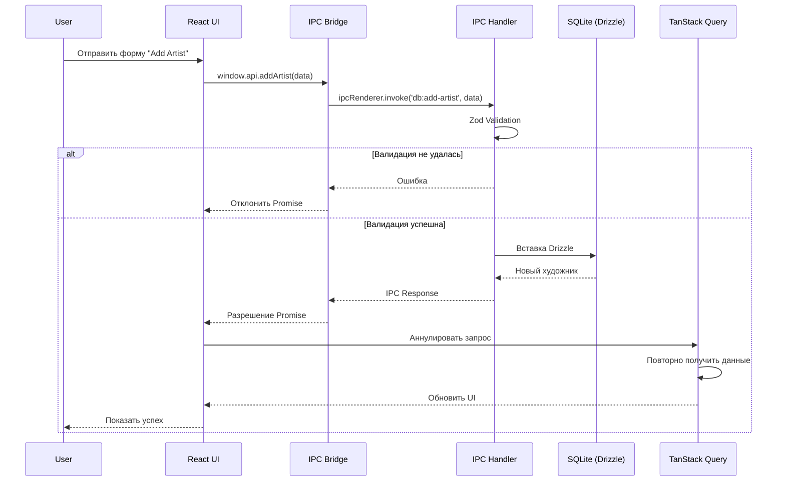
```mermaid
sequenceDiagram
    participant User
    participant ReactUI as React UI
    participant Bridge as IPC Bridge
    participant IPC as IPC Handler
    participant DB as SQLite (Drizzle)
    participant ReactQuery as TanStack Query

    User->>ReactUI: Отправить форму "Add Artist"
    ReactUI->>Bridge: window.api.addArtist(data)
    Bridge->>IPC: ipcRenderer.invoke('db:add-artist', data)
    IPC->>IPC: Zod Validation
    alt Валидация не удалась
        IPC-->>Bridge: Ошибка
        Bridge-->>ReactUI: Отклонить Promise
    else Валидация успешна
        IPC->>DB: Вставка Drizzle
        DB-->>IPC: Новый художник
        IPC-->>Bridge: IPC Response
        Bridge-->>ReactUI: Разрешение Promise
        ReactUI->>ReactQuery: Аннулировать запрос
        ReactQuery->>ReactQuery: Повторно получить данные
        ReactQuery-->>ReactUI: Обновить UI
        ReactUI-->>User: Показать успех
    end
```

**Реальный сценарий: Пользователь добавляет нового художника**

1.  **Пользователь заполняет форму** - Пользователь вводит имя художника "example_artist", Tag "tag_name", выбирает тип "tag" и нажимает "Add".

2.  **Отправка формы** - React компонент вызывает:

    ```typescript
    const handleAddArtist = async (name, tag, type) => {
      await window.api.addArtist({ name, tag, type, provider: "rule34" });
    };
    ```

3.  **Вызов IPC** - Запрос проходит через IPC bridge в Main Process.

4.  **Валидация** - `ArtistsController` валидирует ввод, используя Zod схему:

    ```typescript
    // Zod schema checks:
    // - name is non-empty string
    // - tag is non-empty string
    // - apiEndpoint is valid URL
    ```

5.  **Два пути:**

    **Путь А: Валидация не удалась**

    -   Zod выбрасывает ошибку валидации
    -   `BaseController` перехватывает ее и возвращает удобную для пользователя ошибку
    -   Promise отклоняется в Renderer Process
    -   Компонент показывает сообщение об ошибке пользователю
    -   **Запись в базу данных не происходит**

    **Путь Б: Валидация успешна**

    -   Контроллер вызывает сервис: `dbService.addArtist(validatedData)`
    -   Сервис выполняет вставку Drizzle:
        ```typescript
        await db
          .insert(artists)
          .values({
            name: "example_artist",
            tag: "tag_name",
            // ... other fields
          })
          .returning();
        ```
    -   База данных возвращает нового художника с сгенерированным ID
    -   Ответ возвращается в Renderer Process

6.  **Инвалидация кеша** - В случае успеха компонент инвалидирует React Query кеш:

    ```typescript
    queryClient.invalidateQueries({ queryKey: ["artists"] });
    ```

7.  **Автоматическое повторное получение** - React Query автоматически повторно получает `["artists"]`, поскольку кеш был инвалидирован.

8.  **Обновления UI** - Новый художник автоматически появляется в списке (ручное обновление состояния не требуется).

**Почему этот паттерн?**

-   **Сначала валидация** - Недопустимые данные никогда не попадают в базу данных
-   **Типобезопасность** - TypeScript + Zod обеспечивают корректность данных
-   **Автоматическая синхронизация UI** - Инвалидация кеша гарантирует, что UI всегда показывает актуальные данные
-   **Обработка ошибок** - Удобные для пользователя ошибки, а не технические трассировки стека

**Пример обработки ошибок:**

```typescript
try {
  await window.api.addArtist(data);
  // Success - cache invalidation happens automatically
} catch (error) {
  // Error could be:
  // - Validation error: "Username is required"
  // - Database error: "Tag already exists"
  // - Network error: "Failed to connect"

  log.error("Failed to add artist:", error);
  // Show error toast to user
}
```

### Поток синхронизации

Приведенная ниже схема показывает, как работает фоновая синхронизация. **Прочтите объяснение**, чтобы понять полный асинхронный поток с обновлениями прогресса.

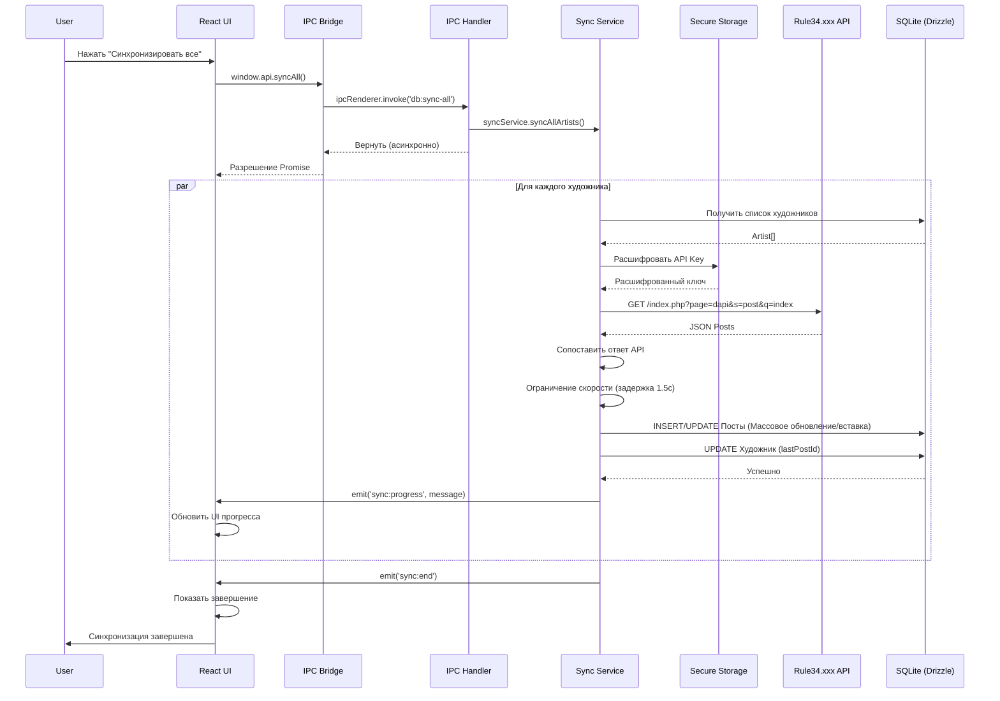
```mermaid
sequenceDiagram
    participant User
    participant ReactUI as React UI
    participant Bridge as IPC Bridge
    participant IPC as IPC Handler
    participant SyncService as Sync Service
    participant SecureStorage as Secure Storage
    participant Rule34API as Rule34.xxx API
    participant DB as SQLite (Drizzle)

    User->>ReactUI: Нажать "Синхронизировать все"
    ReactUI->>Bridge: window.api.syncAll()
    Bridge->>IPC: ipcRenderer.invoke('db:sync-all')
    IPC->>SyncService: syncService.syncAllArtists()
    IPC-->>Bridge: Вернуть (асинхронно)
    Bridge-->>ReactUI: Разрешение Promise

    par Для каждого художника
        SyncService->>DB: Получить список художников
        DB-->>SyncService: Artist[]

        SyncService->>SecureStorage: Расшифровать API Key
        SecureStorage-->>SyncService: Расшифрованный ключ

        SyncService->>Rule34API: GET /index.php?page=dapi&s=post&q=index
        Rule34API-->>SyncService: JSON Posts

        SyncService->>SyncService: Сопоставить ответ API
        SyncService->>SyncService: Ограничение скорости (задержка 1.5с)

        SyncService->>DB: INSERT/UPDATE Посты (Массовое обновление/вставка)
        SyncService->>DB: UPDATE Художник (lastPostId)
        DB-->>SyncService: Успешно

        SyncService->>ReactUI: emit('sync:progress', message)
        ReactUI->>ReactUI: Обновить UI прогресса
    end

    SyncService->>ReactUI: emit('sync:end')
    ReactUI->>ReactUI: Показать завершение
    ReactUI->>User: Синхронизация завершена
```

**Реальный сценарий: Пользователь нажимает кнопку "Синхронизировать все"**

1.  **Действие пользователя** - Пользователь нажимает кнопку "Синхронизировать все" на боковой панели или странице Tracked.

2.  **Вызов IPC** - Компонент вызывает `window.api.syncAll()`. Этот метод возвращается **немедленно** (не ждет завершения синхронизации), потому что синхронизация выполняется в фоновом режиме.

3.  **Запуск Sync Service** - `SyncService` начинает асинхронную обработку художников. UI показывает индикатор "Синхронизация..."."

4.  **Для каждого художника сервис:**

    a.  **Получает данные художника** из базы данных:

    ```typescript
    const artists = await db.query.artists.findMany();
    ```

    b.  **Дешифрует API key** - Зашифрованный API key дешифруется с использованием Electron `safeStorage` API. Это происходит только в Main Process (безопасно).

    c.  **Получает посты из API** - Выполняет HTTP-запрос к Rule34.xxx API:

    ```
    GET https://api.rule34.xxx/index.php?page=dapi&s=post&q=index&tags=tag_name&limit=1000
    ```

    d.  **Сопоставляет ответ API** - Преобразует JSON-формат API в формат схемы базы данных.

    e.  **Ограничение скорости** - Ждет 1.5 секунды перед обработкой следующего художника (предотвращает злоупотребление API).

    f.  **Массовое обновление/вставка** - Сохраняет посты в базу данных с использованием обработки `ON CONFLICT` (обновляет существующие, вставляет новые):

    ```typescript
    await db
      .insert(posts)
      .values(newPosts)
      .onConflictDoUpdate({
        target: [posts.artistId, posts.postId],
        set: {
          /* update fields */
        },
      });
    ```

    g.  **Обновляет художника** - Обновляет `lastPostId` и `newPostsCount` художника.

    h.  **Событие прогресса** - Выпускает IPC событие: `emit('sync:progress', 'Syncing artist_name...')`

5.  **Обновления UI в реальном времени** - React компонент прослушивает события прогресса:

    ```typescript
    useEffect(() => {
      const unsubscribe = window.api.onSyncProgress((message) => {
        setSyncMessage(message); // Update progress text
      });
      return () => unsubscribe();
    }, []);
    ```

6.  **Завершение** - Когда все художники обработаны, сервис выпускает событие `sync:end`. UI показывает сообщение "Синхронизация завершена".

**Почему асинхронность с событиями?**

-   **Неблокирующий** - UI остается отзывчивым во время синхронизации
-   **Обратная связь о прогрессе** - Пользователь видит прогресс в реальном времени
-   **Обработка ошибок** - Сбои отдельных художников не останавливают всю синхронизацию
-   **Возобновляемый** - Можно остановить и возобновить синхронизацию позже

**Пример: Обработка событий синхронизации**

```typescript
// In component
const [syncMessage, setSyncMessage] = useState<string | null>(null);

useEffect(() => {
  const unsubscribeStart = window.api.onSyncStart(() => {
    setSyncMessage("Starting sync...");
  });

  const unsubscribeProgress = window.api.onSyncProgress((message) => {
    setSyncMessage(message); // "Syncing artist_name..."
  });

  const unsubscribeEnd = window.api.onSyncEnd(() => {
    setSyncMessage("Sync complete!");
    // Refresh artist list to show new posts count
    queryClient.invalidateQueries({ queryKey: ["artists"] });
  });

  const unsubscribeError = window.api.onSyncError((error) => {
    setSyncMessage(`Sync error: ${error}`);
  });

  return () => {
    unsubscribeStart();
    unsubscribeProgress();
    unsubscribeEnd();
    unsubscribeError();
  };
}, []);
```

**Вопросы производительности:**

-   **Ограничение скорости** - Задержка 1.5 с между художниками предотвращает блокировку API
-   **Массовые операции** - Посты вставляются пакетами (200 за пакет) для эффективности
-   **Инкрементальная синхронизация** - Получает только посты новее `lastPostId` (не все посты)
-   **Фоновое выполнение** - Синхронизация не блокирует UI или другие операции

## Архитектура базы данных

### Схема

База данных использует SQLite со следующими таблицами:

1.  **artists** - Отслеживаемые художники/пользователи (по Tag или загрузчику)
2.  **posts** - Кешированные метаданные постов с Tag, рейтингами и URL
3.  **settings** - API учетные данные (User ID и зашифрованный API Key), safe mode, подтверждение совершеннолетия

См. [Документацию по базе данных](./database.md) для подробной информации о схеме.

### Уровень ORM

**Drizzle ORM** предоставляет:

-   Типобезопасные запросы
-   Миграции схемы
-   Вывод типов
-   Генерация SQL

### Архитектура базы данных

**Database Client** (`src/main/db/client.ts`):

-   Прямой синхронный доступ к SQLite через `better-sqlite3`
-   WAL (Write-Ahead Logging) mode включен для параллельного чтения
-   Автоматическое выполнение миграций при инициализации
-   Типобезопасные запросы через Drizzle ORM
-   Управление подключением к базе данных в Main Process

## Архитектура компонентов

### Иерархия React компонентов

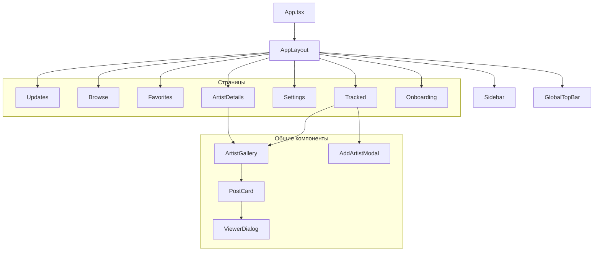
```mermaid
graph TD
    App[App.tsx]
    AppLayout[AppLayout]
    Sidebar[Sidebar]
    GlobalTopBar[GlobalTopBar]

    App --> AppLayout
    AppLayout --> Sidebar
    AppLayout --> GlobalTopBar

    subgraph "Страницы"
        Updates[Updates]
        Browse[Browse]
        Favorites[Favorites]
        Tracked[Tracked]
        Settings[Settings]
        ArtistDetails[ArtistDetails]
        Onboarding[Onboarding]
    end

    AppLayout --> Updates
    AppLayout --> Browse
    AppLayout --> Favorites
    AppLayout --> Tracked
    AppLayout --> Settings
    AppLayout --> ArtistDetails
    AppLayout --> Onboarding

    subgraph "Общие компоненты"
        ArtistGallery[ArtistGallery]
        PostCard[PostCard]
        ViewerDialog[ViewerDialog]
        AddArtistModal[AddArtistModal]
    end

    Tracked --> ArtistGallery
    ArtistDetails --> ArtistGallery
    ArtistGallery --> PostCard
    PostCard --> ViewerDialog
    Tracked --> AddArtistModal
```

## Интеграция с внешними API

### Архитектура паттерна провайдера

Вызовы внешних API абстрагируются через **паттерн провайдера** (`src/main/providers/`):

1.  **Интерфейс IBooruProvider:** Стандартизированный интерфейс для всех Booru источников

    -   `checkAuth()` - Валидация учетных данных
    -   `fetchPosts()` - Получение постов по Tag
    -   `searchTags()` - Автозаполнение Tag
    -   `formatTag()` - Форматирование Tag на основе типа художника
    -   `getDefaultApiEndpoint()` - Получение URL конечной точки API

2.  **Реализации провайдеров:**

    -   `Rule34Provider` - Реализация Rule34.xxx API
    -   `GelbooruProvider` - Реализация Gelbooru API

3.  **Интеграция с SyncService:**
    -   Использует паттерн провайдера для получения постов
    -   **Ограничение скорости:** Задержка 1.5 секунды между художниками, 0.5 секунды между страницами
    -   **Пагинация:** Обрабатывает специфичную для Booru пагинацию (до 1000 постов на страницу)
    -   **Инкрементальная синхронизация:** Получает только посты новее `lastPostId`
    -   **Обработка ошибок:** Корректная обработка ошибок API и сбоев сети
    -   **Аутентификация:** Использует User ID и API Key из таблицы настроек

### Поток загрузки

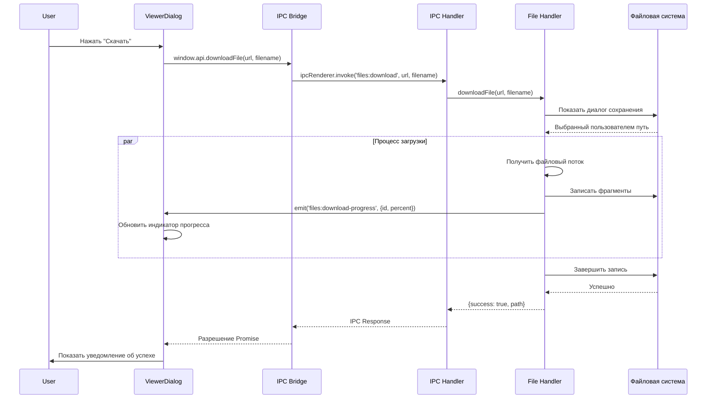
```mermaid
sequenceDiagram
    participant User
    participant Viewer as ViewerDialog
    participant Bridge as IPC Bridge
    participant IPC as IPC Handler
    participant FileHandler as File Handler
    participant FileSystem as Файловая система

    User->>Viewer: Нажать "Скачать"
    Viewer->>Bridge: window.api.downloadFile(url, filename)
    Bridge->>IPC: ipcRenderer.invoke('files:download', url, filename)
    IPC->>FileHandler: downloadFile(url, filename)
    FileHandler->>FileSystem: Показать диалог сохранения
    FileSystem-->>FileHandler: Выбранный пользователем путь

    par Процесс загрузки
        FileHandler->>FileHandler: Получить файловый поток
        FileHandler->>FileSystem: Записать фрагменты
        FileHandler->>Viewer: emit('files:download-progress', {id, percent})
        Viewer->>Viewer: Обновить индикатор прогресса
    end

    FileHandler->>FileSystem: Завершить запись
    FileSystem-->>FileHandler: Успешно
    FileHandler-->>IPC: {success: true, path}
    IPC-->>Bridge: IPC Response
    Bridge-->>Viewer: Разрешение Promise
    Viewer->>User: Показать уведомление об успехе
```

## Архитектура сборки

### Инструмент сборки: Vite

Проект использует **electron-vite** для сборки как Main Process, так и Renderer Process.

**Configuration:** `electron.vite.config.ts`

**Цели сборки:**

1.  **Main:** Node.js бандл (`out/main/`)
2.  **Preload:** CommonJS bridge (`out/preload/`)
3.  **Renderer:** React приложение (`out/renderer/`)

### Режим разработки

-   Горячая замена модулей (HMR) для Renderer Process ✅
-   Быстрая пересборка с Vite
-   Инструменты разработчика включены в режиме разработки
-   Main Process: Требуется ручной перезапуск (без автоперезапуска) ⚠️

## Управление состоянием

### Состояние Renderer Process

**TanStack Query (React Query):**

-   Состояние сервера (данные из Main Process)
-   Кеширование и синхронизация
-   Состояния загрузки и ошибки

**Zustand:**

-   Состояние UI на стороне клиента
-   Минимальный бойлерплейт
-   Соответствие принципу KISS

**⚠️ КРИТИЧЕСКИ ВАЖНО: Используйте селекторы для предотвращения ненужных перерисовок**

Zustand Store могут вызывать проблемы с производительностью, если используются неправильно. **Всегда используйте селекторы**, чтобы подписываться только на то конкретное состояние, которое вам нужно, а не на весь Store.

**Почему селекторы важны:**

Когда вы подписываетесь на весь Store, компонент перерисовывается при **любом** изменении состояния, даже если он не использует эту часть состояния. Это может привести к:

-   Ненужным перерисовкам больших деревьев компонентов
-   Снижению производительности со сложными UI
-   Зависанию UI при частых обновлениях состояния

**❌ НЕПРАВИЛЬНО: Подписка на весь Store**

```typescript
// ❌ BAD: Component re-renders on ANY state change
const store = useViewerStore(); // Gets entire store
const isOpen = store.isOpen; // But only uses isOpen

// If controlsVisible changes, this component still re-renders!
```

**✅ ПРАВИЛЬНО: Использование селекторов**

```typescript
// ✅ GOOD: Component only re-renders when isOpen changes
const isOpen = useViewerStore((state) => state.isOpen);

// Component ignores other state changes (controlsVisible, queue, etc.)
```

**✅ ПРАВИЛЬНО: Использование нескольких селекторов с useShallow**

Когда вам нужно несколько значений, используйте `useShallow`, чтобы предотвратить перерисовки, когда меняется несвязанное состояние:

```typescript
import { useShallow } from "zustand/react/shallow";

// ✅ GOOD: Only re-renders when isOpen or close function changes
const { isOpen, close } = useViewerStore(
  useShallow((state) => ({
    isOpen: state.isOpen,
    close: state.close,
  }))
);

// ✅ GOOD: Split into logical groups for better performance
const { currentPostId, queue } = useViewerStore(
  useShallow((state) => ({
    currentPostId: state.currentPostId,
    queue: state.queue,
  }))
);

const { currentIndex, next, prev } = useViewerStore(
  useShallow((state) => ({
    currentIndex: state.currentIndex,
    next: state.next,
    prev: state.prev,
  }))
);
```

**Реальный пример из ViewerDialog:**

```typescript
// In ViewerDialog.tsx - split selectors into logical groups
export const ViewerDialog = () => {
  // Group 1: Open/close state
  const { isOpen, close } = useViewerStore(
    useShallow((state) => ({
      isOpen: state.isOpen,
      close: state.close,
    }))
  );

  // Group 2: Current post data
  const { currentPostId, queue } = useViewerStore(
    useShallow((state) => ({
      currentPostId: state.currentPostId,
      queue: state.queue,
    }))
  );

  // Group 3: Navigation
  const { currentIndex, next, prev } = useViewerStore(
    useShallow((state) => ({
      currentIndex: state.currentIndex,
      next: state.next,
      prev: state.prev,
    }))
  );

  // Each group only re-renders when its specific values change
  // If controlsVisible changes, none of these groups re-render
};
```

**Рекомендации:**

1.  **Одно значение:** Используйте простой селектор `useStore((s) => s.value)`
2.  **Несколько значений:** Используйте `useShallow` с объектным селектором
3.  **Разделяйте селекторы:** Группируйте связанные значения вместе
4.  **Избегайте полного Store:** Никогда не используйте `useStore()` без селектора
5.  **Мемуизируйте селекторы:** Для сложных селекторов используйте `useMemo` или выделите в функцию

**Влияние на производительность:**

-   **Без селекторов:** Компонент перерисовывается при каждом обновлении Store (даже несвязанном)
-   **С селекторами:** Компонент перерисовывается только при изменении выбранных значений
-   **С useShallow:** Предотвращает перерисовки, когда ссылка на объект меняется, но значения остаются теми же

**Пример: Простой селектор с одним значением**

```typescript
// In AppLayout.tsx - only needs isOpen
const isViewerOpen = useViewerStore((state) => state.isOpen);

// Component only re-renders when isOpen changes
// Ignores changes to controlsVisible, queue, currentIndex, etc.
```

### Состояние Main Process

-   База данных является источником истины
-   Services поддерживают минимальное состояние в памяти
-   Фоновые задачи используют таймеры, а не постоянное состояние

## Структура файлов

```
src/
├── main/                          # Electron Main Process
│   ├── db/                        # Уровень базы данных
│   │   ├── client.ts              # Клиент базы данных (инициализация, getDb, getSqliteInstance)
│   │   ├── maintenance-queue.ts   # Очередь операций обслуживания (последовательное выполнение)
│   │   ├── schema.ts              # Определения схемы Drizzle ORM
│   ├── ipc/                       # IPC (Межпроцессное взаимодействие)
│   │   ├── controllers/           # IPC Контроллеры (по доменам)
│   │   │   ├── ArtistsController.ts
│   │   │   ├── PostsController.ts
│   │   │   ├── SettingsController.ts
│   │   │   ├── AuthController.ts
│   │   │   ├── MaintenanceController.ts
│   │   │   ├── ViewerController.ts
│   │   │   ├── FileController.ts
│   │   │   └── SystemController.ts
│   │   ├── channels.ts            # Константы IPC канала
│   │   └── index.ts               # Настройка и регистрация IPC
│   ├── core/                      # Основная инфраструктура
│   │   ├── di/                    # Внедрение зависимостей
│   │   │   ├── Container.ts       # DI Container (Синглтон)
│   │   │   └── Token.ts           # Типобезопасные DI-токены
│   │   └── ipc/                    # IPC инфраструктура
│   │       └── BaseController.ts   # Базовый контроллер с обработкой ошибок
│   ├── providers/                 # Реализации Booru провайдеров
│   │   ├── rule34-provider.ts     # Провайдер Rule34.xxx
│   │   ├── gelbooru-provider.ts   # Провайдер Gelbooru
│   │   ├── types.ts               # Интерфейсы провайдеров
│   │   └── index.ts               # Реестр провайдеров
│   ├── services/                  # Фоновые сервисы
│   │   ├── secure-storage.ts       # Безопасное хранилище для API учетных данных
│   │   ├── sync-service.ts        # Синхронизация с Rule34.xxx API
│   │   └── updater-service.ts     # Сервис автообновления
│   ├── lib/                       # Утилиты
│   │   └── logger.ts             # Утилита логирования
│   ├── bridge.ts                  # Определение интерфейса IPC bridge
│   ├── main.d.ts                  # Определения типов Main Process
│   └── main.ts                    # Точка входа Main Process
│
├── renderer/                      # Electron Renderer Process
│   ├── components/                # React компоненты
│   │   ├── dialogs/               # Компоненты диалогов
│   │   │   ├── AddArtistModal.tsx
│   │   │   ├── DeleteArtistDialog.tsx
│   │   │   ├── Onboarding.tsx
│   │   │   └── UpdateNotification.tsx
│   │   ├── gallery/               # Компоненты галереи
│   │   │   ├── ArtistCard.tsx
│   │   │   ├── ArtistGallery.tsx
│   │   │   └── PostCard.tsx
│   │   ├── inputs/                # Компоненты ввода
│   │   │   └── AsyncAutocomplete.tsx
│   │   ├── layout/                 # Компоненты макета
│   │   │   ├── AppLayout.tsx
│   │   │   ├── GlobalTopBar.tsx
│   │   │   └── Sidebar.tsx
│   │   ├── pages/                  # Компоненты страниц
│   │   │   ├── ArtistDetails.tsx
│   │   │   ├── Browse.tsx
│   │   │   ├── Favorites.tsx
│   │   │   ├── Onboarding.tsx
│   │   │   ├── Settings.tsx
│   │   │   ├── Tracked.tsx
│   │   │   └── Updates.tsx
│   │   ├── settings/               # Компоненты настроек
│   │   │   └── BackupControls.tsx
│   │   ├── ui/                     # компоненты shadcn/ui
│   │   │   ├── alert.tsx
│   │   │   ├── button.tsx
│   │   │   ├── card.tsx
│   │   │   ├── dialog.tsx
│   │   │   ├── dropdown-menu.tsx
│   │   │   ├── input.tsx
│   │   │   ├── label.tsx
│   │   │   ├── select.tsx
│   │   │   └── separator.tsx
│   │   └── viewer/                 # Компоненты просмотрщика
│   │       └── ViewerDialog.tsx
│   ├── i18n/                       # Интернационализация
│   │   └── index.ts
│   ├── lib/                        # Утилиты
│   │   ├── hooks/                  # Пользовательские React хуки
│   │   │   └── useDebounce.ts
│   │   ├── artist-utils.ts
│   │   ├── tag-utils.ts
│   │   └── utils.ts
│   ├── locales/                    # Файлы переводов
│   │   └── en/
│   │       └── translation.json
│   ├── schemas/                    # Схемы валидации форм
│   │   └── form-schemas.ts
│   ├── store/                       # Управление состоянием (Zustand)
│   │   └── viewerStore.ts
│   ├── App.tsx                     # Основной React компонент
│   ├── index.css                   # Глобальные стили
│   ├── index.html                  # HTML шаблон
│   ├── main.tsx                    # Точка входа Renderer Process
│   └── renderer.d.ts               # Определения типов Renderer Process
│
└── preload/                        # Preload-скрипты (генерируются electron-vite)
    └── bridge.cjs                  # Скомпилированный preload-скрипт

Root:
├── drizzle/                        # Миграции базы данных
│   ├── *.sql                       # Файлы SQL-миграций (отслеживаются в git)
│   └── meta/                       # Метаданные миграций (игнорируются git)
│       ├── _journal.json           # Журнал миграций
│       └── *_snapshot.json         # Снимки схемы
├── docs/                           # Документация
│   ├── api.md
│   ├── architecture.md
│   ├── contributing.md
│   ├── database.md
│   ├── development.md
│   ├── roadmap.md
│   └── rule34-api-reference.md
├── scripts/                        # Скрипты сборки и утилит
│   ├── ai_reviewer.py
│   └── system_prompt.md
├── .github/                        # Рабочие процессы GitHub
│   └── workflows/
│       ├── ai-review.yml
│       └── ci.yml
├── electron.vite.config.ts         # Конфигурация Electron-Vite
├── drizzle.config.ts               # Конфигурация Drizzle ORM
├── tailwind.config.js              # Конфигурация Tailwind CSS
├── tsconfig.json                   # Конфигурация TypeScript
└── package.json                    # Зависимости и скрипты проекта
```

## Принципы проектирования

### Принципы SOLID

-   **Единственная ответственность:** Каждый модуль имеет одну четкую цель
-   **Открытость/Закрытость:** Расширение через композицию, а не модификацию
-   **Инверсия зависимостей:** Сервисы зависят от абстракций

### KISS и YAGNI

-   **KISS:** Простой, читаемый код вместо "умных" решений
-   **YAGNI:** Реализуйте только то, что необходимо сейчас

### DRY

-   Общие типы между Main Process и Renderer Process
-   Переиспользуемые компоненты и утилиты
-   Отсутствие дублирования кода

## Текущий статус

### ✅ Завершенные функции

**Инфраструктура и сборка:**

-   **Версия Electron:** 39.2.7 с последними функциями безопасности
-   **Система сборки:** electron-vite для оптимальной производительности сборки
-   **Архитектура базы данных:** Прямой синхронный доступ через `better-sqlite3` с WAL mode для параллельного чтения
-   **Портативный режим:** Автоматическое определение и поддержка портативных исполняемых файлов

**База данных и схема:**

-   **Схема:** Три основные таблицы (`artists`, `posts`, `settings`) с правильными связями и индексами
-   **Миграции:** Полностью функциональная система миграций с использованием `drizzle-kit`
-   **Индексы:** Оптимизированные индексы по `artistId`, `isViewed`, `publishedAt`, `isFavorited`, `lastChecked`, `createdAt`
-   **Поддержка провайдеров:** Поддержка нескольких Booru с полем `provider` (Rule34, Gelbooru)
-   **Типы художников:** Поддержка типов `tag`, `uploader` и `query`

**Безопасность и надежность:**

-   **Безопасное хранилище:** API учетные данные шифруются с использованием Electron `safeStorage` API (Windows Credential Manager, macOS Keychain, Linux libsecret)
-   **Резервное копирование/восстановление базы данных:** Ручная функциональность резервного копирования и восстановления с проверкой целостности
-   **Изоляция контекста:** Включена глобально с режимом песочницы
-   **CSP:** Строгая политика безопасности контента в продакшене, ослабленная для разработки (поддержка HMR)
-   **Архитектура IPC:** IPC обработчики на основе контроллеров с `BaseController` для централизованной обработки ошибок

**Целостность данных и синхронизация:**

-   **Нормализация Tag:** Автоматическое удаление метаданных из имен Tag (например, "tag (123)" → "tag")
-   **Sync Service:** Корректно обрабатывает `ON CONFLICT` с правильной логикой upsert
-   **Паттерн провайдера:** Поддержка нескольких Booru через интерфейс `IBooruProvider`
-   **Ограничение скорости:** Интеллектуальное ограничение скорости с настраиваемыми задержками

**UI/UX:**

-   **Прогрессивная загрузка изображений:** 3-уровневая система (Preview → Sample → Original)
-   **Виртуализация:** `react-virtuoso` для эффективного рендеринга больших списков
-   **Функциональность поиска:** Локальный поиск художников и удаленный поиск Tag (мульти-провайдер)
-   **Боковая навигация:** Постоянная боковая панель с основными разделами навигации
-   **Глобальная верхняя панель:** Единая верхняя панель с поиском, фильтрами, элементами управления сортировкой (UI реализован, фильтрация на бэкенде ожидает)
-   **Полноэкранный просмотрщик:** Иммерсивный просмотрщик с сочетаниями клавиш, загрузкой, избранным
-   **Менеджер загрузок:** Загрузка файлов в полном разрешении с отслеживанием прогресса
-   **Система избранного:** Полная реализация с полем базы данных и функцией переключения

## Реализованные функции

1.  ✅ **Sync Service:** Специализированный сервис для синхронизации API нескольких Booru с отслеживанием прогресса
2.  ✅ **Управление настройками:** Безопасное хранение API учетных данных с шифрованием с использованием Electron `safeStorage` API
3.  ✅ **Отслеживание художников:** Поддержка отслеживания по Tag с автозаполнением поиска и нормализацией Tag (мульти-провайдер)
4.  ✅ **Галерея постов:** Сеточный вид кешированных постов с изображениями-превью и пагинацией
5.  ✅ **Прогрессивная загрузка изображений:** 3-уровневая система загрузки (Preview → Sample → Original) для мгновенного просмотра
6.  ✅ **Восстановление художников:** Функциональность повторной синхронизации для обновления превью и исправления проблем синхронизации
7.  ✅ **Автообновление:** Автоматическая проверка и установка обновлений через electron-updater
8.  ✅ **Система событий:** IPC-события в реальном времени для отслеживания прогресса синхронизации, статуса обновления и прогресса загрузки
9.  ✅ **Архитектура базы данных:** Прямой синхронный доступ через `better-sqlite3` с WAL mode для параллельного чтения
10. ✅ **Безопасное хранилище:** API учетные данные шифруются в состоянии покоя с использованием Electron `safeStorage` API
11. ✅ **Резервное копирование/восстановление:** Ручная функциональность резервного копирования и восстановления базы данных с проверкой целостности и резервными копиями с отметками времени
12. ✅ **Функциональность поиска:** Локальный поиск художников и удаленный поиск Tag через API автозаполнения Booru (мульти-провайдер)
13. ✅ **Отметить как просмотренное:** Возможность отмечать посты как просмотренные для лучшей организации
14. ✅ **Система избранного:** Отметка и управление избранными постами с функцией переключения
15. ✅ **Менеджер загрузок:** Загрузка файлов в полном разрешении с отслеживанием прогресса
16. ✅ **Полноэкранный просмотрщик:** Иммерсивный просмотрщик с сочетаниями клавиш, загрузкой, избранным и управлением Tag
17. ✅ **Боковая навигация:** Постоянная боковая панель с основными разделами навигации (Updates, Browse, Favorites, Tracked, Settings)
18. ✅ **Глобальная верхняя панель:** Единая верхняя панель с поиском, фильтрами, элементами управления сортировкой (UI реализован, фильтрация на бэкенде ожидает)
19. ✅ **Проверка учетных данных:** Проверка API учетных данных перед сохранением и во время операций синхронизации
20. ✅ **Интеграция с буфером обмена:** Копирование метаданных и отладочной информации в буфер обмена
21. ✅ **Функция выхода:** Очистка сохраненных учетных данных и возврат к онбордингу
22. ✅ **Портативный режим:** Автоматическое определение и поддержка портативных исполняемых файлов
23. ✅ **IPC Контроллеры:** Архитектура на основе контроллеров с `BaseController` и внедрением зависимостей
24. ✅ **Паттерн провайдера:** Поддержка нескольких Booru через интерфейс `IBooruProvider` (Rule34, Gelbooru)

## Активная дорожная карта (Приоритетные задачи)

### A. Фильтры (Расширенный поиск) 🚧 UI готов, бэкенд ожидает

**Цель:** Позволить пользователям уточнять вид галереи.

-   ✅ **UI глобальной верхней панели:** Панель поиска, кнопка фильтра, выпадающий список сортировки и переключатель вида реализованы в `GlobalTopBar.tsx`
-   ⏳ Фильтрация по **Рейтингу** (Safe, Questionable, Explicit) - UI готов, фильтрация на бэкенде ожидает
-   ⏳ Фильтрация по **Типу медиа** (Изображение или Видео) - UI готов, фильтрация на бэкенде ожидает
-   ⏳ Фильтрация по **Tag** (Локальный поиск по загруженным постам) - UI готов, фильтрация на бэкенде ожидает
-   ⏳ Сортировка по: Дате добавления (Новые/Старые), Дате публикации - UI готов, сортировка на бэкенде ожидает

**Статус:** UI глобальной верхней панели полностью реализован и виден в приложении. Логика фильтрации и сортировки на бэкенде должна быть подключена к элементам управления UI через IPC обработчики и интегрирована с компонентом `ArtistGallery`.

### B. Менеджер загрузок ✅ Реализовано (Основные функции)

**Цель:** Позволить сохранять файлы в полном разрешении в локальную файловую систему.

-   ✅ Кнопка "Download Original" в окне просмотра поста (реализована в ViewerDialog)
-   ✅ **Обработчик загрузок:** Загрузки выполняются в Main Process с отслеживанием прогресса
-   ✅ **События прогресса:** Прогресс загрузки в реальном времени через IPC-события (`onDownloadProgress`)
-   ✅ **Управление файлами:** Открытие загруженного файла в папке (`openFileInFolder`)
-   ⏳ "Скачать все" для текущего фильтра/художника (в планах)
-   ⏳ **Настройки:** Разрешить выбор папки загрузки по умолчанию (в планах)

**Статус:** ✅ Основная функциональность загрузки реализована. Индивидуальные загрузки файлов работают с отслеживанием прогресса. Массовая загрузка и настройки каталога по умолчанию запланированы для будущих выпусков.

### C. Плейлисты / Коллекции ⏳ Не начато

**Цель:** Создавать курируемые коллекции постов независимо от художников/трекеров.

**Phase 1: MVP**

-   Новая таблица `playlists` (`id`, `name`, `created_at`)
-   Новая таблица `playlist_posts` (`playlist_id`, `post_id`, `added_at`)
-   Кнопка "⭐ Добавить в плейлист" на Post Card
-   Новая страница/вкладка: "Плейлисты"
-   Просмотр плейлиста: Сеточный вид с фильтрацией и сортировкой

**Статус:** В схеме нет таблиц плейлистов, код, связанный с плейлистами, не реализован.

### 🛡️ Безопасность и надежность (Укрепление)

См. [Дорожную карту](./roadmap.md#-security--reliability-hardening) для подробных улучшений безопасности:

-   ✅ **Архитектура базы данных** - ✅ **ЗАВЕРШЕНО:** Прямой синхронный доступ через `better-sqlite3` с WAL mode для параллельного чтения
-   ✅ **Шифрование / Безопасное хранилище для API учетных данных** - ✅ **ЗАВЕРШЕНО:** Использование Electron `safeStorage` API для шифрования
-   ✅ **Система резервного копирования / восстановления базы данных** - ✅ **ЗАВЕРШЕНО:** Реализована ручная функциональность резервного копирования и восстановления с проверкой целостности

### Будущие соображения

1.  **Подписки на Tag:** Подписка на комбинации Tag (схема готова)
2.  **Инъекция скриптов контента:** Улучшения DOM для внешних сайтов
3.  **Панель статистики:** Аналитика по отслеживаемым художникам и постам
4.  **Двухмодульная система:** Режим библиотеки (локальная база данных) и режим браузера (встроенный webview)
5.  **Поддержка нескольких Booru:** Абстракция паттерна провайдера для нескольких Booru источников

### Масштабируемость

-   База данных может обрабатывать тысячи художников и постов
-   Опрос может быть оптимизирован с помощью пакетирования
-   UI может быть виртуализирован для больших списков
-   Абстракция провайдера позволяет добавлять новые Booru источники без изменения ядра

## Вопросы производительности

1.  **Индексирование базы данных:** Правильные индексы по часто запрашиваемым полям
2.  **Оптимизация запросов:** Эффективные запросы Drizzle
3.  **Оптимизация React:** Мемуизация там, где это необходимо
4.  **Ленивая загрузка:** Разделение кода для больших компонентов

## Стратегия обработки ошибок

1.  **Быстрый отказ:** Валидация входов на границах
2.  **Описательные ошибки:** Четкие сообщения об ошибках
3.  **Логирование ошибок:** Все ошибки логируются через `electron-log`
4.  **Обратная связь с пользователем:** Ошибки корректно отображаются в UI

## Статус реализации (Технический аудит)

На основе всестороннего технического аудита, вот текущий статус реализации ключевых функций:

### ✅ Полностью реализовано

-   **Виртуализация:** `react-virtuoso` реализована для эффективного рендеринга больших списков (`ArtistGallery.tsx`)
-   **Поддержка видео:** Форматы `.mp4` и `.webm` обрабатываются нативным элементом `<video>`
-   **Валидация ввода:** Zod валидация реализована для каждого IPC обработчика
-   **Обработка ошибок:** Блоки try-catch в IPC обработчиках с логированием ошибок

### ⚠️ Частично реализовано

-   **HMR для разработчика:** Renderer Process имеет полную поддержку HMR. Main Process требует ручного перезапуска (без автоперезапуска при изменении файлов)
-   **Санитизация ввода:** Zod валидация для каждого обработчика (децентрализованная), без централизованной утилиты
-   **Обработка ошибок:** IPC обработчики имеют блоки try-catch, но некоторые возвращают необработанные ошибки вместо удобных для пользователя сообщений
-   **Современное видео:** Обработка видео существует, но нет явной конфигурации аппаратного ускорения в `webPreferences`

### ⏳ Отсутствует / Запланировано

-   **Safe Mode / NSFW Filter:** Нет логики размытия или флага `safeMode` в базе данных/настройках
-   **Возрастные ограничения:** ✅ **ЗАВЕРШЕНО:** Компонент Age Gate (`AgeGate.tsx`) и метод `confirmLegal` IPC реализованы
-   **Портативный режим:** Использует абсолютные пути через `app.getPath("userData")`, нет поддержки относительных путей
-   **Меры против ботов:** Статические строки User-Agent, фиксированные задержки (1.5с/0.5с), но без рандомизации или ротации
-   **Оптимизация БД (FTS5):** ✅ Виртуальная таблица FTS5 `posts_fts` реализована с токенизатором `unicode61` для быстрого поиска Tag
-   **Составные индексы:** ✅ Составной индекс по `(artist_id, rating, is_viewed)` для оптимизированных запросов фильтрации
-   **Централизованная валидация:** Нет общей утилиты валидации (`src/main/lib/validation.ts`)

См. [Дорожную карту](./roadmap.md#-technical-improvements-from-audit) для подробных планов реализации.