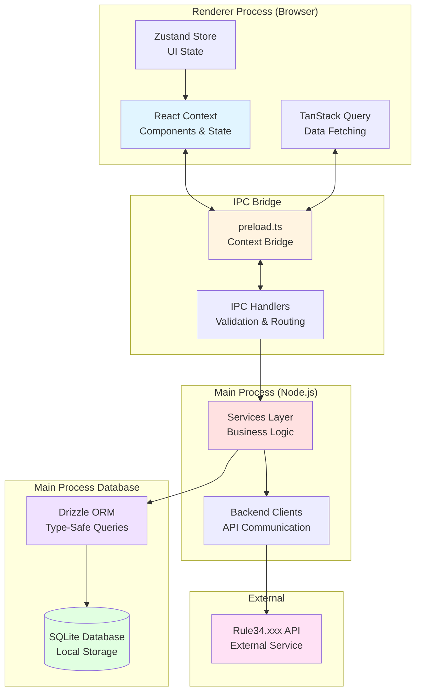
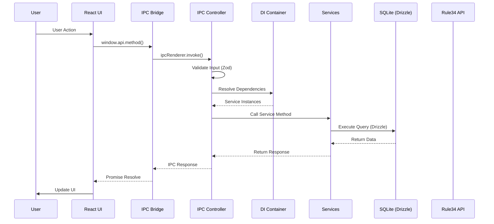
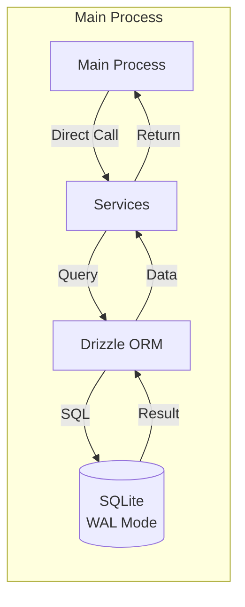
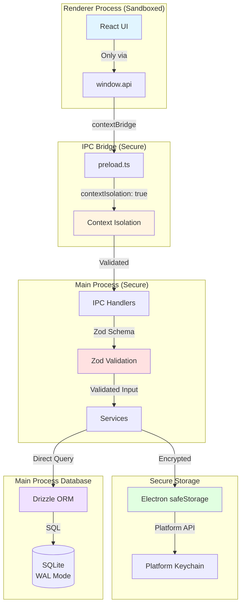
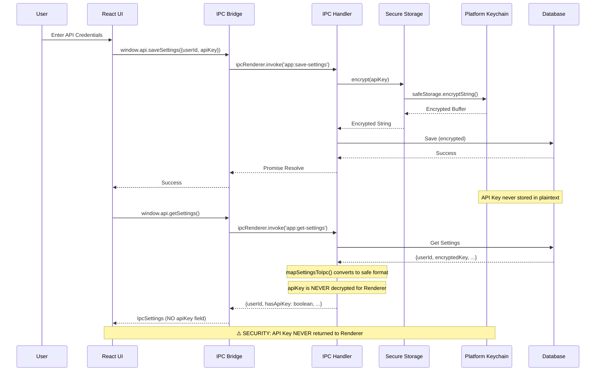
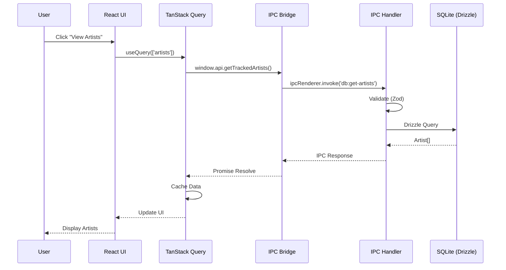
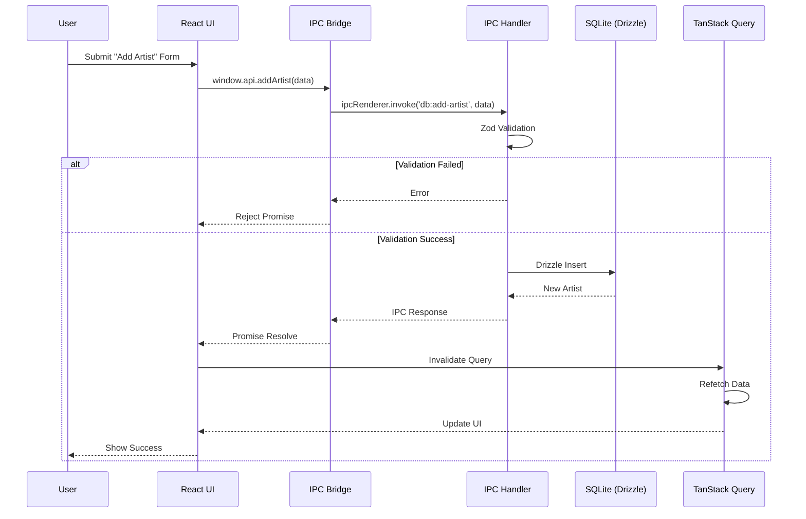
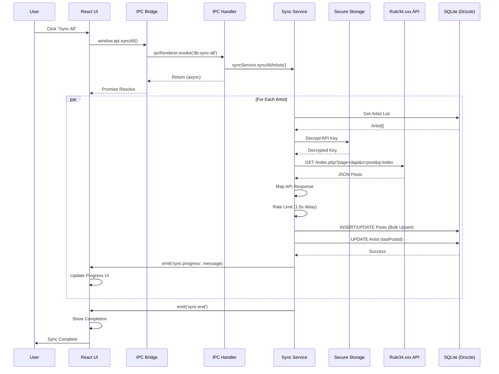
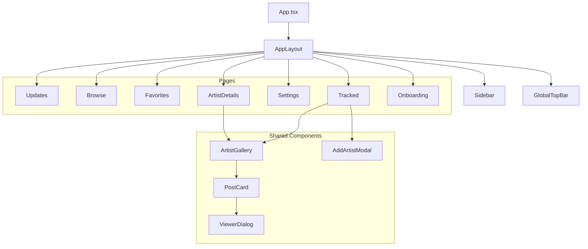
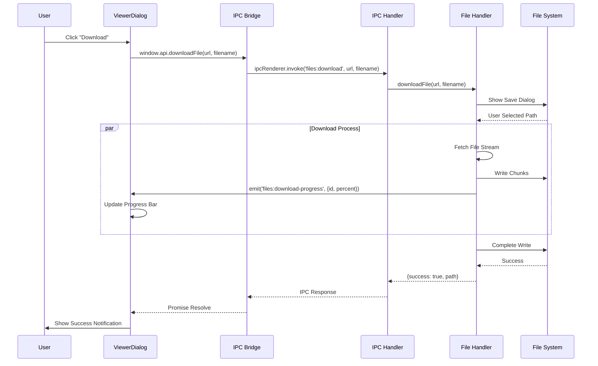

# Документация по архитектуре

## 📑 Оглавление

- [Обзор](#overview)
- [Концепция архитектуры](#architecture-concept)
- [Высокоуровневая архитектура](#high-level-architecture)
- [Разделение процессов](#process-separation)
- [Архитектура безопасности](#security-architecture)
- [Поток данных](#data-flow)
- [Архитектура базы данных](#database-architecture)
- [Архитектура Component'ов](#component-architecture)
- [Интеграция с внешними API](#external-api-integration)
- [Архитектура сборки](#build-architecture)
- [Управление State'ом](#state-management)
- [Структура файлов](#file-structure)
- [Принципы проектирования](#design-principles)
- [Текущий статус](#current-status)

---

## Обзор

Это приложение следует строгой архитектуре **Разделения Ответственностей (Separation of Concerns, SoC)**, распределяя обязанности между Electron Main Process (безопасная среда Node.js) и Renderer Process (изолированная браузерная среда).

**📖 Связанная документация:**

- [Документация по API](./api.md) - Справочник по API IPC
- [Документация по базе данных](./database.md) - Подробности архитектуры базы данных
- [Руководство по разработке](./development.md) - Настройка разработки и рабочие процессы
- [Глоссарий](./glossary.md) - Основные термины (Main Process, Renderer Process, IPC и т.д.)

### Диаграмма архитектуры

Диаграмма ниже показывает высокоуровневую архитектуру. **Прочтите объяснение под диаграммой** для удобочитаемого описания.


```mermaid
graph TB
    subgraph "Renderer Process (Browser)"
        ReactContext[React Context<br/>Components & State]
        TanStackQuery[TanStack Query<br/>Data Fetching]
        Zustand[Zustand Store<br/>UI State]
    end

    subgraph "IPC Bridge"
        Preload[preload.ts<br/>Context Bridge]
        IPCHandlers[IPC Handlers<br/>Validation & Routing]
    end

    subgraph "Main Process (Node.js)"
        ServicesLayer[Services Layer<br/>Business Logic]
        BackendClients[Backend Clients<br/>API Communication]
    end

    subgraph "Main Process Database"
        DrizzleORM[Drizzle ORM<br/>Type-Safe Queries]
        SQLiteDB[(SQLite Database<br/>WAL Mode)]
    end

    subgraph "External"
        Rule34API[Rule34.xxx API<br/>External Service]
        SQLiteDB[(SQLite Database<br/>Local Storage)]
    end

    ReactContext <--> Preload
    TanStackQuery <--> Preload
    Zustand --> ReactContext
    Preload <--> IPCHandlers
    IPCHandlers --> ServicesLayer
    ServicesLayer --> BackendClients
    ServicesLayer --> DrizzleORM
    DrizzleORM --> SQLiteDB
    BackendClients --> Rule34API

    style ReactContext fill:#e1f5ff
    style Preload fill:#fff4e1
    style ServicesLayer fill:#ffe1e1
    style DrizzleORM fill:#f0e1ff
    style SQLiteDB fill:#e1ffe1
    style Rule34API fill:#ffe1f5
```

**Что означает эта диаграмма:**

RuleDesk построен на Electron, который запускает два отдельных процесса:

1.  **Renderer Process (Браузер)** - Это место, где находится ваш пользовательский интерфейс React. Это изолированная браузерная среда, которая не может напрямую обращаться к API Node.js или файловой системе. Она использует:

    -   **React Context** для Component State'а и потока данных
    -   **TanStack Query** для получения данных из Main Process через IPC
    -   **Zustand** для легковесного State'а пользовательского интерфейса (например, какой диалог открыт)

2.  **IPC Bridge** - Это безопасный слой связи между Renderer Process и Main Process:

    -   **Preload script** (`preload.ts`) предоставляет безопасный API (`window.api`) для Renderer Process
    -   **IPC Handlers** в Main Process проверяют и маршрутизируют запросы к соответствующим сервисам

3.  **Main Process (Node.js)** - Это безопасный бэкенд, который обрабатывает:

    -   **Слой сервисов** - Бизнес-логика (синхронизация, обновления, файловые операции)
    -   **Бэкенд-клиенты** - Связь с внешними API (Rule34.xxx, Gelbooru)

4.  **База данных** - База данных SQLite, доступ к которой осуществляется непосредственно в Main Process:
    -   **Drizzle ORM** предоставляет типобезопасные запросы
    -   **SQLite** хранит все данные локально с режимом WAL для производительности

**Пример потока данных:**

Когда вы нажимаете "Add Artist" в UI:

1.  React Component вызывает `window.api.addArtist(data)`
2.  Preload script перенаправляет запрос в Main Process через IPC
3.  IPC Handler проверяет ввод с использованием Zod-схем
4.  Слой сервисов сохраняет исполнителя в базу данных через Drizzle ORM
5.  Ответ возвращается через IPC в Renderer Process
6.  React Query обновляет UI новым исполнителем

Это разделение обеспечивает безопасность (Renderer Process не может получить доступ к конфиденциальным данным) и производительность (операции с базой данных выполняются в Main Process).

## Концепция архитектуры

### 1. Двухмодульный интерфейс

-   **Режим библиотеки:** Работает с локальной базой данных SQLite. Максимальная производительность, виртуализация.
-   **Режим браузера:** Изолированный процесс `<webview>`. Позволяет пользователям просматривать источник (Source) нативно. "Мост" между сайтом и приложением реализован через инъекцию скриптов (DOM scraping + триггеры IPC).

### 2. Абстракция провайдера (задел на будущее)

-   В будущем `SyncService` больше не будет тесно связан с Rule34.
-   Вводит интерфейс `BooruProvider` (методы: `getPosts`, `getArtistInfo`, `search`).
-   Текущая реализация станет `Rule34Provider`. Это позволяет добавлять новые источники без переписывания основной базы данных.

## Высокоуровневая архитектура

### Обзор системы


```mermaid
graph TB
    subgraph "Electron Application"
        subgraph "Renderer Process (Browser)"
            ReactUI[React UI Components]
            Zustand[Zustand Store]
            ReactQuery[TanStack Query]
        end

        subgraph "IPC Bridge"
            Preload[preload.ts]
            IPC[IPC Handlers]
        end

        subgraph "Main Process (Node.js)"
            Services[Services Layer]
            BackendClients[Backend Clients]
        end

        subgraph "Main Process Database"
            Drizzle[Drizzle ORM]
            SQLite[(SQLite)]
        end
    end

    subgraph "External"
        Rule34API[Rule34.xxx API]
        SQLite[(SQLite Database)]
    end

    ReactUI <--> Preload
    Preload <--> IPC
    IPC --> Services
    Services --> BackendClients
    Services --> Drizzle
    Drizzle --> SQLite
    BackendClients --> Rule34API

    ReactUI --> Zustand
    ReactUI --> ReactQuery
    ReactQuery --> Preload
```

### Поток межпроцессного взаимодействия

Диаграмма ниже показывает, как действие пользователя проходит через систему. **Прочтите объяснение ниже** для пошагового обзора.


```mermaid
sequenceDiagram
    participant User
    participant ReactUI as React UI
    participant Bridge as IPC Bridge
    participant Controller as IPC Controller
    participant DI as DI Container
    participant Service as Services
    participant DB as SQLite (Drizzle)
    participant API as Rule34 API

    User->>ReactUI: User Action
    ReactUI->>Bridge: window.api.method()
    Bridge->>Controller: ipcRenderer.invoke()
    Controller->>Controller: Validate Input (Zod)
    Controller->>DI: Resolve Dependencies
    DI-->>Controller: Service Instances
    Controller->>Service: Call Service Method
    Service->>DB: Execute Query (Drizzle)
    DB-->>Service: Return Data
    Service-->>Controller: Return Response
    Controller-->>Bridge: IPC Response
    Bridge-->>ReactUI: Promise Resolve
    ReactUI->>User: Update UI
```

**Пошаговое объяснение:**

Давайте проследим, что происходит, когда пользователь нажимает "Add Artist":

1.  **Действие пользователя** - Пользователь заполняет форму и нажимает кнопку "Add Artist"

2.  **React UI** - React Component вызывает `window.api.addArtist(artistData)`. Это Promise, который разрешится, когда операция завершится.

3.  **IPC Bridge** - Preload script (`preload.ts`) принимает вызов и перенаправляет его в Main Process, используя `ipcRenderer.invoke('db:add-artist', artistData)`. Это безопасный механизм IPC Electron.

4.  **IPC Controller** - В Main Process `ArtistsController` получает запрос. Прежде чем что-либо сделать, он:

    -   **Проверяет ввод** с использованием Zod-схемы (обеспечивает, что `name` и `tag` являются действительными строками, `apiEndpoint` — действительный URL)
    -   Если проверка не удалась, он выбрасывает ошибку, которая распространяется обратно в Renderer Process

5.  **Внедрение зависимостей** - Контроллеру нужны сервисы (например, база данных). Он просит DI Container разрешить зависимости. Контейнер предоставляет singleton-экземпляры сервисов.

6.  **Слой сервисов** - Контроллер вызывает соответствующий метод сервиса (например, `dbService.addArtist()`). Сервисы содержат бизнес-логику.

7.  **База данных** - Сервис использует Drizzle ORM для выполнения типобезопасного запроса: `db.insert(artists).values(artistData)`. SQLite хранит данные.

8.  **Поток ответов** - Данные возвращаются:
    -   База данных возвращает вставленного исполнителя (с сгенерированным ID)
    -   Сервис возвращает объект исполнителя
    -   Контроллер возвращает его через IPC
    -   Bridge разрешает Promise в Renderer Process
    -   React Query обновляет кэш и UI

**Обработка ошибок:**

Если какой-либо шаг не удался (ошибка валидации, ошибка базы данных, сетевая ошибка), ошибка перехватывается `BaseController`, регистрируется, и удобочитаемое сообщение об ошибке отправляется обратно в Renderer Process. UI может затем отобразить уведомление об ошибке.

**Почему именно эта архитектура?**

-   **Безопасность:** Renderer Process не может напрямую обращаться к базе данных или файловой системе
-   **Типобезопасность:** TypeScript обеспечивает корректность типов на каждом шаге
-   **Валидация:** Zod-схемы перехватывают недопустимые данные до того, как они достигнут сервисов
-   **Разделение ответственностей:** Каждый слой имеет одну ответственность
-   **Тестируемость:** Каждый слой может быть протестирован независимо

### Архитектура базы данных

Диаграмма ниже показывает, как работают операции с базой данных. **Прочтите объяснение** для практического понимания.


```mermaid
graph LR
    subgraph "Main Process"
        Main[Main Process]
        Services[Services]
        DrizzleORM[Drizzle ORM]
        SQLiteDB[(SQLite<br/>WAL Mode)]
    end

    Main -->|Direct Call| Services
    Services -->|Query| DrizzleORM
    DrizzleORM -->|SQL| SQLiteDB
    SQLiteDB -->|Result| DrizzleORM
    DrizzleORM -->|Data| Services
    Services -->|Return| Main
```

**Что это означает на практике:**

Все операции с базой данных происходят **непосредственно в Main Process** с использованием синхронного доступа. Вот как это работает:

1.  **Сервисы вызывают Drizzle ORM** - Когда сервису необходимо выполнить запрос к базе данных, он использует типобезопасный конструктор запросов Drizzle:

    ```typescript
    const artists = await db.query.artists.findMany({
      orderBy: [asc(artists.name)],
    });
    ```

2.  **Drizzle генерирует SQL** - Drizzle ORM преобразует запрос TypeScript в оптимизированный SQL:

    ```sql
    SELECT * FROM artists ORDER BY name ASC;
    ```

3.  **SQLite выполняет** - База данных SQLite (через `better-sqlite3`) выполняет запрос **синхронно**.

    **⚠️ КРИТИЧНО: Синхронное выполнение блокирует Main Process**

    `better-sqlite3` использует **синхронные** операции с базой данных. Это означает:

    -   ✅ **Быстро для простых запросов** - Нет асинхронных издержек, прямые вызовы функций
    -   ⚠️ **Блокирует Main Process** - Тяжелые запросы (например, полное сканирование таблицы без индексов) **заморозят все приложение Electron**
    -   ⚠️ **UI зависает** - Если запрос занимает 2 секунды, UI зависает на 2 секунды

    **Почему это быстро для типичных запросов:**

    -   Нет сетевых издержек (локальная база данных)
    -   Синхронное выполнение (нет задержек async/await)
    -   Режим WAL позволяет одновременное чтение во время записи
    -   **Правильные индексы** делают запросы быстрыми (миллисекунды, а не секунды)

    **⚠️ ОБЯЗАТЕЛЬНО: Всегда используйте лимиты и индексы**

    Чтобы предотвратить блокировку Main Process:

    -   **Всегда используйте `limit`** в запросах SELECT (см. [Ограничения базы данных](#-critical-always-use-limits-for-select-queries))
    -   **Обеспечьте наличие правильных индексов** для условий WHERE
    -   **Используйте пагинацию** для больших наборов данных
    -   **Избегайте полного сканирования таблиц** - Всегда фильтруйте по индексированным столбцам

    **Пример опасного запроса:**

    ```typescript
    // ❌ DANGEROUS: No limit, no index on tags column
    // If database has 100k posts, this will freeze UI for seconds
    const posts = await db.query.posts.findMany({
      where: like(posts.tags, "%some_tag%"), // Full table scan!
      // Missing limit!
    });
    ```

    **Пример безопасного запроса с индексированным столбцом:**

    ```typescript
    // ✅ SAFE: Uses indexed column and limit
    const posts = await db.query.posts.findMany({
      where: eq(posts.artistId, artistId), // Indexed column
      orderBy: [desc(posts.postId)],
      limit: 50, // ← Prevents large result sets
      offset: (page - 1) * 50,
    });
    ```

    **Пример безопасного поиска по Tag с FTS5:**

    ```typescript
    // ✅ SAFE: Uses FTS5 index for tag search (fast even on 100k+ records)
    // FTS5 is used automatically when filtering by tags via PostsController
    const posts = await db.getPosts({
      filters: { tags: "blue_hair" }, // Uses FTS5 index, not LIKE
      page: 1,
      limit: 50,
    });
    ```

4.  **Результаты возвращаются** - SQLite возвращает необработанные данные → Drizzle отображает их в TypeScript-типы → Сервис возвращает типизированные объекты

**Почему синхронный доступ?**

-   **Производительность:** Нет асинхронных издержек для локальных операций с базой данных (для простых запросов)
-   **Простота:** Прямые вызовы функций, нет цепочек Promise
-   **Типобезопасность:** Drizzle гарантирует соответствие TypeScript-типов схеме базы данных
-   **Режим WAL:** Журналирование с упреждением (Write-Ahead Logging) позволяет одновременное чтение даже во время записи

**⚠️ Режим WAL обязателен**

SQLite должен работать в **режиме WAL (Write-Ahead Logging)**, чтобы обеспечить:

-   **Одновременное чтение** во время записи
-   **Лучшую производительность** для рабочих нагрузок с интенсивным чтением
-   **Неблокирующее чтение** во время выполнения записи

Режим WAL автоматически включается в `src/main/db/client.ts`:

```typescript
// WAL mode is enabled automatically
sqlite.pragma("journal_mode = WAL");
```

**Без режима WAL:**

-   Запись блокирует все операции чтения
-   Ошибки блокировки базы данных при одновременном доступе
-   Низкая производительность при наличии нескольких читателей

**Пример: Добавление исполнителя**

```typescript
// In ArtistsController
const db = container.resolve(DI_TOKENS.DB);

// Drizzle query (type-safe)
const result = await db
  .insert(artists)
  .values({
    name: "artist_name",
    tag: "tag_name",
    type: "tag",
    apiEndpoint: "https://api.rule34.xxx",
  })
  .returning();

// result[0] is typed as Artist
return result[0];
```

**⚠️ КРИТИЧНО: Всегда используйте лимиты для запросов SELECT**

**Почему лимиты обязательны:**

При запросе постов или других данных, которые могут быть большими, **всегда используйте `limit`** в ваших запросах Drizzle. Без лимитов SQLite может вернуть десятки или сотни тысяч записей, что приведет к:

1.  **Перегрузка Renderer Process** - Попытка сериализовать и отправить 100k+ записей через IPC заморозит UI
2.  **Исчерпание памяти** - Большие массивы потребляют значительную память как в Main Process, так и в Renderer Process
3.  **Блокировка канала IPC** - Большие объемы данных блокируют канал IPC, препятствуя другим операциям

**Пример: Запрос постов с лимитом**

```typescript
// ✅ CORRECT: Always use limit
const posts = await db.query.posts.findMany({
  where: eq(posts.artistId, artistId),
  orderBy: [desc(posts.postId)],
  limit: 50, // ← CRITICAL: Always limit results
  offset: (page - 1) * 50,
});

// ❌ WRONG: No limit - will crash with large databases
const posts = await db.query.posts.findMany({
  where: eq(posts.artistId, artistId),
  // Missing limit - dangerous!
});
```

**Рекомендации:**

-   **Лимит по умолчанию:** 50 записей на страницу (используется в `getArtistPosts`)
-   **Максимальный лимит:** Никогда не превышайте 1000 записей в одном запросе
-   **Пагинация:** Используйте `offset` и `limit` для пагинации
-   **Бесконечная прокрутка:** Используйте `useInfiniteQuery` с пагинацией на основе страниц
-   **Запросы на подсчет:** Используйте отдельные запросы на подсчет (`getArtistPostsCount`) вместо `array.length`

**Методы IPC со встроенными лимитами:**

-   `getArtistPosts()` - Возвращает максимум 50 постов на страницу
-   `getTrackedArtists()` - Должен быть ограничен, если вы ожидаете 1000+ исполнителей (в настоящее время без лимита, но таблица исполнителей обычно мала)

**Ключевые моменты:**

-   Доступ к базе данных **никогда** не осуществляется из Renderer Process (безопасность)
-   Все запросы **типобезопасны** через Drizzle ORM
-   Операции **синхронны** для производительности
-   Режим WAL обеспечивает **одновременное чтение** во время записи
-   **Всегда используйте `limit`** для запросов SELECT, чтобы предотвратить перегрузку Renderer Process

## Разделение процессов

### Main Process (Мозг)

**Расположение:** `src/main/`

**Обязанности:**

-   Операции с базой данных (SQLite через Drizzle ORM)
-   Связь с внешними API
-   Операции с файловой системой
-   Фоновые задачи опроса
-   Операции, чувствительные к безопасности

**Ключевые компоненты:**

1.  **Клиент базы данных** (`src/main/db/client.ts`)

    -   Прямой синхронный доступ к SQLite через `better-sqlite3`
    -   Режим WAL (Write-Ahead Logging) включен для одновременного чтения
    -   Управляет инициализацией и миграциями базы данных
    -   Предоставляет функции `getDb()` и `getSqliteInstance()`
    -   Автоматическое выполнение миграций при запуске

2.  **Схема базы данных** (`src/main/db/schema.ts`)

    -   Определения схем Drizzle ORM для всех таблиц
    -   Типобезопасные определения таблиц с правильными индексами
    -   Таблицы: `artists`, `posts`, `settings`
    -   Вывод типов: `Artist`, `Post`, `Settings`, `NewArtist`, `NewPost`

3.  **Sync Service** (`src/main/services/sync-service.ts`)

    -   Обрабатывает синхронизацию API Rule34.xxx
    -   Реализует ограничение скорости и пагинацию
    -   Сопоставляет ответы API со схемой базы данных
    -   Обновляет количество постов исполнителя
    -   Предоставляет функциональность восстановления/повторной синхронизации для исполнителей
    -   Генерирует IPC события для отслеживания хода синхронизации

4.  **IPC Controllers** (`src/main/ipc/controllers/`)

    -   Архитектура на основе Controller'ов с базовым классом `BaseController`
    -   Централизованная обработка ошибок и проверка входных данных с помощью Zod-схем
    -   Типобезопасное внедрение зависимостей с использованием DI Container
    -   Каждый Controller обрабатывает определенную область операций IPC

    **Модули Controller'ов:**

    -   `ArtistsController.ts` - Операции по управлению исполнителями
    -   `PostsController.ts` - Операции, связанные с постами
    -   `SettingsController.ts` - Управление настройками (включая `confirmLegal` для возрастного ограничения)
    -   `AuthController.ts` - Аутентификация и проверка учетных данных
    -   `MaintenanceController.ts` - Операции резервного копирования/восстановления базы данных
    -   `ViewerController.ts` - Операции, связанные с просмотрщиком
    -   `FileController.ts` - Загрузка и управление файлами
    -   `SystemController.ts` - Системные операции (версия, буфер обмена и т.д.)
    -   `SearchController.ts` - Booru-поиск и операции разрешения Tag'ов (`searchBooru`, `resolveTags`, `resolveCharacterTags`, `resolveCopyrightTags`, `resolveTagsByType`)

    **BaseController** (`src/main/core/ipc/BaseController.ts`):

    -   Обеспечивает централизованную обработку ошибок
    -   Автоматическая проверка входных данных с использованием Zod-схем
    -   Типобезопасная регистрация обработчиков
    -   Предотвращает ошибки при регистрации дублирующихся обработчиков

    **⚠️ КРИТИЧНО: Всегда используйте лимиты в запросах к базе данных**

    При реализации IPC-обработчиков, которые запрашивают базу данных, **всегда используйте `limit`** в ваших запросах Drizzle. Без лимитов SQLite может вернуть десятки или сотни тысяч записей, что приведет к:

    -   **Перегрузка Renderer Process** - Большие массивы блокируют IPC и замораживают UI
    -   **Исчерпание памяти** - Сериализация 100k+ записей потребляет значительную память
    -   **Блокировка канала IPC** - Большие объемы данных препятствуют другим операциям

    **Пример в Controller:**

    ```typescript
    // ✅ CORRECT: Always use limit
    export class PostsController extends BaseController {
      setup() {
        this.handle(
          IPC_CHANNELS.DB.GET_POSTS,
          GetPostsSchema,
          this.getPosts.bind(this)
        );
      }

      private async getPosts(_event: IpcMainInvokeEvent, data: GetPostsRequest) {
        const db = container.resolve(DI_TOKENS.DB);
        const { artistId, page = 1 } = data;
        const limit = 50; // ← CRITICAL: Always limit results
        const offset = (page - 1) * limit;

        return await db.query.posts.findMany({
          where: eq(posts.artistId, artistId),
          orderBy: [desc(posts.postId)],
          limit, // ← Required
          offset,
        });
      }
    }
    ```

    **Лимиты по умолчанию:**

    -   Посты: 50 на страницу (макс. 1000 на запрос)
    -   Исполнители: Без лимита (обычно мало, но рассмотрите добавление, если ожидается > 1000)
    -   Настройки: Одна запись (лимит не требуется)

    **Рекомендации по производительности:**

    -   **Тяжелые запросы** (полное сканирование таблиц, сложные условия WHERE) → Всегда используйте пагинацию
    -   **Индексированные запросы** (WHERE по индексированным столбцам) → Могут обрабатывать большие лимиты (до 1000)
    -   **Неиндексированные запросы** → Должны использовать строгие лимиты (50-100) для предотвращения блокировки
    -   **Режим WAL** → Обязателен для одновременного чтения (включается автоматически)

5.  **Контейнер внедрения зависимостей** (`src/main/core/di/Container.ts`)

    -   Типобезопасный DI-контейнер с регистрацией на основе токенов
    -   Паттерн Singleton для управления сервисами
    -   Обнаружение циклических зависимостей
    -   Сервисы: База данных, SyncService, SecureStorage

6.  **Очередь обслуживания** (`src/main/db/maintenance-queue.ts`)

    -   Очередь последовательного выполнения для операций обслуживания базы данных
    -   Предотвращает состояния гонки и ошибки "Database is closed"
    -   Очередь на основе Promise гарантирует завершение операций перед началом следующей
    -   Используется для операций резервного копирования, восстановления и закрытия базы данных

7.  **Booru Providers** (`src/main/providers/`)

    -   Абстракция паттерна Provider для поддержки нескольких Booru
    -   Интерфейс `IBooruProvider` для стандартизированных операций с Booru
    -   Реализации: `Rule34Provider`, `GelbooruProvider`
    -   Методы: `checkAuth`, `fetchPosts`, `searchTags`, `formatTag`

8.  **Updater Service** (`src/main/services/updater-service.ts`)

    -   Управляет автоматической проверкой обновлений через `electron-updater`
    -   Обрабатывает загрузку и установку обновлений
    -   Генерирует IPC события для статуса и прогресса обновления
    -   Загрузка, контролируемая пользователем (ручной запуск загрузки)

9.  **Secure Storage** (`src/main/services/secure-storage.ts`)

    -   Шифрует и дешифрует конфиденциальные данные с использованием API `safeStorage` Electron
    -   Статический класс с методами `encrypt()` и `decrypt()`
    -   Используется для шифрования учетных данных API в состоянии покоя
    -   Дешифрование происходит только в Main Process при необходимости для вызовов API
    -   Использует платформенную связку ключей (Windows Credential Manager, macOS Keychain, Linux libsecret)

10. **Bridge** (`src/main/bridge.ts`)

-   Определяет IPC-интерфейс
-   Доступен через preload script
-   Типобезопасный контракт связи
-   Управление слушателями событий для обновлений в реальном времени

11. **Главная точка входа** (`src/main/main.ts`)
    -   Инициализация приложения
    -   Создание окна
    -   Конфигурация безопасности
    -   Инициализация базы данных и миграции

### Renderer Process (Лицо)

**Расположение:** `src/renderer/`

**Обязанности:**

-   Рендеринг пользовательского интерфейса
-   Взаимодействие с пользователем
-   Управление State'ом
-   Представление данных

**Ключевые компоненты:**

1.  **React Application** (`src/renderer/App.tsx`)

    -   Главный Component UI с логикой маршрутизации
    -   Экран адаптации для учетных данных API
    -   Боковая навигация с несколькими страницами
    -   Использует TanStack Query для получения данных
    -   Управление State'ом через React hooks и Zustand

2.  **Component'ы** (`src/renderer/components/`)

    -   **Страницы:**

      -   **Updates.tsx** - Лента подписок (stub - Component-заглушка)
      -   **Browse.tsx** - Просмотр всех постов с фильтрацией (stub - Component-заглушка)
      -   **Favorites.tsx** - Коллекция избранного (stub - Component-заглушка)
      -   **Tracked.tsx** - Управление исполнителями и Tag'ами (полностью реализовано)
      -   **Settings.tsx** - Конфигурация приложения (полностью реализовано)
      -   **ArtistDetails.tsx** - Просмотр галереи исполнителя (полностью реализовано)
      -   **Onboarding.tsx** - Форма ввода учетных данных API (полностью реализовано)

    -   **Макет:**

      -   **AppLayout.tsx** - Основной макет приложения с боковой панелью и глобальной верхней панелью
      -   **Sidebar.tsx** - Постоянная боковая навигация с кнопкой синхронизации и выходом
      -   **GlobalTopBar.tsx** - Единая верхняя панель с полем поиска, выпадающим списком сортировки, кнопкой фильтров и переключателем вида (UI реализован, бэкенд-фильтрация в ожидании)

    -   **Галерея:**

      -   **ArtistCard.tsx** - Component карточки исполнителя
      -   **ArtistGallery.tsx** - Сеточный просмотр постов для исполнителя
      -   **PostCard.tsx** - Отдельный Component карточки поста

    -   **Просмотрщик:**

      -   **ViewerDialog.tsx** - Полноэкранный просмотрщик с загрузкой, избранным, горячими клавишами

    -   **Диалоги:**

      -   **AddArtistModal.tsx** - Модальное окно для добавления новых исполнителей
      -   **DeleteArtistDialog.tsx** - Диалог подтверждения удаления исполнителя
      -   **UpdateNotification.tsx** - Component уведомления об обновлении

    -   **Настройки:**

      -   **BackupControls.tsx** - Элементы управления резервным копированием и восстановлением базы данных

    -   **Элементы ввода:**

      -   **AsyncAutocomplete.tsx** - Component автозаполнения с локальным и удаленным поиском

    -   **ui/** - shadcn/ui Component'ы (Button, Dialog, Select, Input и т.д.)

3.  **IPC Клиент** (`window.api`)
    -   Типизированный интерфейс к Main Process
    -   Вся связь осуществляется через этот Bridge
    -   Методы: getSettings, saveSettings, confirmLegal, getTrackedArtists, addArtist, deleteArtist, getArtistPosts, getArtistPostsCount, syncAll, openExternal, searchArtists, searchRemoteTags, searchBooru, resolveTags, resolveCharacterTags, resolveCopyrightTags, resolveTagsByType, markPostAsViewed, togglePostViewed, togglePostFavorite, downloadFile, openFileInFolder, createBackup, restoreBackup, writeToClipboard, verifyCredentials, logout, resetPostCache, repairArtist, checkForUpdates, quitAndInstall, startDownload

## Архитектура безопасности

### Уровни безопасности


```mermaid
graph TB
    subgraph "Renderer Process (Sandboxed)"
        ReactUI[React UI]
        BridgeAPI[window.api]
    end

    subgraph "IPC Bridge (Secure)"
        Preload[preload.ts]
        ContextIsolation[Context Isolation]
    end

    subgraph "Main Process (Secure)"
        IPCHandlers[IPC Handlers]
        ZodValidation[Zod Validation]
        Services[Services]
    end

    subgraph "Secure Storage"
        SafeStorage[Electron safeStorage]
        Keychain[Platform Keychain]
    end

    subgraph "Main Process Database"
        DrizzleORM[Drizzle ORM]
        SQLite[(SQLite<br/>WAL Mode)]
    end

    ReactUI -->|Only via| BridgeAPI
    BridgeAPI -->|contextBridge| Preload
    Preload -->|contextIsolation: true| ContextIsolation
    ContextIsolation -->|Validated| IPCHandlers
    IPCHandlers -->|Zod Schema| ZodValidation
    ZodValidation -->|Validated Input| Services
    Services -->|Encrypted| SafeStorage
    SafeStorage -->|Platform API| Keychain
    Services -->|Direct Query| DrizzleORM
    DrizzleORM -->|SQL| SQLite

    style ReactUI fill:#e1f5ff
    style ContextIsolation fill:#fff4e1
    style ZodValidation fill:#ffe1e1
    style SafeStorage fill:#e1ffe1
    style DrizzleORM fill:#f0e1ff
```

### Изоляция контекста

**Статус:** ✅ Включено

Renderer Process работает в изолированной среде без прямого доступа к Node.js. Это предотвращает атаки удаленного выполнения кода (RCE).

**Конфигурация:**

```typescript
webPreferences: {
  contextIsolation: true,  // Required
  nodeIntegration: false,  // Never true
  sandbox: true,           // Additional security
  preload: path.join(__dirname, "../preload/bridge.cjs"),
}
```

### Безопасность IPC

**⚠️ КРИТИЧНО: Контракт безопасности API Key**

Слой IPC обеспечивает строгий контракт безопасности для учетных данных API:

-   **`saveSettings(creds: { userId: string; apiKey: string })`** - Принимает API key в открытом виде (неизбежно при адаптации)
-   **`getSettings()`** - Возвращает `IpcSettings` с `hasApiKey: boolean`, **НИКОГДА сам API key**
-   **Жизненный цикл API Key:**
    -   Введен в Renderer Process → Отправлен в Main Process через IPC → Зашифрован в Main Process → Сохранен в зашифрованном виде
    -   **Никогда не дешифруется для Renderer Process** - Дешифруется только в Main Process, когда это необходимо для вызовов API (например, в `SyncService`)

**Почему это важно:** Если `getSettings()` возвращал бы API key, любой скомпрометированный Renderer Process (XSS, вредоносное расширение и т.д.) мог бы украсть учетные данные. Булевский флаг `hasApiKey` позволяет UI проверить, настроены ли учетные данные, не раскрывая сам ключ.

1.  **Типобезопасность:** Все IPC-коммуникации строго типизированы
2.  **Проверка входных данных:** Все входные данные проверяются в Main Process с использованием Zod-схем
3.  **Обработка ошибок:** Ошибки обрабатываются корректно без раскрытия конфиденциальных данных
4.  **Нет прямого доступа к Node:** Renderer Process не может напрямую обращаться к API Node.js
5.  **Безопасные учетные данные:** API keys шифруются в состоянии покоя, **НИКОГДА не возвращаются в Renderer Process** (только булевский флаг `hasApiKey`)
6.  **Очередь обслуживания:** Операции обслуживания базы данных используют последовательную очередь для предотвращения состояний гонки

### Поток безопасности учетных данных


```mermaid
sequenceDiagram
    participant User
    participant ReactUI as React UI
    participant Bridge as IPC Bridge
    participant IPC as IPC Handler
    participant SecureStorage as Secure Storage
    participant Keychain as Platform Keychain
    participant DB as Database

    User->>ReactUI: Enter API Credentials
    ReactUI->>Bridge: window.api.saveSettings({userId, apiKey})
    Bridge->>IPC: ipcRenderer.invoke('app:save-settings')
    IPC->>SecureStorage: encrypt(apiKey)
    SecureStorage->>Keychain: safeStorage.encryptString()
    Keychain-->>SecureStorage: Encrypted Buffer
    SecureStorage-->>IPC: Encrypted String
    IPC->>DB: Save (encrypted)
    DB-->>IPC: Success
    IPC-->>Bridge: Promise Resolve
    Bridge-->>ReactUI: Success

    Note over DB,Keychain: API Key never stored in plaintext

    ReactUI->>Bridge: window.api.getSettings()
    Bridge->>IPC: ipcRenderer.invoke('app:get-settings')
    IPC->>DB: Get Settings
    DB-->>IPC: {userId, encryptedKey, ...}
    Note over IPC: mapSettingsToIpc() converts to safe format
    Note over IPC: apiKey is NEVER decrypted for Renderer
    IPC-->>Bridge: {userId, hasApiKey: boolean, ...}
    Bridge-->>ReactUI: IpcSettings (NO apiKey field)

    Note over ReactUI,Keychain: ⚠️ SECURITY: API Key NEVER returned to Renderer
```

**Человекочитаемое объяснение:**

1.  **Сохранение учетных данных (адаптация):**

    -   Пользователь вводит API key в Renderer Process (в открытом виде, неизбежно при вводе)
    -   `saveSettings()` отправляет учетные данные через IPC в Main Process
    -   Main Process шифрует API key с использованием API `safeStorage` Electron (платформенная связка ключей)
    -   Зашифрованный ключ хранится в базе данных
    -   Renderer Process получает подтверждение успеха (конфиденциальные данные не возвращаются)

2.  **Получение настроек (контракт безопасности):**
    -   `getSettings()` вызывается из Renderer Process
    -   Main Process извлекает зашифрованный ключ из базы данных
    -   **⚠️ КРИТИЧЕСКОЕ ПРАВИЛО БЕЗОПАСНОСТИ: API Key НИКОГДА не дешифруется для Renderer Process**
    -   Функция `mapSettingsToIpc()` преобразует запись базы данных в безопасный формат IPC:
      -   ✅ Возвращает: `userId` (безопасно, нечувствительно)
      -   ✅ Возвращает: `hasApiKey: boolean` (флаг, указывающий, существует ли ключ, безопасно)
      -   ✅ Возвращает: Другие флаги настроек (безопасный режим, подтверждение возраста и т.д.)
      -   ❌ **НИКОГДА не возвращает:** `apiKey` (зашифрованный или дешифрованный)
    -   Renderer Process получает тип `IpcSettings`, который **не имеет поля `apiKey`**
    -   API key дешифруется только в Main Process, когда это необходимо для вызовов API (например, в `SyncService`)

**Контракт безопасности:**

-   **Ввод (saveSettings):** API key отправляется из Renderer Process в открытом виде (неизбежно при адаптации)
-   **Хранение:** API key шифруется с использованием платформенной связки ключей, хранится в зашифрованном виде в базе данных
-   **Вывод (getSettings):** Renderer Process получает `IpcSettings` с `hasApiKey: boolean`, **НИКОГДА сам ключ**
-   **Внутреннее использование:** API key дешифруется только в Main Process для вызовов API, никогда не раскрывается Renderer Process

**Почему это важно:**

Если `getSettings()` возвращал бы API key (даже дешифрованный), любой скомпрометированный Renderer Process (XSS, вредоносное расширение и т.д.) мог бы украсть учетные данные. Возвращая только булевский флаг, Renderer Process может проверить, настроены ли учетные данные, никогда не видя сам ключ.

## Поток данных

### Поток чтения данных

Диаграмма ниже показывает, как данные считываются из базы данных и отображаются в UI. **Прочтите объяснение**, чтобы понять полный поток.


```mermaid
sequenceDiagram
    participant User
    participant ReactUI as React UI
    participant ReactQuery as TanStack Query
    participant Bridge as IPC Bridge
    participant IPC as IPC Handler
    participant DB as SQLite (Drizzle)

    User->>ReactUI: Click "View Artists"
    ReactUI->>ReactQuery: useQuery(['artists'])
    ReactQuery->>Bridge: window.api.getTrackedArtists()
    Bridge->>IPC: ipcRenderer.invoke('db:get-artists')
    IPC->>IPC: Validate (Zod)
    IPC->>DB: Drizzle Query
    DB-->>IPC: Artist[]
    IPC-->>Bridge: IPC Response
    Bridge-->>ReactQuery: Promise Resolve
    ReactQuery->>ReactQuery: Cache Data
    ReactQuery-->>ReactUI: Update UI
    ReactUI-->>User: Display Artists
```

**Реальный сценарий: Пользователь открывает страницу "Tracked"**

1.  **Пользователь нажимает "Tracked"** в боковой навигации

2.  **React Component рендерится** - Component `Tracked.tsx` монтируется и вызывает:

    ```typescript
    const { data: artists } = useQuery({
      queryKey: ["artists"],
      queryFn: () => window.api.getTrackedArtists(),
    });
    ```

3.  **React Query проверяет кэш** - React Query сначала проверяет, есть ли у него кэшированные данные для `["artists"]`. Если да, он немедленно возвращает кэшированные данные (без сетевого вызова).

4.  **Вызов IPC** - Если кэш пуст или устарел, React Query вызывает `window.api.getTrackedArtists()`, который проходит через IPC bridge в Main Process.

5.  **Валидация** - IPC-обработчик проверяет запрос (хотя `getTrackedArtists` не имеет параметров, валидация все равно выполняется для обеспечения согласованности).

6.  **Запрос к базе данных** - Обработчик выполняет Drizzle-запрос:

    ```typescript
    const artists = await db.query.artists.findMany({
      orderBy: [asc(artists.name)],
    });
    ```

7.  **Ответ** - Массив исполнителей возвращается:

    -   Database → IPC Handler → IPC Bridge → React Query → Component

8.  **Кэширование** - React Query автоматически кэширует результат. Если пользователь уходит и возвращается, данные подаются из кэша (мгновенная загрузка).

9.  **Обновление UI** - React перерисовывается с данными об исполнителях, отображая их в виде сетки.

**Почему React Query?**

-   **Автоматическое кэширование** - Данные кэшируются и повторно используются
-   **Состояния загрузки** - Состояния `isLoading` и `error` обрабатываются автоматически
-   **Фоновая повторная выборка** - Может повторно получать данные в фоновом режиме, когда данные могут быть устаревшими
-   **Оптимистичные обновления** - Может обновлять UI до подтверждения сервером (для мутаций)

**Преимущества производительности:**

-   Первая загрузка: ~50-100 мс (запрос к базе данных + издержки IPC)
-   Последующие загрузки: ~0 мс (обслуживается из кэша React Query)
-   Фоновая повторная выборка: Происходит автоматически, не блокируя UI

### Поток записи данных

Диаграмма ниже показывает, как данные записываются в базу данных. **Прочтите объяснение** для полного понимания потока, включая обработку ошибок.


```mermaid
sequenceDiagram
    participant User
    participant ReactUI as React UI
    participant Bridge as IPC Bridge
    participant IPC as IPC Handler
    participant DB as SQLite (Drizzle)
    participant ReactQuery as TanStack Query

    User->>ReactUI: Submit "Add Artist" Form
    ReactUI->>Bridge: window.api.addArtist(data)
    Bridge->>IPC: ipcRenderer.invoke('db:add-artist', data)
    IPC->>IPC: Zod Validation
    alt Validation Failed
        IPC-->>Bridge: Error
        Bridge-->>ReactUI: Reject Promise
    else Validation Success
        IPC->>DB: Drizzle Insert
        DB-->>IPC: New Artist
        IPC-->>Bridge: IPC Response
        Bridge-->>ReactUI: Promise Resolve
        ReactUI->>ReactQuery: Invalidate Query
        ReactQuery->>ReactQuery: Refetch Data
        ReactQuery-->>ReactUI: Update UI
        ReactUI-->>User: Show Success
    end
```

**Реальный сценарий: Пользователь добавляет нового исполнителя**

1.  **Пользователь заполняет форму** - Пользователь вводит имя исполнителя "example_artist", Tag "tag_name", выбирает тип "tag" и нажимает "Add".

2.  **Отправка формы** - React Component вызывает:

    ```typescript
    const handleAddArtist = async (name, tag, type) => {
      await window.api.addArtist({ name, tag, type, provider: "rule34" });
    };
    ```

3.  **Вызов IPC** - Запрос проходит через IPC bridge в Main Process.

4.  **Валидация** - `ArtistsController` проверяет ввод, используя Zod-схему:

    ```typescript
    // Zod schema checks:
    // - name is non-empty string
    // - tag is non-empty string
    // - apiEndpoint is valid URL
    ```

5.  **Два пути:**

    **Путь A: Валидация не удалась**

    -   Zod выбрасывает ошибку валидации
    -   `BaseController` перехватывает ее и возвращает удобочитаемую ошибку
    -   Promise отклоняется в Renderer Process
    -   Component показывает сообщение об ошибке пользователю
    -   **Запись в базу данных не происходит**

    **Путь B: Валидация прошла успешно**

    -   Контроллер вызывает сервис: `dbService.addArtist(validatedData)`
    -   Сервис выполняет вставку Drizzle:
        ```typescript
        await db
          .insert(artists)
          .values({
            name: "example_artist",
            tag: "tag_name",
            // ... other fields
          })
          .returning();
        ```
    -   База данных возвращает нового исполнителя с сгенерированным ID
    -   Ответ возвращается в Renderer Process

6.  **Инвалидация кэша** - При успехе Component инвалидирует кэш React Query:

    ```typescript
    queryClient.invalidateQueries({ queryKey: ["artists"] });
    ```

7.  **Автоматическая повторная выборка** - React Query автоматически повторно получает `["artists"]`, поскольку кэш был инвалидирован.

8.  **Обновления UI** - Новый исполнитель автоматически появляется в списке (ручное обновление State'а не требуется).

**Почему именно этот паттерн?**

-   **Валидация в первую очередь** - Неверные данные никогда не попадают в базу данных
-   **Типобезопасность** - TypeScript + Zod обеспечивают корректность данных
-   **Автоматическая синхронизация UI** - Инвалидация кэша гарантирует, что UI всегда отображает последние данные
-   **Обработка ошибок** - Удобные для пользователя ошибки, а не технические трассировки стека

**Пример обработки ошибок:**

```typescript
try {
  await window.api.addArtist(data);
  // Success - cache invalidation happens automatically
} catch (error) {
  // Error could be:
  // - Validation error: "Username is required"
  // - Database error: "Tag already exists"
  // - Network error: "Failed to connect"

  log.error("Failed to add artist:", error);
  // Show error toast to user
}
```

### Поток синхронизации

Диаграмма ниже показывает, как работает фоновая синхронизация. **Прочтите объяснение**, чтобы понять полный асинхронный поток с обновлениями прогресса.


```mermaid
sequenceDiagram
    participant User
    participant ReactUI as React UI
    participant Bridge as IPC Bridge
    participant IPC as IPC Handler
    participant SyncService as Sync Service
    participant SecureStorage as Secure Storage
    participant Rule34API as Rule34.xxx API
    participant DB as SQLite (Drizzle)

    User->>ReactUI: Click "Sync All"
    ReactUI->>Bridge: window.api.syncAll()
    Bridge->>IPC: ipcRenderer.invoke('db:sync-all')
    IPC->>SyncService: syncService.syncAllArtists()
    IPC-->>Bridge: Return (async)
    Bridge-->>ReactUI: Promise Resolve

    par For Each Artist
        SyncService->>DB: Get Artist List
        DB-->>SyncService: Artist[]

        SyncService->>SecureStorage: Decrypt API Key
        SecureStorage-->>SyncService: Decrypted Key

        SyncService->>Rule34API: GET /index.php?page=dapi&s=post&q=index
        Rule34API-->>SyncService: JSON Posts

        SyncService->>SyncService: Map API Response
        SyncService->>SyncService: Rate Limit (1.5s delay)

        SyncService->>DB: INSERT/UPDATE Posts (Bulk Upsert)
        SyncService->>DB: UPDATE Artist (lastPostId)
        DB-->>SyncService: Success

        SyncService->>ReactUI: emit('sync:progress', message)
        ReactUI->>ReactUI: Update Progress UI
    end

    SyncService->>ReactUI: emit('sync:end')
    ReactUI->>ReactUI: Show Completion
    ReactUI->>User: Sync Complete
```

**Реальный сценарий: Пользователь нажимает кнопку "Sync All"**

1.  **Действие пользователя** - Пользователь нажимает кнопку "Sync All" в боковой панели или на странице Tracked.

2.  **Вызов IPC** - Component вызывает `window.api.syncAll()`. Этот метод возвращает управление **немедленно** (не ждет завершения синхронизации), потому что синхронизация выполняется в фоновом режиме.

3.  **Sync Service запускается** - `SyncService` начинает асинхронную обработку исполнителей. UI показывает индикатор "Syncing...".

4.  **Для каждого исполнителя сервис:**

    a.  **Получает данные исполнителя** из базы данных:

    ```typescript
    const artists = await db.query.artists.findMany();
    ```

    b.  **Дешифрует API key** - Зашифрованный API key дешифруется с использованием API `safeStorage` Electron. Это происходит только в Main Process (безопасно).

    c.  **Получает посты из API** - Выполняет HTTP-запрос к API Rule34.xxx:

    ```
    GET https://api.rule34.xxx/index.php?page=dapi&s=post&q=index&tags=tag_name&limit=1000
    ```

    d.  **Сопоставляет ответ API** - Преобразует формат API JSON в формат схемы базы данных.

    e.  **Ограничение скорости** - Ждет 1.5 секунды перед обработкой следующего исполнителя (предотвращает злоупотребление API).

    f.  **Массовая вставка/обновление (upsert)** - Сохраняет посты в базу данных, используя обработку `ON CONFLICT` (обновляет существующие, вставляет новые):

    ```typescript
    await db
      .insert(posts)
      .values(newPosts)
      .onConflictDoUpdate({
        target: [posts.artistId, posts.postId],
        set: {
          /* update fields */
        },
      });
    ```

    g.  **Обновляет исполнителя** - Обновляет `lastPostId` и `newPostsCount` исполнителя.

    h.  **Событие прогресса** - Генерирует IPC-событие: `emit('sync:progress', 'Syncing artist_name...')`

5.  **Обновления UI в реальном времени** - React Component слушает события прогресса:

    ```typescript
    useEffect(() => {
      const unsubscribe = window.api.onSyncProgress((message) => {
        setSyncMessage(message); // Update progress text
      });
      return () => unsubscribe();
    }, []);
    ```

6.  **Завершение** - Когда все исполнители обработаны, сервис генерирует событие `sync:end`. UI показывает сообщение "Sync complete".

**Почему асинхронно с событиями?**

-   **Неблокирующее** - UI остается отзывчивым во время синхронизации
-   **Обратная связь о прогрессе** - Пользователь видит прогресс в реальном времени
-   **Обработка ошибок** - Отдельные сбои исполнителей не останавливают всю синхронизацию
-   **Возобновляемое** - Можно остановить и возобновить синхронизацию позже

**Пример: Обработка событий синхронизации**

```typescript
// In component
const [syncMessage, setSyncMessage] = useState<string | null>(null);

useEffect(() => {
  const unsubscribeStart = window.api.onSyncStart(() => {
    setSyncMessage("Starting sync...");
  });

  const unsubscribeProgress = window.api.onSyncProgress((message) => {
    setSyncMessage(message); // "Syncing artist_name..."
  });

  const unsubscribeEnd = window.api.onSyncEnd(() => {
    setSyncMessage("Sync complete!");
    // Refresh artist list to show new posts count
    queryClient.invalidateQueries({ queryKey: ["artists"] });
  });

  const unsubscribeError = window.api.onSyncError((error) => {
    setSyncMessage(`Sync error: ${error}`);
  });

  return () => {
    unsubscribeStart();
    unsubscribeProgress();
    unsubscribeEnd();
    unsubscribeError();
  };
}, []);
```

**Вопросы производительности:**

-   **Ограничение скорости** - Задержка 1.5 с между исполнителями предотвращает блокировки API
-   **Массовые операции** - Посты вставляются пакетами (200 за пакет) для эффективности
-   **Инкрементальная синхронизация** - Получает только посты новее `lastPostId` (не все посты)
-   **Фоновое выполнение** - Синхронизация не блокирует UI или другие операции

## Архитектура базы данных

### Схема

База данных использует SQLite со следующими таблицами:

1.  **artists** - Отслеживаемые исполнители/пользователи (по Tag'у или загрузчику)
2.  **posts** - Кэшированные метаданные постов с Tag'ами, рейтингами и URL
3.  **settings** - Учетные данные API (User ID и зашифрованный API Key), безопасный режим, подтверждение возраста

См. [Документацию по базе данных](./database.md) для получения подробной информации о схеме.

### Слой ORM

**Drizzle ORM** предоставляет:

-   Типобезопасные запросы
-   Миграции схемы
-   Вывод типов
-   Генерация SQL

### Архитектура базы данных

**Клиент базы данных** (`src/main/db/client.ts`):

-   Прямой синхронный доступ к SQLite через `better-sqlite3`
-   Режим WAL (Write-Ahead Logging) включен для одновременного чтения
-   Автоматическое выполнение миграций при инициализации
-   Типобезопасные запросы через Drizzle ORM
-   Управление подключением к базе данных в Main Process

## Архитектура Component'ов

### Иерархия React Component'ов


```mermaid
graph TD
    App[App.tsx]
    AppLayout[AppLayout]
    Sidebar[Sidebar]
    GlobalTopBar[GlobalTopBar]

    App --> AppLayout
    AppLayout --> Sidebar
    AppLayout --> GlobalTopBar

    subgraph "Pages"
        Updates[Updates]
        Browse[Browse]
        Favorites[Favorites]
        Tracked[Tracked]
        Settings[Settings]
        ArtistDetails[ArtistDetails]
        Onboarding[Onboarding]
    end

    AppLayout --> Updates
    AppLayout --> Browse
    AppLayout --> Favorites
    AppLayout --> Tracked
    AppLayout --> Settings
    AppLayout --> ArtistDetails
    AppLayout --> Onboarding

    subgraph "Shared Components"
        ArtistGallery[ArtistGallery]
        PostCard[PostCard]
        ViewerDialog[ViewerDialog]
        AddArtistModal[AddArtistModal]
    end

    Tracked --> ArtistGallery
    ArtistDetails --> ArtistGallery
    ArtistGallery --> PostCard
    PostCard --> ViewerDialog
    Tracked --> AddArtistModal
```

## Интеграция с внешними API

### Архитектура паттерна Provider

Вызовы внешних API абстрагируются через **паттерн Provider** (`src/main/providers/`):

1.  **IBooruProvider Interface:** Стандартизированный интерфейс для всех Booru-источников

    -   `checkAuth()` - Проверить учетные данные
    -   `fetchPosts()` - Получить посты по Tag'ам
    -   `searchTags()` - Автозаполнение Tag'ов
    -   `formatTag()` - Форматировать Tag'и на основе типа исполнителя
    -   `getDefaultApiEndpoint()` - Получить URL конечной точки API

2.  **Реализации Provider'ов:**

    -   `Rule34Provider` - Реализация API Rule34.xxx
    -   `GelbooruProvider` - Реализация API Gelbooru

3.  **Интеграция с SyncService:**
    -   Использует паттерн Provider для получения постов
    -   **Ограничение скорости:** Задержка 1.5 секунды между исполнителями, 0.5 секунды между страницами
    -   **Пагинация:** Обрабатывает специфическую для Booru пагинацию (до 1000 постов на страницу)
    -   **Инкрементальная синхронизация:** Получает только посты новее `lastPostId`
    -   **Обработка ошибок:** Корректная обработка ошибок API и сбоев сети
    -   **Аутентификация:** Использует User ID и API Key из таблицы настроек

### Поток загрузки


```mermaid
sequenceDiagram
    participant User
    participant Viewer as ViewerDialog
    participant Bridge as IPC Bridge
    participant IPC as IPC Handler
    participant FileHandler as File Handler
    participant FileSystem as File System

    User->>Viewer: Click "Download"
    Viewer->>Bridge: window.api.downloadFile(url, filename)
    Bridge->>IPC: ipcRenderer.invoke('files:download', url, filename)
    IPC->>FileHandler: downloadFile(url, filename)
    FileHandler->>FileSystem: Show Save Dialog
    FileSystem-->>FileHandler: User Selected Path

    par Download Process
        FileHandler->>FileHandler: Fetch File Stream
        FileHandler->>FileSystem: Write Chunks
        FileHandler->>Viewer: emit('files:download-progress', {id, percent})
        Viewer->>Viewer: Update Progress Bar
    end

    FileHandler->>FileSystem: Complete Write
    FileSystem-->>FileHandler: Success
    FileHandler-->>IPC: {success: true, path}
    IPC-->>Bridge: IPC Response
    Bridge-->>Viewer: Promise Resolve
    Viewer->>User: Show Success Notification
```

## Архитектура сборки

### Инструмент сборки: Vite

Проект использует **electron-vite** для сборки как Main Process, так и Renderer Process.

**Конфигурация:** `electron.vite.config.ts`

**Цели сборки:**

1.  **Main:** Node.js-бандл (`out/main/`)
2.  **Preload:** CommonJS-bridge (`out/preload/`)
3.  **Renderer:** React-приложение (`out/renderer/`)

### Режим разработки

-   Hot Module Replacement (HMR) для Renderer Process ✅
-   Быстрая пересборка с Vite
-   DevTools включены в разработке
-   Main Process: Требуется ручной перезапуск (без автоперезапуска) ⚠️

## Управление State'ом

### State Renderer Process'а

**TanStack Query (React Query):**

-   Server State (данные из Main Process)
-   Кэширование и синхронизация
-   Состояния загрузки и ошибок

**Zustand:**

-   UI State на стороне клиента
-   Минимум шаблонного кода
-   Соответствие принципу KISS

**⚠️ КРИТИЧНО: Используйте селекторы для предотвращения ненужных перерисовок**

Zustand Store'ы могут вызывать проблемы с производительностью, если используются неправильно. **Всегда используйте селекторы**, чтобы подписываться только на тот конкретный State, который вам нужен, а не на весь Store.

**Почему селекторы важны:**

Когда вы подписываетесь на весь Store, Component перерисовывается при **любом** изменении State'а, даже если он не использует эту часть State'а. Это может вызвать:

-   Ненужные перерисовки больших деревьев Component'ов
-   Снижение производительности со сложными UI
-   Зависание UI при частых обновлениях State'а

**❌ НЕПРАВИЛЬНО: Подписка на весь Store**

```typescript
// ❌ BAD: Component re-renders on ANY state change
const store = useViewerStore(); // Gets entire store
const isOpen = store.isOpen; // But only uses isOpen

// If controlsVisible changes, this component still re-renders!
```

**✅ ПРАВИЛЬНО: Использование селекторов**

```typescript
// ✅ GOOD: Component only re-renders when isOpen changes
const isOpen = useViewerStore((state) => state.isOpen);

// Component ignores other state changes (controlsVisible, queue, etc.)
```

**✅ ПРАВИЛЬНО: Использование нескольких селекторов с useShallow**

Когда вам нужно несколько значений, используйте `useShallow`, чтобы предотвратить перерисовки при изменениях несвязанного State'а:

```typescript
import { useShallow } from "zustand/react/shallow";

// ✅ GOOD: Only re-renders when isOpen or close function changes
const { isOpen, close } = useViewerStore(
  useShallow((state) => ({
    isOpen: state.isOpen,
    close: state.close,
  }))
);

// ✅ GOOD: Split into logical groups for better performance
const { currentPostId, queue } = useViewerStore(
  useShallow((state) => ({
    currentPostId: state.currentPostId,
    queue: state.queue,
  }))
);

const { currentIndex, next, prev } = useViewerStore(
  useShallow((state) => ({
    currentIndex: state.currentIndex,
    next: state.next,
    prev: state.prev,
  }))
);
```

**Пример из реального мира из ViewerDialog:**

```typescript
// In ViewerDialog.tsx - split selectors into logical groups
export const ViewerDialog = () => {
  // Group 1: Open/close state
  const { isOpen, close } = useViewerStore(
    useShallow((state) => ({
      isOpen: state.isOpen,
      close: state.close,
    }))
  );

  // Group 2: Current post data
  const { currentPostId, queue } = useViewerStore(
    useShallow((state) => ({
      currentPostId: state.currentPostId,
      queue: state.queue,
    }))
  );

  // Group 3: Navigation
  const { currentIndex, next, prev } = useViewerStore(
    useShallow((state) => ({
      currentIndex: state.currentIndex,
      next: state.next,
      prev: state.prev,
    }))
  );

  // Each group only re-renders when its specific values change
  // If controlsVisible changes, none of these groups re-render
};
```

**Рекомендации:**

1.  **Одно значение:** Используйте простой селектор `useStore((s) => s.value)`
2.  **Несколько значений:** Используйте `useShallow` с селектором объекта
3.  **Разделяйте селекторы:** Группируйте связанные значения вместе
4.  **Избегайте полного Store'а:** Никогда не делайте `useStore()` без селектора
5.  **Мемоизируйте селекторы:** Для сложных селекторов используйте `useMemo` или выносите в функцию

**Влияние на производительность:**

-   **Без селекторов:** Component перерисовывается при каждом обновлении Store'а (даже несвязанном)
-   **С селекторами:** Component перерисовывается только при изменении выбранных значений
-   **С useShallow:** Предотвращает перерисовки, когда ссылка на объект изменяется, но значения остаются теми же

**Пример: Простой селектор с одним значением**

```typescript
// In AppLayout.tsx - only needs isOpen
const isViewerOpen = useViewerStore((state) => state.isOpen);

// Component only re-renders when isOpen changes
// Ignores changes to controlsVisible, queue, currentIndex, etc.
```

### State Main Process'а

-   База данных является источником истины
-   Сервисы поддерживают минимальный State в памяти
-   Фоновые задачи используют таймеры, а не постоянный State

## Структура файлов

```
src/
├── main/                          # Electron Main Process
│   ├── db/                        # Database layer
│   │   ├── client.ts              # Database client (initialization, getDb, getSqliteInstance)
│   │   ├── maintenance-queue.ts   # Maintenance operation queue (sequential execution)
│   │   ├── schema.ts              # Drizzle ORM schema definitions
│   ├── ipc/                       # IPC (Inter-Process Communication)
│   │   ├── controllers/           # IPC Controllers (domain-based)
│   │   │   ├── ArtistsController.ts
│   │   │   ├── PostsController.ts
│   │   │   ├── SettingsController.ts
│   │   │   ├── AuthController.ts
│   │   │   ├── MaintenanceController.ts
│   │   │   ├── ViewerController.ts
│   │   │   ├── FileController.ts
│   │   │   └── SystemController.ts
│   │   ├── channels.ts            # IPC channel constants
│   │   └── index.ts               # IPC setup and registration
│   ├── core/                      # Core infrastructure
│   │   ├── di/                    # Dependency Injection
│   │   │   ├── Container.ts       # DI Container (Singleton)
│   │   │   └── Token.ts           # Type-safe DI tokens
│   │   └── ipc/                    # IPC infrastructure
│   │       └── BaseController.ts   # Base controller with error handling
│   ├── providers/                 # Booru provider implementations
│   │   ├── rule34-provider.ts     # Rule34.xxx provider
│   │   ├── gelbooru-provider.ts   # Gelbooru provider
│   │   ├── types.ts               # Provider interfaces
│   │   └── index.ts               # Provider registry
│   ├── services/                  # Background services
│   │   ├── secure-storage.ts       # Secure storage for API credentials
│   │   ├── sync-service.ts        # Rule34.xxx API synchronization
│   │   └── updater-service.ts     # Auto-updater service
│   ├── lib/                       # Utilities
│   │   └── logger.ts             # Logging utility
│   ├── bridge.ts                  # IPC bridge interface definition
│   ├── main.d.ts                  # Main process type definitions
│   └── main.ts                    # Main process entry point
│
├── renderer/                      # Electron Renderer Process
│   ├── components/                # React components
│   │   ├── dialogs/               # Dialog components
│   │   │   ├── AddArtistModal.tsx
│   │   │   ├── DeleteArtistDialog.tsx
│   │   │   ├── Onboarding.tsx
│   │   │   └── UpdateNotification.tsx
│   │   ├── gallery/               # Gallery components
│   │   │   ├── ArtistCard.tsx
│   │   │   ├── ArtistGallery.tsx
│   │   │   └── PostCard.tsx
│   │   ├── inputs/                # Input components
│   │   │   └── AsyncAutocomplete.tsx
│   │   ├── layout/                 # Layout components
│   │   │   ├── AppLayout.tsx
│   │   │   ├── GlobalTopBar.tsx
│   │   │   └── Sidebar.tsx
│   │   ├── pages/                  # Page components
│   │   │   ├── ArtistDetails.tsx
│   │   │   ├── Browse.tsx
│   │   │   ├── Favorites.tsx
│   │   │   ├── Onboarding.tsx
│   │   │   ├── Settings.tsx
│   │   │   ├── Tracked.tsx
│   │   │   └── Updates.tsx
│   │   ├── settings/               # Settings components
│   │   │   └── BackupControls.tsx
│   │   ├── ui/                     # shadcn/ui components
│   │   │   ├── alert.tsx
│   │   │   ├── button.tsx
│   │   │   ├── card.tsx
│   │   │   ├── dialog.tsx
│   │   │   ├── dropdown-menu.tsx
│   │   │   ├── input.tsx
│   │   │   ├── label.tsx
│   │   │   ├── select.tsx
│   │   │   └── separator.tsx
│   │   └── viewer/                 # Viewer components
│   │       └── ViewerDialog.tsx
│   ├── i18n/                       # Internationalization
│   │   └── index.ts
│   ├── lib/                        # Utilities
│   │   ├── hooks/                  # Custom React hooks
│   │   │   └── useDebounce.ts
│   │   ├── artist-utils.ts
│   │   ├── tag-utils.ts
│   │   └── utils.ts
│   ├── locales/                    # Translation files
│   │   └── en/
│   │       └── translation.json
│   ├── schemas/                    # Form validation schemas
│   │   └── form-schemas.ts
│   ├── store/                       # State management (Zustand)
│   │   └── viewerStore.ts
│   ├── App.tsx                     # Main React component
│   ├── index.css                   # Global styles
│   ├── index.html                  # HTML template
│   ├── main.tsx                    # Renderer entry point
│   └── renderer.d.ts               # Renderer type definitions
│
└── preload/                        # Preload scripts (generated by electron-vite)
    └── bridge.cjs                  # Compiled preload script

Root:
├── drizzle/                        # Database migrations
│   ├── *.sql                       # SQL migration files (tracked in git)
│   └── meta/                       # Migration metadata (ignored by git)
│       ├── _journal.json           # Migration journal
│       └── *_snapshot.json         # Schema snapshots
├── docs/                           # Documentation
│   ├── api.md
│   ├── architecture.md
│   ├── contributing.md
│   ├── database.md
│   ├── development.md
│   ├── roadmap.md
│   └── rule34-api-reference.md
├── scripts/                        # Build and utility scripts
│   ├── ai_reviewer.py
│   └── system_prompt.md
├── .github/                        # GitHub workflows
│   └── workflows/
│       ├── ai-review.yml
│       └── ci.yml
├── electron.vite.config.ts         # Electron-Vite configuration
├── drizzle.config.ts               # Drizzle ORM configuration
├── tailwind.config.js              # Tailwind CSS configuration
├── tsconfig.json                   # TypeScript configuration
└── package.json                    # Project dependencies and scripts
```

## Принципы проектирования

### Принципы SOLID

-   **Единая ответственность:** Каждый модуль имеет одну четкую цель
-   **Открытость/Закрытость:** Расширение через композицию, а не модификацию
-   **Инверсия зависимостей:** Сервисы зависят от абстракций

### KISS и YAGNI

-   **KISS:** Простой, читаемый код вместо хитроумных решений
-   **YAGNI:** Реализуйте только то, что нужно сейчас

### DRY

-   Общие типы между Main Process и Renderer Process
-   Переиспользуемые Component'ы и утилиты
-   Отсутствие дублирования кода

## Текущий статус

### ✅ Завершенные функции

**Инфраструктура и сборка:**

-   **Версия Electron:** 39.2.7 с последними функциями безопасности
-   **Система сборки:** electron-vite для оптимальной производительности сборки
-   **Архитектура базы данных:** Прямой синхронный доступ через `better-sqlite3` с режимом WAL для одновременного чтения
-   **Портативный режим:** Автоматическое определение и поддержка портативных исполняемых файлов

**База данных и схема:**

-   **Схема:** Три основные таблицы (`artists`, `posts`, `settings`) с правильными связями и индексами
-   **Миграции:** Полностью функциональная система миграций с использованием `drizzle-kit`
-   **Индексы:** Оптимизированные индексы по полям `artistId`, `isViewed`, `publishedAt`, `isFavorited`, `lastChecked`, `createdAt`
-   **Поддержка провайдеров:** Поддержка нескольких Booru с полем `provider` (Rule34, Gelbooru)
-   **Типы исполнителей:** Поддержка типов `tag`, `uploader` и `query`

**Безопасность и надежность:**

-   **Secure Storage:** Учетные данные API шифруются с использованием API `safeStorage` Electron (Windows Credential Manager, macOS Keychain, Linux libsecret)
-   **Резервное копирование/восстановление базы данных:** Функциональность ручного резервного копирования и восстановления с проверкой целостности
-   **Изоляция контекста:** Включена глобально с режимом песочницы
-   **CSP:** Строгая Политика Безопасности Контента в продакшене, ослабленная для разработки (поддержка HMR)
-   **Архитектура IPC:** IPC-обработчики на основе Controller'ов с `BaseController` для централизованной обработки ошибок

**Целостность данных и синхронизация:**

-   **Нормализация Tag'ов:** Автоматическое удаление метаданных из имен Tag'ов (например, "tag (123)" → "tag")
-   **Sync Service:** Корректно обрабатывает `ON CONFLICT` с правильной логикой upsert
-   **Паттерн Provider:** Поддержка нескольких Booru через интерфейс `IBooruProvider`
-   **Ограничение скорости:** Интеллектуальное ограничение скорости с настраиваемыми задержками

**UI/UX:**

-   **Прогрессивная загрузка изображений:** 3-слойная система (Preview → Sample → Original)
-   **Виртуализация:** `react-virtuoso` для эффективного рендеринга больших списков
-   **Функциональность поиска:** Локальный поиск исполнителей и удаленный поиск по Tag'ам (несколько провайдеров)
-   **Навигация по боковой панели:** Постоянная боковая панель с основными разделами навигации
-   **Global Top Bar:** Единая верхняя панель с поиском, фильтрами, элементами управления сортировкой (UI реализован, бэкенд в ожидании)
-   **Полноэкранный просмотрщик:** Иммерсивный просмотрщик с горячими клавишами, загрузкой, избранным
-   **Менеджер загрузок:** Загрузка файлов в полном разрешении с отслеживанием прогресса
-   **Система избранного:** Полная реализация с полем базы данных и функциональностью переключения

## Реализованные функции

1.  ✅ **Sync Service:** Выделенный сервис для синхронизации API нескольких Booru с отслеживанием прогресса
2.  ✅ **Управление настройками:** Безопасное хранение учетных данных API с шифрованием с использованием API `safeStorage` Electron
3.  ✅ **Отслеживание исполнителей:** Поддержка отслеживания на основе Tag'ов с автозаполнением поиска и нормализацией Tag'ов (несколько провайдеров)
4.  ✅ **Галерея постов:** Просмотр кэшированных постов в виде сетки с изображениями предварительного просмотра и пагинацией
5.  ✅ **Прогрессивная загрузка изображений:** 3-слойная система загрузки (Preview → Sample → Original) для мгновенного просмотра
6.  ✅ **Восстановление исполнителей:** Функциональность повторной синхронизации для обновления предварительных просмотров и устранения проблем синхронизации
7.  ✅ **Автообновление:** Автоматическая проверка и установка обновлений через electron-updater
8.  ✅ **Система событий:** IPC-события в реальном времени для прогресса синхронизации, статуса обновления и прогресса загрузки
9.  ✅ **Архитектура базы данных:** Прямой синхронный доступ через `better-sqlite3` с режимом WAL для одновременного чтения
10. ✅ **Secure Storage:** Учетные данные API шифруются в состоянии покоя с использованием API `safeStorage` Electron
11. ✅ **Резервное копирование/восстановление:** Функциональность ручного резервного копирования и восстановления базы данных с проверками целостности и резервными копиями с отметками времени
12. ✅ **Функциональность поиска:** Локальный поиск исполнителей и удаленный поиск по Tag'ам через API автозаполнения Booru (несколько провайдеров)
13. ✅ **Отметить как просмотренное:** Возможность отмечать посты как просмотренные для лучшей организации
14. ✅ **Система избранного:** Отметка и управление избранными постами с функциональностью переключения
15. ✅ **Менеджер загрузок:** Загрузка файлов в полном разрешении с отслеживанием прогресса
16. ✅ **Полноэкранный просмотрщик:** Иммерсивный просмотрщик с горячими клавишами, загрузкой, избранным и управлением Tag'ами
17. ✅ **Навигация по боковой панели:** Постоянная боковая панель с основными разделами навигации (Updates, Browse, Favorites, Tracked, Settings)
18. ✅ **Global Top Bar:** Единая верхняя панель с поиском, фильтрами, элементами управления сортировкой (UI реализован, бэкенд-фильтрация в ожидании)
19. ✅ **Проверка учетных данных:** Проверка учетных данных API перед сохранением и во время операций синхронизации
20. ✅ **Интеграция с буфером обмена:** Копирование метаданных и отладочной информации в буфер обмена
21. ✅ **Функциональность выхода:** Очистка сохраненных учетных данных и возврат к адаптации
22. ✅ **Портативный режим:** Автоматическое определение и поддержка портативных исполняемых файлов
23. ✅ **IPC Controllers:** Архитектура на основе Controller'ов с `BaseController` и внедрением зависимостей
24. ✅ **Паттерн Provider:** Поддержка нескольких Booru через интерфейс `IBooruProvider` (Rule34, Gelbooru)

## Активная дорожная карта (приоритетные задачи)

### A. Фильтры (расширенный поиск) 🚧 UI готов, бэкенд в ожидании

**Цель:** Позволить пользователям уточнять представление галереи.

-   ✅ **UI Global Top Bar:** Поле поиска, кнопка фильтра, выпадающий список сортировки и переключатель вида реализованы в `GlobalTopBar.tsx`
-   ⏳ Фильтр по **Рейтингу** (Safe, Questionable, Explicit) - UI готов, бэкенд-фильтрация в ожидании
-   ⏳ Фильтр по **Типу Медиа** (Изображение против Видео) - UI готов, бэкенд-фильтрация в ожидании
-   ⏳ Фильтр по **Tag'ам** (Локальный поиск среди загруженных постов) - UI готов, бэкенд-фильтрация в ожидании
-   ⏳ Сортировка по: Дате добавления (Новые/Старые), Дате публикации - UI готов, бэкенд-сортировка в ожидании

**Статус:** UI Global Top Bar полностью реализован и виден в приложении. Логика бэкенд-фильтрации и сортировки должна быть подключена к элементам управления UI через IPC-обработчики и интегрирована с Component'ом `ArtistGallery`.

### B. Менеджер загрузок ✅ Реализовано (основные функции)

**Цель:** Позволить сохранять файлы в полном разрешении в локальную файловую систему.

-   ✅ Кнопка "Download Original" на просмотре поста (реализована в ViewerDialog)
-   ✅ **Обработчик загрузок:** Загрузки выполняются в Main Process с отслеживанием прогресса
-   ✅ **События прогресса:** Прогресс загрузки в реальном времени через IPC-события (`onDownloadProgress`)
-   ✅ **Управление файлами:** Открытие загруженного файла в папке (`openFileInFolder`)
-   ⏳ "Download All" для текущего фильтра/исполнителя (запланировано)
-   ⏳ **Настройки:** Разрешить выбор каталога загрузки по умолчанию (запланировано)

**Статус:** ✅ Основная функциональность загрузки реализована. Индивидуальные загрузки файлов работают с отслеживанием прогресса. Пакетная загрузка и настройки каталога по умолчанию запланированы для будущих релизов.

### C. Плейлисты / Коллекции ⏳ Не начато

**Цель:** Создавать отобранные коллекции постов независимо от исполнителей/трекеров.

**Фаза 1: MVP**

-   Новая таблица `playlists` (`id`, `name`, `created_at`)
-   Новая таблица `playlist_posts` (`playlist_id`, `post_id`, `added_at`)
-   Кнопка "⭐ Добавить в плейлист" на Post Card
-   Новая страница/вкладка: "Playlists"
-   Просмотр плейлиста: Сеточный вид с фильтрацией и сортировкой

**Статус:** Таблицы плейлистов в схеме отсутствуют, код, связанный с плейлистами, не реализован.

### 🛡️ Безопасность и надежность (усиление)

См. [Дорожную карту](./roadmap.md#-security--reliability-hardening) для подробных улучшений безопасности:

-   ✅ **Архитектура базы данных** - ✅ **ЗАВЕРШЕНО:** Прямой синхронный доступ через `better-sqlite3` с режимом WAL для одновременного чтения
-   ✅ **Шифрование / Secure Storage для учетных данных API** - ✅ **ЗАВЕРШЕНО:** Использование API `safeStorage` Electron для шифрования
-   ✅ **Система резервного копирования / восстановления базы данных** - ✅ **ЗАВЕРШЕНО:** Реализована функциональность ручного резервного копирования и восстановления с проверкой целостности

### Будущие соображения

1.  **Подписки на Tag'и:** Подписка на комбинации Tag'ов (схема готова)
2.  **Инъекция контент-скриптов:** Улучшения DOM для внешних сайтов
3.  **Панель статистики:** Аналитика по отслеживаемым исполнителям и постам
4.  **Двухмодульная система:** Режим библиотеки (локальная база данных) и режим браузера (встроенный webview)
5.  **Поддержка нескольких Booru:** Абстракция паттерна Provider для нескольких Booru-источников

### Масштабируемость

-   База данных может обрабатывать тысячи исполнителей и постов
-   Опрос может быть оптимизирован с помощью пакетирования
-   UI может быть виртуализирован для больших списков
-   Абстракция Provider'ов позволяет добавлять новые Booru-источники без изменения ядра

## Вопросы производительности

1.  **Индексирование базы данных:** Правильные индексы по часто запрашиваемым полям
2.  **Оптимизация запросов:** Эффективные запросы Drizzle
3.  **Оптимизация React:** Мемоизация там, где это необходимо
4.  **Ленивая загрузка:** Разделение кода для больших Component'ов

## Стратегия обработки ошибок

1.  **Быстрый отказ:** Проверка входных данных на границах
2.  **Описательные ошибки:** Четкие сообщения об ошибках
3.  **Логирование ошибок:** Все ошибки регистрируются через `electron-log`
4.  **Обратная связь с пользователем:** Ошибки корректно отображаются в UI

## Статус реализации (технический аудит)

На основе комплексного технического аудита, вот текущий статус реализации ключевых функций:

### ✅ Полностью реализовано

-   **Виртуализация:** `react-virtuoso` реализован для эффективного рендеринга больших списков (`ArtistGallery.tsx`)
-   **Поддержка видео:** Форматы `.mp4` и `.webm` обрабатываются с помощью нативного элемента `<video>`
-   **Проверка входных данных:** Zod-валидация реализована для каждого IPC-обработчика
-   **Обработка ошибок:** Блоки try-catch в IPC-обработчиках с логированием ошибок

### ⚠️ Частично реализовано

-   **HMR для разработчика:** Renderer Process имеет полную поддержку HMR. Main Process требует ручного перезапуска (без автоперезапуска при изменениях файлов)
-   **Санитизация ввода:** Zod-валидация для каждого обработчика (децентрализованная), нет централизованной утилиты
-   **Обработка ошибок:** IPC-обработчики имеют блоки try-catch, но некоторые возвращают необработанные ошибки вместо удобочитаемых сообщений
-   **Современное видео:** Обработка видео существует, но нет явной конфигурации аппаратного ускорения в `webPreferences`

### ⏳ Отсутствует / Запланировано

-   **Безопасный режим / NSFW фильтр:** Нет логики размытия или флага `safeMode` в базе данных/настройках
-   **Возрастное ограничение:** ✅ **ЗАВЕРШЕНО:** Component возрастного ограничения (`AgeGate.tsx`) и метод IPC `confirmLegal` реализованы
-   **Портативный режим:** Использует абсолютные пути через `app.getPath("userData")`, нет поддержки относительных путей
-   **Меры по борьбе с ботами:** Статические строки User-Agent, фиксированные задержки (1.5с/0.5с), но без рандомизации или ротации
-   **Оптимизация БД (FTS5):** ✅ Виртуальная таблица FTS5 `posts_fts` реализована с токенизатором `unicode61` для быстрого поиска по Tag'ам
-   **Составные индексы:** ✅ Составной индекс по `(artist_id, rating, is_viewed)` для оптимизированных запросов фильтрации
-   **Централизованная валидация:** Нет общей утилиты валидации (`src/main/lib/validation.ts`)

См. [Дорожную карту](./roadmap.md#-technical-improvements-from-audit) для подробных планов реализации.