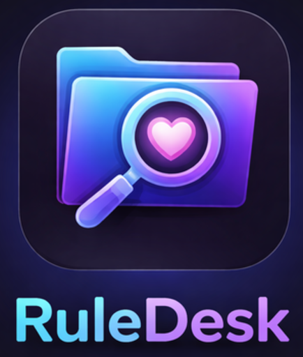

<div align="center">




> A modern, secure desktop companion built on Electron and React/TypeScript for browsing and organizing booru-style imageboard content via its public API. Designed for performance and maintainability.

</div>

---

## 📑 Table of Contents

- [Disclaimer & Risk Assessment](#-disclaimer--risk-assessment)
- [Features](#-features)
- [Quick Start](#-quick-start)
- [Documentation](#-documentation)
- [Architecture Overview](#-architecture-overview--tech-stack)
- [Product Structure](#-product-structure)
- [Core UX Principles](#-core-ux-principles)
- [Sync & Background](#-sync--background)
- [Settings](#-settings)
- [Current Status](#-current-status)
- [Active Roadmap](#-active-roadmap)
- [Development Setup](#-development-setup)
- [License & Legal](#-license--legal)

---

## ⚠️ Disclaimer & Risk Assessment

This project is **unofficial** and **not affiliated** with any external website or company.

- **Content Risk:** The application does **not** host, redistribute, or bundle any media. All content is loaded directly from the original website's API or CDN. Users are responsible for adhering to local laws regarding NSFW content and the target website’s API Terms of Service (ToS).
- **API Risk (Polling):** The Core Services are implemented with strict **Exponential Backoff** and **Rate Limiting** to minimize the risk of IP/key bans due to abusive polling behavior.
- **Security Posture:** The application is configured with mandatory Electron security hardening (Context Isolation, Preload Scripts) to prevent any potential Remote Code Execution (RCE) via the renderer process.

---

## ✨ Features

| Feature                           | Description                                                                                                                                                                                                                                                                                                                                            |
| :-------------------------------- | :----------------------------------------------------------------------------------------------------------------------------------------------------------------------------------------------------------------------------------------------------------------------------------------------------------------------------------------------------- |
| **🔐 API Authentication**         | Secure onboarding flow for Rule34.xxx API credentials (User ID and API Key). Credentials encrypted using Electron's `safeStorage` API and stored securely. Decryption only happens in Main Process when needed for API calls.                                                                                                                          |
| **👤 Artist Tracking**            | Track artists/uploaders by tag or username. Add, view, and delete tracked artists. Supports tag-based tracking with autocomplete search (local and remote Rule34.xxx API). Tag normalization automatically strips metadata like "(123)" from tag names.                                                                                                |
| **🔄 Background Synchronization** | Sync service fetches new posts from Rule34.xxx API with shared `ProviderThrottle` pacing (~1200ms minimum + 0–400ms jitter per request) and exponential backoff on retries. Real-time sync progress updates via IPC events.                                                                                                                      |
| **💾 Local Metadata Database**    | Uses **SQLite** via **Drizzle ORM** (TypeScript mandatory). Direct synchronous access via `better-sqlite3` in Main Process. Stores artists, posts metadata (tags, ratings, URLs, sample URLs), and settings. WAL mode enabled for concurrent reads.                                                                                                    |
| **🖼️ Artist Gallery**             | View cached posts for each tracked artist in a responsive grid layout. Shows preview images, ratings, and metadata. Click to open external link to Rule34.xxx. Supports pagination and artist repair/resync functionality. Mark posts as viewed for better organization.                                                                               |
| **🎨 Progressive Image Loading**  | Stills: `PostCard` loads **preview** first, then upgrades to **sample** when the card is in the viewport. Viewer uses file URL for full quality. Video posts use sample/file for hover preview as applicable.                                                                                                                                       |
| **🌍 Rule34 CDN host fallback**   | Viewer builds an alternate-host URL chain for Rule34 media (`wimg.rule34.xxx`, `img.rule34.xxx`, `us.rule34.xxx`, `api-cdn.rule34.xxx`) when the primary host fails (`ViewerDialog`). No Main-process CDN probe/rewrite service.                                                                                                                        |
| **📊 Post Metadata**              | Cached posts include file URLs, preview URLs, sample URLs, tags, ratings, and publication timestamps. Enables offline browsing and fast filtering.                                                                                                                                                                                                     |
| **🔧 Artist Repair**              | Repair/resync functionality to update low-quality previews or fix synchronization issues. Resets artist's last post ID and re-fetches initial pages.                                                                                                                                                                                                   |
| **💾 Backup & Restore**           | Manual database backup and restore. Timestamped backups in the user data directory; retention is configurable in Settings (`backupRetention`, range `1..20`) and enforced after each successful backup. Restore replaces the live DB (with checks) and reloads the app.                                                                               |
| **🧹 DB Maintenance (VACUUM)**    | User-visible maintenance card in Settings: shows last VACUUM run, allows manual `Run VACUUM now`, and supports schedule policy (`manual`, `weekly`, `monthly`). Lightweight auto-maintenance (`wal_checkpoint` + `optimize`) remains automatic in Main process.                                                                                     |
| **🔍 Search Functionality**       | Search for artists locally, search for tags remotely via booru autocomplete API, and search posts directly on booru (`searchBooru`) with infinite scroll on Browse. Tag resolution methods (`resolveTags`, `resolveCharacterTags`, `resolveCopyrightTags`, `resolveTagsByType`) for identifying artist, character, and copyright tags. Multi-provider support (Rule34.xxx, Gelbooru). |
| **⭐ Favorites System**           | Mark posts as favorites and manage your favorite collection. Toggle favorite status with keyboard shortcut (`F`) in viewer or via UI controls. Favorites are stored locally in the database.                                                                                                                                                           |
| **⬇️ Download Manager**           | Download full-resolution media files to your local file system. Download individual posts or manage download queue. Files are saved to user-selected directory with progress tracking.                                                                                                                                                                 |
| **🖥️ Full-Screen Viewer**         | Immersive viewer with keyboard shortcuts, download controls, favorite toggling, and tag management. Auto-hide controls, navigation between posts, and comprehensive media viewing experience.                                                                                                                                                          |
| **🧭 Navigation & Layout**        | ✅ Implemented — Sidebar and global top bar are used across core pages. `Updates` sidebar item includes an unread badge (polling-based) that clears when the user explicitly opens Updates. Optional IA polish (labels/grouping/density) remains a UX refinement task, not a missing core feature.                                                  |
| **📋 Playlists & Collections**    | Create curated collections of posts independent of Artists/Trackers. Create, rename, delete, export, and import playlists. Add posts via quick menu on Post Cards or in viewer. View playlist galleries with filtering/sorting, drag-and-drop reorder for manual playlists, and smart playlists with hybrid local+remote tag queries.                                                                                   |
| **📊 Statistics**                 | **Statistics** page (`/stats`): extended aggregates via `getExtendedStats` IPC — totals (artists/posts/favorites/unviewed), rating/media/viewed/favorites pie charts, provider split (`rule34 artists`, `gelbooru artists`), top artists/tags, and DB file size. Service placeholder `Artist 0` is excluded from Top Artists.                       |
| **🔄 Auto-Updater**               | Built-in automatic update checker using `electron-updater`. Notifies users of available updates, supports manual download, and provides seamless installation on app restart.                                                                                                                                                                          |
| **🌐 Clean English UI**           | English-only UI copy as inline literals (or local constants when reused 3+ times). No i18n stack.                                                                                                                                                                                                                  |
| **🔌 Multi-Source Ready**         | Provider pattern abstraction for multi-booru support. Current implementations: Rule34.xxx, Gelbooru. `IBooruProvider` interface allows adding new sources (Danbooru, etc.) without core database changes.                                                                                                                                              |

---

## 🏗️ Architecture Overview & Tech Stack

The application adheres to a strict **Separation of Concerns (SoC)** model:

### 1. Core Services (The Brain - Electron Main Process)

This is the secure Node.js environment. It handles all I/O, persistence, and secrets.

- **Desktop Runtime:** **Electron** (desktop runtime for secure Main/Renderer process separation).
- **Database:** **SQLite** (via `better-sqlite3` driver) with direct synchronous access in Main Process. WAL mode enabled for concurrent reads.
- **Data Layer:** **Drizzle ORM** (TypeScript type-safety for queries, raw SQL timestamps in milliseconds).
- **Security:** **Secure Storage** using Electron's `safeStorage` API for encrypting API credentials at rest.
- **API:** Custom wrapper based on `axios` with retry and backoff logic.
- **CDN host fallback (Rule34 media):** Renderer `ViewerDialog` retries Rule34 media URLs across known alternate hosts when a host fails; Main does not rewrite URLs at fetch time.
- **Background Jobs:** Node.js timers and asynchronous operations.

### 2. Renderer (The Face - UI Process)

This is the sandboxed browser environment. It handles presentation.

- **Frontend:** **React + TypeScript**
- **Locale:** **English-only** — user-facing copy is inline string literals (or a local named constant when the same text is used in 3+ places). No i18n libraries.
- **Styling:** **Tailwind CSS + shadcn/ui** (modern UI, good baseline A11y).
- **State Management:** **Zustand** (minimalistic state layer, aligned with KISS/YAGNI).
- **Data Fetching:** **TanStack Query (React Query)** (caching, loading states, API boundary).

### 3. Security Boundary (The Gatekeeper)

- **IPC Architecture:** Controller-based IPC handlers with `BaseController` for centralized error handling and validation. Type-safe dependency injection via DI Container.
- **IPC Bridge:** Strictly typed TypeScript interface (`bridge.ts`) used by the Renderer to communicate with the Main Process.
- **Security:** **Context Isolation** enforced globally; no direct Node.js access from the Renderer.
- **Encryption:** API credentials encrypted using Electron's `safeStorage` API. Decryption only occurs in Main Process when needed for API calls.
- **Provider Pattern:** Multi-booru support via `IBooruProvider` interface. Current implementations: Rule34.xxx, Gelbooru.

**📖 For detailed architecture information, see [Architecture Documentation](./docs/architecture.md).**

## 📐 Product Structure

The application is organized into the following main sections accessible via the Sidebar:

- **Updates (Subscriptions)** - View new posts from tracked artists and tag subscriptions
- **Browse (All posts)** - Search the live booru API with chip-based tags, infinite scroll, and advanced filters; Favorites/Subscriptions modes search the local cache
- **Favorites (Account favorites)** - Access your account favorites synced from the booru
- **Playlists (Collections)** - Create and manage curated collections of posts
- **Statistics** - Extended local metrics and distribution charts via `getExtendedStats` (counts, pie charts, top artists/tags, provider artist split, DB size)
- **Tracked (Artists/Tags management)** - Manage tracked artists, tags, and subscriptions
- **Settings** - Configure downloads, sync, appearance, account, backup/restore, and Danger-zone wipe

## 🎨 Core UX Principles

### Global Top Bar

A unified Top Bar appears on all content pages providing:

- **Search** - Chip-based search with automatic updates while typing/selecting tags
- **Search syntax help** - `CircleHelp` popover next to search input with supported Rule34 syntax examples
- **Filters** - AI, media type, source (per `FiltersPanel`)
- **Sort** - Newest/oldest (`sortOrder` on date-oriented lists)
- **View Toggle** - Switch between grid and masonry layouts
- **Sync Status** - Real-time sync progress indicator with last sync timestamp
*✅ `SyncStatusBadge` is in the top bar. Sorting is handled by the dedicated date sort control in the top bar (outside Filters). Search stretches across the available left section and chip rows can expand to a second line when needed.*

### Viewer Experience

The full-screen viewer provides a polished media viewing experience:

- **Full-screen Mode** - Immersive viewing with auto-hide controls
- **Navigation** - Arrow keys (←/→) for previous/next post
- **Hotkeys:**
  - `Esc` - Close viewer
  - `←/→` - Navigate between posts
  - `F` - Toggle favorite
  - `V` - Mark as viewed
  - `T` - Toggle tags drawer
  - Mouse side buttons (`Back` / `Forward`) - Captured by viewer and mapped to viewer exit flow (do not navigate background pages)
- **Auto-hide Bars** - Top and bottom bars automatically hide after inactivity
- **Tags Drawer** - Right-side sheet with tags grouped by type:
  - **Click** tag to add to search (**include**)
  - **Right-click** to add **exclude** (`-tag`); state shown with **green** (include) / **red** (exclude) ring styling
*✅ Implemented in `ViewerDialog` / `TagsDrawer` via `useSearchStore` (`addIncludeTag` / `addExcludeTag`).*

### Progressive Image Loading

Optimized image loading strategy for performance:

- **Preview URL** - Low-resolution blurred preview (instant display)
- **Sample URL** - Medium-resolution sample (loaded in gallery)
- **File URL** - Full-resolution original (loaded only in viewer)

This ensures fast initial page loads while maintaining high-quality viewing experience. **Gallery cards** upgrade still images from preview to sample when scrolled into view (`PostCard` viewport + image decode).

### Gallery Cards

Post cards in gallery views include informative overlays:

- **Viewed Badge** - Indicator for already viewed posts
- **Favorite Badge** - Star icon for favorited posts
- **Rating Badge** - Visual indicator (Safe/Questionable/Explicit)
- **Media Type Badge** - Icon indicating image or video content
*✅ Rating label (S/Q/Explicit) appears in the card hover overlay; video type is indicated where applicable.*

## 🔄 Sync & Background

### ✅ Auto-sync on startup

When enabled in **Settings → Sync**, the app starts a full **Sync All** after the main window is ready (if no sync is already running). Progress uses the same sync pipeline as manual sync.

### ✅ Periodic background sync

**Settings → Sync → Sync interval** controls how often a background full sync runs (Disabled, 15 / 30 / 60 / 120 minutes). The main process enforces a **minimum interval of 5 minutes** (`MIN_INTERVAL_MINUTES` in `SyncScheduler`); values below that are treated as disabled. Rate limiting and backoff in `SyncService` / `ProviderThrottle` apply to scheduled runs as well as manual ones.

### Maintenance note

A lightweight **maintenance scheduler** runs `PRAGMA wal_checkpoint(PASSIVE)` and `PRAGMA optimize` after a short post-startup delay and on a **daily** timer. This is separate from user-initiated VACUUM/backup operations.

## ⚙️ Settings

Settings are organized into tabs for faster scanning and lower cognitive load:

### General

- **Default download folder** - Choose or reset destination folder
- **Duplicate behavior** - `skip` or `overwrite` for existing files
- **Folder structure** - `flat` or `{artist_id}` subfolder mode
- **Proxy URL** - Optional HTTP/HTTPS proxy for outbound requests/downloads
- **Danger zone — Delete all data** - Confirmed wipe of everything under `.rdcache` (database, `video-cache/`, logs, in-app backups, Electron cache), then quit. Does **not** delete the separate media download folder. Prefer this over uninstall alone (uninstall leaves `.rdcache`).

### Sync

- **Sync on startup** - Toggle automatic sync when app opens
- **Sync interval** - Disabled, 15 / 30 / 60 / 120 minutes
- **Sync now** - Manual trigger in the sidebar with live `Last sync` relative time

### Appearance

- **Theme** - `System`, `Light`, `Dark`

### Blacklist

- **Tag blacklist** - Hide posts containing listed tags from Browse and local galleries (enforced in Main after fetch)

### Backup

- **Create backup** - Manual timestamped backup
- **Restore backup** - Restore from backup file and reload app
- **Integrity check** - Run `PRAGMA integrity_check`
- **Auto-backup schedule** - `Never` / `Daily` / `Weekly` (evaluated on app startup)
- **Automatic backup rotation** - Keep the last `N` backups (`backupRetention`, configurable in UI, range `1..20`)
- **Optional storage cap (env)** - `BACKUP_RETENTION_MAX_TOTAL_MB` can enforce a total size ceiling for backup files in addition to `keep last N`
- **Database maintenance (VACUUM)** - Last run timestamp/status/error, manual run button, and schedule (`manual` / `weekly` / `monthly`)

### Account

- **API key update** - Password-style input with show/hide toggle
- **Key status badge** - `Configured` / `Not configured` via safe `hasApiKey` contract

### Feedback timing

- Settings success/error badges auto-hide after ~5 seconds to avoid stale status indicators.

## ✅ Current Status

The application is stable and production-ready (see **`package.json`** → `version` for the current release number) with the following features implemented:

### Infrastructure & Build

- ✅ **Electron Version:** 39.8.x with latest security patches
- ✅ **Build System:** electron-vite for optimal build performance
- ✅ **Database Architecture:** Direct synchronous access via `better-sqlite3` in Main Process with WAL mode for concurrent reads
- ✅ **User Data Path:** Neutral `.rdcache` directory for dev and packaged builds (same location on a given machine)
- ✅ **Testing Architecture:** Vitest (unit, integration, property/fuzzing), Playwright (E2E); CI runs `validate`, `docs:api` freshness, and `npm test` on every push/PR
- ✅ **Dual ABI Support:** Automatic switching between Node.js and Electron ABI for `better-sqlite3` during testing
- ✅ **HMR Status:** Renderer HMR is enabled, and Main/Preload sources are watched in development for faster backend iteration.

### Database & Schema

- ✅ **Schema:** Core tables `artists`, `posts`, `settings`; additional `tag_metadata`, `playlists`, `playlist_entries`, and FTS5 external content for posts
- ✅ **Migrations:** Fully functional migration system using `drizzle-kit` with idempotent migration handling
- ✅ **Media Type Support:** `media_type` column in `posts` table for efficient image/video filtering (`image`, `video`)
- ✅ **Indexes:** Optimized indexes on `artistId`, `isViewed`, `publishedAt`, `isFavorited`, `lastChecked`, `createdAt`, `mediaType`
- ✅ **Composite Indexes:** Composite indexes on `(artist_id, rating, is_viewed)` and `(artist_id, media_type)` for optimized multi-column filter queries
- ✅ **FTS5 Full-Text Search:** FTS5 virtual table `posts_fts` with `unicode61` tokenizer for fast tag searching
- ✅ **Provider Support:** Multi-booru support with `provider` field in artists table (rule34, gelbooru)
- ✅ **Artist Types:** Support for `tag`, `uploader`, and `query` types

### Security & Reliability

- ✅ **Secure Storage:** API credentials encrypted using Electron's `safeStorage` API via **`SecureStorage` only** (no parallel crypto helpers). Credentials encrypted at rest; decryption only in Main Process
- ✅ **Database Backup/Restore:** Manual backup and restore with integrity checks; configurable retention
- ✅ **Wipe all data:** Settings → General → Danger zone deletes `.rdcache` contents and quits
- ✅ **Input Validation:** Zod validation per IPC handler via `BaseController` (collapse for idempotent; spacing for mutate)
- ✅ **Context Isolation:** Enabled globally with sandbox mode for maximum security
- ✅ **CSP (Content Security Policy):** Strict CSP in production, relaxed for development (HMR support)
- ✅ **User Data Path:** Packaged and dev builds use `%LOCALAPPDATA%/.rdcache` on Windows (not a folder next to the executable)
- ✅ **Age Gate:** Age gate component implemented with legal confirmation (`confirmLegal` method)

### Data Integrity & Sync

- ✅ **Tag Normalization:** Inputs like "tag (123)" are automatically stripped to "tag" before saving/syncing
- ✅ **Sync Service:** Handles `ON CONFLICT` correctly and populates the gallery with proper upsert logic
- ✅ **Timestamp Handling:** All timestamps use Drizzle timestamp mode with proper milliseconds precision
- ✅ **Provider Pattern:** Multi-booru support via `IBooruProvider` interface (Rule34, Gelbooru)
- ✅ **Rate Limiting:** Shared `ProviderThrottle` (~1200ms + 0–400ms jitter per request) across providers
- ✅ **Anti-Bot Measures:** Session User-Agent from a shared pool (`pickRandomUA`) plus jittered request pacing.
- ✅ **Sync integrity:** `lastPostId` advances only after complete pagination; unfinished runs set `lastSyncIncomplete`. Video-cache writes are atomic (tmp+rename) with size-capped eviction — see [Roadmap](./docs/roadmap.md).

### UI/UX

- ✅ **Progressive image loading (stills):** `PostCard` upgrades preview → sample in viewport; original in viewer
- ✅ **Virtualization:** `react-virtuoso` implemented for efficient large list rendering
- ✅ **Search Functionality:** Local artist search, remote tag search via booru autocomplete API, and direct booru search (`searchBooru` method) with tag resolution (`resolveTags`, `resolveCharacterTags`, `resolveCopyrightTags`, `resolveTagsByType`)
- ✅ **Sidebar Navigation:** Persistent grouped sidebar structure (Discover / Library / System) with the current shipped IA.
- ✅ **Global Top Bar:** Search (chip-based include/exclude with OR-group tokens), syntax-help popover, `FiltersPanel` (AI, media, source), dedicated date sort control, view toggle, `SyncStatusBadge`
- ✅ **Advanced Filtering:** Filter by AI-generated tags, media type (image/video), and source (all/favorites/subscriptions)
- ✅ **Sorting:** Sort by date order (newest/oldest) across main feeds
- ✅ **View Modes:** Grid (virtualized) and masonry (CSS columns) are both shipped and user-selectable.
  *Trade-off remains intentional: masonry prioritizes visual layout over full virtualization on huge feeds.*
- ✅ **Updates feed:** Per-post viewed state, **Mark all read** for the feed, and a **Creators** tab with new-post counts and navigation to artist galleries
- ✅ **Full-Screen Viewer:** Immersive viewer with keyboard shortcuts, download, favorites, and tag management
- ✅ **Video Support:** `.mp4`, `.webm`, `.mov`, `.avi`, `.mkv`, `.flv`, `.wmv`, `.m4v` video formats supported with native `<video>` element
- ✅ **Download Manager:** Download full-resolution files with progress tracking and queue management
- ✅ **Favorites System:** Complete implementation with `isFavorited` database field, toggle functionality, and keyboard shortcuts
- ✅ **Backup Controls:** UI component for creating and restoring database backups with integrity checks
- ✅ **Credential Verification:** Verify API credentials before saving and during sync operations
- ✅ **Age Gate Component:** Fully implemented with legal confirmation (`AgeGate.tsx` component and `confirmLegal` IPC method)
- ✅ **Content Security Policy:** Strict CSP with support for Rule34.xxx and Gelbooru.com media sources
- ✅ **Rule34 CDN host fallback:** Viewer retries Rule34 media across alternate hosts when a host fails
- ✅ **Safe Mode / NSFW blur:** When Safe Mode is enabled, gallery cards and the full-screen viewer apply configurable blur to sensitive ratings (`PostCard`, `ViewerDialog`, `safeModeStore`)

---

## 🚀 Quick Start

### First Launch

1. **Get API Credentials:**

   - Visit https://rule34.xxx/index.php?page=account&s=options
   - Copy your **User ID** and **API Key** from the API Access section

2. **Onboarding:**

   - Launch the application
   - Confirm legal age / ToS in the mandatory Age Gate
   - Option A: enter User ID + API Key and click "Save and Login"
   - Option B: click "Skip for now" to continue in Browse-only mode
   - Add API key later in `Settings -> Account` to unlock Updates, Favorites, Playlists, and Artists

3. **Add Artists:**

   - Click "Add Artist" button
   - Enter artist name and tag
   - Select type (tag or uploader)
   - Click "Add"

4. **Sync Posts:**
   - Click "Sync All" to fetch posts from Rule34.xxx
   - Wait for synchronization to complete (progress updates shown in real-time)
   - Click on an artist to view their gallery
   - Use "Repair" button in gallery to resync and update preview quality if needed

---

## 📚 Documentation

Comprehensive documentation is available in the [`docs/`](./docs/) directory:

### 📖 Start Here

- **[User Guide](./docs/user-guide.md)** - **Complete guide for end users** (installation, usage, troubleshooting)
- **[Documentation Index](./docs/index.md)** - Complete navigation guide to all documentation
- **[Glossary](./docs/glossary.md)** - Key terms and concepts (booru, tags, sync, cache, etc.)

**💡 New to RuleDesk?**

- **Start here:** Open the [User Guide](./docs/user-guide.md) for the full end-user walkthrough.
- **Need a map of docs?** Use the [Documentation Index](./docs/index.md).

### 👤 User Guides

- **[Quick Start](#-quick-start)** - First launch and basic setup (this document)
- **[Features](#-features)** - Complete feature list (this document)
- **[Settings](#-settings)** - Application configuration (this document)
- **[Sync & Background](#-sync--background)** - Synchronization guide (this document)

### 📋 Planning & Reference

- **[Roadmap](./docs/roadmap.md)** - Development roadmap and planned features
- **[Features.md](./Features.md)** - Short internal priority list (P1 / P2)
- **[Product Strategy](./Product_Strategy.md)** - Long-term positioning and research pillars

### 🛠️ Maintainer Appendix

- **[Architecture Documentation](./docs/architecture.md)** - System architecture and boundaries
- **[API Reference](./docs/api.md)** - Generated IPC channel table (`npm run docs:api`)
- **[API Guide](./docs/api-guide.md)** - IPC usage patterns, examples, security narrative
- **[Database Documentation](./docs/database.md)** - Schema, migrations, and operational notes
- **[Rule34 API Reference](./docs/rule34-api-reference.md)** - Unofficial Rule34.xxx API documentation
- **[.cursorrules](./.cursorrules)** - Code standards and development principles
- **[.ai/LESSONS.txt](./.ai/LESSONS.txt)** - Canonical short lessons (`Problem -> Root Cause -> Invariant Rule`)

**💡 Tip:** If you're new to RuleDesk, start with the [Documentation Index](./docs/index.md) for structured navigation.

## 🚀 Active Roadmap

Current priority is roadmap parity and UX polish on top of already shipped core modules:

### A. Filters (Advanced Search) ✅ Implemented

**Goal:** Allow users to refine the gallery view.

- ✅ **Global top bar** — `GlobalTopBar.tsx` + `FiltersPanel` (AI, media, source) and separate date sort control
- ✅ **AI / media / source** — Backed by `searchStore` and post queries
- ✅ **Source on Browse** — Favorites/Subscriptions require a tag query when using those modes (`SourceSwitcher`); **intentional** (see [roadmap](./docs/roadmap.md#closed-by-design-not-backlog))
- 🟡 **View modes** — Grid (`VirtuosoGrid`) vs masonry (CSS columns); different scaling behavior on huge lists
- ✅ **FTS5** — Tag search where integrated in browse/search flows

**Status:** Day-to-day filtering works with current scope (AI/media/source + date sort).

### B. Download Manager ✅ Implemented (Core Features)

**Goal:** Allow saving full-resolution files to the local file system.

- ✅ "Download Original" button on post view (implemented in ViewerDialog)
- ✅ **Download Handler:** Downloads run in Main Process with progress tracking
- ✅ **Progress Events:** Real-time download progress via IPC events (`onDownloadProgress`)
- ✅ **File Management:** Open downloaded file in folder (`openFileInFolder`)
- ✅ **Batch download:** "Download all" flows for galleries and lists (rate-limited; see Settings for folder behavior)
- ✅ **Settings:** Default download folder and duplicate/structure options in **Settings**

### C. Playlists / Collections ✅ Implemented

**Goal:** Create curated collections of posts independent of Artists/Trackers.

**Phase 1: MVP** ✅ **COMPLETED**

- ✅ **Database Tables:** `playlists` table (`id`, `name`, `is_smart`, `query_json`, `icon_name`, `created_at`) and `playlist_entries` table (`playlist_id`, `post_id`, `added_at`) with proper indexes
- ✅ **Playlist Management:** Create, rename, delete playlists with full CRUD operations
- ✅ **Add to Playlist:** Quick add menu on Post Cards and in viewer dialog
- ✅ **Playlists Page:** Dedicated page in Sidebar with playlist list and gallery views
- ✅ **Playlist Gallery:** Grid and masonry view modes with filtering, sorting, and search
- ✅ **Smart Playlists:** Support for dynamic playlists with tag-based queries (auto-fill based on tags)
- ✅ **Hybrid Smart Search:** Smart collections resolve posts from local DB and remote API, merge, and deduplicate results
- ✅ **Manual Reordering:** Drag-and-drop post ordering for manual playlists (`position` sort mode)
- ✅ **Import/Export:** JSON-based playlist transfer (`.ruledesk-playlist.json`) via file dialogs
- ✅ **FTS5 Integration:** Fast tag searching within playlists using FTS5 full-text search
- ✅ **IPC Controller:** Full `PlaylistController` implementation with type-safe operations

**Status:** ✅ Core playlist functionality fully implemented. Users can create playlists, add posts, view galleries, and manage collections independently of artist tracking.

### 🛡️ Security & Reliability (Hardening)

- ✅ **Database Architecture** - ✅ **COMPLETED:** Direct synchronous access via `better-sqlite3` with WAL mode for concurrent reads. All database operations run in Main Process.
- ✅ **Encrypt / Secure Storage for API Credentials** - ✅ **COMPLETED:** Using Electron's `safeStorage` API for encryption. API keys encrypted at rest, never exposed to Renderer process.
- ✅ **Database Backup / Restore System** - ✅ **COMPLETED:** Manual backup and restore functionality implemented with integrity checks and timestamped backups.
- ✅ **IPC Architecture** - ✅ **COMPLETED:** Controller-based IPC handlers with `BaseController` for centralized error handling and validation. Type-safe dependency injection via DI Container.
**📖 For detailed roadmap information, see [Roadmap Documentation](./docs/roadmap.md).** For **backlog** and **planned** work, see [Backlog](./docs/roadmap.md#backlog-not-implemented-yet) and [Planned product work](./docs/roadmap.md#planned-product-work).

---

## ⚙️ Development Setup

This project uses **electron-vite** as the build tool for both the Electron Main and Renderer processes, ensuring optimal build performance.

### Prerequisites

- **Node.js:** v20 LTS (matches CI)
- **npm:** v9 or higher
- **Git:** For version control

### Installation

```bash
# Clone the repository
git clone https://github.com/KazeKaze93/ruledesk.git
cd ruledesk

# Install dependencies
npm install

# Start the application in development mode
# This runs the Vite dev server for the Renderer and starts the Electron Main process.
npm run dev
```

### Configuration

The application stores configuration in SQLite database:

- **API Credentials:** Stored securely with encryption using Electron's `safeStorage` API. API keys are encrypted at rest and only decrypted in Main Process when needed for API calls.
- **Database Location** (development and packaged builds use the same neutral path):
  - Windows: `%LOCALAPPDATA%\.rdcache\data.bin`
  - Logs: `%LOCALAPPDATA%\.rdcache\logs\app.log`
  - macOS: `~/Library/Application Support/.rdcache/data.bin`
  - Linux: `~/.config/.rdcache/data.bin`
- **Database Architecture:** Direct synchronous access via `better-sqlite3` with WAL mode for concurrent reads
- **No Environment Variables Required:** All configuration is handled through the UI

### Building the Binary

To package the application for distribution:

```bash
# Build for current platform
npm run build

# Package with electron-builder (after build)
npm run dist
# Or use electron-builder directly:
npx electron-builder
```

The built binaries will be available in the `release/` directory. The exact output location may vary depending on your Electron builder configuration.

**Official release artifacts** (GitHub Releases on `v*` tags; see [user guide — Installation](./docs/user-guide.md#installation)):

| Platform | Artifact | CI |
|----------|----------|-----|
| Windows | `RuleDesk-<version>-win.zip` — extract and run `RuleDesk.exe` | ✅ |
| Linux x64 | `RuleDesk-<version>.AppImage` — `chmod +x` and run | ✅ |
| macOS | — | ❌ Not shipped (Apple signing/notarization not set up; build from source on a Mac if needed) |

Local packaging scripts: `npm run dist:win`, `npm run dist:linux` (after `npm run build`). `npm run dist` defaults to Windows zip on the current machine.

**Release hygiene:** Production builds disable source maps (`electron.vite.config.ts`). `electron-builder` excludes `.env*`, databases, logs, tests, `.cursorrules`, `.ai/`, and `*.map` from `app.asar`. CI runs `npm run check:release-artifacts` on every packaged build before upload. User API keys are never bundled — they are entered at runtime and stored encrypted in the local user data directory (`.rdcache`), not in the installer.

### Quality Checks

```bash
# Typecheck + ESLint + renderer  loading/decoding policy
npm run validate

# Regenerate IPC channel reference (commit docs/api.md if it changes)
npm run docs:api

# Individual steps (if needed)
npm run typecheck
npm run lint
npm run check:img-attrs

# Production dependency audit (high severity and above)
npm audit --omit=dev --audit-level=high

# Full local gate before a PR (validate + all Vitest suites + Electron ABI restore)
npm run test:verify
```

### Testing

**Vitest** covers unit, integration, and property-based tests (**197 tests** across 28 files). **Playwright** covers E2E flows. Full suite inventory: [`tests/unit/TEST_COVERAGE.md`](tests/unit/TEST_COVERAGE.md).

```bash
# Full suite: rebuild for Node → run all Vitest tests → rebuild for Electron
npm test

# Same Vitest run without posttest Electron rebuild (still rebuilds Node first)
npm run test:run

# Watch / UI / coverage (each rebuilds better-sqlite3 for Node before running)
npm run test:watch
npm run test:ui
npm run test:coverage
# Coverage HTML/JSON under coverage/ is gitignored — regenerate locally, do not commit

# Targeted suites
npm run test:integration
npm run test:integration:watch

# E2E (requires build + Playwright browsers)
npm run test:e2e
```

**Test layout:**

| Directory | Purpose |
|-----------|---------|
| `tests/unit/` | Hooks, utilities, filter/layout logic, DI, credential decrypt |
| `tests/integration/` | IPC controllers and services with in-memory SQLite |
| `tests/property/` | Property-based / fuzzing tests (`fast-check`) |
| `tests/e2e/` | Playwright user workflows |

**Notable Vitest coverage:**

| File | Area |
|------|------|
| `tests/unit/utils/decrypted-credentials.test.ts` | No ciphertext fallback on decrypt failure |
| `tests/unit/core/di-container.test.ts` | DI `Map` keyed by `token.id` |
| `tests/unit/hooks/useWorkerFilteredPosts.test.ts` | `mapWorkerPostToPost` field preservation |
| `tests/unit/shared/provider-search-ipc-payload.test.ts` | Electron IPC error wrapper → typed provider payload |
| `tests/unit/providers/rule34-provider-fetch-posts.test.ts` | Auth/429/network/parse vs genuine empty results |
| `tests/unit/services/tag-resolve-coordinator.test.ts` | Tag resolve dedup, rate-limit backoff, negative cache |
| `tests/integration/controllers/ArtistsController.limit.test.ts` | `MAX_TRACKED_ARTISTS` (5000) cap |
| `tests/integration/services/SyncService.queue.test.ts` | `runExclusive` serializes sync vs repair |
| `tests/integration/services/SyncService.test.ts` | Auth provider errors → `SYNC.ERROR` |

**Dual ABI for `better-sqlite3`:**

Vitest runs under **Node.js**; the packaged app uses **Electron**. Native module ABI must match the runtime:

- `pretest` / `test:run` / `test:watch` / `test:coverage` → `npm run db:rebuild:node` before Vitest
- `posttest` (on `npm test` only) → `npm run db:rebuild` so `npm run dev` works immediately after

If integration tests fail with `NODE_MODULE_VERSION` mismatch, run `npm run db:rebuild:node` and retry.

### CI/CD

GitHub Actions workflow (`.github/workflows/ci.yml`):

1. **Quality** — `npm run validate`, `npm run docs:api` + freshness check on `docs/api.md`, `npm test`, `npm audit --omit=dev --audit-level=high`
2. **E2E** — build app, run Playwright (needs `TEST_USER_ID` / `TEST_API_KEY` secrets for live API tests)
3. **Release** (tags only) — Windows zip + Linux AppImage (parallel jobs), merged into one GitHub Release after quality + e2e pass

## 📜 License & Legal

### License

This project is licensed under **Apache 2.0**.

You may use, reproduce, modify, distribute, and sublicense the software under the terms of Apache 2.0. The license includes an express patent grant and requires preservation of copyright and license notices.

The full license text is available in the `LICENSE` file in this repository.

### Legal Disclaimer

By using this software, you acknowledge and agree to the following:

**18+ Only:** This application is intended exclusively for adults (18+) in jurisdictions where viewing NSFW content is legal.

**No Content Hosting:** The application does not host, store, mirror, or redistribute any media content. All media is requested directly from the original website’s API/CDN at the user’s initiative.

**Use at Your Own Risk:** The authors and contributors of this project:

- Do not control the content provided by third-party services.
- Do not endorse, moderate, or curate any content accessed through this software.
- Are not responsible for how you use this software or which content you access with it.

**Compliance with Laws & ToS:** You are solely responsible for:

- Complying with the laws and regulations applicable in your country/region.
- Complying with the target website's Terms of Service, API rules, and any usage limitations (including rate limits and content policies).

**No Warranty / Limitation of Liability:** This software is provided “AS IS”, without warranties or conditions of any kind, either express or implied. To the fullest extent permitted by applicable law, in no event shall the authors or copyright holders be liable for any claim, damages, or other liability, whether in an action of contract, tort, or otherwise, arising from, out of, or in connection with the software or the use or other dealings in the software.

---

## ⚙️ Database Management

### Migrations

If you modify the database schema (`src/main/db/schema.ts`):

```bash
# Generate migration from schema changes
npm run db:generate

# Run migrations manually (migrations also run automatically on startup)
npm run db:migrate

# Open Drizzle Studio to inspect database
npm run db:studio
```

**Note:** Migrations run automatically on application startup. The migration path is automatically detected based on whether the app is packaged or in development mode.

**Performance Optimizations:**

- **FTS5 Full-Text Search:** Fast tag searching using SQLite FTS5 virtual table with `unicode61` tokenizer
- **Composite Indexes:** Optimized indexes for common filter combinations (artist + rating + view status)
- **External Content Tables:** FTS5 uses external content to avoid data duplication and save storage space

### Database Location

- **All builds:** neutral user data directory (`.rdcache/` — `data.bin`, `logs/app.log`, `backup-settings.json`; see paths above)

**📖 For detailed database information, see [Database Documentation](./docs/database.md).**

---

## 🛡️ Code Quality Standards

This project adheres to strict development principles:

- **Architecture:** SOLID, DRY, KISS, YAGNI principles
- **TypeScript:** Strict typing, no `any` or unsafe casts
- **Error Handling:** Proper error handling with descriptive messages via `BaseController`
- **Security:** Context Isolation enabled, sandbox mode, CSP headers, no direct Node.js access from Renderer
- **Database:** Type-safe queries via Drizzle ORM, no raw SQL (except migrations)
- **UI:** Tailwind CSS only, no inline styles, shadcn/ui components, accessibility considerations
- **Logging:** `electron-log` for all logging (no `console.log` in production code)
- **IPC:** Controller-based architecture with dependency injection

**📖 For detailed guidelines, see [.cursorrules](./.cursorrules) and [.ai/LESSONS.txt](./.ai/LESSONS.txt).**
