# Architecture Documentation

## Overview

This application follows a strict **Separation of Concerns (SoC)** architecture, dividing responsibilities between the Electron Main Process (secure Node.js environment) and the Renderer Process (sandboxed browser environment).

### Architecture Diagram

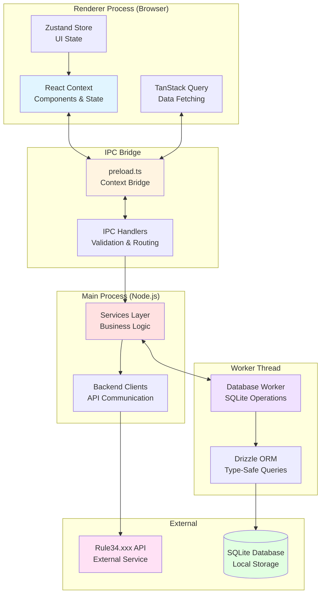

## Architecture Concept

### 1. Dual-Module Interface

- **Library Mode:** Works with local SQLite database. Maximum performance, virtualization.
- **Browser Mode:** Isolated `<webview>` process. Allows users to browse the source (Source) natively. "Bridge" between the site and application is implemented through script injection (DOM scraping + IPC triggers).

### 2. Provider Abstraction (Future Proofing)

- In the future, `SyncService` will no longer be tightly coupled to Rule34.
- Introduces `BooruProvider` interface (methods: `getPosts`, `getArtistInfo`, `search`).
- Current implementation will become `Rule34Provider`. This allows adding new sources without rewriting the core database.

## High-Level Architecture

### System Overview

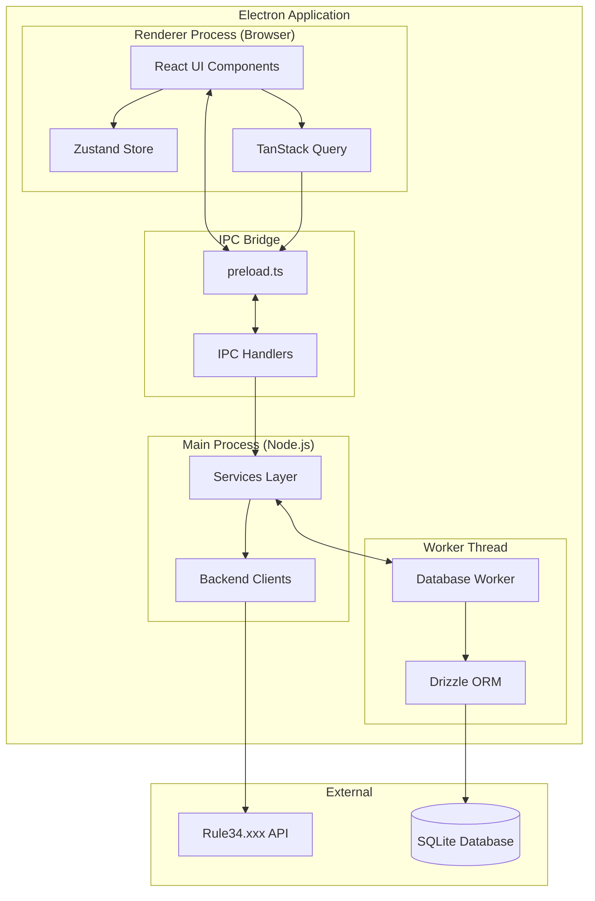

### Process Communication Flow

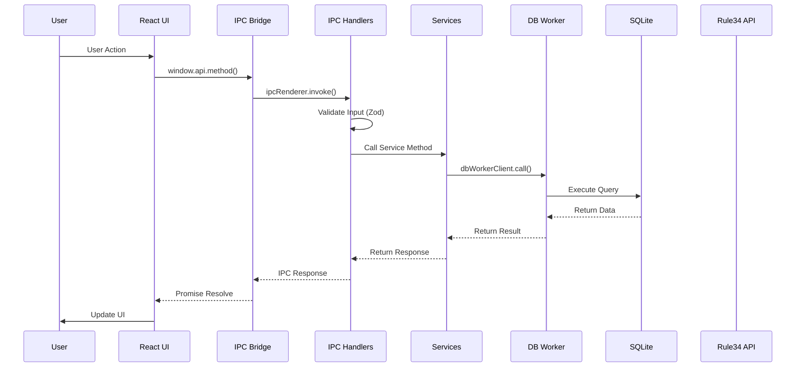

### Database Worker Architecture

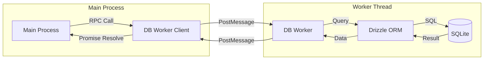

## Process Separation

### Main Process (The Brain)

**Location:** `src/main/`

**Responsibilities:**

- Database operations (SQLite via Drizzle ORM)
- External API communication
- File system operations
- Background polling jobs
- Security-sensitive operations

**Key Components:**

1. **Database Worker** (`src/main/db/db-worker.ts`)

   - Runs in a dedicated worker thread for non-blocking database operations
   - Manages all database operations using Drizzle ORM
   - Thread-safe SQLite access isolated from main process
   - RPC pattern with correlation IDs for request/response matching
   - Methods: getTrackedArtists, addArtist, deleteArtist, getPostsByArtist, savePostsForArtist, getSettings, saveSettings, backup, restore, searchArtists, markPostAsViewed

2. **Database Worker Client** (`src/main/db/db-worker-client.ts`)

   - Client interface for communicating with database worker thread
   - Handles worker lifecycle (initialization, termination)
   - Provides async/await interface over worker RPC calls
   - Manages backup and restore operations

3. **Repositories** (`src/main/db/repositories/`)

   - **ArtistsRepository** (`artists.repo.ts`) - Abstraction layer for artist operations

     - `getAll()` - Get all tracked artists
     - `add(artist)` - Add new artist
     - `delete(id)` - Delete artist
     - `searchTags(query)` - Search artists by tag/name

   - **PostsRepository** (`posts.repo.ts`) - Abstraction layer for post operations

     - `getByArtist(params)` - Get posts for artist with pagination
     - `getCountByArtist(artistId)` - Get post count
     - `markAsViewed(postId)` - Mark post as viewed
     - `toggleFavorite(postId)` - Toggle favorite status
     - `togglePostViewed(postId)` - Toggle viewed status
     - `resetPostCache(postId)` - Reset post cache

   - Repositories provide a clean abstraction over direct worker client calls
   - Used by IPC handlers for type-safe database operations

4. **Sync Service** (`src/main/services/sync-service.ts`)

   - Handles Rule34.xxx API synchronization
   - Implements rate limiting and pagination
   - Maps API responses to database schema
   - Updates artist post counts
   - Provides repair/resync functionality for artists
   - Emits IPC events for sync progress tracking

5. **IPC Handlers** (`src/main/ipc/index.ts`)

   - Registers all IPC communication channels
   - Modular handler structure in `src/main/ipc/handlers/`
   - Validates input from Renderer using Zod schemas
   - Delegates to appropriate services and repositories
   - Security validation (e.g., openExternal URL whitelist)
   - Handles updater and sync event subscriptions

   **Handler Modules:**

   - `artists.ts` - Artist-related IPC handlers
   - `files.ts` - File download handlers
   - `posts.ts` - Post-related IPC handlers
   - `settings.ts` - Settings IPC handlers
   - `viewer.ts` - Viewer-related IPC handlers

6. **Updater Service** (`src/main/services/updater-service.ts`)

   - Manages automatic update checking via `electron-updater`
   - Handles update download and installation
   - Emits IPC events for update status and progress
   - User-controlled download (manual download trigger)

7. **Secure Storage** (`src/main/services/secure-storage.ts`)

   - Encrypts and decrypts sensitive data using Electron's `safeStorage` API
   - Used for API credentials encryption at rest
   - Decryption only occurs in Main Process when needed
   - Methods: encrypt, decrypt

8. **Bridge** (`src/main/bridge.ts`)

   - Defines the IPC interface
   - Exposed via preload script
   - Type-safe communication contract
   - Event listener management for real-time updates

9. **Main Entry** (`src/main/main.ts`)
   - Application initialization
   - Window creation
   - Security configuration
   - Database worker thread initialization and migrations

### Renderer Process (The Face)

**Location:** `src/renderer/`

**Responsibilities:**

- User interface rendering
- User interactions
- State management
- Data presentation

**Key Components:**

1. **React Application** (`src/renderer/App.tsx`)

   - Main UI component with routing logic
   - Onboarding screen for API credentials
   - Sidebar navigation with multiple pages
   - Uses TanStack Query for data fetching
   - State management via React hooks and Zustand

2. **Components** (`src/renderer/components/`)

   - **Pages:**

     - **Updates.tsx** - Subscriptions feed (stub, in development)
     - **Browse.tsx** - All posts view with filtering (stub, in development)
     - **Favorites.tsx** - Favorites collection (stub, in development)
     - **Tracked.tsx** - Artists and tags management
     - **Settings.tsx** - Application configuration
     - **ArtistDetails.tsx** - Artist gallery view
     - **Onboarding.tsx** - API credentials input form

   - **Layout:**

     - **AppLayout.tsx** - Main application layout with sidebar
     - **Sidebar.tsx** - Persistent sidebar navigation
     - **GlobalTopBar.tsx** - Unified top bar with search, filters, sort controls

   - **Gallery:**

     - **ArtistCard.tsx** - Artist card component
     - **ArtistGallery.tsx** - Grid view of posts for an artist
     - **PostCard.tsx** - Individual post card component

   - **Viewer:**

     - **ViewerDialog.tsx** - Full-screen viewer with download, favorites, keyboard shortcuts

   - **Dialogs:**

     - **AddArtistModal.tsx** - Modal for adding new artists
     - **DeleteArtistDialog.tsx** - Confirmation dialog for artist deletion
     - **UpdateNotification.tsx** - Update notification component

   - **Settings:**

     - **BackupControls.tsx** - Database backup and restore controls

   - **Inputs:**

     - **AsyncAutocomplete.tsx** - Autocomplete component with local and remote search

   - **ui/** - shadcn/ui components (Button, Dialog, Select, Input, etc.)

3. **IPC Client** (`window.api`)
   - Typed interface to Main process
   - All communication goes through this bridge
   - Methods: getSettings, saveSettings, getTrackedArtists, addArtist, deleteArtist, getArtistPosts, getArtistPostsCount, syncAll, openExternal, searchArtists, searchRemoteTags, markPostAsViewed, togglePostViewed, togglePostFavorite, downloadFile, openFileInFolder, createBackup, restoreBackup, writeToClipboard, verifyCredentials, logout, resetPostCache

## Security Architecture

### Security Layers

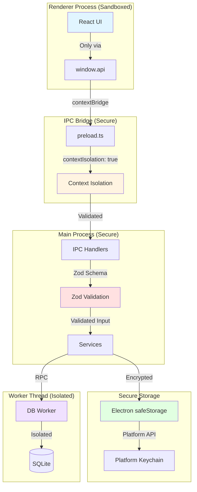

### Context Isolation

**Status:** ✅ Enabled

The Renderer process runs in a sandboxed environment with no direct Node.js access. This prevents Remote Code Execution (RCE) attacks.

**Configuration:**

```typescript
webPreferences: {
  contextIsolation: true,  // Required
  nodeIntegration: false,  // Never true
  sandbox: true,           // Additional security
  preload: path.join(__dirname, "../preload/bridge.cjs"),
}
```

### IPC Security

1. **Type Safety:** All IPC communication is strictly typed
2. **Input Validation:** All inputs are validated in Main process using Zod schemas
3. **Error Handling:** Errors are properly handled without exposing sensitive data
4. **No Direct Node Access:** Renderer cannot access Node.js APIs directly
5. **Secure Credentials:** API keys encrypted at rest, only decrypted in Main Process when needed
6. **Worker Thread Isolation:** Database operations isolated in worker thread

### Credential Security Flow

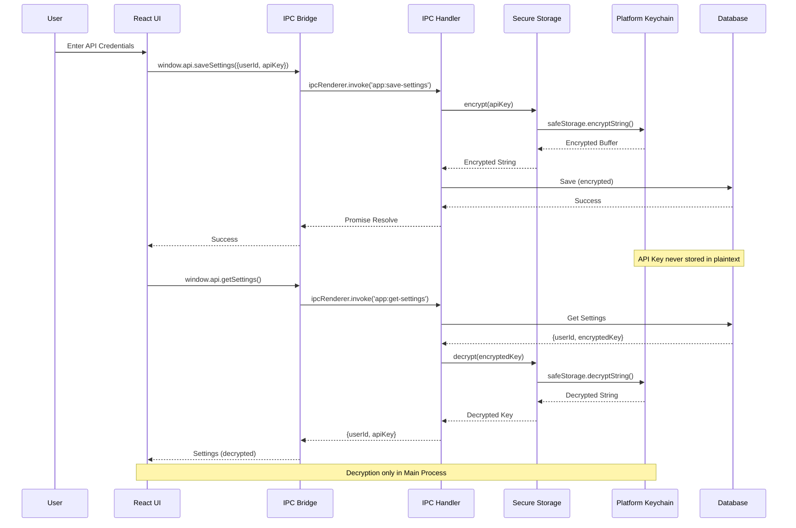

## Data Flow

### Reading Data Flow

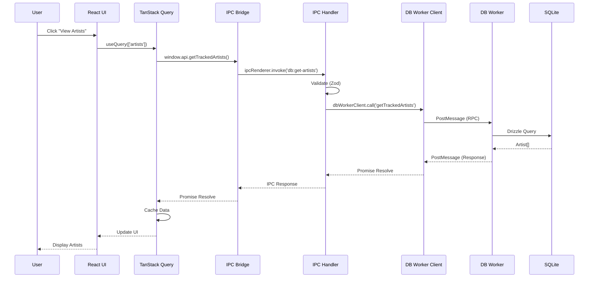

### Writing Data Flow

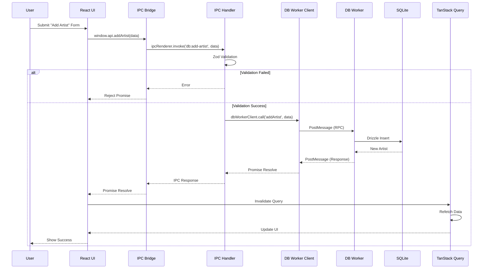

### Synchronization Flow

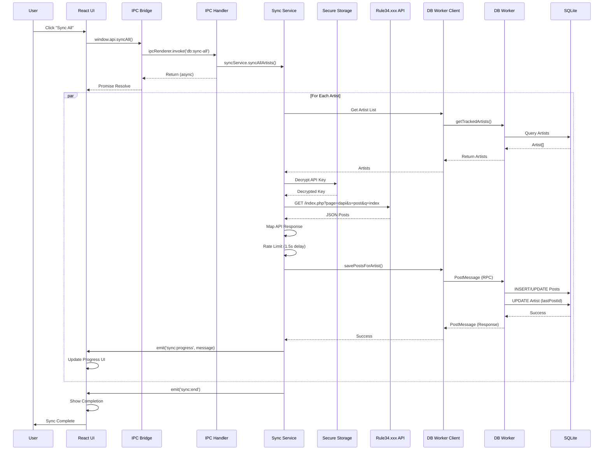

## Database Architecture

### Schema

The database uses SQLite with the following tables:

1. **artists** - Tracked artists/users (by tag or uploader)
2. **posts** - Cached post metadata with tags, ratings, and URLs
3. **settings** - API credentials (User ID and API Key)
4. **subscriptions** - Tag subscriptions (schema defined, not yet implemented)

See [Database Documentation](./database.md) for detailed schema information.

### ORM Layer

**Drizzle ORM** provides:

- Type-safe queries
- Schema migrations
- Type inference
- SQL generation

### Worker Thread Architecture

**Database Worker Thread** (`src/main/db/db-worker.ts`):

- All database operations run in a dedicated worker thread
- Prevents blocking the main Electron process
- RPC pattern with correlation IDs for request/response matching
- Timeout handling for worker requests
- Type-safe communication via `WorkerRequest` and `WorkerResponse` types
- Automatic migration execution on worker initialization

## Component Architecture

### React Component Hierarchy

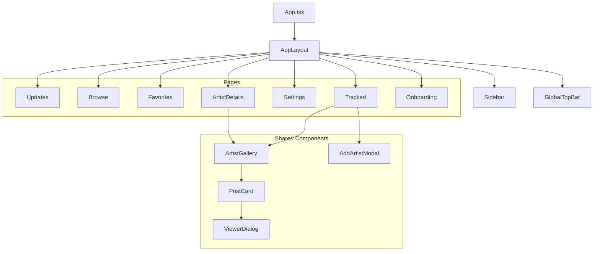

## External API Integration

### API Client Design

External API calls are handled in the Main process via `SyncService` (`src/main/services/sync-service.ts`) with:

1. **Rate Limiting:** 1.5 second delay between artists, 0.5 second between pages
2. **Pagination:** Handles Rule34.xxx pagination (up to 1000 posts per page)
3. **Incremental Sync:** Only fetches posts newer than `lastPostId`
4. **Error Handling:** Graceful handling of API errors and network failures
5. **Authentication:** Uses User ID and API Key from settings table

### Download Flow

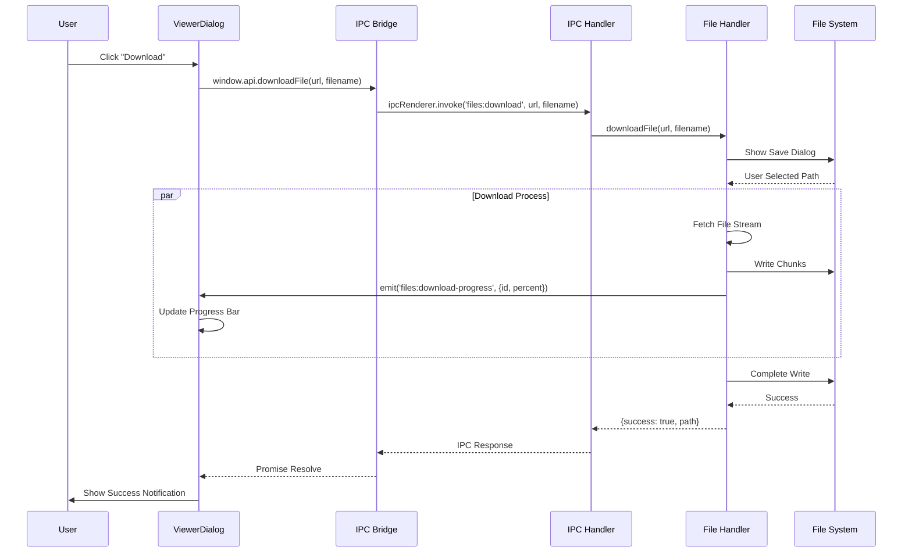

## Build Architecture

### Build Tool: Vite

The project uses **electron-vite** for building both Main and Renderer processes.

**Configuration:** `electron.vite.config.ts`

**Build Targets:**

1. **Main:** Node.js bundle (`out/main/`)
2. **Preload:** CommonJS bridge (`out/preload/`)
3. **Renderer:** React application (`out/renderer/`)

### Development Mode

- Hot Module Replacement (HMR) for Renderer
- Fast rebuilds with Vite
- DevTools enabled in development

## State Management

### Renderer State

**TanStack Query (React Query):**

- Server state (data from Main process)
- Caching and synchronization
- Loading and error states

**Zustand:**

- Client-side UI state
- Minimal boilerplate
- KISS principle compliance

### Main Process State

- Database is the source of truth
- Services maintain minimal in-memory state
- Background jobs use timers, not persistent state

## File Structure

```
src/
├── main/                          # Electron Main Process
│   ├── db/                        # Database layer
│   │   ├── repositories/         # Repository pattern implementations
│   │   │   ├── artists.repo.ts    # Artists repository
│   │   │   └── posts.repo.ts       # Posts repository
│   │   ├── db-service.ts          # Legacy database service (deprecated)
│   │   ├── db-worker.ts           # Database worker thread implementation
│   │   ├── db-worker-client.ts    # Worker client interface
│   │   ├── migrate.ts             # Migration runner
│   │   ├── schema.ts              # Drizzle ORM schema definitions
│   │   └── worker-types.ts        # Worker thread type definitions
│   ├── ipc/                       # IPC (Inter-Process Communication)
│   │   ├── handlers/              # Modular IPC handlers
│   │   │   ├── artists.ts         # Artist-related IPC handlers
│   │   │   ├── files.ts           # File download handlers
│   │   │   ├── posts.ts           # Post-related IPC handlers
│   │   │   ├── settings.ts        # Settings IPC handlers
│   │   │   └── viewer.ts          # Viewer-related IPC handlers
│   │   ├── channels.ts            # IPC channel constants
│   │   └── index.ts               # Main IPC registration
│   ├── services/                  # Background services
│   │   ├── secure-storage.ts       # Secure storage for API credentials
│   │   ├── sync-service.ts        # Rule34.xxx API synchronization
│   │   └── updater-service.ts     # Auto-updater service
│   ├── lib/                       # Utilities
│   │   └── logger.ts             # Logging utility
│   ├── bridge.ts                  # IPC bridge interface definition
│   ├── main.d.ts                  # Main process type definitions
│   └── main.ts                    # Main process entry point
│
├── renderer/                      # Electron Renderer Process
│   ├── components/                # React components
│   │   ├── dialogs/               # Dialog components
│   │   │   ├── AddArtistModal.tsx
│   │   │   ├── DeleteArtistDialog.tsx
│   │   │   ├── Onboarding.tsx
│   │   │   └── UpdateNotification.tsx
│   │   ├── gallery/               # Gallery components
│   │   │   ├── ArtistCard.tsx
│   │   │   ├── ArtistGallery.tsx
│   │   │   └── PostCard.tsx
│   │   ├── inputs/                # Input components
│   │   │   └── AsyncAutocomplete.tsx
│   │   ├── layout/                 # Layout components
│   │   │   ├── AppLayout.tsx
│   │   │   ├── GlobalTopBar.tsx
│   │   │   └── Sidebar.tsx
│   │   ├── pages/                  # Page components
│   │   │   ├── ArtistDetails.tsx
│   │   │   ├── Browse.tsx
│   │   │   ├── Favorites.tsx
│   │   │   ├── Onboarding.tsx
│   │   │   ├── Settings.tsx
│   │   │   ├── Tracked.tsx
│   │   │   └── Updates.tsx
│   │   ├── settings/               # Settings components
│   │   │   └── BackupControls.tsx
│   │   ├── ui/                     # shadcn/ui components
│   │   │   ├── alert.tsx
│   │   │   ├── button.tsx
│   │   │   ├── card.tsx
│   │   │   ├── dialog.tsx
│   │   │   ├── dropdown-menu.tsx
│   │   │   ├── input.tsx
│   │   │   ├── label.tsx
│   │   │   ├── select.tsx
│   │   │   └── separator.tsx
│   │   └── viewer/                 # Viewer components
│   │       └── ViewerDialog.tsx
│   ├── i18n/                       # Internationalization
│   │   └── index.ts
│   ├── lib/                        # Utilities
│   │   ├── hooks/                  # Custom React hooks
│   │   │   └── useDebounce.ts
│   │   ├── artist-utils.ts
│   │   ├── tag-utils.ts
│   │   └── utils.ts
│   ├── locales/                    # Translation files
│   │   └── en/
│   │       └── translation.json
│   ├── schemas/                    # Form validation schemas
│   │   └── form-schemas.ts
│   ├── store/                       # State management (Zustand)
│   │   └── viewerStore.ts
│   ├── App.tsx                     # Main React component
│   ├── index.css                   # Global styles
│   ├── index.html                  # HTML template
│   ├── main.tsx                    # Renderer entry point
│   └── renderer.d.ts               # Renderer type definitions
│
└── preload/                        # Preload scripts (generated by electron-vite)
    └── bridge.cjs                  # Compiled preload script

Root:
├── drizzle/                        # Database migrations
│   ├── meta/                       # Migration metadata
│   │   ├── _journal.json
│   │   └── *_snapshot.json
│   └── *.sql                       # SQL migration files
├── docs/                           # Documentation
│   ├── api.md
│   ├── architecture.md
│   ├── contributing.md
│   ├── database.md
│   ├── development.md
│   ├── roadmap.md
│   └── rule34-api-reference.md
├── scripts/                        # Build and utility scripts
│   ├── ai_reviewer.py
│   └── system_prompt.md
├── .github/                        # GitHub workflows
│   └── workflows/
│       ├── ai-review.yml
│       └── ci.yml
├── electron.vite.config.ts         # Electron-Vite configuration
├── drizzle.config.ts               # Drizzle ORM configuration
├── tailwind.config.js              # Tailwind CSS configuration
├── tsconfig.json                   # TypeScript configuration
└── package.json                    # Project dependencies and scripts
```

## Design Principles

### SOLID Principles

- **Single Responsibility:** Each module has one clear purpose
- **Open/Closed:** Extend via composition, not modification
- **Dependency Inversion:** Services depend on abstractions

### KISS & YAGNI

- **KISS:** Simple, readable code over clever solutions
- **YAGNI:** Implement only what's needed now

### DRY

- Shared types between Main and Renderer
- Reusable components and utilities
- No code duplication

## Recent Fixes & Current Status

### ✅ Completed Stabilization

**Infrastructure & Build:**

- Fixed `better-sqlite3` native build on Windows (resolved `node-gyp`, Python, and ABI version mismatches)
- App runs successfully via `npm run dev` and communicates with SQLite database
- **Database Worker Thread:** All database operations moved to dedicated worker thread for non-blocking main process

**Database & Schema:**

- Replaced incompatible `unixepoch` and JS-dates with raw SQL timestamps (ms)
- Added proper `UNIQUE` constraints to the `posts` table (`artistId` + `postId`) to enable correct UPSERT operations
- Added `sampleUrl` column for progressive image loading
- Migrations system (`drizzle-kit`) is fully functional
- **Worker Thread Architecture:** Database operations isolated in worker thread with RPC pattern

**Security & Reliability:**

- **Secure Storage:** API credentials encrypted using Electron's `safeStorage` API. Credentials encrypted at rest, decryption only in Main Process
- **Database Backup/Restore:** Manual backup and restore functionality implemented. Create timestamped backups and restore from files
- **Thread Safety:** Database operations run in dedicated worker thread, preventing main process blocking

**Data Integrity & Sync:**

- Implemented Tag Normalization in `AddArtistModal`: Inputs like "tag (123)" are now stripped to "tag" before saving/syncing
- SyncService correctly handles `ON CONFLICT` and populates the gallery
- Fixed timestamp handling: `lastChecked` now uses `new Date()` with proper Drizzle timestamp mode

**UI/UX:**

- Fixed "Soapy/Blurred" Previews: Image rendering quality for previews has been corrected
- Implemented Progressive Image Loading: 3-layer system (Preview → Sample → Original) for instant viewing
- Basic Gallery grid is functional
- AsyncAutocomplete component for artist/tag search with free-text input support
- **Search Functionality:** Local artist search and remote tag search via Rule34.xxx autocomplete API
- **Backup Controls:** UI component for creating and restoring database backups
- **Mark as Viewed:** Ability to mark posts as viewed for better organization

## Implemented Features

1. ✅ **Sync Service:** Dedicated service for Rule34.xxx API synchronization with progress tracking
2. ✅ **Settings Management:** Secure storage of API credentials with encryption using Electron's `safeStorage` API
3. ✅ **Artist Tracking:** Support for tag-based tracking with autocomplete search and tag normalization
4. ✅ **Post Gallery:** Grid view of cached posts with preview images and pagination
5. ✅ **Progressive Image Loading:** 3-layer loading system (Preview → Sample → Original) for instant viewing
6. ✅ **Artist Repair:** Resync functionality to update previews and fix sync issues
7. ✅ **Auto-Updater:** Automatic update checking and installation via electron-updater
8. ✅ **Event System:** Real-time IPC events for sync progress, update status, and download progress
9. ✅ **Database Worker Thread:** All database operations run in dedicated worker thread for non-blocking performance
10. ✅ **Secure Storage:** API credentials encrypted at rest using Electron's `safeStorage` API
11. ✅ **Backup/Restore:** Manual database backup and restore functionality with timestamped backups
12. ✅ **Search Functionality:** Local artist search and remote tag search via Rule34.xxx autocomplete API
13. ✅ **Mark as Viewed:** Ability to mark posts as viewed for better organization
14. ✅ **Favorites System:** Mark and manage favorite posts with toggle functionality
15. ✅ **Download Manager:** Download full-resolution files with progress tracking and queue management
16. ✅ **Full-Screen Viewer:** Immersive viewer with keyboard shortcuts, download, favorites, and tag management
17. ✅ **Sidebar Navigation:** Persistent sidebar with main navigation sections (Updates, Browse, Favorites, Tracked, Settings)
18. ✅ **Global Top Bar:** Unified top bar with search, filters, sort controls, and view toggles
19. ✅ **Credential Verification:** Verify API credentials before saving and during sync operations
20. ✅ **Clipboard Integration:** Copy metadata and debug information to clipboard
21. ✅ **Logout Functionality:** Clear stored credentials and return to onboarding

## Active Roadmap (Priority Tasks)

### A. Filters (Advanced Search) ⏳ Not Started

**Goal:** Allow users to refine the gallery view.

- Filter by **Rating** (Safe, Questionable, Explicit)
- Filter by **Media Type** (Image vs Video)
- Filter by **Tags** (Local search within downloaded posts)
- Sort by: Date Added (New/Old), Posted Date

**Status:** No filtering UI or logic implemented. `ArtistGallery` component currently displays all posts without filtering options.

### B. Download Manager ⏳ Not Started

**Goal:** Allow saving full-resolution files to the local file system.

- "Download Original" button on post view
- "Download All" for current filter/artist
- **Queue System:** Handle downloads in the background/main process
- **Settings:** Allow choosing a default download directory

**Status:** No download functionality for posts. Only auto-updater download exists.

### C. Playlists / Collections ⏳ Not Started

**Goal:** Create curated collections of posts independent of Artists/Trackers.

**Phase 1: MVP**

- New table `playlists` (`id`, `name`, `created_at`)
- New table `playlist_posts` (`playlist_id`, `post_id`, `added_at`)
- "⭐ Add to playlist" button on Post Card
- New Page/Tab: "Playlists"
- View Playlist: Grid view with filtering and sorting

**Status:** No playlist tables in schema, no playlist-related code implemented.

### 🛡️ Security & Reliability (Hardening)

See [Roadmap](./roadmap.md#-security--reliability-hardening) for detailed security improvements:

- ✅ **DB Worker Thread Migration** - ✅ **COMPLETED:** SQLite access moved to dedicated worker thread
- ✅ **Encrypt / Secure Storage for API Credentials** - ✅ **COMPLETED:** Using Electron's `safeStorage` API for encryption
- ✅ **Database Backup / Restore System** - ✅ **COMPLETED:** Manual backup and restore functionality implemented

### Future Considerations

1. **Tag Subscriptions:** Subscribe to tag combinations (schema ready)
2. **Content Script Injection:** DOM enhancements for external sites
3. **Statistics Dashboard:** Analytics on tracked artists and posts
4. **Dual-Module System:** Library mode (local database) and Browser mode (embedded webview)
5. **Multi-Booru Support:** Provider pattern abstraction for multiple booru sources

### Scalability

- Database can handle thousands of artists and posts
- Polling can be optimized with batching
- UI can be virtualized for large lists
- Provider abstraction allows adding new booru sources without core changes

## Performance Considerations

1. **Database Indexing:** Proper indexes on frequently queried fields
2. **Query Optimization:** Efficient Drizzle queries
3. **React Optimization:** Memoization where needed
4. **Lazy Loading:** Code splitting for large components

## Error Handling Strategy

1. **Fail Fast:** Validate inputs at boundaries
2. **Descriptive Errors:** Clear error messages
3. **Error Logging:** All errors logged via `electron-log`
4. **User Feedback:** Errors surfaced to UI appropriately
