# Architecture Documentation

## 📑 Table of Contents

- [Overview](#overview)
- [Architecture Concept](#architecture-concept)
- [High-Level Architecture](#high-level-architecture)
- [Process Separation](#process-separation)
- [Security Architecture](#security-architecture)
- [Data Flow](#data-flow)
- [Database Architecture](#database-architecture)
- [Component Architecture](#component-architecture)
- [External API Integration](#external-api-integration)
- [Build Architecture](#build-architecture)
- [State Management](#state-management)
- [File Structure](#file-structure)
- [Design Principles](#design-principles)
- [Current Status](#current-status)

---

## Overview

This application follows a strict **Separation of Concerns (SoC)** architecture, dividing responsibilities between the Electron Main Process (secure Node.js environment) and the Renderer Process (sandboxed browser environment).

**📖 Related Documentation:**
- [API Documentation](./api.md) - IPC API reference
- [Database Documentation](./database.md) - Database architecture details
- [Development Guide](./development.md) - Development setup and workflows
- [Glossary](./glossary.md) - Key terms (Main Process, Renderer Process, IPC, etc.)

### Architecture Diagram

The diagram below shows the high-level architecture. **Read the explanation below the diagram** for a human-readable description.

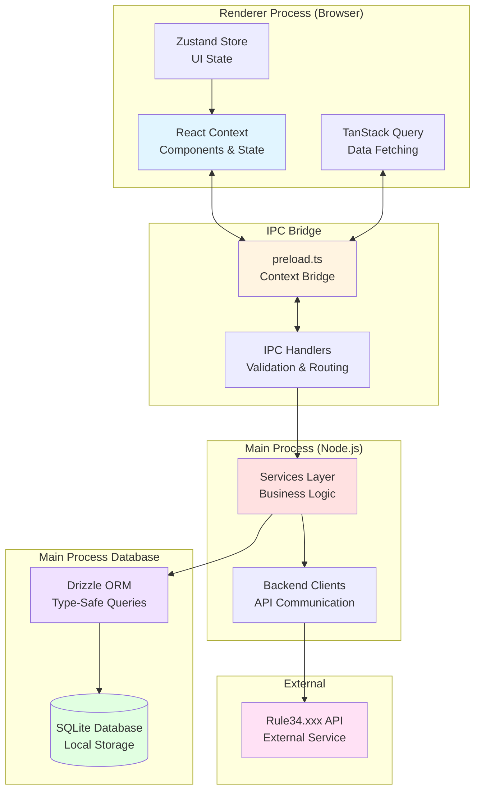

**What this diagram means:**

RuleDesk is built on Electron, which runs two separate processes:

1. **Renderer Process (Browser)** - This is where your React UI lives. It's a sandboxed browser environment that can't directly access Node.js APIs or the file system. It uses:
   - **React Context** for component state and data flow
   - **TanStack Query** to fetch data from the Main Process via IPC
   - **Zustand** for lightweight UI state (like which dialog is open)

2. **IPC Bridge** - This is the secure communication layer between Renderer and Main Process:
   - **Preload script** (`preload.ts`) exposes a safe API (`window.api`) to the Renderer
   - **IPC Handlers** in Main Process validate and route requests to appropriate services

3. **Main Process (Node.js)** - This is the secure backend that handles:
   - **Services Layer** - Business logic (sync, updates, file operations)
   - **Backend Clients** - Communication with external APIs (Rule34.xxx, Gelbooru)

4. **Database** - SQLite database accessed directly in Main Process:
   - **Drizzle ORM** provides type-safe queries
   - **SQLite** stores all data locally with WAL mode for performance

**Data Flow Example:**

When you click "Add Artist" in the UI:
1. React component calls `window.api.addArtist(data)`
2. Preload script forwards request to Main Process via IPC
3. IPC Handler validates input using Zod schemas
4. Service layer saves artist to database via Drizzle ORM
5. Response flows back through IPC to Renderer
6. React Query updates the UI with the new artist

This separation ensures security (Renderer can't access sensitive data) and performance (database operations run in Main Process).

## Architecture Concept

### 1. Dual-Module Interface

- **Library Mode:** Works with local SQLite database. Maximum performance, virtualization.
- **Browser Mode:** Isolated `<webview>` process. Allows users to browse the source (Source) natively. "Bridge" between the site and application is implemented through script injection (DOM scraping + IPC triggers).

### 2. Provider Abstraction (Future Proofing)

- In the future, `SyncService` will no longer be tightly coupled to Rule34.
- Introduces `BooruProvider` interface (methods: `getPosts`, `getArtistInfo`, `search`).
- Current implementation will become `Rule34Provider`. This allows adding new sources without rewriting the core database.

## High-Level Architecture

### System Overview

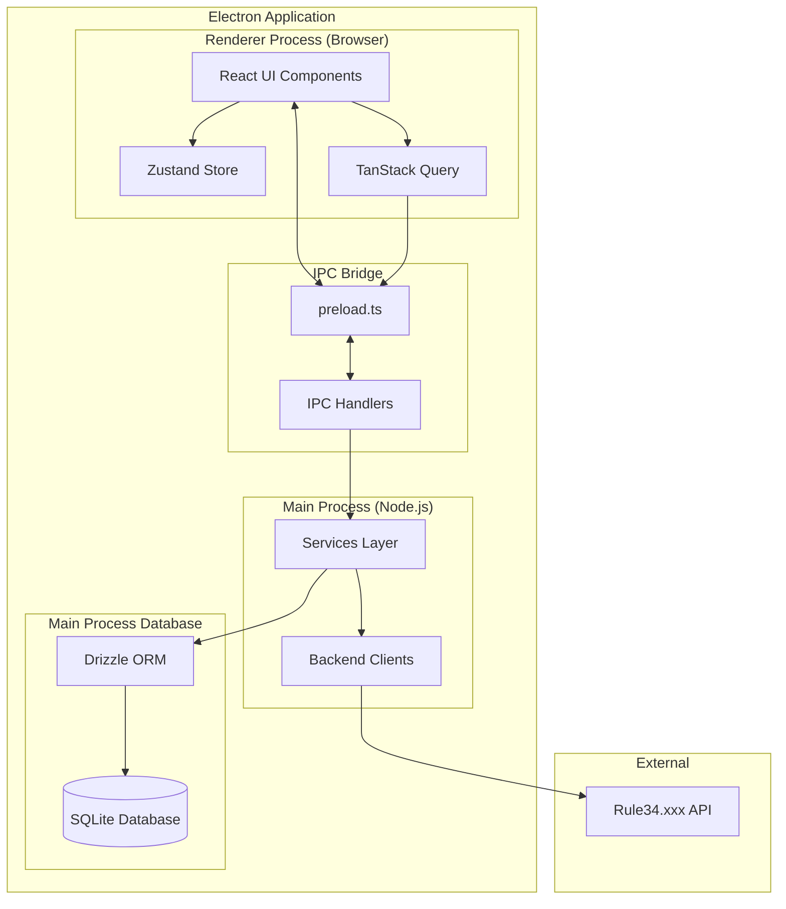

### Process Communication Flow

The diagram below shows how a user action flows through the system. **Read the explanation below** for a step-by-step walkthrough.

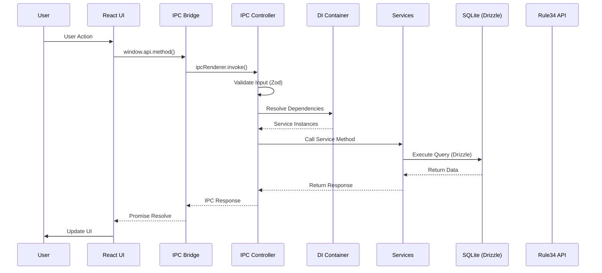

**Step-by-step explanation:**

Let's trace what happens when a user clicks "Add Artist":

1. **User Action** - User fills out the form and clicks "Add Artist" button

2. **React UI** - The React component calls `window.api.addArtist(artistData)`. This is a Promise that will resolve when the operation completes.

3. **IPC Bridge** - The preload script (`preload.ts`) receives the call and forwards it to the Main Process using `ipcRenderer.invoke('db:add-artist', artistData)`. This is Electron's secure IPC mechanism.

4. **IPC Controller** - In Main Process, the `ArtistsController` receives the request. Before doing anything, it:
   - **Validates the input** using a Zod schema (ensures `name` and `tag` are valid strings, `apiEndpoint` is a valid URL)
   - If validation fails, it throws an error that propagates back to Renderer

5. **Dependency Injection** - The controller needs services (like the database). It asks the DI Container to resolve dependencies. The container provides singleton instances of services.

6. **Service Layer** - The controller calls the appropriate service method (e.g., `dbService.addArtist()`). Services contain the business logic.

7. **Database** - The service uses Drizzle ORM to execute a type-safe query: `db.insert(artists).values(artistData)`. SQLite stores the data.

8. **Response Flow** - The data flows back:
   - Database returns the inserted artist (with generated ID)
   - Service returns the artist object
   - Controller returns it via IPC
   - Bridge resolves the Promise in Renderer
   - React Query updates the cache and UI

**Error Handling:**

If any step fails (validation error, database error, network error), the error is caught by `BaseController`, logged, and a user-friendly error message is sent back to Renderer. The UI can then display an error notification.

**Why this architecture?**

- **Security:** Renderer can't directly access database or file system
- **Type Safety:** TypeScript ensures type correctness at every step
- **Validation:** Zod schemas catch invalid data before it reaches services
- **Separation of Concerns:** Each layer has a single responsibility
- **Testability:** Each layer can be tested independently

### Database Architecture

The diagram below shows how database operations work. **Read the explanation** for a practical understanding.

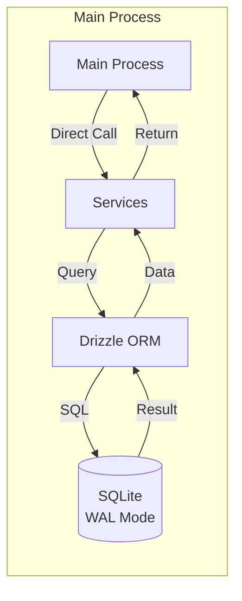

**What this means in practice:**

All database operations happen **directly in the Main Process** using synchronous access. Here's how it works:

1. **Services call Drizzle ORM** - When a service needs to query the database, it uses Drizzle's type-safe query builder:
   ```typescript
   const artists = await db.query.artists.findMany({
     orderBy: [asc(artists.name)],
   });
   ```

2. **Drizzle generates SQL** - Drizzle ORM converts the TypeScript query into optimized SQL:
   ```sql
   SELECT * FROM artists ORDER BY name ASC;
   ```

3. **SQLite executes** - The SQLite database (via `better-sqlite3`) executes the query **synchronously**. 

   **⚠️ CRITICAL: Synchronous Execution Blocks Main Process**
   
   `better-sqlite3` uses **synchronous** database operations. This means:
   - ✅ **Fast for simple queries** - No async overhead, direct function calls
   - ⚠️ **Blocks Main Process** - Heavy queries (e.g., full table scan without indexes) will **freeze the entire Electron application**
   - ⚠️ **UI Freezes** - If a query takes 2 seconds, the UI is frozen for 2 seconds
   
   **Why this is fast for typical queries:**
   - No network overhead (local database)
   - Synchronous execution (no async/await delays)
   - WAL mode allows concurrent reads while writes happen
   - **Proper indexes** make queries fast (milliseconds, not seconds)
   
   **⚠️ MANDATORY: Always Use Limits and Indexes**
   
   To prevent Main Process blocking:
   - **Always use `limit`** in SELECT queries (see [Database Limits](#-critical-always-use-limits-for-select-queries))
   - **Ensure proper indexes** exist for WHERE clauses
   - **Use pagination** for large datasets
   - **Avoid full table scans** - Always filter with indexed columns
   
   **Example of dangerous query:**
   
   ```typescript
   // ❌ DANGEROUS: No limit, no index on tags column
   // If database has 100k posts, this will freeze UI for seconds
   const posts = await db.query.posts.findMany({
     where: like(posts.tags, "%some_tag%"), // Full table scan!
     // Missing limit!
   });
   ```
   
   **Example of safe query:**
   
   ```typescript
   // ✅ SAFE: Uses indexed column and limit
   const posts = await db.query.posts.findMany({
     where: eq(posts.artistId, artistId), // Indexed column
     orderBy: [desc(posts.postId)],
     limit: 50, // ← Prevents large result sets
     offset: (page - 1) * 50,
   });
   ```

4. **Results flow back** - SQLite returns raw data → Drizzle maps it to TypeScript types → Service returns typed objects

**Why synchronous access?**

- **Performance:** No async overhead for local database operations (for simple queries)
- **Simplicity:** Direct function calls, no Promise chains
- **Type Safety:** Drizzle ensures TypeScript types match database schema
- **WAL Mode:** Write-Ahead Logging allows concurrent reads even during writes

**⚠️ WAL Mode is Mandatory**

SQLite must run in **WAL (Write-Ahead Logging) mode** to enable:
- **Concurrent reads** during writes
- **Better performance** for read-heavy workloads
- **Non-blocking reads** while writes are in progress

WAL mode is automatically enabled in `src/main/db/client.ts`:

```typescript
// WAL mode is enabled automatically
sqlite.pragma("journal_mode = WAL");
```

**Without WAL mode:**
- Writes block all reads
- Database locked errors during concurrent access
- Poor performance with multiple readers

**Example: Adding an Artist**

```typescript
// In ArtistsController
const db = container.resolve(DI_TOKENS.DB);

// Drizzle query (type-safe)
const result = await db
  .insert(artists)
  .values({
    name: "artist_name",
    tag: "tag_name",
    type: "tag",
    apiEndpoint: "https://api.rule34.xxx",
  })
  .returning();

// result[0] is typed as Artist
return result[0];
```

**⚠️ CRITICAL: Always Use Limits for SELECT Queries**

**Why limits are mandatory:**

When querying posts or other data that can grow large, **always use `limit`** in your Drizzle queries. Without limits, SQLite may return tens or hundreds of thousands of records, which will:

1. **Overwhelm the Renderer Process** - Trying to serialize and send 100k+ records via IPC will freeze the UI
2. **Exhaust Memory** - Large arrays consume significant memory in both Main and Renderer processes
3. **Block IPC Channel** - Large payloads block the IPC channel, preventing other operations

**Example: Querying Posts with Limit**

```typescript
// ✅ CORRECT: Always use limit
const posts = await db.query.posts.findMany({
  where: eq(posts.artistId, artistId),
  orderBy: [desc(posts.postId)],
  limit: 50, // ← CRITICAL: Always limit results
  offset: (page - 1) * 50,
});

// ❌ WRONG: No limit - will crash with large databases
const posts = await db.query.posts.findMany({
  where: eq(posts.artistId, artistId),
  // Missing limit - dangerous!
});
```

**Best Practices:**

- **Default limit:** 50 records per page (used in `getArtistPosts`)
- **Maximum limit:** Never exceed 1000 records in a single query
- **Pagination:** Use `offset` and `limit` for pagination
- **Infinite scroll:** Use `useInfiniteQuery` with page-based pagination
- **Count queries:** Use separate count queries (`getArtistPostsCount`) instead of `array.length`

**IPC Methods with Built-in Limits:**

- `getArtistPosts()` - Returns max 50 posts per page
- `getTrackedArtists()` - Should be limited if you expect 1000+ artists (currently no limit, but artists table is typically small)

**Key Points:**

- Database is **never** accessed from Renderer Process (security)
- All queries are **type-safe** via Drizzle ORM
- Operations are **synchronous** for performance
- WAL mode enables **concurrent reads** during writes
- **Always use `limit`** for SELECT queries to prevent Renderer process overload

## Process Separation

### Main Process (The Brain)

**Location:** `src/main/`

**Responsibilities:**

- Database operations (SQLite via Drizzle ORM)
- External API communication
- File system operations
- Background polling jobs
- Security-sensitive operations

**Key Components:**

1. **Database Client** (`src/main/db/client.ts`)

   - Direct synchronous access to SQLite via `better-sqlite3`
   - WAL (Write-Ahead Logging) mode enabled for concurrent reads
   - Manages database initialization and migrations
   - Provides `getDb()` and `getSqliteInstance()` functions
   - Automatic migration execution on startup

2. **Database Schema** (`src/main/db/schema.ts`)

   - Drizzle ORM schema definitions for all tables
   - Type-safe table definitions with proper indexes
   - Tables: `artists`, `posts`, `settings`
   - Type inference: `Artist`, `Post`, `Settings`, `NewArtist`, `NewPost`

3. **Sync Service** (`src/main/services/sync-service.ts`)

   - Handles Rule34.xxx API synchronization
   - Implements rate limiting and pagination
   - Maps API responses to database schema
   - Updates artist post counts
   - Provides repair/resync functionality for artists
   - Emits IPC events for sync progress tracking

4. **IPC Controllers** (`src/main/ipc/controllers/`)

   - Controller-based architecture with `BaseController` base class
   - Centralized error handling and input validation via Zod schemas
   - Type-safe dependency injection using DI Container
   - Each controller handles a specific domain of IPC operations

   **Controller Modules:**

   - `ArtistsController.ts` - Artist management operations
   - `PostsController.ts` - Post-related operations
   - `SettingsController.ts` - Settings management
   - `AuthController.ts` - Authentication and credential verification
   - `MaintenanceController.ts` - Database backup/restore operations
   - `ViewerController.ts` - Viewer-related operations
   - `FileController.ts` - File download and management
   - `SystemController.ts` - System-level operations (version, clipboard, etc.)

   **BaseController** (`src/main/core/ipc/BaseController.ts`):

   - Provides centralized error handling
   - Automatic input validation using Zod schemas
   - Type-safe handler registration
   - Prevents duplicate handler registration errors

   **⚠️ CRITICAL: Always Use Limits in Database Queries**

   When implementing IPC handlers that query the database, **always use `limit`** in your Drizzle queries. Without limits, SQLite may return tens or hundreds of thousands of records, which will:
   
   - **Overwhelm the Renderer Process** - Large arrays block IPC and freeze the UI
   - **Exhaust Memory** - Serializing 100k+ records consumes significant memory
   - **Block IPC Channel** - Large payloads prevent other operations
   
   **Example in Controller:**
   
   ```typescript
   // ✅ CORRECT: Always use limit
   export class PostsController extends BaseController {
     setup() {
       this.handle(
         IPC_CHANNELS.DB.GET_POSTS,
         GetPostsSchema,
         this.getPosts.bind(this)
       );
     }
   
     private async getPosts(
       _event: IpcMainInvokeEvent,
       data: GetPostsRequest
     ) {
       const db = container.resolve(DI_TOKENS.DB);
       const { artistId, page = 1 } = data;
       const limit = 50; // ← CRITICAL: Always limit results
       const offset = (page - 1) * limit;
   
       return await db.query.posts.findMany({
         where: eq(posts.artistId, artistId),
         orderBy: [desc(posts.postId)],
         limit, // ← Required
         offset,
       });
     }
   }
   ```
   
   **Default Limits:**
   - Posts: 50 per page (max 1000 per query)
   - Artists: No limit (typically small, but consider adding if > 1000 expected)
   - Settings: Single record (no limit needed)
   
   **Performance Guidelines:**
   - **Heavy queries** (full table scans, complex WHERE clauses) → Always use pagination
   - **Indexed queries** (WHERE on indexed columns) → Can handle larger limits (up to 1000)
   - **Unindexed queries** → Must use strict limits (50-100) to prevent blocking
   - **WAL mode** → Required for concurrent reads (enabled automatically)

5. **Dependency Injection Container** (`src/main/core/di/Container.ts`)

   - Type-safe DI container with Token-based registration
   - Singleton pattern for service management
   - Circular dependency detection
   - Services: Database, SyncService

6. **Booru Providers** (`src/main/providers/`)

   - Provider pattern abstraction for multi-booru support
   - `IBooruProvider` interface for standardized booru operations
   - Implementations: `Rule34Provider`, `GelbooruProvider`
   - Methods: `checkAuth`, `fetchPosts`, `searchTags`, `formatTag`

7. **Updater Service** (`src/main/services/updater-service.ts`)

   - Manages automatic update checking via `electron-updater`
   - Handles update download and installation
   - Emits IPC events for update status and progress
   - User-controlled download (manual download trigger)

8. **Secure Storage** (`src/main/services/secure-storage.ts`)

   - Encrypts and decrypts sensitive data using Electron's `safeStorage` API
   - Used for API credentials encryption at rest
   - Decryption only occurs in Main Process when needed
   - Methods: encrypt, decrypt

9. **Bridge** (`src/main/bridge.ts`)

   - Defines the IPC interface
   - Exposed via preload script
   - Type-safe communication contract
   - Event listener management for real-time updates

10. **Main Entry** (`src/main/main.ts`)
    - Application initialization
    - Window creation
    - Security configuration
    - Database worker thread initialization and migrations

### Renderer Process (The Face)

**Location:** `src/renderer/`

**Responsibilities:**

- User interface rendering
- User interactions
- State management
- Data presentation

**Key Components:**

1. **React Application** (`src/renderer/App.tsx`)

   - Main UI component with routing logic
   - Onboarding screen for API credentials
   - Sidebar navigation with multiple pages
   - Uses TanStack Query for data fetching
   - State management via React hooks and Zustand

2. **Components** (`src/renderer/components/`)

   - **Pages:**

     - **Updates.tsx** - Subscriptions feed (stub - placeholder component)
     - **Browse.tsx** - All posts view with filtering (stub - placeholder component)
     - **Favorites.tsx** - Favorites collection (stub - placeholder component)
     - **Tracked.tsx** - Artists and tags management (fully implemented)
     - **Settings.tsx** - Application configuration (fully implemented)
     - **ArtistDetails.tsx** - Artist gallery view (fully implemented)
     - **Onboarding.tsx** - API credentials input form (fully implemented)

   - **Layout:**

     - **AppLayout.tsx** - Main application layout with sidebar and global top bar
     - **Sidebar.tsx** - Persistent sidebar navigation with sync button and logout
     - **GlobalTopBar.tsx** - Unified top bar with search bar, sort dropdown, filters button, and view toggle (UI implemented, backend filtering pending)

   - **Gallery:**

     - **ArtistCard.tsx** - Artist card component
     - **ArtistGallery.tsx** - Grid view of posts for an artist
     - **PostCard.tsx** - Individual post card component

   - **Viewer:**

     - **ViewerDialog.tsx** - Full-screen viewer with download, favorites, keyboard shortcuts

   - **Dialogs:**

     - **AddArtistModal.tsx** - Modal for adding new artists
     - **DeleteArtistDialog.tsx** - Confirmation dialog for artist deletion
     - **UpdateNotification.tsx** - Update notification component

   - **Settings:**

     - **BackupControls.tsx** - Database backup and restore controls

   - **Inputs:**

     - **AsyncAutocomplete.tsx** - Autocomplete component with local and remote search

   - **ui/** - shadcn/ui components (Button, Dialog, Select, Input, etc.)

3. **IPC Client** (`window.api`)
   - Typed interface to Main process
   - All communication goes through this bridge
   - Methods: getSettings, saveSettings, getTrackedArtists, addArtist, deleteArtist, getArtistPosts, getArtistPostsCount, syncAll, openExternal, searchArtists, searchRemoteTags, markPostAsViewed, togglePostViewed, togglePostFavorite, downloadFile, openFileInFolder, createBackup, restoreBackup, writeToClipboard, verifyCredentials, logout, resetPostCache, repairArtist, checkForUpdates, quitAndInstall, startDownload

## Security Architecture

### Security Layers

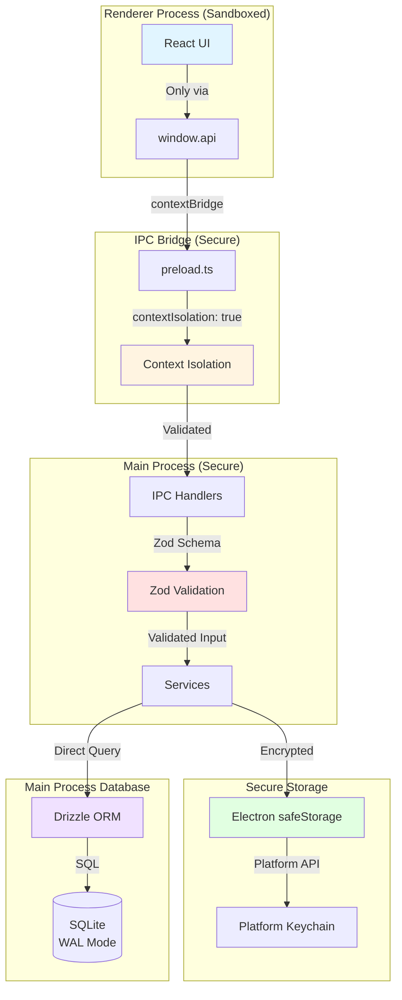

### Context Isolation

**Status:** ✅ Enabled

The Renderer process runs in a sandboxed environment with no direct Node.js access. This prevents Remote Code Execution (RCE) attacks.

**Configuration:**

```typescript
webPreferences: {
  contextIsolation: true,  // Required
  nodeIntegration: false,  // Never true
  sandbox: true,           // Additional security
  preload: path.join(__dirname, "../preload/bridge.cjs"),
}
```

### IPC Security

**⚠️ CRITICAL: API Key Security Contract**

The IPC layer enforces a strict security contract for API credentials:

- **`saveSettings(creds: { userId: string; apiKey: string })`** - Accepts API key in plaintext (unavoidable during onboarding)
- **`getSettings()`** - Returns `IpcSettings` with `hasApiKey: boolean`, **NEVER the actual API key**
- **API Key Lifecycle:**
  - Entered in Renderer → Sent to Main via IPC → Encrypted in Main → Stored encrypted
  - **Never decrypted for Renderer** - Only decrypted in Main Process when needed for API calls (e.g., in `SyncService`)

**Why this matters:** If `getSettings()` returned the API key, any compromised Renderer process (XSS, malicious extension, etc.) could steal credentials. The boolean flag `hasApiKey` allows the UI to check if credentials are configured without exposing the actual key.

1. **Type Safety:** All IPC communication is strictly typed
2. **Input Validation:** All inputs are validated in Main process using Zod schemas
3. **Error Handling:** Errors are properly handled without exposing sensitive data
4. **No Direct Node Access:** Renderer cannot access Node.js APIs directly
5. **Secure Credentials:** API keys encrypted at rest, **NEVER returned to Renderer** (only `hasApiKey` boolean flag)
6. **Worker Thread Isolation:** Database operations isolated in worker thread

### Credential Security Flow

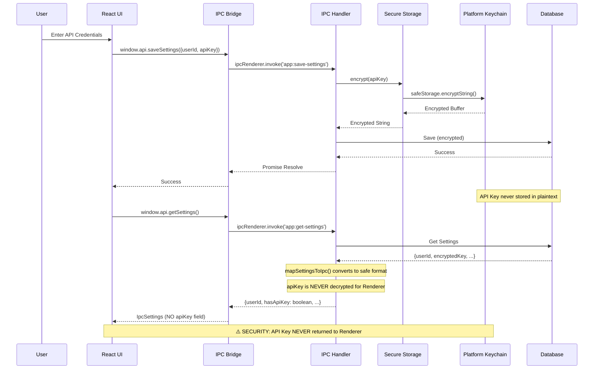

**Human-Readable Explanation:**

1. **Saving Credentials (Onboarding):**
   - User enters API key in Renderer (plaintext, unavoidable during input)
   - `saveSettings()` sends credentials via IPC to Main Process
   - Main Process encrypts API key using Electron's `safeStorage` API (platform keychain)
   - Encrypted key is stored in database
   - Renderer receives success confirmation (no sensitive data returned)

2. **Retrieving Settings (Security Contract):**
   - `getSettings()` is called from Renderer
   - Main Process retrieves encrypted key from database
   - **⚠️ CRITICAL SECURITY RULE: API Key is NEVER decrypted for Renderer**
   - `mapSettingsToIpc()` function converts database record to safe IPC format:
     - ✅ Returns: `userId` (safe, non-sensitive)
     - ✅ Returns: `hasApiKey: boolean` (flag indicating if key exists, safe)
     - ✅ Returns: Other settings flags (safe mode, adult confirmation, etc.)
     - ❌ **NEVER returns:** `apiKey` (encrypted or decrypted)
   - Renderer receives `IpcSettings` type which has **no `apiKey` field**
   - API key is only decrypted in Main Process when needed for API calls (e.g., in `SyncService`)

**Security Contract:**

- **Input (saveSettings):** API key sent from Renderer in plaintext (unavoidable during onboarding)
- **Storage:** API key encrypted using platform keychain, stored encrypted in database
- **Output (getSettings):** Renderer receives `IpcSettings` with `hasApiKey: boolean`, **NEVER the actual key**
- **Internal Use:** API key is only decrypted in Main Process for API calls, never exposed to Renderer

**Why this matters:**

If `getSettings()` returned the API key (even decrypted), any compromised Renderer process (XSS, malicious extension, etc.) could steal credentials. By returning only a boolean flag, the Renderer can check if credentials are configured without ever seeing the actual key.

## Data Flow

### Reading Data Flow

The diagram below shows how data is read from the database and displayed in the UI. **Read the explanation** to understand the complete flow.

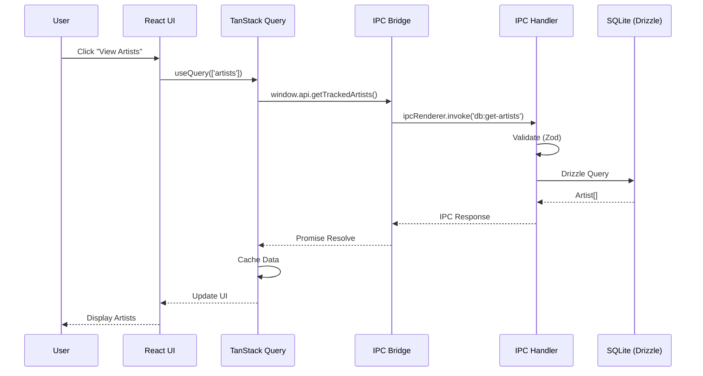

**Real-world scenario: User opens the Tracked page**

1. **User clicks "Tracked"** in the sidebar navigation

2. **React component renders** - The `Tracked.tsx` component mounts and calls:
   ```typescript
   const { data: artists } = useQuery({
     queryKey: ["artists"],
     queryFn: () => window.api.getTrackedArtists(),
   });
   ```

3. **React Query checks cache** - React Query first checks if it has cached data for `["artists"]`. If yes, it returns cached data immediately (no network call).

4. **IPC call** - If cache is empty or stale, React Query calls `window.api.getTrackedArtists()`, which goes through the IPC bridge to Main Process.

5. **Validation** - The IPC handler validates the request (though `getTrackedArtists` has no parameters, validation still runs for consistency).

6. **Database query** - The handler executes a Drizzle query:
   ```typescript
   const artists = await db.query.artists.findMany({
     orderBy: [asc(artists.name)],
   });
   ```

7. **Response** - The array of artists flows back:
   - Database → IPC Handler → IPC Bridge → React Query → Component

8. **Caching** - React Query automatically caches the result. If the user navigates away and comes back, the data is served from cache (instant load).

9. **UI update** - React re-renders with the artists data, displaying them in a grid.

**Why React Query?**

- **Automatic caching** - Data is cached and reused
- **Loading states** - `isLoading` and `error` states are handled automatically
- **Background refetching** - Can refetch in background when data might be stale
- **Optimistic updates** - Can update UI before server confirms (for mutations)

**Performance benefits:**

- First load: ~50-100ms (database query + IPC overhead)
- Subsequent loads: ~0ms (served from React Query cache)
- Background refetch: Happens automatically without blocking UI

### Writing Data Flow

The diagram below shows how data is written to the database. **Read the explanation** for a complete understanding of the flow, including error handling.

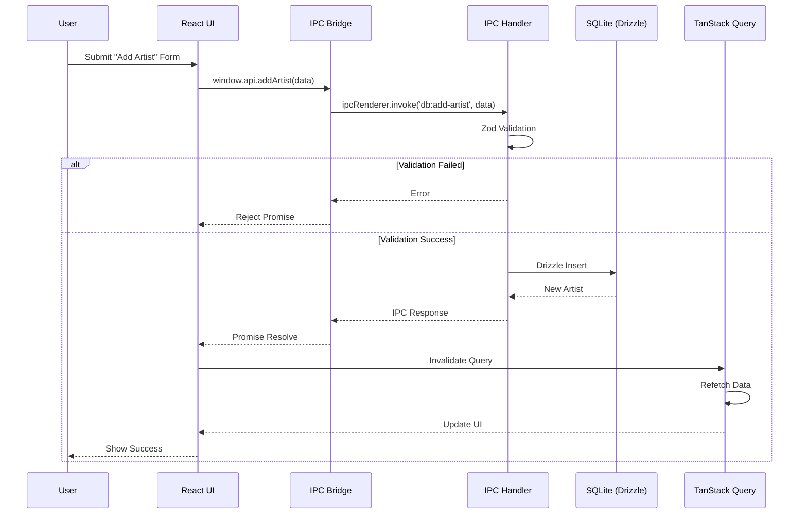

**Real-world scenario: User adds a new artist**

1. **User fills form** - User enters artist name "example_artist", tag "tag_name", selects type "tag", and clicks "Add".

2. **Form submission** - React component calls:
   ```typescript
   const handleAddArtist = async (name, tag, type) => {
     await window.api.addArtist({ name, tag, type, provider: "rule34" });
   };
   ```

3. **IPC call** - Request goes through IPC bridge to Main Process.

4. **Validation** - The `ArtistsController` validates input using Zod schema:
   ```typescript
   // Zod schema checks:
   // - name is non-empty string
   // - tag is non-empty string
   // - apiEndpoint is valid URL
   ```

5. **Two paths:**

   **Path A: Validation Fails**
   - Zod throws validation error
   - `BaseController` catches it and returns user-friendly error
   - Promise rejects in Renderer
   - Component shows error message to user
   - **No database write happens**

   **Path B: Validation Succeeds**
   - Controller calls service: `dbService.addArtist(validatedData)`
   - Service executes Drizzle insert:
     ```typescript
     await db.insert(artists).values({
       name: "example_artist",
       tag: "tag_name",
       // ... other fields
     }).returning();
     ```
   - Database returns the new artist with generated ID
   - Response flows back to Renderer

6. **Cache invalidation** - On success, component invalidates React Query cache:
   ```typescript
   queryClient.invalidateQueries({ queryKey: ["artists"] });
   ```

7. **Automatic refetch** - React Query automatically refetches `["artists"]` because cache was invalidated.

8. **UI updates** - New artist appears in the list automatically (no manual state update needed).

**Why this pattern?**

- **Validation first** - Invalid data never reaches database
- **Type safety** - TypeScript + Zod ensure data correctness
- **Automatic UI sync** - Cache invalidation ensures UI always shows latest data
- **Error handling** - User-friendly errors, not technical stack traces

**Error handling example:**

```typescript
try {
  await window.api.addArtist(data);
  // Success - cache invalidation happens automatically
} catch (error) {
  // Error could be:
  // - Validation error: "Username is required"
  // - Database error: "Tag already exists"
  // - Network error: "Failed to connect"
  
  log.error("Failed to add artist:", error);
  // Show error toast to user
}
```

### Synchronization Flow

The diagram below shows how background synchronization works. **Read the explanation** to understand the complete async flow with progress updates.

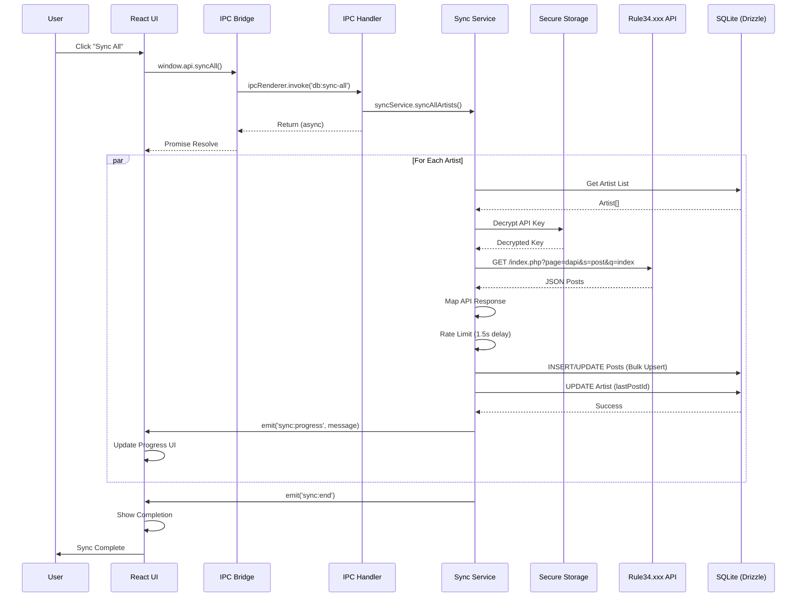

**Real-world scenario: User clicks "Sync All" button**

1. **User action** - User clicks "Sync All" button in the sidebar or Tracked page.

2. **IPC call** - Component calls `window.api.syncAll()`. This method returns **immediately** (doesn't wait for sync to complete) because sync runs in the background.

3. **Sync service starts** - The `SyncService` begins processing artists asynchronously. The UI shows "Syncing..." indicator.

4. **For each artist, the service:**

   a. **Gets artist data** from database:
      ```typescript
      const artists = await db.query.artists.findMany();
      ```

   b. **Decrypts API key** - The encrypted API key is decrypted using Electron's `safeStorage` API. This happens in Main Process only (secure).

   c. **Fetches posts from API** - Makes HTTP request to Rule34.xxx API:
      ```
      GET https://api.rule34.xxx/index.php?page=dapi&s=post&q=index&tags=tag_name&limit=1000
      ```

   d. **Maps API response** - Converts API JSON format to database schema format.

   e. **Rate limiting** - Waits 1.5 seconds before processing next artist (prevents API abuse).

   f. **Bulk upsert** - Saves posts to database using `ON CONFLICT` handling (updates existing, inserts new):
      ```typescript
      await db.insert(posts).values(newPosts)
        .onConflictDoUpdate({
          target: [posts.artistId, posts.postId],
          set: { /* update fields */ }
        });
      ```

   g. **Updates artist** - Updates artist's `lastPostId` and `newPostsCount`.

   h. **Progress event** - Emits IPC event: `emit('sync:progress', 'Syncing artist_name...')`

5. **UI updates in real-time** - React component listens to progress events:
   ```typescript
   useEffect(() => {
     const unsubscribe = window.api.onSyncProgress((message) => {
       setSyncMessage(message); // Update progress text
     });
     return () => unsubscribe();
   }, []);
   ```

6. **Completion** - When all artists are processed, service emits `sync:end` event. UI shows "Sync complete" message.

**Why async with events?**

- **Non-blocking** - UI remains responsive during sync
- **Progress feedback** - User sees real-time progress
- **Error handling** - Individual artist failures don't stop entire sync
- **Resumable** - Can stop and resume sync later

**Example: Handling sync events**

```typescript
// In component
const [syncMessage, setSyncMessage] = useState<string | null>(null);

useEffect(() => {
  const unsubscribeStart = window.api.onSyncStart(() => {
    setSyncMessage("Starting sync...");
  });

  const unsubscribeProgress = window.api.onSyncProgress((message) => {
    setSyncMessage(message); // "Syncing artist_name..."
  });

  const unsubscribeEnd = window.api.onSyncEnd(() => {
    setSyncMessage("Sync complete!");
    // Refresh artist list to show new posts count
    queryClient.invalidateQueries({ queryKey: ["artists"] });
  });

  const unsubscribeError = window.api.onSyncError((error) => {
    setSyncMessage(`Sync error: ${error}`);
  });

  return () => {
    unsubscribeStart();
    unsubscribeProgress();
    unsubscribeEnd();
    unsubscribeError();
  };
}, []);
```

**Performance considerations:**

- **Rate limiting** - 1.5s delay between artists prevents API bans
- **Bulk operations** - Posts are inserted in batches (200 per batch) for efficiency
- **Incremental sync** - Only fetches posts newer than `lastPostId` (not all posts)
- **Background execution** - Sync doesn't block UI or other operations

## Database Architecture

### Schema

The database uses SQLite with the following tables:

1. **artists** - Tracked artists/users (by tag or uploader)
2. **posts** - Cached post metadata with tags, ratings, and URLs
3. **settings** - API credentials (User ID and encrypted API Key), safe mode, adult confirmation

See [Database Documentation](./database.md) for detailed schema information.

### ORM Layer

**Drizzle ORM** provides:

- Type-safe queries
- Schema migrations
- Type inference
- SQL generation

### Database Architecture

**Database Client** (`src/main/db/client.ts`):

- Direct synchronous access to SQLite via `better-sqlite3`
- WAL (Write-Ahead Logging) mode enabled for concurrent reads
- Automatic migration execution on initialization
- Type-safe queries via Drizzle ORM
- Database connection managed in Main Process

## Component Architecture

### React Component Hierarchy

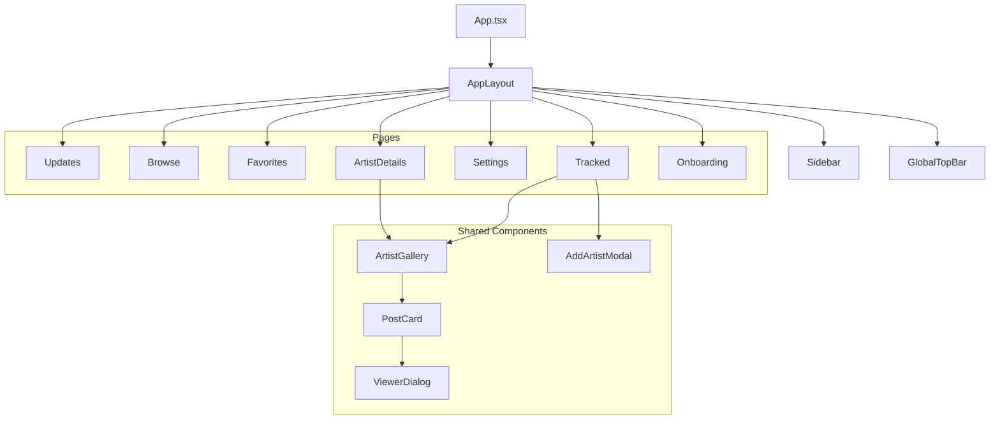

## External API Integration

### Provider Pattern Architecture

External API calls are abstracted through the **Provider Pattern** (`src/main/providers/`):

1. **IBooruProvider Interface:** Standardized interface for all booru sources

   - `checkAuth()` - Validate credentials
   - `fetchPosts()` - Fetch posts by tags
   - `searchTags()` - Tag autocomplete
   - `formatTag()` - Format tags based on artist type
   - `getDefaultApiEndpoint()` - Get API endpoint URL

2. **Provider Implementations:**

   - `Rule34Provider` - Rule34.xxx API implementation
   - `GelbooruProvider` - Gelbooru API implementation

3. **SyncService Integration:**
   - Uses provider pattern to fetch posts
   - **Rate Limiting:** 1.5 second delay between artists, 0.5 second between pages
   - **Pagination:** Handles booru-specific pagination (up to 1000 posts per page)
   - **Incremental Sync:** Only fetches posts newer than `lastPostId`
   - **Error Handling:** Graceful handling of API errors and network failures
   - **Authentication:** Uses User ID and API Key from settings table

### Download Flow

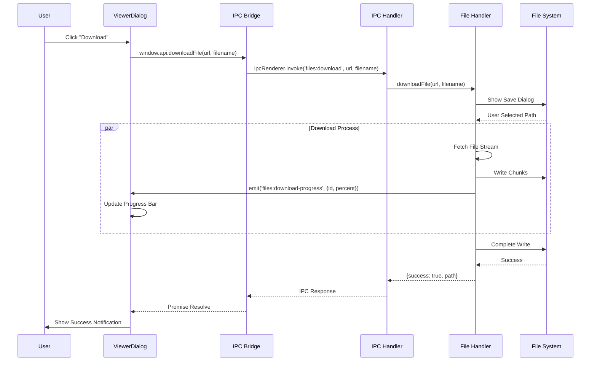

## Build Architecture

### Build Tool: Vite

The project uses **electron-vite** for building both Main and Renderer processes.

**Configuration:** `electron.vite.config.ts`

**Build Targets:**

1. **Main:** Node.js bundle (`out/main/`)
2. **Preload:** CommonJS bridge (`out/preload/`)
3. **Renderer:** React application (`out/renderer/`)

### Development Mode

- Hot Module Replacement (HMR) for Renderer ✅
- Fast rebuilds with Vite
- DevTools enabled in development
- Main Process: Manual restart required (no auto-restart) ⚠️

## State Management

### Renderer State

**TanStack Query (React Query):**

- Server state (data from Main process)
- Caching and synchronization
- Loading and error states

**Zustand:**

- Client-side UI state
- Minimal boilerplate
- KISS principle compliance

**⚠️ CRITICAL: Use Selectors to Prevent Unnecessary Re-renders**

Zustand stores can cause performance issues if not used correctly. **Always use selectors** to subscribe only to the specific state you need, not the entire store.

**Why selectors matter:**

When you subscribe to the entire store, the component re-renders on **any** state change, even if it doesn't use that part of the state. This can cause:
- Unnecessary re-renders of large component trees
- Performance degradation with complex UIs
- UI freezing when state updates frequently

**❌ WRONG: Subscribing to entire store**

```typescript
// ❌ BAD: Component re-renders on ANY state change
const store = useViewerStore(); // Gets entire store
const isOpen = store.isOpen; // But only uses isOpen

// If controlsVisible changes, this component still re-renders!
```

**✅ CORRECT: Using selectors**

```typescript
// ✅ GOOD: Component only re-renders when isOpen changes
const isOpen = useViewerStore((state) => state.isOpen);

// Component ignores other state changes (controlsVisible, queue, etc.)
```

**✅ CORRECT: Using multiple selectors with useShallow**

When you need multiple values, use `useShallow` to prevent re-renders when unrelated state changes:

```typescript
import { useShallow } from "zustand/react/shallow";

// ✅ GOOD: Only re-renders when isOpen or close function changes
const { isOpen, close } = useViewerStore(
  useShallow((state) => ({
    isOpen: state.isOpen,
    close: state.close,
  }))
);

// ✅ GOOD: Split into logical groups for better performance
const { currentPostId, queue } = useViewerStore(
  useShallow((state) => ({
    currentPostId: state.currentPostId,
    queue: state.queue,
  }))
);

const { currentIndex, next, prev } = useViewerStore(
  useShallow((state) => ({
    currentIndex: state.currentIndex,
    next: state.next,
    prev: state.prev,
  }))
);
```

**Real-world example from ViewerDialog:**

```typescript
// In ViewerDialog.tsx - split selectors into logical groups
export const ViewerDialog = () => {
  // Group 1: Open/close state
  const { isOpen, close } = useViewerStore(
    useShallow((state) => ({
      isOpen: state.isOpen,
      close: state.close,
    }))
  );

  // Group 2: Current post data
  const { currentPostId, queue } = useViewerStore(
    useShallow((state) => ({
      currentPostId: state.currentPostId,
      queue: state.queue,
    }))
  );

  // Group 3: Navigation
  const { currentIndex, next, prev } = useViewerStore(
    useShallow((state) => ({
      currentIndex: state.currentIndex,
      next: state.next,
      prev: state.prev,
    }))
  );

  // Each group only re-renders when its specific values change
  // If controlsVisible changes, none of these groups re-render
};
```

**Best Practices:**

1. **Single value:** Use simple selector `useStore((s) => s.value)`
2. **Multiple values:** Use `useShallow` with object selector
3. **Split selectors:** Group related values together
4. **Avoid full store:** Never do `useStore()` without selector
5. **Memoize selectors:** For complex selectors, use `useMemo` or extract to function

**Performance Impact:**

- **Without selectors:** Component re-renders on every store update (even unrelated)
- **With selectors:** Component re-renders only when selected values change
- **With useShallow:** Prevents re-renders when object reference changes but values are the same

**Example: Simple single-value selector**

```typescript
// In AppLayout.tsx - only needs isOpen
const isViewerOpen = useViewerStore((state) => state.isOpen);

// Component only re-renders when isOpen changes
// Ignores changes to controlsVisible, queue, currentIndex, etc.
```

### Main Process State

- Database is the source of truth
- Services maintain minimal in-memory state
- Background jobs use timers, not persistent state

## File Structure

```
src/
├── main/                          # Electron Main Process
│   ├── db/                        # Database layer
│   │   ├── repositories/         # Repository pattern implementations
│   │   │   ├── artists.repo.ts    # Artists repository
│   │   │   └── posts.repo.ts       # Posts repository
│   │   ├── db-service.ts          # Legacy database service (deprecated)
│   │   ├── db-worker.ts           # Database worker thread implementation
│   │   ├── db-worker-client.ts    # Worker client interface
│   │   ├── migrate.ts             # Migration runner
│   │   ├── schema.ts              # Drizzle ORM schema definitions
│   │   └── worker-types.ts        # Worker thread type definitions
│   ├── ipc/                       # IPC (Inter-Process Communication)
│   │   ├── controllers/           # IPC Controllers (domain-based)
│   │   │   ├── ArtistsController.ts
│   │   │   ├── PostsController.ts
│   │   │   ├── SettingsController.ts
│   │   │   ├── AuthController.ts
│   │   │   ├── MaintenanceController.ts
│   │   │   ├── ViewerController.ts
│   │   │   ├── FileController.ts
│   │   │   └── SystemController.ts
│   │   ├── channels.ts            # IPC channel constants
│   │   └── index.ts               # IPC setup and registration
│   ├── core/                      # Core infrastructure
│   │   ├── di/                    # Dependency Injection
│   │   │   ├── Container.ts       # DI Container (Singleton)
│   │   │   └── Token.ts           # Type-safe DI tokens
│   │   └── ipc/                    # IPC infrastructure
│   │       └── BaseController.ts   # Base controller with error handling
│   ├── providers/                 # Booru provider implementations
│   │   ├── rule34-provider.ts     # Rule34.xxx provider
│   │   ├── gelbooru-provider.ts   # Gelbooru provider
│   │   ├── types.ts               # Provider interfaces
│   │   └── index.ts               # Provider registry
│   ├── services/                  # Background services
│   │   ├── secure-storage.ts       # Secure storage for API credentials
│   │   ├── sync-service.ts        # Rule34.xxx API synchronization
│   │   └── updater-service.ts     # Auto-updater service
│   ├── lib/                       # Utilities
│   │   └── logger.ts             # Logging utility
│   ├── bridge.ts                  # IPC bridge interface definition
│   ├── main.d.ts                  # Main process type definitions
│   └── main.ts                    # Main process entry point
│
├── renderer/                      # Electron Renderer Process
│   ├── components/                # React components
│   │   ├── dialogs/               # Dialog components
│   │   │   ├── AddArtistModal.tsx
│   │   │   ├── DeleteArtistDialog.tsx
│   │   │   ├── Onboarding.tsx
│   │   │   └── UpdateNotification.tsx
│   │   ├── gallery/               # Gallery components
│   │   │   ├── ArtistCard.tsx
│   │   │   ├── ArtistGallery.tsx
│   │   │   └── PostCard.tsx
│   │   ├── inputs/                # Input components
│   │   │   └── AsyncAutocomplete.tsx
│   │   ├── layout/                 # Layout components
│   │   │   ├── AppLayout.tsx
│   │   │   ├── GlobalTopBar.tsx
│   │   │   └── Sidebar.tsx
│   │   ├── pages/                  # Page components
│   │   │   ├── ArtistDetails.tsx
│   │   │   ├── Browse.tsx
│   │   │   ├── Favorites.tsx
│   │   │   ├── Onboarding.tsx
│   │   │   ├── Settings.tsx
│   │   │   ├── Tracked.tsx
│   │   │   └── Updates.tsx
│   │   ├── settings/               # Settings components
│   │   │   └── BackupControls.tsx
│   │   ├── ui/                     # shadcn/ui components
│   │   │   ├── alert.tsx
│   │   │   ├── button.tsx
│   │   │   ├── card.tsx
│   │   │   ├── dialog.tsx
│   │   │   ├── dropdown-menu.tsx
│   │   │   ├── input.tsx
│   │   │   ├── label.tsx
│   │   │   ├── select.tsx
│   │   │   └── separator.tsx
│   │   └── viewer/                 # Viewer components
│   │       └── ViewerDialog.tsx
│   ├── i18n/                       # Internationalization
│   │   └── index.ts
│   ├── lib/                        # Utilities
│   │   ├── hooks/                  # Custom React hooks
│   │   │   └── useDebounce.ts
│   │   ├── artist-utils.ts
│   │   ├── tag-utils.ts
│   │   └── utils.ts
│   ├── locales/                    # Translation files
│   │   └── en/
│   │       └── translation.json
│   ├── schemas/                    # Form validation schemas
│   │   └── form-schemas.ts
│   ├── store/                       # State management (Zustand)
│   │   └── viewerStore.ts
│   ├── App.tsx                     # Main React component
│   ├── index.css                   # Global styles
│   ├── index.html                  # HTML template
│   ├── main.tsx                    # Renderer entry point
│   └── renderer.d.ts               # Renderer type definitions
│
└── preload/                        # Preload scripts (generated by electron-vite)
    └── bridge.cjs                  # Compiled preload script

Root:
├── drizzle/                        # Database migrations
│   ├── meta/                       # Migration metadata
│   │   ├── _journal.json
│   │   └── *_snapshot.json
│   └── *.sql                       # SQL migration files
├── docs/                           # Documentation
│   ├── api.md
│   ├── architecture.md
│   ├── contributing.md
│   ├── database.md
│   ├── development.md
│   ├── roadmap.md
│   └── rule34-api-reference.md
├── scripts/                        # Build and utility scripts
│   ├── ai_reviewer.py
│   └── system_prompt.md
├── .github/                        # GitHub workflows
│   └── workflows/
│       ├── ai-review.yml
│       └── ci.yml
├── electron.vite.config.ts         # Electron-Vite configuration
├── drizzle.config.ts               # Drizzle ORM configuration
├── tailwind.config.js              # Tailwind CSS configuration
├── tsconfig.json                   # TypeScript configuration
└── package.json                    # Project dependencies and scripts
```

## Design Principles

### SOLID Principles

- **Single Responsibility:** Each module has one clear purpose
- **Open/Closed:** Extend via composition, not modification
- **Dependency Inversion:** Services depend on abstractions

### KISS & YAGNI

- **KISS:** Simple, readable code over clever solutions
- **YAGNI:** Implement only what's needed now

### DRY

- Shared types between Main and Renderer
- Reusable components and utilities
- No code duplication

## Current Status

### ✅ Completed Features

**Infrastructure & Build:**

- **Electron Version:** 39.2.7 with latest security features
- **Build System:** electron-vite for optimal build performance
- **Database Architecture:** Direct synchronous access via `better-sqlite3` with WAL mode for concurrent reads
- **Portable Mode:** Automatic detection and support for portable executables

**Database & Schema:**

- **Schema:** Three main tables (`artists`, `posts`, `settings`) with proper relationships and indexes
- **Migrations:** Fully functional migration system using `drizzle-kit`
- **Indexes:** Optimized indexes on `artistId`, `isViewed`, `publishedAt`, `isFavorited`, `lastChecked`, `createdAt`
- **Provider Support:** Multi-booru support with `provider` field (rule34, gelbooru)
- **Artist Types:** Support for `tag`, `uploader`, and `query` types

**Security & Reliability:**

- **Secure Storage:** API credentials encrypted using Electron's `safeStorage` API (Windows Credential Manager, macOS Keychain, Linux libsecret)
- **Database Backup/Restore:** Manual backup and restore functionality with integrity checks
- **Context Isolation:** Enabled globally with sandbox mode
- **CSP:** Strict Content Security Policy in production, relaxed for development (HMR support)
- **IPC Architecture:** Controller-based IPC handlers with `BaseController` for centralized error handling

**Data Integrity & Sync:**

- **Tag Normalization:** Automatic stripping of metadata from tag names (e.g., "tag (123)" → "tag")
- **Sync Service:** Handles `ON CONFLICT` correctly with proper upsert logic
- **Provider Pattern:** Multi-booru support via `IBooruProvider` interface
- **Rate Limiting:** Intelligent rate limiting with configurable delays

**UI/UX:**

- **Progressive Image Loading:** 3-layer system (Preview → Sample → Original)
- **Virtualization:** `react-virtuoso` for efficient large list rendering
- **Search Functionality:** Local artist search and remote tag search (multi-provider)
- **Sidebar Navigation:** Persistent sidebar with main navigation sections
- **Global Top Bar:** Unified top bar with search, filters, sort controls (UI implemented, backend pending)
- **Full-Screen Viewer:** Immersive viewer with keyboard shortcuts, download, favorites
- **Download Manager:** Download full-resolution files with progress tracking
- **Favorites System:** Complete implementation with database field and toggle functionality

## Implemented Features

1. ✅ **Sync Service:** Dedicated service for multi-booru API synchronization with progress tracking
2. ✅ **Settings Management:** Secure storage of API credentials with encryption using Electron's `safeStorage` API
3. ✅ **Artist Tracking:** Support for tag-based tracking with autocomplete search and tag normalization (multi-provider)
4. ✅ **Post Gallery:** Grid view of cached posts with preview images and pagination
5. ✅ **Progressive Image Loading:** 3-layer loading system (Preview → Sample → Original) for instant viewing
6. ✅ **Artist Repair:** Resync functionality to update previews and fix sync issues
7. ✅ **Auto-Updater:** Automatic update checking and installation via electron-updater
8. ✅ **Event System:** Real-time IPC events for sync progress, update status, and download progress
9. ✅ **Database Architecture:** Direct synchronous access via `better-sqlite3` with WAL mode for concurrent reads
10. ✅ **Secure Storage:** API credentials encrypted at rest using Electron's `safeStorage` API
11. ✅ **Backup/Restore:** Manual database backup and restore functionality with integrity checks and timestamped backups
12. ✅ **Search Functionality:** Local artist search and remote tag search via booru autocomplete API (multi-provider)
13. ✅ **Mark as Viewed:** Ability to mark posts as viewed for better organization
14. ✅ **Favorites System:** Mark and manage favorite posts with toggle functionality
15. ✅ **Download Manager:** Download full-resolution files with progress tracking
16. ✅ **Full-Screen Viewer:** Immersive viewer with keyboard shortcuts, download, favorites, and tag management
17. ✅ **Sidebar Navigation:** Persistent sidebar with main navigation sections (Updates, Browse, Favorites, Tracked, Settings)
18. ✅ **Global Top Bar:** Unified top bar with search, filters, sort controls (UI implemented, backend filtering pending)
19. ✅ **Credential Verification:** Verify API credentials before saving and during sync operations
20. ✅ **Clipboard Integration:** Copy metadata and debug information to clipboard
21. ✅ **Logout Functionality:** Clear stored credentials and return to onboarding
22. ✅ **Portable Mode:** Automatic detection and support for portable executables
23. ✅ **IPC Controllers:** Controller-based architecture with `BaseController` and dependency injection
24. ✅ **Provider Pattern:** Multi-booru support via `IBooruProvider` interface (Rule34, Gelbooru)

## Active Roadmap (Priority Tasks)

### A. Filters (Advanced Search) 🚧 UI Ready, Backend Pending

**Goal:** Allow users to refine the gallery view.

- ✅ **Global Top Bar UI:** Search bar, filter button, sort dropdown, and view toggle implemented in `GlobalTopBar.tsx`
- ⏳ Filter by **Rating** (Safe, Questionable, Explicit) - UI ready, backend filtering pending
- ⏳ Filter by **Media Type** (Image vs Video) - UI ready, backend filtering pending
- ⏳ Filter by **Tags** (Local search within downloaded posts) - UI ready, backend filtering pending
- ⏳ Sort by: Date Added (New/Old), Posted Date - UI ready, backend sorting pending

**Status:** Global Top Bar UI is fully implemented and visible in the application. Backend filtering and sorting logic needs to be connected to the UI controls via IPC handlers and integrated with `ArtistGallery` component.

### B. Download Manager ✅ Implemented (Core Features)

**Goal:** Allow saving full-resolution files to the local file system.

- ✅ "Download Original" button on post view (implemented in ViewerDialog)
- ✅ **Download Handler:** Downloads run in Main Process with progress tracking
- ✅ **Progress Events:** Real-time download progress via IPC events (`onDownloadProgress`)
- ✅ **File Management:** Open downloaded file in folder (`openFileInFolder`)
- ⏳ "Download All" for current filter/artist (planned)
- ⏳ **Settings:** Allow choosing a default download directory (planned)

**Status:** ✅ Core download functionality implemented. Individual file downloads work with progress tracking. Batch download and default directory settings are planned for future releases.

### C. Playlists / Collections ⏳ Not Started

**Goal:** Create curated collections of posts independent of Artists/Trackers.

**Phase 1: MVP**

- New table `playlists` (`id`, `name`, `created_at`)
- New table `playlist_posts` (`playlist_id`, `post_id`, `added_at`)
- "⭐ Add to playlist" button on Post Card
- New Page/Tab: "Playlists"
- View Playlist: Grid view with filtering and sorting

**Status:** No playlist tables in schema, no playlist-related code implemented.

### 🛡️ Security & Reliability (Hardening)

See [Roadmap](./roadmap.md#-security--reliability-hardening) for detailed security improvements:

- ✅ **Database Architecture** - ✅ **COMPLETED:** Direct synchronous access via `better-sqlite3` with WAL mode for concurrent reads
- ✅ **Encrypt / Secure Storage for API Credentials** - ✅ **COMPLETED:** Using Electron's `safeStorage` API for encryption
- ✅ **Database Backup / Restore System** - ✅ **COMPLETED:** Manual backup and restore functionality implemented with integrity checks

### Future Considerations

1. **Tag Subscriptions:** Subscribe to tag combinations (schema ready)
2. **Content Script Injection:** DOM enhancements for external sites
3. **Statistics Dashboard:** Analytics on tracked artists and posts
4. **Dual-Module System:** Library mode (local database) and Browser mode (embedded webview)
5. **Multi-Booru Support:** Provider pattern abstraction for multiple booru sources

### Scalability

- Database can handle thousands of artists and posts
- Polling can be optimized with batching
- UI can be virtualized for large lists
- Provider abstraction allows adding new booru sources without core changes

## Performance Considerations

1. **Database Indexing:** Proper indexes on frequently queried fields
2. **Query Optimization:** Efficient Drizzle queries
3. **React Optimization:** Memoization where needed
4. **Lazy Loading:** Code splitting for large components

## Error Handling Strategy

1. **Fail Fast:** Validate inputs at boundaries
2. **Descriptive Errors:** Clear error messages
3. **Error Logging:** All errors logged via `electron-log`
4. **User Feedback:** Errors surfaced to UI appropriately

## Implementation Status (Technical Audit)

Based on a comprehensive technical audit, here's the current implementation status of key features:

### ✅ Fully Implemented

- **Virtualization:** `react-virtuoso` implemented for efficient large list rendering (`ArtistGallery.tsx`)
- **Video Support:** `.mp4` and `.webm` formats handled with native `<video>` element
- **Input Validation:** Zod validation implemented per IPC handler
- **Error Handling:** Try-catch blocks in IPC handlers with error logging

### ⚠️ Partially Implemented

- **Developer HMR:** Renderer process has full HMR support. Main process requires manual restart (no auto-restart on file changes)
- **Input Sanitization:** Zod validation per handler (decentralized), no centralized utility
- **Error Handling:** IPC handlers have try-catch blocks, but some return raw errors instead of user-friendly messages
- **Modern Video:** Video handling exists, but no explicit hardware acceleration configuration in `webPreferences`

### ⏳ Missing / Planned

- **Safe Mode / NSFW Filter:** No blur logic or `safeMode` flag in database/settings
- **Age Gate:** Only disclaimer text in README, no confirmation overlay or `isAdult` flag
- **Portable Mode:** Uses absolute paths via `app.getPath("userData")`, no relative path support
- **Anti-Bot Measures:** Static User-Agent strings, fixed delays (1.5s/0.5s) but no randomization or rotation
- **DB Optimization (FTS5):** Standard indexes only, no FTS5 virtual tables for tag searching
- **Centralized Validation:** No shared validation utility (`src/main/lib/validation.ts`)

See [Roadmap](./roadmap.md#-technical-improvements-from-audit) for detailed implementation plans.
