# Architecture Documentation

## 📑 Table of Contents

- [Overview](#overview)
- [Architecture Concept](#architecture-concept)
- [High-Level Architecture](#high-level-architecture)
- [Process Separation](#process-separation)
- [Security Architecture](#security-architecture)
- [Data Flow](#data-flow)
- [Database Architecture](#database-architecture)
- [Component Architecture](#component-architecture)
- [External API Integration](#external-api-integration)
- [Build Architecture](#build-architecture)
- [State Management](#state-management)
- [File Structure](#file-structure)
- [Design Principles](#design-principles)
- [Current Status](#current-status)

---

## Overview

This document is a maintainer-focused architecture reference. It describes how RuleDesk enforces strict **Separation of Concerns (SoC)** between the Electron Main Process (secure Node.js environment) and the Renderer Process (sandboxed browser environment).

**📖 Related Documentation:**

- [User Guide](./user-guide.md) - End-user flows and product behavior
- [API Reference (generated)](./api.md) - IPC channel table (`npm run docs:api`)
- [API Guide](./api-guide.md) - IPC usage patterns and examples
- [Database Documentation](./database.md) - Database architecture details
- [README](../README.md#-development-setup) - Build, scripts, and local quality checks
- [Glossary](./glossary.md) - Key terms (Main Process, Renderer Process, IPC, etc.)

### Architecture Diagram

The diagram below shows the high-level architecture. **Read the explanation below the diagram** for a human-readable description.

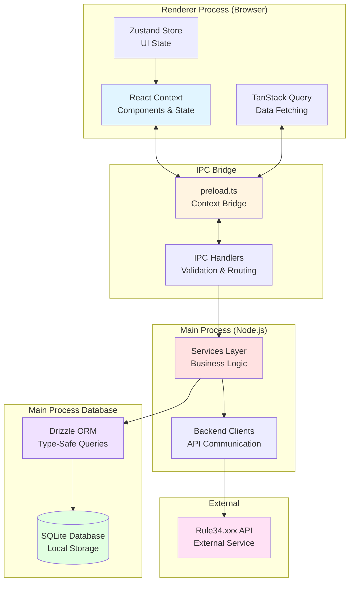
```mermaid
graph TB
    subgraph "Renderer Process (Browser)"
        ReactContext[React Context<br/>Components & State]
        TanStackQuery[TanStack Query<br/>Data Fetching]
        Zustand[Zustand Store<br/>UI State]
    end

    subgraph "IPC Bridge"
        Preload[preload.ts<br/>Context Bridge]
        IPCHandlers[IPC Handlers<br/>Validation & Routing]
    end

    subgraph "Main Process (Node.js)"
        ServicesLayer[Services Layer<br/>Business Logic]
        BackendClients[Backend Clients<br/>API Communication]
    end

    subgraph "Main Process Database"
        DrizzleORM[Drizzle ORM<br/>Type-Safe Queries]
        SQLiteDB[(SQLite Database<br/>WAL Mode)]
    end

    subgraph "External"
        Rule34API[Rule34.xxx API<br/>External Service]
        SQLiteDB[(SQLite Database<br/>Local Storage)]
    end

    ReactContext <--> Preload
    TanStackQuery <--> Preload
    Zustand --> ReactContext
    Preload <--> IPCHandlers
    IPCHandlers --> ServicesLayer
    ServicesLayer --> BackendClients
    ServicesLayer --> DrizzleORM
    DrizzleORM --> SQLiteDB
    BackendClients --> Rule34API

    style ReactContext fill:#e1f5ff
    style Preload fill:#fff4e1
    style ServicesLayer fill:#ffe1e1
    style DrizzleORM fill:#f0e1ff
    style SQLiteDB fill:#e1ffe1
    style Rule34API fill:#ffe1f5
```

**What this diagram means:**

RuleDesk is built on Electron, which runs two separate processes:

1. **Renderer Process (Browser)** - This is where your React UI lives. It's a sandboxed browser environment that can't directly access Node.js APIs or the file system. It uses:

   - **React Context** for component state and data flow
   - **TanStack Query** to fetch data from the Main Process via IPC
   - **Zustand** for lightweight UI state (like which dialog is open)

2. **IPC Bridge** - This is the secure communication layer between Renderer and Main Process:

   - **Preload script** (`preload.ts`) exposes a safe API (`window.api`) to the Renderer
   - **IPC Handlers** in Main Process validate and route requests to appropriate services

3. **Main Process (Node.js)** - This is the secure backend that handles:

   - **Services Layer** - Business logic (sync, updates, file operations)
   - **Backend Clients** - Communication with external APIs (Rule34.xxx, Gelbooru)

4. **Database** - SQLite database accessed directly in Main Process:
   - **Drizzle ORM** provides type-safe queries
   - **SQLite** stores all data locally with WAL mode for performance

**Data Flow Example:**

When you click "Add Artist" in the UI:

1. **Tag search** — `AsyncAutocomplete` calls `searchRemoteTags(query, provider, artistOnly=true)` after 300ms debounce. Gelbooru autocomplete2 includes `category` (`artist` / `character` / `copyright`); Main keeps `type === "artist"` only. Rule34 `autocomplete.php` has no category — Main takes the top 5 hits by label post_count and second-passes them through `tag_metadata` + DAPI `s=tag` (`TAG_TYPES.ARTIST`, **`user` throttle**). A new Add Artist query **aborts** the previous Main wave (`AbortController` → `throttle.wait` + axios); renderer abort alone does not cancel `invoke`. No match → empty list (not unfiltered tags). Browse tag-resolve stays `background`. Browse/blacklist autocomplete still call `searchRemoteTags` without `artistOnly`.
2. React component calls `window.api.addArtist(data)`
3. Preload script forwards request to Main Process via IPC
4. IPC Handler validates input using Zod schemas
5. Service layer saves artist to database via Drizzle ORM
6. Response flows back through IPC to Renderer
7. React Query updates the UI with the new artist

This separation ensures security (Renderer can't access sensitive data) and performance (database operations run in Main Process).

## Architecture Concept

### 1. Dual-Module Interface

Not planned.

### 2. Provider Abstraction (Current Architecture)

- `SyncService` already uses provider-based dispatch (`artist.provider`) instead of a Rule34-only path.
- `IBooruProvider` defines shared operations (auth, posts fetch, tag search, formatting).
- Current implementations: `Rule34Provider`, `GelbooruProvider`; the same interface allows adding new sources without rewriting core DB logic.

## High-Level Architecture

### System Overview

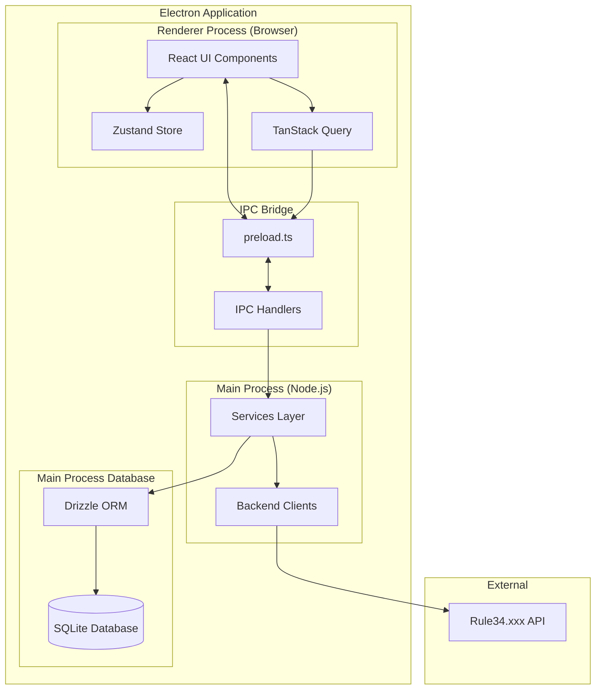
```mermaid
graph TB
    subgraph "Electron Application"
        subgraph "Renderer Process (Browser)"
            ReactUI[React UI Components]
            Zustand[Zustand Store]
            ReactQuery[TanStack Query]
        end

        subgraph "IPC Bridge"
            Preload[preload.ts]
            IPC[IPC Handlers]
        end

        subgraph "Main Process (Node.js)"
            Services[Services Layer]
            BackendClients[Backend Clients]
        end

        subgraph "Main Process Database"
            Drizzle[Drizzle ORM]
            SQLite[(SQLite)]
        end
    end

    subgraph "External"
        Rule34API[Rule34.xxx API]
        SQLite[(SQLite Database)]
    end

    ReactUI <--> Preload
    Preload <--> IPC
    IPC --> Services
    Services --> BackendClients
    Services --> Drizzle
    Drizzle --> SQLite
    BackendClients --> Rule34API

    ReactUI --> Zustand
    ReactUI --> ReactQuery
    ReactQuery --> Preload
```

### Process Communication Flow

The diagram below shows how a user action flows through the system. **Read the explanation below** for a step-by-step walkthrough.

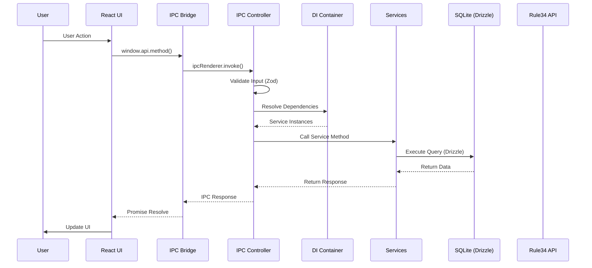
```mermaid
sequenceDiagram
    participant User
    participant ReactUI as React UI
    participant Bridge as IPC Bridge
    participant Controller as IPC Controller
    participant DI as DI Container
    participant Service as Services
    participant DB as SQLite (Drizzle)
    participant API as Rule34 API

    User->>ReactUI: User Action
    ReactUI->>Bridge: window.api.method()
    Bridge->>Controller: ipcRenderer.invoke()
    Controller->>Controller: Validate Input (Zod)
    Controller->>DI: Resolve Dependencies
    DI-->>Controller: Service Instances
    Controller->>Service: Call Service Method
    Service->>DB: Execute Query (Drizzle)
    DB-->>Service: Return Data
    Service-->>Controller: Return Response
    Controller-->>Bridge: IPC Response
    Bridge-->>ReactUI: Promise Resolve
    ReactUI->>User: Update UI
```

**Step-by-step explanation:**

Let's trace what happens when a user clicks "Add Artist":

1. **User Action** - User fills out the form and clicks "Add Artist" button

2. **React UI** - The React component calls `window.api.addArtist(artistData)`. This is a Promise that will resolve when the operation completes.

3. **IPC Bridge** - The preload script (`preload.ts`) receives the call and forwards it to the Main Process using `ipcRenderer.invoke('db:add-artist', artistData)`. This is Electron's secure IPC mechanism.

4. **IPC Controller** - In Main Process, the `ArtistsController` receives the request. Before doing anything, it:

   - **Validates the input** using a Zod schema (ensures `name` and `tag` are valid strings, `apiEndpoint` is a valid URL)
   - If validation fails, it throws an error that propagates back to Renderer

5. **Dependency Injection** - The controller needs services (like the database). It asks the DI Container to resolve dependencies. The container provides singleton instances of services.

6. **Service Layer** - The controller performs the business logic / Drizzle write (e.g., insert artist via `getDb()`). Dedicated services exist where needed (`SyncService`, `BackupService`, etc.).

7. **Database** - The service uses Drizzle ORM to execute a type-safe query: `db.insert(artists).values(artistData)`. SQLite stores the data.

8. **Response Flow** - The data flows back:
   - Database returns the inserted artist (with generated ID)
   - Service returns the artist object
   - Controller returns it via IPC
   - Bridge resolves the Promise in Renderer
   - React Query updates the cache and UI

**Error Handling:**

If any step fails (validation error, database error, network error), the error is caught by `BaseController`, logged, and a user-friendly error message is sent back to Renderer. The UI can then display an error notification.

**Why this architecture?**

- **Security:** Renderer can't directly access database or file system
- **Type Safety:** TypeScript ensures type correctness at every step
- **Validation:** Zod schemas catch invalid data before it reaches services
- **Separation of Concerns:** Each layer has a single responsibility
- **Testability:** Each layer can be tested independently

### Database Architecture

The diagram below shows how database operations work. **Read the explanation** for a practical understanding.

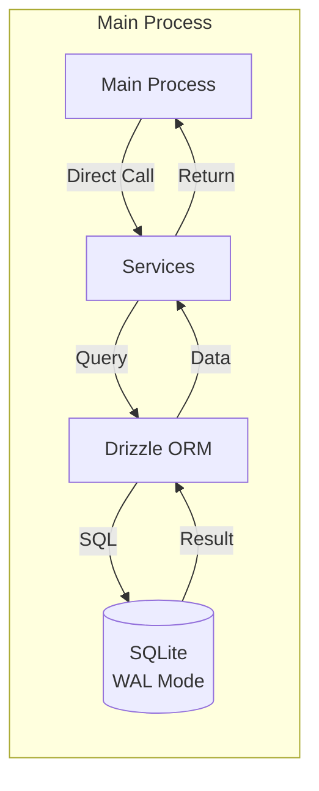
```mermaid
graph LR
    subgraph "Main Process"
        Main[Main Process]
        Services[Services]
        DrizzleORM[Drizzle ORM]
        SQLiteDB[(SQLite<br/>WAL Mode)]
    end

    Main -->|Direct Call| Services
    Services -->|Query| DrizzleORM
    DrizzleORM -->|SQL| SQLiteDB
    SQLiteDB -->|Result| DrizzleORM
    DrizzleORM -->|Data| Services
    Services -->|Return| Main
```

**What this means in practice:**

All database operations happen **directly in the Main Process** using synchronous access. Here's how it works:

1. **Services call Drizzle ORM** - When a service needs to query the database, it uses Drizzle's type-safe query builder:

   ```typescript
   const artists = await db.query.artists.findMany({
     orderBy: [asc(artists.name)],
   });
   ```

2. **Drizzle generates SQL** - Drizzle ORM converts the TypeScript query into optimized SQL:

   ```sql
   SELECT * FROM artists ORDER BY name ASC;
   ```

3. **SQLite executes** - The SQLite database (via `better-sqlite3`) executes the query **synchronously**.

   **⚠️ CRITICAL: Synchronous Execution Blocks Main Process**

   `better-sqlite3` uses **synchronous** database operations. This means:

   - ✅ **Fast for simple queries** - No async overhead, direct function calls
   - ⚠️ **Blocks Main Process** - Heavy queries (e.g., full table scan without indexes) will **freeze the entire Electron application**
   - ⚠️ **UI Freezes** - If a query takes 2 seconds, the UI is frozen for 2 seconds

   **Why this is fast for typical queries:**

   - No network overhead (local database)
   - Synchronous execution (no async/await delays)
   - WAL mode allows concurrent reads while writes happen
   - **Proper indexes** make queries fast (milliseconds, not seconds)

   **⚠️ MANDATORY: Always Use Limits and Indexes**

   To prevent Main Process blocking:

   - **Always use `limit`** in SELECT queries (see [Database Limits](#-critical-always-use-limits-for-select-queries))
   - **Ensure proper indexes** exist for WHERE clauses
   - **Use pagination** for large datasets
   - **Avoid full table scans** - Always filter with indexed columns

   **Example of dangerous query:**

   ```typescript
   // ❌ DANGEROUS: No limit, no index on tags column
   // If database has 100k posts, this will freeze UI for seconds
   const posts = await db.query.posts.findMany({
     where: like(posts.tags, "%some_tag%"), // Full table scan!
     // Missing limit!
   });
   ```

   **Example of safe query with indexed column:**

   ```typescript
   // ✅ SAFE: Uses indexed column and limit
   const posts = await db.query.posts.findMany({
     where: eq(posts.artistId, artistId), // Indexed column
     orderBy: [desc(posts.postId)],
     limit: 50, // ← Prevents large result sets
     offset: (page - 1) * 50,
   });
   ```

   **Example of safe tag search with FTS5:**

   ```typescript
   // ✅ SAFE: Uses FTS5 index for tag search (fast even on 100k+ records)
   // FTS5 is used automatically when filtering by tags via PostsController
   const posts = await db.getPosts({
     filters: { tags: "blue_hair" }, // Uses FTS5 index, not LIKE
     page: 1,
     limit: 50,
   });
   ```

4. **Results flow back** - SQLite returns raw data → Drizzle maps it to TypeScript types → Service returns typed objects

**Why synchronous access?**

- **Performance:** No async overhead for local database operations (for simple queries)
- **Simplicity:** Direct function calls, no Promise chains
- **Type Safety:** Drizzle ensures TypeScript types match database schema
- **WAL Mode:** Write-Ahead Logging allows concurrent reads even during writes

**⚠️ WAL Mode is Mandatory**

SQLite must run in **WAL (Write-Ahead Logging) mode** to enable:

- **Concurrent reads** during writes
- **Better performance** for read-heavy workloads
- **Non-blocking reads** while writes are in progress

WAL mode is automatically enabled in `src/main/db/client.ts`:

```typescript
// WAL mode is enabled automatically
sqlite.pragma("journal_mode = WAL");
```

**Without WAL mode:**

- Writes block all reads
- Database locked errors during concurrent access
- Poor performance with multiple readers

**Example: Adding an Artist**

```typescript
// In ArtistsController
const db = container.resolve(DI_TOKENS.DB);

// Drizzle query (type-safe)
const result = await db
  .insert(artists)
  .values({
    name: "artist_name",
    tag: "tag_name",
    type: "tag",
    apiEndpoint: "https://api.rule34.xxx",
  })
  .returning();

// result[0] is typed as Artist
return result[0];
```

**⚠️ CRITICAL: Always Use Limits for SELECT Queries**

**Why limits are mandatory:**

When querying posts or other data that can grow large, **always use `limit`** in your Drizzle queries. Without limits, SQLite may return tens or hundreds of thousands of records, which will:

1. **Overwhelm the Renderer Process** - Trying to serialize and send 100k+ records via IPC will freeze the UI
2. **Exhaust Memory** - Large arrays consume significant memory in both Main and Renderer processes
3. **Block IPC Channel** - Large payloads block the IPC channel, preventing other operations

**Example: Querying Posts with Limit**

```typescript
// ✅ CORRECT: Always use limit
const posts = await db.query.posts.findMany({
  where: eq(posts.artistId, artistId),
  orderBy: [desc(posts.postId)],
  limit: 50, // ← CRITICAL: Always limit results
  offset: (page - 1) * 50,
});

// ❌ WRONG: No limit - will crash with large databases
const posts = await db.query.posts.findMany({
  where: eq(posts.artistId, artistId),
  // Missing limit - dangerous!
});
```

**Best Practices:**

- **Default limit:** 50 records per page (used in `getArtistPosts` / `GetPostsSchema`)
- **Maximum limit:** `GetPostsSchema` caps `limit` at **100** (`src/shared/schemas/post.ts`)
- **Pagination:** Use `offset` and `limit` for pagination
- **Infinite scroll:** Use `useInfiniteQuery` with page-based pagination
- **Count queries:** Use separate count queries (`getArtistPostsCount`) instead of `array.length`

**IPC Methods with Built-in Limits:**

- `getArtistPosts()` - Returns max 50 posts per page
- `getTrackedArtists()` - Capped at `MAX_TRACKED_ARTISTS` (5000); warns in main log if truncated

**Key Points:**

- Database is **never** accessed from Renderer Process (security)
- All CRUD queries are **type-safe** via Drizzle ORM; raw SQL is reserved for PRAGMAs, FTS5/trigger management, schema introspection, and performance-critical batch backfills
- Operations are **synchronous** for performance
- WAL mode enables **concurrent reads** during writes
- **Always use `limit`** for SELECT queries to prevent Renderer process overload

## Process Separation

### Main Process (The Brain)

**Location:** `src/main/`

**Responsibilities:**

- Database operations (SQLite via Drizzle ORM)
- External API communication
- File system operations
- Background polling jobs
- Security-sensitive operations

**Key Components:**

1. **Database Client** (`src/main/db/client.ts`)

   - Direct synchronous access to SQLite via `better-sqlite3`
   - WAL (Write-Ahead Logging) mode enabled for concurrent reads
   - Manages database initialization and migrations
   - Provides `getDb()` and `getSqliteInstance()` functions
   - Automatic migration execution on startup

2. **Database Schema** (`src/main/db/schema.ts`)

   - Drizzle ORM schema definitions for all tables
   - Type-safe table definitions with proper indexes
   - Tables: `artists`, `posts`, `settings`, `tag_metadata`, `search_results_cache`, `post_lookup_cache`, `playlists`, `playlist_entries`; plus `tag_blacklist` (migration + raw SQL, not in Drizzle schema)
   - Type inference: `Artist`, `Post`, `Settings`, `NewArtist`, `NewPost` (and playlist / tag_metadata types). `SearchResultsCacheRow` and `PostLookupCacheRow` are Main-only. Renderer consumes gallery types via `@shared/types/db` (type-only re-export); do not import `schema.ts` from `src/renderer/**`.

3. **Sync Service** (`src/main/services/sync-service.ts`)

   - Multi-provider API synchronization (`artist.provider`)
   - Implements rate limiting and pagination
   - Maps API responses to database schema
   - Updates artist post counts
   - `syncAllArtists()` and `repairArtist()` run through `runExclusive()` — a promise-chain mutex: if one operation is in flight, the next **waits** until it finishes (no silent drop). Covered by `tests/integration/services/SyncService.queue.test.ts` (timing: repair’s `syncArtist` runs only after full sync completes).
   - Cooperative cancel: `requestCancel()` / `SyncCancelledError` / `waitUntilIdle()` — app quit drains in-flight sync (up to `SYNC_SHUTDOWN_DRAIN_MS`) before `closeDatabase()`. Hard kill still bypasses cancel; runtime-droppable FTS triggers (`posts_fts_insert`, `posts_fts_update`) are recovered on DB init via `ensureFtsTriggers` (`src/main/db/fts-triggers.ts`), then `rebuildFtsIndex` (`VALUES('rebuild')`). Successful initial/repair sync calls `backfillArtistFtsIndex` (also `rebuild` — blind artist `INSERT…SELECT` leaves stale terms after repair conflicts) before restoring triggers. While those triggers are dropped, `PostsController` AI filter (`hide`/`only`) and `PlaylistController` smart-playlist tag MATCH do not run — `areRuntimeDroppableFtsTriggersPresent` reads `sqlite_master` and falls back to `instr`/`LIKE` on `posts.tags` so hide/exclude cannot fail-open. `getIsSyncing()` is not that signal (incremental sync keeps triggers live). Same init path also runs `resetStaleSyncingArtists` (`UPDATE artists SET sync_status = 'idle' WHERE sync_status = 'syncing'`) so a hard-kill cannot leave a permanent **Syncing** badge; `'error'`, `lastError`, and `lastSyncIncomplete` are left alone.
   - Per-artist `syncStatus` (`idle` / `syncing` / `error`) and `lastError` are written by `SyncService.setArtistSyncStatus`: `"syncing"` at the start of `syncArtist` (before network / FTS drop); `"idle"` + `lastError: null` on successful pagination end (same tx as `lastPostId` / `lastChecked`) and on incomplete-without-throw (`lastSyncIncomplete: true`) or cancel; `"error"` + message on provider/network rethrow. Not written on credentials early-return or invalid-provider fallback. After each persist, Main emits void `sync:artist` (and `sync:repair:start` after the syncing write when repairing). `AppLayout` invalidates React Query `["artists"]` on `sync:artist` / `sync:repair:start` / `sync:repair:end` (plus full feed refresh on `sync:end`). `sync:progress` remains a **string** for the global Sidebar/`SyncStatusBadge` indicator — do not overload it with artist status.
   - Emits IPC events for sync progress tracking

4. **IPC Controllers** (`src/main/ipc/controllers/`)

   - Controller-based architecture with `BaseController` base class
   - Centralized error handling and input validation via Zod schemas
   - Type-safe dependency injection using DI Container
   - Each controller handles a specific domain of IPC operations

   **Controller Modules:**

   - `ArtistsController.ts` - Artist management operations
   - `PostsController.ts` - Post-related operations. Shadow-insert `id:${postId}` fetch is cache-first via `resolvePostLookup` (`post_lookup_cache` not_found TTL). Mark-viewed / favorite with supplied `postData` does not hit that cache.
   - `SettingsController.ts` - Settings management (including `confirmLegal` for age gate)
   - `AuthController.ts` - Authentication and credential verification
   - `MaintenanceController.ts` - Database backup/restore operations
   - `ViewerController.ts` - Viewer-related operations
   - `FileController.ts` - File download and management
   - `SystemController.ts` - System-level ops (version, clipboard, icon path, quit, **`wipeAllData`**)
   - `SearchController.ts` - Booru search and tag resolution (`searchBooru` with Rule34 cursor pagination and SQLite `search_results_cache` TTL layer, `resolveTags`, `resolveCharacterTags`, `resolveCopyrightTags`, `resolveTagsByType`, blacklist filtering)
   - `PlaylistController.ts` - Playlist CRUD, smart queries, import/export
   - `StatsController.ts` - Extended stats for `/stats`
   - `BlacklistController.ts` - Tag blacklist CRUD
   - `VideoProxyController.ts` - Local video proxy URL / cache control

   **BaseController** (`src/main/core/ipc/BaseController.ts`):

   - Provides centralized error handling
   - Automatic input validation using Zod schemas
   - Type-safe handler registration
   - Prevents duplicate handler registration errors
   - **Request collapsing** (idempotent handlers): in-flight calls with the same channel + full canonical args hash share one Promise; different payloads never share results
   - **Call spacing** (non-idempotent handlers): rapid repeat calls on one channel are delayed (~100ms), not rejected
   - **Type assertions:** `as` forbidden except documented boundary allowlist in `.cursorrules` / `.ai/LESSONS.txt` (enforced by `@typescript-eslint/no-unsafe-type-assertion` on `src/**`)

   **⚠️ CRITICAL: Always Use Limits in Database Queries**

   When implementing IPC handlers that query the database, **always use `limit`** in your Drizzle queries. Without limits, SQLite may return tens or hundreds of thousands of records, which will:

   - **Overwhelm the Renderer Process** - Large arrays block IPC and freeze the UI
   - **Exhaust Memory** - Serializing 100k+ records consumes significant memory
   - **Block IPC Channel** - Large payloads prevent other operations

   **Example in Controller:**

   ```typescript
   // ✅ CORRECT: Always use limit
   export class PostsController extends BaseController {
     setup() {
       this.handle(
         IPC_CHANNELS.DB.GET_POSTS,
         GetPostsSchema,
         this.getPosts.bind(this)
       );
     }

     private async getPosts(_event: IpcMainInvokeEvent, data: GetPostsRequest) {
       const db = container.resolve(DI_TOKENS.DB);
       const { artistId, page = 1 } = data;
       const limit = 50; // ← CRITICAL: Always limit results
       const offset = (page - 1) * limit;

       return await db.query.posts.findMany({
         where: eq(posts.artistId, artistId),
         orderBy: [desc(posts.postId)],
         limit, // ← Required
         offset,
       });
     }
   }
   ```

   **Default Limits:**

   - Posts (`getArtistPosts` / `GetPostsSchema`): 50 per page (max **100** per query)
   - Artists: `MAX_TRACKED_ARTISTS` (5000) on `getTrackedArtists()` — logs a warning if truncated
   - Settings: Single record (no limit needed)

   **Gallery view modes (grid vs masonry):**

   | Mode | DOM cost | Virtualization |
   |------|----------|----------------|
   | **Grid** | O(visible) — `VirtuosoGrid` renders only viewport rows | Yes |
   | **Masonry** | O(n) — CSS `columns` layout; all loaded posts stay in the DOM | No (intentional trade-off) |

   Masonry is suitable for moderate lists. With 2000+ posts, prefer **grid** mode for scroll performance.

   All five galleries (`Browse`, `Favorites`, `Updates`, `ArtistGallery`, `PlaylistGallery`) use `createVirtuosoGridFactories` (`src/renderer/components/gallery/virtuoso-factories.tsx`). **Grid** uses `VirtuosoGrid`. **Masonry** is a non-virtualized overflow-auto CSS multi-column list (`columns-2 md:columns-3 lg:columns-4 xl:columns-5`) — `VirtuosoGrid` is not mounted in that mode. Masonry items are `w-full mb-4 break-inside-avoid` (width fills the column box; `break-inside-avoid` keeps a card from splitting across columns). Do not put `w-[calc(N%)]` on column children: percentages are relative to the column, not the gallery. `flex-shrink-*` has no effect unless the parent is `display: flex`. Bottom padding is `pb-44` (clears the fixed `BulkActionBar` when a selection is active).

   **Infinite scroll split:** Grid uses `VirtuosoGrid.endReached` / `useGalleryInfiniteScroll.handleEndReached` (150ms debounce). Do not wire `atBottomStateChange` — that is Virtuoso's tail-f contract for live feeds that prepend/append while pinned at the bottom, and a sticky `atBottom=true` plus a length effect cascades `fetchNextPage` without user scroll. Masonry uses `useMasonryInfiniteScroll` on the overflow-auto scroller (300px threshold, 150ms debounce, ref guard that re-arms only after the user leaves the threshold). Masonry `onLoadMore` (all five galleries) and local grid `endReached` (Favorites / Updates / Playlist) pass the gallery `handleLoadMore` (`fetchNextPage` + `appendQueueIds`). Browse / Artist grid still use `useGalleryInfiniteScroll.handleEndReached` (naked `fetchNextPage`; hook change is a separate task). `appendQueueIds` is a no-op when the viewer queue is closed.

   **Performance Guidelines:**

   - **Heavy queries** (full table scans, complex WHERE clauses) → Always use pagination
   - **IPC post list queries** → Respect `GetPostsSchema` max **100**
   - **Unindexed queries** → Must use strict limits (50-100) to prevent blocking
   - **WAL mode** → Required for concurrent reads (enabled automatically)

5. **Dependency Injection Container** (`src/main/core/di/Container.ts`)

   - Slim typed instance registry (`Container` + `DI_TOKENS`) — stores instances, not factories
   - Internal `Map` keyed by **`token.id` string** (stable across hot reload; not object identity). Two `new Token('Database')` instances resolve the same service if registered once.
   - No cycle-detection / factory theater — YAGNI for this app size
   - Singleton pattern for service management
   - Services: Database, SyncService, BackupService, SyncScheduler
   - Unit tests: `tests/unit/core/di-container.test.ts`

6. **App lifecycle (Main)**

   - Process-lifetime listeners such as `before-quit` are registered **once** at module scope (not inside window recreate paths)
   - Quit path: if sync is running, `before-quit` `preventDefault`s, calls `syncService.requestCancel()`, awaits `waitUntilIdle(SYNC_SHUTDOWN_DRAIN_MS)`, then stops proxy/schedulers/tray and `closeDatabase()`. Tray Quit and `window-all-closed` only call `app.quit()` so drain ownership stays in `before-quit`.
   - `closeDatabase` is idempotent; tray Show / `activate` may recreate the window and re-bind IPC (`removeHandler` first) without stacking quit handlers

7. **Maintenance Queue** (`src/main/db/maintenance-queue.ts`)

   - Sequential execution queue for database maintenance operations
   - Prevents race conditions and "Database is closed" errors
   - Promise-based queue ensures operations complete before next starts
   - Used for backup, restore, and user-visible VACUUM (`MaintenanceService.runVacuum` → worker). Serializes those ops with each other; does **not** gate ordinary CRUD IPC.

8. **Booru Providers** (`src/main/providers/`)

   - Provider pattern abstraction for multi-booru support
   - `IBooruProvider` interface for standardized booru operations
   - Implementations: `Rule34Provider`, `GelbooruProvider`
   - `allowedDomains` is the full host list for CSP (`getAllProviderDomains`: API + CDN). `cdnDomains` is the media-CDN subset for video-proxy `isAllowedCdnUrl` (`getAllProviderCdnDomains`; exact hostname match, no suffix wildcard). `api-cdn.rule34.xxx` does not cover `api-cdn-mp4.rule34.xxx` (Rule34 MP4 CDN). Gelbooru media CDN is `img4.gelbooru.com`; `gelbooru.com` is the API/site host and is not proxied. Registry load throws if any provider's `cdnDomains` is not a subset of `allowedDomains`. After mapping `file_url`, unknown hostnames (exact match, not CSP `*.domain`) `log.warn` once: missing from `allowedDomains`, or video URL missing from `cdnDomains`.
   - Methods: `checkAuth`, `fetchPosts`, `searchTags`, `formatTag`
   - Shared request pacing via `ProviderThrottle` (~1200ms + jitter) and session UA via `pickRandomUA()`
   - **Priorities:** `user` (Sync `fetchPosts`, Browse/search `fetchPosts`, autocomplete, Add Artist DAPI second-pass) drains before `background` (Browse tag-resolve). Same min-interval; order only. Add Artist aborts superseded throttle waiters; intervals are unchanged.
   - **Host 429 gate:** any consumer calls `notifyRateLimited(retryAfterMs?)`; all waiters honor it (`background` fails fast, `user` waits up to `USER_GATE_WAIT_CEILING_MS` then fails with typed rate_limit)

9. **Video Proxy Service** (`src/main/services/video-proxy-server.ts`)

   - Local HTTP proxy for video playback with on-disk `video-cache/` under `.rdcache`
   - Atomic cache writes (tmp+rename), abort cleanup, eviction capped by `VIDEO_CACHE_MAX_BYTES` (2 GiB) in `src/main/config/constants.ts`. LRU by last-accessed (`atime` bumped on hit); open readers are skipped. Selection lives in `selectMediaCacheFilesToEvict`; `MaintenanceScheduler` runs `evictCache()` after SQLite work on a nested `setImmediate` (one synchronous directory walk per tick — not chunked iteration). A pass that still exceeds the cap logs `warn` (`skippedOpen`); that is an expected trade-off while a viewer holds the file, not a silent miss.
   - Host allowlist is derived from `provider.cdnDomains` via `getAllProviderCdnDomains` (exact match, cached at module load). IPC `video-proxy:get-url` only mints a localhost URL and does not check the allowlist; rejection is HTTP 400 on the subsequent Range request (logged with hostname). API/apex hosts such as `api.rule34.xxx` and `gelbooru.com` are CSP-only. Does not rewrite stored post URLs at sync time.

10. **Updater Service** (`src/main/services/updater-service.ts`)

   - Manages automatic update checking via `electron-updater`
   - Handles update download and installation
   - Emits IPC events for update status and progress
   - User-controlled download (manual download trigger)

11. **Secure Storage** (`src/main/services/secure-storage.ts`) and **credential helpers** (`src/main/utils/decrypted-credentials.ts`, `src/main/services/credentials.ts`)

   - `SecureStorage.encrypt()` / `decrypt()` — static wrappers around Electron `safeStorage`; `decrypt()` returns `null` on failure (never raw ciphertext). **Sole** crypto path — do not reintroduce parallel helpers.
   - `getDecryptedCredentialsFromRecord()` — decrypt a settings row; returns `null` if decryption fails
   - `getDecryptedApiSettings(db)` — Playlist/Posts load path: settings row + empty `userId`/`encryptedApiKey` pre-check + `getDecryptedCredentialsFromRecord()`. `SearchController` and `SyncService` keep their own variants (provider field / strict throw).
   - `getDecryptedCredentialsStrict()` — used by `SyncService`; throws `CredentialDecryptionError` instead of falling back to stored ciphertext
   - Decryption only occurs in Main Process when needed for API calls
   - Uses platform keychain (Windows Credential Manager, macOS Keychain, Linux libsecret)
   - Unit tests: `tests/unit/utils/decrypted-credentials.test.ts`, `tests/unit/services/secure-storage.test.ts`, `tests/unit/services/credentials.test.ts`

12. **Browse** (`src/renderer/components/pages/Browse.tsx`, `SearchController.search`, `src/renderer/utils/react-query-cache.ts`)

   - **Remote gallery (Source: All):** live booru search via IPC `searchBooru`. Main is cache-first: `search_results_cache` (TTL `SEARCH_RESULTS_CACHE_TTL_MS`) before `provider.fetchPosts`. Hits skip HTTP; confirmed empty tagged pages persist as `not_found`; untagged page 1 empty is not persisted; untagged page 2+ empty is `not_found`. 429/network are unresolved (not written). `isRandom` bypasses the cache. Blacklist + local viewed/favorited still apply on hits. Grid infinite scroll: `useGalleryInfiniteScroll` + `VirtuosoGrid.endReached` only (no `atBottomStateChange`). Masonry infinite scroll: `useMasonryInfiniteScroll` (overflow-auto).
   - **Rule34 deep pagination:** offset pages 1–4 (`RULE34_MAX_OFFSET_PAGES`), then cursor via meta-tag `id:<postId>` (`beforePostId` / `nextBeforePostId`); `getSearchBrowseNextPageParam()` drives React Query `pageParam`.
   - **Local source modes:** Favorites / Browse Source Subscriptions filter query cached DB posts via `getArtistPosts` (page + `LIMIT`/`OFFSET`). `aiFilter` / `mediaType` / `sortOrder` are passed into SQL (`buildPostFilterConditions`) so filtering happens **before** pagination — same pattern as `ArtistGallery`. Favorites maps to `isFavorited`; Browse Source Subscriptions filter maps to `sinceTracking` (join `posts.artistId` + `publishedAt >= artists.createdAt`). Worker-side tag-intersection against tracked artist tags is **not** used. Distinct from the unimplemented tag-combination subscriptions feature/table.
   - **Remote AI filter (Rule34):** Browse injects verified AI tag tokens into the `searchBooru` tags array (`buildRemoteBooruTagListForIpc` / `buildRemoteAiFilterTagInjection` in `searchStore.ts`): `hide` → `-ai_generated -ai-generated -ai_generation -ai-generated_content`; `only` → OR-group `( ai_generated ~ … )`. Injection is **Rule34-only**. Defensive skip when the user's include/exclude chips already conflict with the filter (avoids API empty-page AND of `tag -tag`); then the worker AI path remains the fallback. **Gelbooru** (and any non-Rule34 provider) never injects AI — worker AI filtering only (live Gelbooru AI tag injection not verified).
   - **Remote media filter (Rule34 + Gelbooru):** Videos / Images on Source: All inject the live-verified metadata tag `video` / `-video` (`buildRemoteMediaTypeTagInjection`; autocomplete 2026-08-14: Rule34 513788, Gelbooru 105460). Worker media filtering is skipped when injection succeeds. Conflict with the user's own `video` chip skips injection and keeps the worker (same empty-page guard as AI). Format subsets (`webm`, `mp4`) are not injected.
   - **Client-side filter/sort (remote only):** `useWorkerFilteredPosts` runs when Source is **All** and filters are non-default after accounting for injection (`usesDefaultRemoteFilters`: no chip tags + worker AI All + worker media All). When injection succeeds, worker receives `aiFilter: "all"` and/or `mediaType: "all"` for that axis; conflict / unverified keep the worker path. Worker output is mapped via `mapWorkerPostToPost()` in `src/renderer/lib/map-worker-post.ts` (preserves `mediaType`, `viewCount`, `lastViewedAt`; infers `mediaType` from `fileUrl` when missing).
   - Filter config is debounced (~250 ms) on the remote worker path; raw post pages are not debounced (scroll/load latency). Browse `queryKey` is `buildBrowseSearchQueryKey({ tags, source, aiFilter, mediaType, sortOrder })` with **chip tags** (not injected tokens) + `aiFilter` — isomorphic with viewer cache lookup; changing AI filter still refetches.
   - **Provider search failures** (auth, rate limit, network, parse): both providers throw typed `ProviderSearchError` with an explicit `kind`. `SearchController` rethrows via `throwProviderSearchIpcError()` — JSON-encoded `ProviderSearchErrorPayload` in `Error.message` (Electron drops custom fields; kind is not inferred from user copy). Renderer `parseProviderSearchErrorPayload()` unwraps JSON / explicit `providerKind` and shows `BrowseErrorState`. User strings in `PROVIDER_SEARCH_USER_MESSAGES` are provider-agnostic display copy (no hardcoded "Rule34").
   - **Worker filter/sort failures** (client-side only): partial failure uses a neutral `Alert` above loaded posts; fatal query failure uses `BrowseErrorState`.
   - **Preload constraint:** `src/main/bridge.ts` must stay thin — do **not** import shared Zod/schemas in preload (breaks `contextBridge.exposeInMainWorld` → perpetual Loading).
   - **Removed:** local rating / date-range / orientation filters (no UI; dead plumbing removed from `searchStore`, worker `FilterConfig`, IPC `PostFilterSchema` / `PostFiltersSchema`, gallery pages, and viewer query keys). Post `rating` as data (column, badges, Stats, Safe Mode blur) is unchanged. Booru search metatags (`rating:`, `width:`, `aspectratio:`) are unchanged.
   - Unit tests: `tests/unit/hooks/useWorkerFilteredPosts.test.ts`, `tests/unit/hooks/useMasonryInfiniteScroll.test.ts`, `tests/unit/utils/react-query-cache.test.ts`, `tests/unit/store/searchStore.test.ts`.

13. **Bridge** (`src/main/bridge.ts`, built to `out/preload/bridge.cjs`)

- Defines the IPC interface exposed as `window.api`
- Preload forwards `ipcRenderer.invoke` / event subscriptions only — no business logic, no shared-schema imports
- Type-safe communication contract (TypeScript types on both sides)
- Provider-search error normalization happens in Main (`throwProviderSearchIpcError`) and Renderer (`parseProviderSearchErrorPayload`), not in preload

14. **Main Entry** (`src/main/main.ts`)
    - Application initialization
    - Window creation
    - Security configuration
    - Database initialization and migrations

### Renderer Process (The Face)

**Location:** `src/renderer/`

**Responsibilities:**

- User interface rendering
- User interactions
- State management
- Data presentation
- **English-only UI copy** — inline literals (or local constants at 3+ call sites); no `i18next` / locale packs under `src/renderer/`
- **Import boundary:** `src/renderer/**` must not import from `src/main/**`, including type-only imports (ESLint `no-restricted-imports`). DB row types (`Artist`, `Post`, `Playlist`, …) come from `@shared/types/db` (type-only re-export of `$inferSelect` from `src/main/db/schema.ts`). IPC extras (`TrackedArtist`, `PlaylistWithStats`) from `@shared/types/bridge`. Tag autocomplete DTO (`SearchResults`) from `@shared/types/providers`. Zod request types stay in `@shared/schemas/*`. A value import of `main/db/schema` or `main/providers` would pull Drizzle / better-sqlite3 into the browser bundle.

**Key Components:**

1. **React Application** (`src/renderer/App.tsx`)

   - Main UI component with routing logic
   - Account gate for API credentials (`AccountGate` → `SettingsAccountTab`)
   - Sidebar navigation with multiple pages
   - Uses TanStack Query for data fetching
   - State management via React hooks and Zustand

2. **Components** (`src/renderer/components/`)

   - **Pages:**

    - **Updates.tsx** / **Browse.tsx** / **Favorites.tsx** / **PlaylistsPage.tsx** / **StatsPage.tsx** — `src/renderer/components/pages/` (`PlaylistsPage` is list/CRUD; gallery lives under `components/playlists/`)
    - **PlaylistCard.tsx** / **PlaylistGallery.tsx** / **PlaylistVirtuosoComponents.tsx** / **AddToPlaylistModal.tsx** / **QuickAddToPlaylistMenu.tsx** — `src/renderer/components/playlists/`
    - **Tracked.tsx** / **ArtistDetails.tsx** / **ArtistGallery.tsx** — `src/renderer/features/artists/`
    - **Settings.tsx** — `src/renderer/features/settings/Settings.tsx` (tabbed IA)

  - **Layout:**

    - **AppLayout.tsx** - Main application layout with sidebar and global top bar
    - **Sidebar.tsx** - Persistent sidebar navigation with sync button and logout
    - **GlobalTopBar.tsx** - Unified top bar with search, `FiltersPanel`, sort, view toggle, and `SyncStatusBadge` (wired to `searchStore` / gallery pipelines)

  - **Gallery:**

    - **ArtistListRow.tsx** - Artist row component (`src/renderer/features/artists/components/ArtistListRow.tsx`)
    - **ArtistGallery.tsx** - Grid view of posts for an artist
    - **PostCard.tsx** - Individual post card component

   - **Viewer (`src/renderer/features/viewer/`):**

     - **ViewerDialog.tsx** - Full-screen shell (queue, cache lookup via `buildViewerOriginQueryKey`, keyboard/side buttons). `openViewer({ hasNextPage })` is the react-query infinite-query flag (Playlist/Artist/Browse/Favorites/Updates). Do not derive it from loaded count vs page size (`n * 50`) or `allPosts.length < totalCount` — a full last page makes those inequalities false while `getNextPageParam` still reports more data, and the viewer next-arrow then dead-ends.
     - **ViewerContent.tsx** / **ViewerMedia.tsx** / **TagsDrawer.tsx** / **PostNotFoundFallback.tsx** - chrome, media, tags, shadow-insert fallback. `TagsDrawer` Artist / Character / Copyright: in-flight resolve uses React Query `isLoading` (`isPending && isFetching`); confirmed empty is “No … detected”; session-cached hits (`staleTime: Infinity`) skip the loading row on first paint.
     - **buildViewerOriginQueryKey.ts** - origin → React Query key (Artist / Browse / Favorites / Updates / Playlist)

   - **Dialogs:**

     - **AddArtistModal.tsx** - Modal for adding new artists
     - **DeleteArtistDialog.tsx** - Confirmation dialog for artist deletion
     - **UpdateNotification.tsx** - Update notification component
     - **AgeGate.tsx** - Age gate (`src/renderer/components/onboarding/AgeGate.tsx`)

  - **Settings (`src/renderer/features/settings/`):**

    - **Settings.tsx** - Tab container and settings orchestration
    - **SettingsGeneralTab.tsx** - Downloads, proxy, and Danger zone (`wipeAllData`)
    - **SettingsSyncTab.tsx** - Startup/interval sync (manual Sync All remains in the sidebar)
    - **SettingsAppearanceTab.tsx** - Theme selection (`System` / `Light` / `Dark`)
    - **SettingsBlacklistTab.tsx** - Tag blacklist management
    - **SettingsBackupTab.tsx** - Backup, restore, integrity check, retention, and maintenance section
    - **DatabaseMaintenanceCard.tsx** - User-visible VACUUM status, schedule, and manual run
    - **SettingsAccountTab.tsx** - API key input, visibility toggle, `hasApiKey` status, paste-URL hint under credentials fields

   - **Inputs:**

     - **AsyncAutocomplete.tsx** - Autocomplete component with local and remote search

   - **ui/** - shadcn/ui components (Button, Dialog, Select, Input, etc.)

3. **IPC Client** (`window.api`)
   - Typed interface to Main process
   - All communication goes through this bridge
   - Channel inventory is generated into [`docs/api.md`](./api.md) via `npm run docs:api` — do not maintain a hand-copied method list here. Notable domains: settings/auth, artists/posts, search/tags, playlists, backup/VACUUM, updates, `getVideoProxyUrl`, `wipeAllData` (`system:wipe-all-data`).

## Security Architecture

### Security Layers

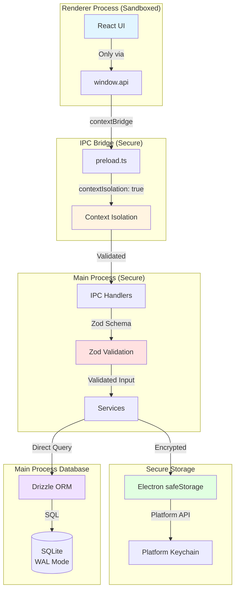
```mermaid
graph TB
    subgraph "Renderer Process (Sandboxed)"
        ReactUI[React UI]
        BridgeAPI[window.api]
    end

    subgraph "IPC Bridge (Secure)"
        Preload[preload.ts]
        ContextIsolation[Context Isolation]
    end

    subgraph "Main Process (Secure)"
        IPCHandlers[IPC Handlers]
        ZodValidation[Zod Validation]
        Services[Services]
    end

    subgraph "Secure Storage"
        SafeStorage[Electron safeStorage]
        Keychain[Platform Keychain]
    end

    subgraph "Main Process Database"
        DrizzleORM[Drizzle ORM]
        SQLite[(SQLite<br/>WAL Mode)]
    end

    ReactUI -->|Only via| BridgeAPI
    BridgeAPI -->|contextBridge| Preload
    Preload -->|contextIsolation: true| ContextIsolation
    ContextIsolation -->|Validated| IPCHandlers
    IPCHandlers -->|Zod Schema| ZodValidation
    ZodValidation -->|Validated Input| Services
    Services -->|Encrypted| SafeStorage
    SafeStorage -->|Platform API| Keychain
    Services -->|Direct Query| DrizzleORM
    DrizzleORM -->|SQL| SQLite

    style ReactUI fill:#e1f5ff
    style ContextIsolation fill:#fff4e1
    style ZodValidation fill:#ffe1e1
    style SafeStorage fill:#e1ffe1
    style DrizzleORM fill:#f0e1ff
```

### Context Isolation

**Status:** ✅ Enabled

The Renderer process runs in a sandboxed environment with no direct Node.js access. This prevents Remote Code Execution (RCE) attacks.

**Configuration:**

```typescript
webPreferences: {
  contextIsolation: true,  // Required
  nodeIntegration: false,  // Never true
  sandbox: true,           // Additional security
  preload: path.join(__dirname, "../preload/bridge.cjs"),
}
```

### IPC Security

**⚠️ CRITICAL: API Key Security Contract**

The IPC layer enforces a strict security contract for API credentials:

- **`saveSettings(creds)`** - Accepts partial settings updates; API key, when provided, is sent in plaintext from Renderer (unavoidable during input) and encrypted in Main
- **`getSettings()`** - Returns `IpcSettings` with `hasApiKey: boolean`, **NEVER the actual API key**
- **API Key Lifecycle:**
  - Entered in Renderer → Sent to Main via IPC → Encrypted in Main → Stored encrypted
  - **Never decrypted for Renderer** - Only decrypted in Main Process when needed for API calls (e.g., in `SyncService`)

**Why this matters:** If `getSettings()` returned the API key, any compromised Renderer process (XSS, malicious extension, etc.) could steal credentials. The boolean flag `hasApiKey` allows the UI to check if credentials are configured without exposing the actual key.

1. **Type Safety:** All IPC communication is strictly typed
2. **Input Validation:** All inputs are validated in Main process using Zod schemas
3. **Error Handling:** Errors are properly handled without exposing sensitive data
4. **No Direct Node Access:** Renderer cannot access Node.js APIs directly
5. **Secure Credentials:** API keys encrypted at rest, **NEVER returned to Renderer** (only `hasApiKey` boolean flag)
6. **Maintenance Queue:** Backup, restore, and user-visible VACUUM share a sequential queue to prevent close/reopen races; ordinary read/write IPC is not paused by the queue (except a few legacy updates handlers that incorrectly join it)

### Credential Security Flow

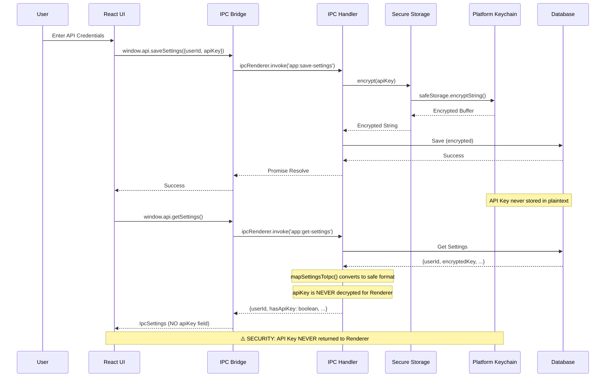
```mermaid
sequenceDiagram
    participant User
    participant ReactUI as React UI
    participant Bridge as IPC Bridge
    participant IPC as IPC Handler
    participant SecureStorage as Secure Storage
    participant Keychain as Platform Keychain
    participant DB as Database

    User->>ReactUI: Enter API Credentials
    ReactUI->>Bridge: window.api.saveSettings({userId, apiKey})
    Bridge->>IPC: ipcRenderer.invoke('app:save-settings')
    IPC->>SecureStorage: encrypt(apiKey)
    SecureStorage->>Keychain: safeStorage.encryptString()
    Keychain-->>SecureStorage: Encrypted Buffer
    SecureStorage-->>IPC: Encrypted String
    IPC->>DB: Save (encrypted)
    DB-->>IPC: Success
    IPC-->>Bridge: Promise Resolve
    Bridge-->>ReactUI: Success

    Note over DB,Keychain: API Key never stored in plaintext

    ReactUI->>Bridge: window.api.getSettings()
    Bridge->>IPC: ipcRenderer.invoke('app:get-settings')
    IPC->>DB: Get Settings
    DB-->>IPC: {userId, encryptedKey, ...}
    Note over IPC: mapSettingsToIpc() converts to safe format
    Note over IPC: apiKey is NEVER decrypted for Renderer
    IPC-->>Bridge: {userId, hasApiKey: boolean, ...}
    Bridge-->>ReactUI: IpcSettings (NO apiKey field)

    Note over ReactUI,Keychain: ⚠️ SECURITY: API Key NEVER returned to Renderer
```

**Human-Readable Explanation:**

1. **Saving Credentials (AccountGate / SettingsAccountTab):**

   - User enters API key in Renderer (plaintext, unavoidable during input)
   - `saveSettings()` sends credentials via IPC to Main Process
   - Main Process encrypts API key using Electron's `safeStorage` API (platform keychain)
   - Encrypted key is stored in database
   - Renderer receives success confirmation (no sensitive data returned)

2. **Retrieving Settings (Security Contract):**
   - `getSettings()` is called from Renderer
   - Main Process retrieves encrypted key from database
   - **⚠️ CRITICAL SECURITY RULE: API Key is NEVER decrypted for Renderer**
   - `mapSettingsToIpc()` function converts database record to safe IPC format:
     - ✅ Returns: `userId` (safe, non-sensitive)
     - ✅ Returns: `hasApiKey: boolean` (flag indicating if key exists, safe)
     - ✅ Returns: Other settings flags (safe mode, adult confirmation, etc.)
     - ❌ **NEVER returns:** `apiKey` (encrypted or decrypted)
   - Renderer receives `IpcSettings` type which has **no `apiKey` field**
   - API key is only decrypted in Main Process when needed for API calls (via `decrypted-credentials` helpers, never inline catch-and-fallback to `encryptedApiKey`)

**Security Contract:**

- **Input (saveSettings):** API key sent from Renderer in plaintext (unavoidable during onboarding)
- **Storage:** API key encrypted using platform keychain, stored encrypted in database
- **Output (getSettings):** Renderer receives `IpcSettings` with `hasApiKey: boolean`, **NEVER the actual key**
- **Internal Use:** API key is only decrypted in Main Process for API calls, never exposed to Renderer

**Why this matters:**

If `getSettings()` returned the API key (even decrypted), any compromised Renderer process (XSS, malicious extension, etc.) could steal credentials. By returning only a boolean flag, the Renderer can check if credentials are configured without ever seeing the actual key.

## Data Flow

### Reading Data Flow

The diagram below shows how data is read from the database and displayed in the UI. **Read the explanation** to understand the complete flow.

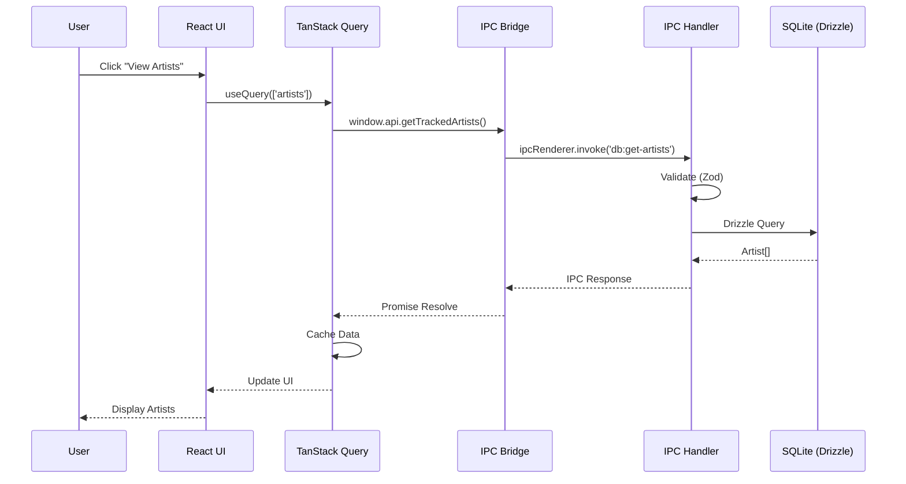
```mermaid
sequenceDiagram
    participant User
    participant ReactUI as React UI
    participant ReactQuery as TanStack Query
    participant Bridge as IPC Bridge
    participant IPC as IPC Handler
    participant DB as SQLite (Drizzle)

    User->>ReactUI: Click "View Artists"
    ReactUI->>ReactQuery: useQuery(['artists'])
    ReactQuery->>Bridge: window.api.getTrackedArtists()
    Bridge->>IPC: ipcRenderer.invoke('db:get-artists')
    IPC->>IPC: Validate (Zod)
    IPC->>DB: Drizzle Query
    DB-->>IPC: Artist[]
    IPC-->>Bridge: IPC Response
    Bridge-->>ReactQuery: Promise Resolve
    ReactQuery->>ReactQuery: Cache Data
    ReactQuery-->>ReactUI: Update UI
    ReactUI-->>User: Display Artists
```

**Real-world scenario: User opens the Tracked page**

1. **User clicks "Tracked"** in the sidebar navigation

2. **React component renders** - The `Tracked.tsx` component mounts and calls:

   ```typescript
   const { data: artists } = useQuery({
     queryKey: ["artists"],
     queryFn: () => window.api.getTrackedArtists(),
   });
   ```

3. **React Query checks cache** - React Query first checks if it has cached data for `["artists"]`. If yes, it returns cached data immediately (no network call).

4. **IPC call** - If cache is empty or stale, React Query calls `window.api.getTrackedArtists()`, which goes through the IPC bridge to Main Process.

5. **Validation** - The IPC handler validates the request (though `getTrackedArtists` has no parameters, validation still runs for consistency).

6. **Database query** - The handler calls `getTrackedArtistsWithStats()` (newest activity first), capped at `MAX_TRACKED_ARTISTS` (**5000**). If the DB has more tracked artists, the list is truncated and Main logs a warning.

7. **Response** - The array of artists flows back:

   - Database → IPC Handler → IPC Bridge → React Query → Component

8. **Caching** - React Query automatically caches the result. If the user navigates away and comes back, the data is served from cache (instant load).

9. **UI update** - React re-renders with the artists data, displaying them in a grid (at most 5000 artists from IPC).

**Why React Query?**

- **Automatic caching** - Data is cached and reused
- **Loading states** - `isLoading` and `error` states are handled automatically
- **Background refetching** - Can refetch in background when data might be stale
- **Optimistic updates** - Can update UI before server confirms (for mutations)

**Performance benefits:**

- First load: ~50-100ms (database query + IPC overhead)
- Subsequent loads: ~0ms (served from React Query cache)
- Background refetch: Happens automatically without blocking UI

### Writing Data Flow

The diagram below shows how data is written to the database. **Read the explanation** for a complete understanding of the flow, including error handling.

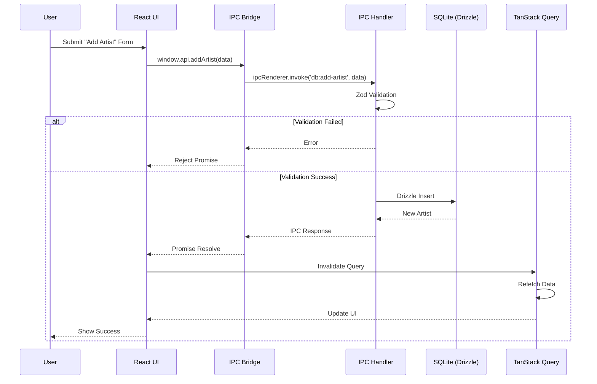
```mermaid
sequenceDiagram
    participant User
    participant ReactUI as React UI
    participant Bridge as IPC Bridge
    participant IPC as IPC Handler
    participant DB as SQLite (Drizzle)
    participant ReactQuery as TanStack Query

    User->>ReactUI: Submit "Add Artist" Form
    ReactUI->>Bridge: window.api.addArtist(data)
    Bridge->>IPC: ipcRenderer.invoke('db:add-artist', data)
    IPC->>IPC: Zod Validation
    alt Validation Failed
        IPC-->>Bridge: Error
        Bridge-->>ReactUI: Reject Promise
    else Validation Success
        IPC->>DB: Drizzle Insert
        DB-->>IPC: New Artist
        IPC-->>Bridge: IPC Response
        Bridge-->>ReactUI: Promise Resolve
        ReactUI->>ReactQuery: Invalidate Query
        ReactQuery->>ReactQuery: Refetch Data
        ReactQuery-->>ReactUI: Update UI
        ReactUI-->>User: Show Success
    end
```

**Real-world scenario: User adds a new artist**

1. **User fills form** - User enters artist name "example_artist", tag "tag_name", selects type "tag", and clicks "Add".

2. **Form submission** - React component calls:

   ```typescript
   const handleAddArtist = async (name, tag, type) => {
     await window.api.addArtist({ name, tag, type, provider: "rule34" });
   };
   ```

3. **IPC call** - Request goes through IPC bridge to Main Process.

4. **Validation** - The `ArtistsController` validates input using Zod schema:

   ```typescript
   // Zod schema checks:
   // - name is non-empty string
   // - tag is non-empty string
   // - apiEndpoint is valid URL
   ```

5. **Two paths:**

   **Path A: Validation Fails**

   - Zod throws validation error
   - `BaseController` catches it and returns user-friendly error
   - Promise rejects in Renderer
   - Component shows error message to user
   - **No database write happens**

   **Path B: Validation Succeeds**

   - Controller inserts via Drizzle on `getDb()` (no separate `dbService` layer):
     ```typescript
     db
       .insert(artists)
       .values({
         name: "example_artist",
         tag: "tag_name",
         // ... other fields
       })
       .returning();
     ```
   - Database returns the new artist with generated ID
   - If Settings `autoSyncOnArtistAdd` is enabled and API credentials are configured, Main fire-and-forgets `SyncService.repairArtist(id)` (queued via `runExclusive`; does not block the IPC response). Default is off.
   - Response flows back to Renderer

6. **Cache invalidation** - On success, component invalidates React Query cache:

   ```typescript
   queryClient.invalidateQueries({ queryKey: ["artists"] });
   ```

7. **Automatic refetch** - React Query automatically refetches `["artists"]` because cache was invalidated.

8. **UI updates** - New artist appears in the list automatically (no manual state update needed).

**Why this pattern?**

- **Validation first** - Invalid data never reaches database
- **Type safety** - TypeScript + Zod ensure data correctness
- **Automatic UI sync** - Cache invalidation ensures UI always shows latest data
- **Error handling** - User-friendly errors, not technical stack traces

**Error handling example:**

```typescript
try {
  await window.api.addArtist(data);
  // Success - cache invalidation happens automatically
} catch (error) {
  // Error could be:
  // - Validation error: "Username is required"
  // - Database error: "Tag already exists"
  // - Network error: "Failed to connect"

  log.error("Failed to add artist:", error);
  // Show error toast to user
}
```

### Synchronization Flow

The diagram below shows how background synchronization works. **Read the explanation** to understand the complete async flow with progress updates.

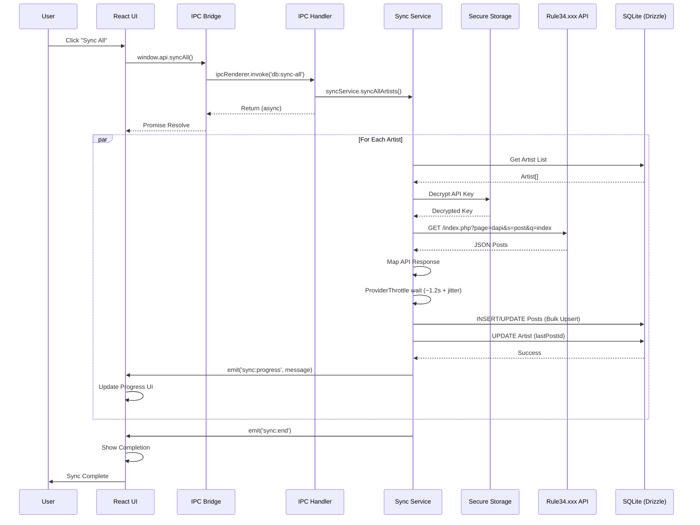
```mermaid
sequenceDiagram
    participant User
    participant ReactUI as React UI
    participant Bridge as IPC Bridge
    participant IPC as IPC Handler
    participant SyncService as Sync Service
    participant SecureStorage as Secure Storage
    participant Rule34API as Rule34.xxx API
    participant DB as SQLite (Drizzle)

    User->>ReactUI: Click "Sync All"
    ReactUI->>Bridge: window.api.syncAll()
    Bridge->>IPC: ipcRenderer.invoke('db:sync-all')
    IPC->>SyncService: syncService.syncAllArtists()
    IPC-->>Bridge: Return (async)
    Bridge-->>ReactUI: Promise Resolve

    par For Each Artist
        SyncService->>DB: Get Artist List
        DB-->>SyncService: Artist[]

        SyncService->>SecureStorage: Decrypt API Key
        SecureStorage-->>SyncService: Decrypted Key

        SyncService->>Rule34API: GET /index.php?page=dapi&s=post&q=index
        Rule34API-->>SyncService: JSON Posts

        SyncService->>SyncService: Map API Response
        SyncService->>SyncService: ProviderThrottle wait (~1.2s + jitter)

        SyncService->>DB: INSERT/UPDATE Posts (Bulk Upsert)
        SyncService->>DB: UPDATE Artist (lastPostId)
        DB-->>SyncService: Success

        SyncService->>ReactUI: emit('sync:progress', message)
        ReactUI->>ReactUI: Update Progress UI
    end

    SyncService->>ReactUI: emit('sync:end')
    ReactUI->>ReactUI: Show Completion
    ReactUI->>User: Sync Complete
```

**Real-world scenario: User clicks "Sync All" button**

1. **User action** - User clicks "Sync All" button in the sidebar or Tracked page.

2. **IPC call** - Component calls `window.api.syncAll()`. This method returns **immediately** (doesn't wait for sync to complete) because sync runs in the background.

3. **Sync service starts** - The `SyncService` begins processing artists asynchronously. The UI shows "Syncing..." indicator.

4. **For each artist, the service:**

   a. **Gets artist data** from database:

   ```typescript
   const artists = await db.query.artists.findMany();
   ```

   b. **Decrypts API key** - The encrypted API key is decrypted using Electron's `safeStorage` API. This happens in Main Process only (secure).

   c. **Fetches posts from API** - Makes HTTP request to Rule34.xxx API:

   ```
   GET https://api.rule34.xxx/index.php?page=dapi&s=post&q=index&tags=tag_name&limit=100
   ```

   (`PAGE_SIZE` = 100 in `src/main/providers/types.ts`)

   d. **Maps API response** - Converts API JSON format to database schema format.

   e. **Rate limiting** - `ProviderThrottle.wait()` before each provider request (~1200ms + 0–400ms jitter).

   f. **Bulk upsert** - Saves posts to database using `ON CONFLICT` handling (updates existing, inserts new):

   ```typescript
   await db
     .insert(posts)
     .values(newPosts)
     .onConflictDoUpdate({
       target: [posts.artistId, posts.postId],
       set: {
         /* update fields */
       },
     });
   ```

   g. **Updates artist** - Mid-batch and error paths update `newPostsCount` (and may set `lastSyncIncomplete`) without moving `lastPostId`. After natural pagination end (`postsData.length < PAGE_SIZE`), a single commit writes `lastPostId`, `lastChecked`, clears `lastSyncIncomplete`, and sets `syncStatus` to `idle`. Incomplete-without-throw keeps `syncStatus` `idle` with `lastSyncIncomplete`. Provider/network rethrow sets `syncStatus` `error` and `lastError` before rethrow; cancel returns `syncStatus` to `idle`. Cancel mid-pagination follows the same incomplete path (partial commit, cursor unchanged) then rethrows `SyncCancelledError`.

   h. **Progress event** - Emits IPC event: `emit('sync:progress', 'Checking artist_name...')` (string only — global Sidebar indicator). After per-artist `syncStatus` is written, emits void `sync:artist` so `AppLayout` can invalidate `["artists"]`. Repair emits `sync:repair:start` (after syncing write) and `sync:repair:end`.

5. **UI updates in real-time** - Global shell listens to progress for the Sync All spinner; artist badges refetch via `onSyncArtist` / repair listeners:

   ```typescript
   useEffect(() => {
     const unsubscribeProgress = window.api.onSyncProgress((message) => {
       setSyncMessage(message);
     });
     const unsubscribeArtist = window.api.onSyncArtist(() => {
       void queryClient.invalidateQueries({ queryKey: ["artists"] });
     });
     return () => {
       unsubscribeProgress();
       unsubscribeArtist();
     };
   }, [queryClient]);
   ```

6. **Completion** - When all artists are processed, service emits `sync:end` event. UI shows "Sync complete" message.

**Why async with events?**

- **Non-blocking** - UI remains responsive during sync
- **Progress feedback** - User sees real-time progress
- **Error handling** - Individual artist failures don't stop entire sync
- **Resumable** - Can stop and resume sync later

**Example: Handling sync events**

```typescript
// In component
const [syncMessage, setSyncMessage] = useState<string | null>(null);

useEffect(() => {
  const unsubscribeStart = window.api.onSyncStart(() => {
    setSyncMessage("Starting sync...");
  });

  const unsubscribeProgress = window.api.onSyncProgress((message) => {
    setSyncMessage(message); // "Syncing artist_name..."
  });

  const unsubscribeEnd = window.api.onSyncEnd(() => {
    setSyncMessage("Sync complete!");
    // Refresh artist list to show new posts count
    queryClient.invalidateQueries({ queryKey: ["artists"] });
  });

  const unsubscribeError = window.api.onSyncError((error) => {
    setSyncMessage(`Sync error: ${error}`);
  });

  return () => {
    unsubscribeStart();
    unsubscribeProgress();
    unsubscribeEnd();
    unsubscribeError();
  };
}, []);
```

**Performance considerations:**

- **Rate limiting** - Shared `ProviderThrottle` (~1200ms + jitter) prevents API bans
- **Bulk operations** - Posts are inserted in chunks of `CHUNK_SIZE` (75) to stay under SQLite variable limits
- **Incremental sync** - Only fetches posts newer than `lastPostId` (not all posts)
- **Background execution** - Sync doesn't block UI or other operations
- **Page size** - Sync calls `fetchPosts(..., PAGE_SIZE)` with the same `PAGE_SIZE` (100) used for the pagination stop condition (`postsData.length < PAGE_SIZE`)

## Database Architecture

### Schema

The database uses SQLite with the following tables:

1. **artists** - Tracked artists/users (by tag or uploader)
2. **posts** - Cached post metadata with tags, ratings, and URLs
3. **settings** - API credentials (User ID and encrypted API Key), safe mode, adult confirmation

See [Database Documentation](./database.md) for detailed schema information.

### ORM Layer

**Drizzle ORM** provides:

- Type-safe queries
- Schema migrations
- Type inference
- SQL generation

### Database Architecture

**Database Client** (`src/main/db/client.ts`):

- Direct synchronous access to SQLite via `better-sqlite3`
- WAL (Write-Ahead Logging) mode enabled for concurrent reads
- Automatic migration execution on initialization
- Type-safe queries via Drizzle ORM
- Database connection managed in Main Process

## Component Architecture

### React Component Hierarchy

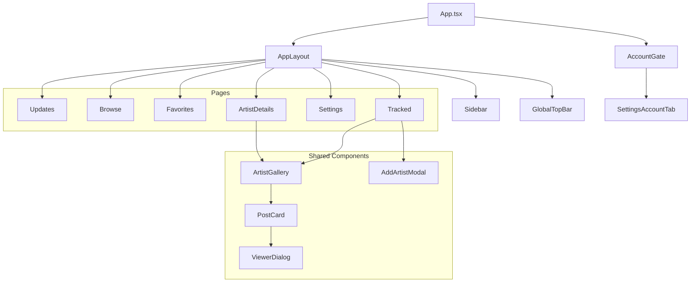
```mermaid
graph TD
    App[App.tsx]
    AppLayout[AppLayout]
    Sidebar[Sidebar]
    GlobalTopBar[GlobalTopBar]

    App --> AppLayout
    AppLayout --> Sidebar
    AppLayout --> GlobalTopBar

    subgraph "Pages"
        Updates[Updates]
        Browse[Browse]
        Favorites[Favorites]
        Tracked[Tracked]
        Settings[Settings]
        ArtistDetails[ArtistDetails]
    end

    App --> AccountGate[AccountGate]
    AccountGate --> SettingsAccountTab[SettingsAccountTab]

    AppLayout --> Updates
    AppLayout --> Browse
    AppLayout --> Favorites
    AppLayout --> Tracked
    AppLayout --> Settings
    AppLayout --> ArtistDetails

    subgraph "Shared Components"
        ArtistGallery[ArtistGallery]
        PostCard[PostCard]
        ViewerDialog[ViewerDialog]
        AddArtistModal[AddArtistModal]
    end

    Tracked --> ArtistGallery
    ArtistDetails --> ArtistGallery
    ArtistGallery --> PostCard
    PostCard --> ViewerDialog
    Tracked --> AddArtistModal
```

## External API Integration

### Provider Pattern Architecture

External API calls are abstracted through the **Provider Pattern** (`src/main/providers/`):

1. **IBooruProvider Interface:** Standardized interface for all booru sources

   - `checkAuth()` - Validate credentials
   - `fetchPosts()` - Fetch posts by tags
   - `searchTags()` - Tag autocomplete
   - `formatTag()` - Format tags based on artist type
   - `getDefaultApiEndpoint()` - Get API endpoint URL

2. **Provider Implementations:**

   - `Rule34Provider` - Rule34.xxx API implementation
   - `GelbooruProvider` - Gelbooru API implementation

3. **SyncService Integration:**
   - Uses provider pattern to fetch posts
   - **Rate Limiting:** Shared `ProviderThrottle` (~1200ms + 0–400ms jitter per request)
   - **Pagination:** Incremental sync by `lastPostId`; each page requests `limit: PAGE_SIZE` (100) and stops when `postsData.length < PAGE_SIZE`
   - **Error Handling:** `auth` / `rate_limit` provider errors during pagination propagate to `SYNC.ERROR`; `network` / `parse` and transient 5xx stop the current artist gracefully without marking sync failed
   - **Authentication:** Uses User ID and API Key from settings table

4. **Browse search (`SearchController.search`):**
   - **Page size:** 50 posts per request (configurable `limit`, max 100)
   - **Rule34 offset cap:** pages 1–4 via `pid`; page 5+ via meta-tag cursor `id:<postId>` with `pid=0`
   - **Response metadata:** `hasMore`, `apiFetchedCount`, `nextBeforePostId` for infinite scroll (blacklist applied after fetch)
   - **Persistent cache:** SQLite `search_results_cache` is consulted before `provider.fetchPosts`. Cache key is provider + formatted API tags + page + limit + cursor (AI/media isolation is the injected tags string). Payload JSON is versioned (`payload_schema_version`); unknown versions are misses. Untagged page 1 empty is not persisted; untagged page 2+ empty is `not_found`. Maintenance deletes expired rows via `deleteExpiredSearchResultsCache`.

### Download Flow

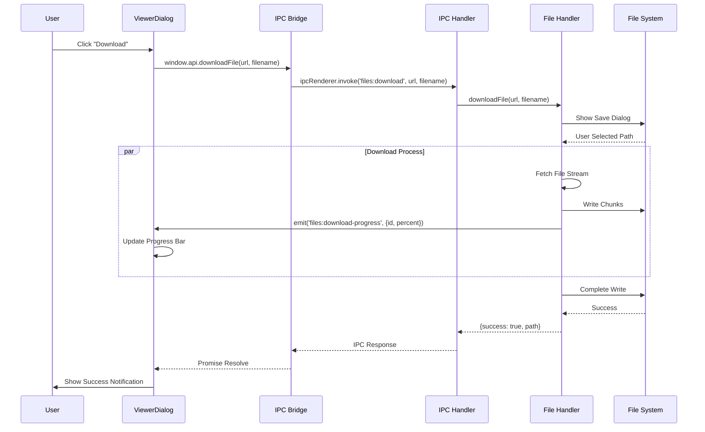
```mermaid
sequenceDiagram
    participant User
    participant Viewer as ViewerDialog
    participant Bridge as IPC Bridge
    participant IPC as IPC Handler
    participant FileHandler as File Handler
    participant FileSystem as File System

    User->>Viewer: Click "Download"
    Viewer->>Bridge: window.api.downloadFile(url, filename)
    Bridge->>IPC: ipcRenderer.invoke('files:download', url, filename)
    IPC->>FileHandler: downloadFile(url, filename)
    FileHandler->>FileSystem: Show Save Dialog
    FileSystem-->>FileHandler: User Selected Path

    par Download Process
        FileHandler->>FileHandler: Fetch File Stream
        FileHandler->>FileSystem: Write Chunks
        FileHandler->>Viewer: emit('files:download-progress', {id, percent})
        Viewer->>Viewer: Update Progress Bar
    end

    FileHandler->>FileSystem: Complete Write
    FileSystem-->>FileHandler: Success
    FileHandler-->>IPC: {success: true, path}
    IPC-->>Bridge: IPC Response
    Bridge-->>Viewer: Promise Resolve
    Viewer->>User: Show Success Notification
```

## Build Architecture

### Build Tool: Vite

The project uses **electron-vite** for building both Main and Renderer processes.

**Configuration:** `electron.vite.config.ts`

**Build Targets:**

1. **Main:** Node.js bundle (`out/main/`)
2. **Preload:** CommonJS bridge (`out/preload/`)
3. **Renderer:** React application (`out/renderer/`)

### Development Mode

- Hot Module Replacement (HMR) for Renderer ✅
- Fast rebuilds with Vite
- DevTools enabled in development
- Main/Preload sources are watched in development for faster iteration ✅

### Testing & CI

**Vitest** (`vitest.config.ts`) — `tests/unit/`, `tests/integration/`, `tests/property/`; Node environment; `better-sqlite3` externalized.

**Playwright** — `tests/e2e/`; requires `npm run build` and Chromium; live API tests need `TEST_USER_ID` / `TEST_API_KEY` in CI secrets.

**Native module ABI:** Vitest uses Node; the app uses Electron. Scripts call `db:rebuild:node` before Vitest and `db:rebuild` after `npm test` so local dev keeps working.

**CI pipeline** (`.github/workflows/ci.yml`):

1. `validate` → `docs:api` freshness (`git diff --exit-code docs/api.md`) → `npm test` → `npm audit --omit=dev --audit-level=high`
2. E2E on built artifact
3. Tagged releases (parallel native runners after quality + e2e):
   - **Windows:** `RuleDesk-*-win.zip` (`windows-latest`)
   - **Linux:** `RuleDesk-*.AppImage` (`ubuntu-latest`, `libfuse2` for AppImage)
   - **macOS:** not published (no signed/notarized CI pipeline; build from source locally if needed)
   - Each packaging job runs `npm run check:release-artifacts` before upload (no `.map`, tests, `.env`, fixture secrets, or `sourceMappingURL` in `out/**`)

**Local maintainer gate:** `npm run test:verify` (= validate + all Vitest + Electron rebuild).

## State Management

### Renderer State

**TanStack Query (React Query):**

- Server state (data from Main process)
- Caching and synchronization
- Loading and error states

**Zustand:**

- Client-side UI state
- Minimal boilerplate
- KISS principle compliance

**⚠️ CRITICAL: Use Selectors to Prevent Unnecessary Re-renders**

Zustand stores can cause performance issues if not used correctly. **Always use selectors** to subscribe only to the specific state you need, not the entire store.

**Why selectors matter:**

When you subscribe to the entire store, the component re-renders on **any** state change, even if it doesn't use that part of the state. This can cause:

- Unnecessary re-renders of large component trees
- Performance degradation with complex UIs
- UI freezing when state updates frequently

**❌ WRONG: Subscribing to entire store**

```typescript
// ❌ BAD: Component re-renders on ANY state change
const store = useViewerStore(); // Gets entire store
const isOpen = store.isOpen; // But only uses isOpen

// If controlsVisible changes, this component still re-renders!
```

**✅ CORRECT: Using selectors**

```typescript
// ✅ GOOD: Component only re-renders when isOpen changes
const isOpen = useViewerStore((state) => state.isOpen);

// Component ignores other state changes (controlsVisible, queue, etc.)
```

**✅ CORRECT: Using multiple selectors with useShallow**

When you need multiple values, use `useShallow` to prevent re-renders when unrelated state changes:

```typescript
import { useShallow } from "zustand/react/shallow";

// ✅ GOOD: Only re-renders when isOpen or close function changes
const { isOpen, close } = useViewerStore(
  useShallow((state) => ({
    isOpen: state.isOpen,
    close: state.close,
  }))
);

// ✅ GOOD: Split into logical groups for better performance
const { currentPostId, queue } = useViewerStore(
  useShallow((state) => ({
    currentPostId: state.currentPostId,
    queue: state.queue,
  }))
);

const { currentIndex, next, prev } = useViewerStore(
  useShallow((state) => ({
    currentIndex: state.currentIndex,
    next: state.next,
    prev: state.prev,
  }))
);
```

**Real-world example from ViewerDialog:**

```typescript
// In ViewerDialog.tsx - split selectors into logical groups
export const ViewerDialog = () => {
  // Group 1: Open/close state
  const { isOpen, close } = useViewerStore(
    useShallow((state) => ({
      isOpen: state.isOpen,
      close: state.close,
    }))
  );

  // Group 2: Current post data
  const { currentPostId, queue } = useViewerStore(
    useShallow((state) => ({
      currentPostId: state.currentPostId,
      queue: state.queue,
    }))
  );

  // Group 3: Navigation
  const { currentIndex, next, prev } = useViewerStore(
    useShallow((state) => ({
      currentIndex: state.currentIndex,
      next: state.next,
      prev: state.prev,
    }))
  );

  // Each group only re-renders when its specific values change
  // If controlsVisible changes, none of these groups re-render
};
```

**Best Practices:**

1. **Single value:** Use simple selector `useStore((s) => s.value)`
2. **Multiple values:** Use `useShallow` with object selector
3. **Split selectors:** Group related values together
4. **Avoid full store:** Never do `useStore()` without selector
5. **Memoize selectors:** For complex selectors, use `useMemo` or extract to function

**Performance Impact:**

- **Without selectors:** Component re-renders on every store update (even unrelated)
- **With selectors:** Component re-renders only when selected values change
- **With useShallow:** Prevents re-renders when object reference changes but values are the same

**Example: Simple single-value selector**

```typescript
// In AppLayout.tsx - only needs isOpen
const isViewerOpen = useViewerStore((state) => state.isOpen);

// Component only re-renders when isOpen changes
// Ignores changes to controlsVisible, queue, currentIndex, etc.
```

### Main Process State

- Database is the source of truth
- Services maintain minimal in-memory state
- Background jobs use timers, not persistent state

## File Structure

```
src/
├── main/                          # Electron Main Process
│   ├── db/                        # Database layer
│   │   ├── client.ts              # Database client (initialization, getDb, getSqliteInstance)
│   │   ├── fts-triggers.ts        # Runtime-droppable FTS trigger DDL / rebuild
│   │   ├── fts-table-check.ts     # posts_fts existence probe (sqlite instance in)
│   │   ├── maintenance-queue.ts   # Maintenance operation queue (sequential execution)
│   │   ├── paths.ts               # DB/userData path constants (data.bin, .rdcache, backup prefix)
│   │   ├── schema.ts              # Drizzle ORM schema definitions
│   │   └── backfill-media-type.ts # Background media_type backfill
│   ├── config/                    # Main-process constants / allowlists
│   │   ├── allowed-hosts.ts       # shell.openExternal host allowlist (user click; not provider CDN)
│   │   ├── constants.ts           # SYNC_SHUTDOWN_DRAIN_MS, VIDEO_CACHE_MAX_BYTES, …
│   │   ├── tag-resolve-constants.ts
│   │   ├── search-results-cache-constants.ts
│   │   └── post-lookup-constants.ts
│   ├── ipc/                       # IPC (Inter-Process Communication)
│   │   ├── controllers/           # IPC Controllers (domain-based)
│   │   │   ├── ArtistsController.ts
│   │   │   ├── BlacklistController.ts
│   │   │   ├── PostsController.ts
│   │   │   ├── PlaylistController.ts
│   │   │   ├── SearchController.ts
│   │   │   ├── SettingsController.ts
│   │   │   ├── AuthController.ts
│   │   │   ├── MaintenanceController.ts
│   │   │   ├── UpdatesController.ts
│   │   │   ├── ViewerController.ts
│   │   │   ├── FileController.ts
│   │   │   ├── StatsController.ts
│   │   │   ├── VideoProxyController.ts
│   │   │   └── SystemController.ts
│   │   ├── channels.ts            # IPC channel constants
│   │   └── index.ts               # IPC setup and registration
│   ├── core/                      # Core infrastructure
│   │   ├── di/                    # Dependency Injection
│   │   │   ├── Container.ts       # DI Container (Singleton)
│   │   │   ├── databaseRegistration.ts # Re-register DB in DI after DB reinit
│   │   │   └── Token.ts           # Type-safe DI tokens
│   │   └── ipc/                    # IPC infrastructure
│   │       └── BaseController.ts   # Base controller with error handling
│   ├── providers/                 # Booru provider implementations
│   │   ├── rule34-provider.ts     # Rule34.xxx provider
│   │   ├── gelbooru-provider.ts   # Gelbooru provider
│   │   ├── types.ts               # Provider interfaces
│   │   └── index.ts               # Provider registry
│   ├── services/                  # Background services
│   │   ├── credentials.ts          # getDecryptedApiSettings (Playlist/Posts load path)
│   │   ├── secure-storage.ts       # Secure storage for API credentials
│   │   ├── sync-service.ts         # API synchronization
│   │   ├── sync-scheduler.ts       # Periodic sync scheduler
│   │   ├── backup-service.ts       # Auto-backup service
│   │   ├── maintenance-scheduler.ts # Daily checkpoint/optimize scheduler
│   │   ├── MaintenanceService.ts   # User-triggered VACUUM status/run logic
│   │   ├── updater-service.ts      # Auto-updater service
│   │   ├── tag-resolve-coordinator.ts # Tag metadata resolve: found/not_found persist, unresolved not cached
│   │   ├── post-lookup-cache.ts    # Single-post id: lookup: not_found TTL, unresolved not cached
│   │   └── video-proxy-server.ts   # Local video proxy + disk cache
│   ├── workers/                   # Worker threads
│   │   ├── downloadWorker.ts       # Batch download worker
│   │   └── vacuumWorker.ts         # VACUUM worker
│   ├── lib/                       # Utilities
│   │   ├── logger.ts              # Logging utility
│   │   └── proxy.ts               # Proxy config helpers
│   ├── bridge.ts                  # IPC bridge interface definition
│   ├── main.d.ts                  # Main process type definitions
│   └── main.ts                    # Main process entry point
│
├── renderer/                      # Electron Renderer Process
│   ├── components/                # React components
│   │   ├── dialogs/               # Dialog components
│   │   │   ├── AddArtistModal.tsx
│   │   │   ├── DeleteArtistDialog.tsx
│   │   │   └── UpdateNotification.tsx
│   │   ├── onboarding/            # Age gate
│   │   │   └── AgeGate.tsx
│   │   ├── inputs/                # Input components
│   │   │   └── AsyncAutocomplete.tsx
│   │   ├── layout/                 # Layout components
│   │   │   ├── AppLayout.tsx
│   │   │   ├── GlobalTopBar.tsx
│   │   │   └── Sidebar.tsx
│   │   ├── pages/                  # Page components
│   │   │   ├── Browse.tsx
│   │   │   ├── Favorites.tsx
│   │   │   ├── PlaylistsPage.tsx   # Playlist list + CRUD/import-export
│   │   │   ├── StatsPage.tsx
│   │   │   ├── Updates.tsx
│   │   │   └── ...
│   │   ├── playlists/              # Playlist UI (card, gallery, virtuoso, add menus)
│   │   │   ├── PlaylistCard.tsx
│   │   │   ├── PlaylistGallery.tsx
│   │   │   ├── PlaylistVirtuosoComponents.tsx
│   │   │   ├── AddToPlaylistModal.tsx
│   │   │   └── QuickAddToPlaylistMenu.tsx
│   │   ├── ui/                     # shadcn/ui components
│   │   │   └── ...
│   ├── features/                  # Feature modules
│   │   ├── artists/               # Artist details/tracked/gallery/post card
│   │   ├── settings/
│   │   └── viewer/                # ViewerDialog shell + media/tags/query-key helpers
│   ├── workers/                   # Renderer Web Workers (not Node worker_threads)
│   │   └── data-processor.worker.ts # Remote Browse only (source=all): AI/media/sort; local Favorites / Browse Source Subscriptions filter use SQL
│   ├── hooks/                     # App-level hooks
│   ├── lib/                        # Utilities
│   │   ├── hooks/                  # Custom React hooks
│   │   │   └── useDebounce.ts
│   │   ├── artist-utils.ts
│   │   ├── tag-utils.ts
│   │   └── utils.ts
│   ├── schemas/                    # Form validation schemas
│   │   └── form-schemas.ts
│   ├── store/                       # State management (Zustand)
│   │   └── viewerStore.ts
│   ├── App.tsx                     # Main React component
│   ├── index.css                   # Global styles
│   ├── index.html                  # HTML template
│   └── main.tsx                    # Renderer entry point
│
├── renderer.d.ts                  # window.api global types (preload contract; not under renderer/)
│
└── shared/                         # Shared contracts (schemas/constants/types)
    ├── schemas/
    ├── constants.ts
    └── types/
        ├── db.ts                   # type-only re-export of Drizzle row types for renderer
        ├── bridge.ts               # TrackedArtist, PlaylistWithStats (from main/bridge)
        ├── providers.ts            # SearchResults (from main/providers/types)
        ├── post.ts                 # WorkerPost Zod schema
        └── ipc.ts                  # IpcSafe<> utility

Root:
├── drizzle/                        # Database migrations
│   ├── *.sql                       # SQL migration files (tracked in git)
│   └── meta/                       # Migration journal + snapshots (tracked in git)
│       ├── _journal.json           # Migration journal
│       └── *_snapshot.json         # Schema snapshots
├── docs/                           # Documentation
│   ├── api.md                      # Generated IPC reference (do not hand-edit)
│   ├── api-guide.md                # IPC narrative / examples
│   ├── api-notes/                  # Optional channel notes for the generator
│   ├── architecture.md
│   ├── index.md
│   ├── database.md
│   ├── roadmap.md
│   └── rule34-api-reference.md
├── scripts/                        # Build and utility scripts
│   ├── generate-api-docs.mjs       # IPC docs generator
│   ├── check-img-loading-decoding.mjs
│   └── check-release-artifacts.mjs
├── .github/                        # GitHub workflows
│   └── workflows/
│       └── ci.yml
├── electron.vite.config.ts         # Electron-Vite configuration
├── drizzle.config.ts               # Drizzle ORM configuration
├── tailwind.config.js              # Tailwind CSS configuration
├── tsconfig.json                   # TypeScript configuration
└── package.json                    # Project dependencies and scripts
```

## Design Principles

### SOLID Principles

- **Single Responsibility:** Each module has one clear purpose
- **Open/Closed:** Extend via composition, not modification
- **Dependency Inversion:** Services depend on abstractions

### KISS & YAGNI

- **KISS:** Simple, readable code over clever solutions
- **YAGNI:** Implement only what's needed now

### DRY

- Shared types between Main and Renderer (`@shared/types/*` re-exports; renderer never imports `src/main/**`)
- Reusable components and utilities
- No code duplication

## Current Status

### ✅ Completed Features

**Infrastructure & Build:**

- **Electron Version:** 39.8.x with latest security patches
- **Build System:** electron-vite for optimal build performance
- **Database Architecture:** Direct synchronous access via `better-sqlite3` with WAL mode for concurrent reads
- **User Data Path:** Neutral `.rdcache` directory for dev and packaged builds (`bootstrap-user-data.ts` runs before logger and electron-store)

**Database & Schema:**

- **Schema:** Core tables `artists`, `posts`, `settings`; also `tag_metadata` (`status` found|not_found + `resolved_at` TTL for misses), `search_results_cache` (Browse `searchBooru` page TTL cache, found|not_found, versioned JSON payload), `post_lookup_cache` (single-post `id:` lookup TTL, found|not_found, 30-day not_found), `playlists`, `playlist_entries`, `tag_blacklist`, and FTS5 for post tags
- **Migrations:** Fully functional migration system using `drizzle-kit` 0.30+ (`drizzle.config.ts`, `npm run db:generate` / `db:migrate`)
- **Testing & CI:** Vitest (unit, integration, property), Playwright (E2E); CI runs `validate`, `npm test`, and production `npm audit`
- **Indexes:** Optimized indexes on `artistId`, `isViewed`, `publishedAt`, `isFavorited`, `lastChecked`, `createdAt`
- **Provider Support:** Multi-booru support with `provider` field (rule34, gelbooru)
- **Artist Types:** Support for `tag`, `uploader`, and `query` types

**Security & Reliability:**

- **Secure Storage:** API credentials encrypted using Electron's `safeStorage` API (Windows Credential Manager, macOS Keychain, Linux libsecret)
- **Database Backup/Restore:** Manual backup and restore with integrity checks; automatic rotation of timestamped backup files using configurable `backupRetention` (`1..20`)
- **DB Maintenance (VACUUM):** User-visible status, manual trigger, and persisted schedule (`manual`, `weekly`, `monthly`)
- **Context Isolation:** Enabled globally with sandbox mode
- **CSP:** Built from `getAllProviderDomains()` (`img-src` / `media-src` / `connect-src`); production is strict, development is relaxed for HMR
- **IPC Architecture:** Controller-based IPC handlers with `BaseController` for centralized error handling

**Data Integrity & Sync:**

- **Tag Normalization:** Automatic stripping of metadata from tag names (e.g., "tag (123)" → "tag")
- **Sync Service:** Handles `ON CONFLICT` correctly with proper upsert logic
- **Provider Pattern:** Multi-booru support via `IBooruProvider` interface
- **Rate Limiting:** Shared `ProviderThrottle` (~1200ms + 0–400ms jitter per request)

**UI/UX:**

- **Progressive Image Loading:** 3-layer system (Preview → Sample → Original)
- **Virtualization:** `react-virtuoso` for efficient large list rendering
- **Search Functionality:** Local artist search and remote tag search (multi-provider)
- **Sidebar Navigation:** Persistent sidebar with main navigation sections
- **Global Top Bar:** Unified top bar with search, filters, sort controls (implemented)
- **Full-Screen Viewer:** Immersive viewer with keyboard shortcuts, download, favorites
- **Download Manager:** Download full-resolution files with progress tracking
- **Favorites System:** Complete implementation with database field and toggle functionality

## Implemented Features

1. ✅ **Sync Service:** Dedicated service for multi-booru API synchronization with progress tracking
2. ✅ **Settings Management:** Secure storage of API credentials with encryption using Electron's `safeStorage` API
3. ✅ **Artist Tracking:** Support for tag-based tracking with autocomplete search and tag normalization (multi-provider)
4. ✅ **Post Gallery:** Grid view of cached artist posts with preview images and pagination
5. ✅ **Browse:** Live booru search with infinite scroll (Rule34 cursor pagination after offset cap)
6. ✅ **Progressive Image Loading:** 3-layer loading system (Preview → Sample → Original) for instant viewing
7. ✅ **Artist Repair:** Resync functionality to update previews and fix sync issues
8. ✅ **Auto-Updater:** Automatic update checking and installation via electron-updater
9. ✅ **Event System:** Real-time IPC events for sync progress, update status, and download progress
10. ✅ **Database Architecture:** Direct synchronous access via `better-sqlite3` with WAL mode for concurrent reads
11. ✅ **Secure Storage:** API credentials encrypted at rest using Electron's `safeStorage` API
12. ✅ **Backup/Restore:** Manual database backup and restore functionality with integrity checks and timestamped backups
13. ✅ **Search Functionality:** Local artist search, remote tag search, and Browse `searchBooru` with deep pagination (multi-provider)
14. ✅ **Mark as Viewed:** Ability to mark posts as viewed for better organization
15. ✅ **Favorites System:** Mark and manage favorite posts with toggle functionality
16. ✅ **Download Manager:** Download full-resolution files with progress tracking
17. ✅ **Full-Screen Viewer:** Immersive viewer with keyboard shortcuts, download, favorites, and tag management
18. ✅ **Sidebar Navigation:** Persistent sidebar with main navigation sections (Browse, Updates, Artists, Favorites, Playlists, Statistics, Settings)
19. ✅ **Global Top Bar:** Search, `FiltersPanel` (AI, media, source), sort, view toggle, `SyncStatusBadge` — filters consumed by gallery/browse pipelines.
20. ✅ **Credential Verification:** Verify API credentials before saving and during sync operations
21. ✅ **Clipboard Integration:** Copy metadata and debug information to clipboard
22. ✅ **Logout Functionality:** Clear stored credentials and return to account gate
23. ✅ **User Data Path:** Neutral `.rdcache` directory for dev and packaged builds
24. ✅ **IPC Controllers:** Controller-based architecture with `BaseController` and dependency injection
25. ✅ **Provider Pattern:** Multi-booru support via `IBooruProvider` interface (Rule34, Gelbooru)

## Active Roadmap (Priority Tasks)

> For the live priority list, see [docs/roadmap.md](./roadmap.md). The subsection below is kept short to avoid duplicating a long spec.

### A. Filters (Advanced Search) — ongoing

- ✅ `FiltersPanel` + `searchStore` drive AI, media, and source filters on main surfaces.
- ℹ️ Local rating / date-range / orientation filters are out of scope: UI was already removed; store, worker, IPC filter schemas, and gallery apply-paths no longer accept those fields. Post `rating` data and booru search metatags are unchanged.
- Full detail: [roadmap — Navigation & UX](./roadmap.md#-navigation--ux-revamp).

### B. Download Manager ✅ Implemented (Core Features)

**Goal:** Allow saving full-resolution files to the local file system.

- ✅ "Download Original" button on post view (implemented in ViewerContent)
- ✅ **Download Handler:** Downloads run in Main Process with progress tracking
- ✅ **Progress Events:** Real-time download progress via IPC events (`onDownloadProgress`)
- ✅ **File Management:** Open downloaded file in folder (`openFileInFolder`)
- ✅ "Download All" for current filter/artist (implemented with rate limits)
- ✅ **Settings:** Default download directory and related options available

**Status:** ✅ Core download functionality implemented. Individual and batch downloads work with progress tracking, and default directory settings are available.

### C. Playlists / Collections ✅ Implemented

**Goal:** Create curated collections of posts independent of Artists/Trackers.

**Phase 1: MVP** ✅ **COMPLETED**

- ✅ **Database Tables:** `playlists` table (`id`, `name`, `is_smart`, `query_json`, `icon_name`, `created_at`) and `playlist_entries` table (`playlist_id`, `post_id`, `added_at`) with proper indexes and composite primary key
- ✅ **Playlist Management:** Full CRUD operations via `PlaylistController` (create, read, update, delete playlists)
- ✅ **Add to Playlist:** Quick add menu (`QuickAddToPlaylistMenu`) on Post Cards and in viewer dialog
- ✅ **Playlists Page:** Dedicated `PlaylistsPage` component in Sidebar navigation (list + CRUD/import-export; `PlaylistGallery` + Virtuoso wrappers under `components/playlists/`)
- ✅ **Playlist Gallery:** Grid and masonry view modes with filtering (FTS5 tag search, media type, AI filter) and date-oriented sorting
- ✅ **Smart Playlists:** Support for dynamic playlists with tag-based queries (auto-fill based on tags)
- ✅ **FTS5 Integration:** Fast tag searching within playlists using FTS5 full-text search
- ✅ **IPC Controller:** Complete `PlaylistController` implementation with type-safe operations and comprehensive error handling

**Status:** ✅ **COMPLETED:** Core playlist functionality fully implemented. Users can create playlists, add/remove posts, view galleries with filtering and sorting, and manage smart playlists with tag-based queries.

### 🛡️ Security & Reliability (Hardening)

See [Roadmap](./roadmap.md#-security--reliability-hardening) for detailed security improvements:

- ✅ **Database Architecture** - ✅ **COMPLETED:** Direct synchronous access via `better-sqlite3` with WAL mode for concurrent reads
- ✅ **Encrypt / Secure Storage for API Credentials** - ✅ **COMPLETED:** Using Electron's `safeStorage` API for encryption
- ✅ **Database Backup / Restore System** - ✅ **COMPLETED:** Manual backup and restore functionality implemented with integrity checks

### Future Considerations

1. **tag-combination subscriptions feature/table:** Not implemented (see `docs/database.md` / planned product work). Distinct from the shipped Browse Source Subscriptions filter (`sinceTracking`).
2. **Content Script Injection:** DOM enhancements for external sites
3. **Statistics page:** extended aggregate metrics are shipped on the same `StatsPage` via `getExtendedStats` (totals, rating/media/viewed/favorites pie charts, provider artist split, top artists/tags, DB size). Further additions should stay in the same page/IPC pattern — see [roadmap — Planned product work](./roadmap.md#planned-product-work)
4. **Multi-Booru Support:** additional providers on top of the existing `IBooruProvider` pattern (Rule34, Gelbooru)

### Scalability

- Database can handle thousands of artists and posts
- Polling can be optimized with batching
- UI can be virtualized for large lists
- Provider abstraction allows adding new booru sources without core changes

## Performance Considerations

1. **Database Indexing:** Proper indexes on frequently queried fields
2. **Query Optimization:** Efficient Drizzle queries
3. **React Optimization:** Memoization where needed
4. **Lazy Loading:** Code splitting for large components

## Error Handling Strategy

1. **Fail Fast:** Validate inputs at boundaries
2. **Descriptive Errors:** Clear error messages
3. **Error Logging:** All errors logged via `electron-log`
4. **User Feedback:** Errors surfaced to UI appropriately

## Implementation Status (Technical Audit)

Based on a comprehensive technical audit, here's the current implementation status of key features:

### ✅ Fully Implemented

- **Virtualization:** `react-virtuoso` implemented for efficient large list rendering (`ArtistGallery.tsx`)
- **Video Support:** Extensions from `src/shared/utils/media.ts` (`.mp4`, `.webm`, `.mov`, `.avi`, `.mkv`, `.flv`, `.wmv`, `.m4v`) with native `<video>` element
- **Input Validation:** Zod validation implemented per IPC handler
- **Error Handling:** Try-catch blocks in IPC handlers with error logging

### ⚠️ Partially Implemented

- **Developer HMR:** Renderer HMR and watched Main/Preload rebuild loop are in place
- **Input Sanitization:** Zod validation is enforced at IPC boundaries. Shared wrapper/tuple patterns are now used across controllers to reduce registration drift.
- **Error Handling:** Provider search and sync auth paths return user-facing messages; other IPC domains still rely on generic `Error.message` at the boundary
- **Modern Video:** Baseline tuning is shipped; further platform-specific tuning remains regression-driven

### Shipped (formerly listed under Missing / Planned)

- **Safe Mode / NSFW Filter:** blur logic and safe mode state in gallery/viewer (`safeModeStore`, `PanicButton`, `PostCard`, `ViewerMedia`)
- **Age Gate:** `src/renderer/components/onboarding/AgeGate.tsx` and `confirmLegal` IPC method
- **User Data Path:** Neutral `.rdcache` via `bootstrap-user-data.ts` (not next to the executable)
- **Anti-Bot Measures:** Shared `ProviderThrottle` (~1200ms + jitter) and session UA rotation via `pickRandomUA()` across current providers. One throttle instance per provider host serializes Sync/Browse/autocomplete (`user` priority) ahead of tag-resolve (`background`). A single host 429 gate (`notifyRateLimited`) is written by any consumer and checked by every `wait()` — local rate-limit copies are forbidden.
- **DB Optimization (FTS5):** FTS5 virtual table `posts_fts` implemented with `unicode61` tokenizer for fast tag searching
- **Composite Indexes:** Composite index on `(artist_id, rating, is_viewed)` for optimized filter queries
- **Centralized Validation:** No single monolithic validation module by design; current direction is shared schemas + typed controller wrappers at IPC boundaries.

See [Roadmap](./roadmap.md#-technical-improvements-from-audit) for detailed implementation plans.
